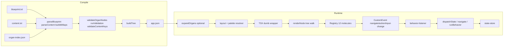

# CLEAN EXECUTION CONVERSION PLAN: Blueprint → Compiled JSON → TSX Dumb Wrapper

## 1. JSON Screen Contract (exact schema TSX wrapper must accept)

**Root document (compiler output from [blueprint.ts](src/07_Dev_Tools/scripts/blueprint.ts) lines 472–477):**

```ts
{
  id: "screenRoot";
  type: "screen";
  state?: { currentView?: string };
  children: ScreenNode[];
}
```

**Per-node (from buildTree, [blueprint.ts](src/07_Dev_Tools/scripts/blueprint.ts) 408–428, 433–436; aligned to [JSON_SCREEN_CONTRACT.json](src/02_Contracts_Reports/contracts/JSON_SCREEN_CONTRACT.json)):**


| Key        | Required | Source                                          | Notes                                                                                                                                |
| ---------- | -------- | ----------------------------------------------- | ------------------------------------------------------------------------------------------------------------------------------------ |
| `type`     | ✓        | buildTree                                       | One of: `screen` | `organ` | 12 molecules (section, button, card, avatar, chip, field, footer, list, modal, stepper, toast, toolbar) |
| `id`       | ✓        | idMap (slugifyId/slugify)                       | Format `|name`; stable identity                                                                                                      |
| `content`  | —        | contentMap by rawId                             | Keys per [ALLOWED_CONTENT_KEYS](src/07_Dev_Tools/scripts/blueprint.ts) / organ slots                                                 |
| `children` | —        | buildTree stack                                 | Array of nodes; order preserved; SEQUENCE reorders root only                                                                         |
| `behavior` | —        | buildTree (target → Navigation; logic → Action) | See Behavior Dispatch Contract                                                                                                       |
| `state`    | —        | buildTree (state.bind)                          | `{ mode: "two-way", key }` for field binding                                                                                         |
| `params`   | —        | buildTree (state bind, field)                   | `field.fieldKey`, `field.multiline`, etc.                                                                                            |
| `role`     | —        | RawNode.role                                    | Phase 5                                                                                                                              |
| `organId`  | —        | Organ only                                      | Required when `type === "organ"`                                                                                                     |
| `variant`  | —        | Organ/default                                   | Organ: from node; molecule: optional                                                                                                 |


**Forbidden in node (contract):** `layout`, `params.moleculeLayout`, `params.layoutPreset`, `params.layout`, `params.containerWidth`, `params.backgroundVariant`, `params.split`, `params.gap`, `params.padding` (section layout from layout engine only per [JSON_SCREEN_CONTRACT.json](src/02_Contracts_Reports/contracts/JSON_SCREEN_CONTRACT.json) and [json-renderer](src/03_Runtime/engine/core/json-renderer.tsx) applyProfileToNode). No `palette`, no `style`.

**Conditional visibility (optional, not emitted by current compiler):** `when?: { state: string; equals: unknown }` — render only if `state[when.state] === when.equals`.

**Closed molecule set (authority):** [allowed-molecules.ts](src/02_Contracts_Reports/contracts/allowed-molecules.ts): section, button, card, avatar, chip, field, footer, list, modal, stepper, toast, toolbar.

---

## 2. Organ Handling Plan (when expansion happens, where, deterministic)

**Where expansion happens:** In the **compiler** only ([blueprint.ts](src/07_Dev_Tools/scripts/blueprint.ts) buildTree). Organs are **not** expanded to Section+children at runtime. Compiler emits a single node:

```ts
{ id, type: "organ", organId, variant, content: Record<slotKey, string>, children: [] }
```

**Organ index authority:** [organ-index.json](src/07_Dev_Tools/scripts/organ-index.json). Shape: `{ organs: Record<organId, { slots: string[], variants: string[] }> }`.

**Determinism:**

- Compiler: content keys for organ = intersection of `organIndex.organs[organId].slots` with content block; variant must be in `organIndex.organs[organId].variants`; validated in validateOrganNodes.
- Runtime (TSX): Renderer receives `type: "organ"` with `organId`, `variant`, `content`. Expansion (organ → Section + slot placeholders) must occur in **one** place only: either (a) compiler expands organ to Section subtree before writing app.json (current compiler does **not** expand; it emits organ node as-is), or (b) a single **organ resolver** in the render path that maps organId+variant+content → fixed Section subtree from a contract-defined map. No branching logic in TSX: one lookup `organTemplateMap[organId][variant]` → tree shape; slot values from `node.content`.

**Insertion point for expansion (if done at runtime):** After loading app.json, before passing to dumb wrapper: a pure function `expandOrgans(root, organIndex)` that replaces each `type: "organ"` node with the contract-defined Section structure, filling slots from `node.content`. Then TSX sees only molecules (section, button, …). No expansion inside TSX.

---

## 3. Molecule Renderer Map (12 allowed molecules, zero inline logic)

**Rule:** Each molecule is a single Registry entry; component receives only props from JSON (id, content, params, behavior, children). No conditionals that implement business logic; no style literals.


| Molecule | Registry key      | Props from JSON                                | Behavior dispatch                               |
| -------- | ----------------- | ---------------------------------------------- | ----------------------------------------------- |
| section  | section / Section | id, role?, params?, content?, children         | Strip (NON_ACTIONABLE)                          |
| button   | button / Button   | id, content, params, behavior                  | Navigation → `navigate`; Action → `action`      |
| card     | card / Card       | id, content, params, children                  | Pass through; strip if non-close for modal only |
| avatar   | avatar / Avatar   | id, content, params, behavior                  | Same as button                                  |
| chip     | chip / Chip       | id, content, params, behavior                  | Same as button                                  |
| field    | field / Field     | id, content, params, state (bind)              | Strip behavior; value from state snapshot       |
| footer   | footer / Footer   | id, content, params                            | Strip                                           |
| list     | list / List       | id, content, params (items from content.items) | Per-item behavior if allowed                    |
| modal    | modal / Modal     | id, content, params, behavior                  | Strip unless close-only                         |
| stepper  | stepper / Stepper | id, content (steps), params, behavior          | Pass through                                    |
| toast    | toast / Toast     | id, content, params, behavior                  | Pass through                                    |
| toolbar  | toolbar / Toolbar | id, content, params, behavior                  | Pass through                                    |


**Rendering:** `Registry[node.type]` → component. Pass `content`, `params`, `behavior` (after strip), `children`. Layout/visual from layout engine + palette only (no inline logic). Per [RENDERING_PURITY_CONTRACT](src/02_Contracts_Reports/contracts/RENDERING_PURITY_CONTRACT.md): no business logic; delegate behavior to dispatch layer.

---

## 4. Behavior Dispatch Contract (JSON → behavior-listener, no inline TSX logic)

**JSON behavior shape (compiler output):**

- Navigation: `{ type: "Navigation", params: { verb: "go", variant: "screen", screenId, to } }`
- Action: `{ type: "Action", params: { name, track?, key?, valueFrom?, fieldKey?, ... } }`

**Flow:**

1. JsonRenderer/resolver strips behavior for NON_ACTIONABLE_TYPES and modal (non-close) per [json-renderer](src/03_Runtime/engine/core/json-renderer.tsx) shouldStripBehavior.
2. Compound (e.g. [button.compound.tsx](src/04_Presentation/components/molecules/button.compound.tsx)) receives `behavior`; on tap: if Navigation → `window.dispatchEvent(new CustomEvent("navigate", { detail: { to } }))`; if Action → `window.dispatchEvent(new CustomEvent("action", { detail: behavior }))`.
3. [behavior-listener](src/03_Runtime/engine/core/behavior-listener.ts) (installBehaviorListener): listens `navigate` → navigate(destination); listens `action` → state mutation (state:currentView, state.update, journal.add) or CONTRACT_VERBS → runBehavior(domain, actionName, ctx, params) or interpretRuntimeVerb.

**Contract:** TSX never implements mutation or navigation logic. It only: (1) reads `node.behavior`, (2) dispatches one CustomEvent (`navigate` | `action`) with payload. Listener is the single place that calls dispatchState / navigate / runBehavior.

**Contract verbs (single source):** [contract-verbs.ts](src/02_Contracts_Reports/contracts/contract-verbs.ts): CONTRACT_VERBS (tap, double, long, drag, scroll, swipe, go, back, open, close, route, crop, filter, frame, layout, motion, overlay); CONTRACT_VERBS_NAVIGATION, CONTRACT_VERBS_IMAGE_DOMAIN, inferContractVerbDomain.

---

## 5. State Mutation Boundary (TSX cannot mutate; dispatch layer only)

**Rule:** No `dispatchState`, `writeEngineState`, or any state write inside TSX or molecule components. State changes only via:

- behavior-listener (on `action`): dispatchState(intent, payload) or navigate() or runBehavior/interpretRuntimeVerb.
- Optional: `input-change` → listener writes candidate to state (state.update) per [behavior-listener](src/03_Runtime/engine/core/behavior-listener.ts) (lines 41–65).

**State read:** TSX may receive a **snapshot** (e.g. from useSyncExternalStore(subscribeState, getState, getState)) for: (1) conditional visibility (`when.state`/`when.equals`), (2) field value display (params.field.value from snapshot), (3) stepper activeValue (currentView). No write from TSX.

**Intent surface (state-resolver):** [state-resolver.ts](src/03_Runtime/state/state-resolver.ts) — deriveState(log) handles: state:currentView, journal.set/journal.add, state.update, layout.override, scan.*, interaction.record. All writes go through dispatchState(intent, payload) → log.push → deriveState → notify.

---

## 6. Validation Layer Insertion Point (pre-mutation gate)

**Insertion point:** In behavior-listener, **before** any dispatchState/navigate/runBehavior/interpretRuntimeVerb: run a synchronous validation function `validateBehaviorPayload(behavior, nodeType, stateSnapshot)`.

**Contract (from BLUEPRINT_UNIVERSE §1️⃣2️⃣):** Validation blocks **mutation** only; never blocks interaction or navigation. So: gate only intents that mutate state (e.g. state.update, journal.add). Validation rules: required, minLength, maxLength, pattern, etc., from JSON or contract; validator returns { valid: boolean, errors?: string[] }. If !valid, do not call dispatchState; optionally emit a validation-failed event or set a transient error state (itself not stored in main state unless by a dedicated intent).

**Placement:** Inside the `action` handler in [behavior-listener](src/03_Runtime/engine/core/behavior-listener.ts), after parsing `behavior` and before the block that calls dispatchState for state:currentView / state.update / journal.add. Same for any mutation path in interpretRuntimeVerb (if validation is per-action).

---

## 7. Layout Application Strategy (flow/alignment/containment from JSON only)

**Authority:** Layout is **not** in screen JSON per contract. Section layout id comes from: layout-store / template / section key + role + overrides ([json-renderer](src/03_Runtime/engine/core/json-renderer.tsx) getSectionLayoutId, applyProfileToNode). Card layout (mediaPosition, contentAlign) from card preset by section.

**Strategy for dumb wrapper:**

- JSON must **not** carry layout primitives (flow, alignment, containment). Compiler does not emit them.
- Renderer receives resolved `layout` (string id) per section from a **pre-step**: given screen JSON + structure type + template id + overrides, a layout resolver (existing getSectionLayoutId, getCardLayoutPreset, etc.) produces layout id per section/card. That resolver is **outside** the dumb TSX; its output is passed as read-only config (e.g. sectionKey → layoutId). TSX only applies layout by passing layout id to Section compound; Section/layout engine renders using layout-definitions. No layout logic inside molecule wrappers; at most a single lookup by id.

**Containment/flow/alignment:** Defined in layout-definitions (e.g. page-layouts, component-layouts); referenced by layout id. No inference in TSX.

---

## 8. Palette Application Strategy (system-driven; no selection in blueprint or TSX)

**Authority:** [PALETTE_SYSTEM_CONTRACT](src/02_Contracts_Reports/contracts/PALETTE_SYSTEM_CONTRACT.md). Discovery: `src/04_Presentation/palettes/*.json`; id = filename without extension.

**Strategy:** Palette is chosen by system (e.g. layout-store, or default from config). Blueprint and screen JSON do **not** contain palette id. TSX and molecules do **not** choose palette; they receive resolved design tokens (e.g. via resolveParams(overlay, variantPreset, sizePreset, node.params, paletteOverride) where paletteOverride is from external context). All style values from palette/layout only; no hardcoded fallbacks in TSX (per RENDERING_PURITY_CONTRACT and PALETTE_SYSTEM_CONTRACT).

---

## 9. Structure-Type Integration Plan (list/board/dashboard/etc. consume same JSON grammar)

**Authority:** [LAYOUT_SYSTEM_CONTRACT](src/02_Contracts_Reports/contracts/LAYOUT_SYSTEM_CONTRACT.md): 8 structure types — list, board, dashboard, editor, timeline, detail, wizard, gallery. Each has template ids.

**Integration:** Structure type and template are **declared** (app/screen config or metadata). They are **not** inferred from JSON content. The same screen JSON (same node tree grammar: type, id, content, children, behavior, …) is consumed by all structure types. Difference is only in **wrapper** that hosts the tree:

- One root wrapper component per structure type (e.g. ListScreen, BoardScreen, DashboardScreen, …) that receives (screenJson, templateId, layoutOverrides, stateSnapshot). Each wrapper renders the same tree via the same molecule Registry + same layout/palette resolution; only the **container** (e.g. list vs board vs dashboard grid) differs, and that container is determined by structure type + template from config, not from JSON nodes. No branching inside the tree walk by structure type: the tree walk is identical; the outer shell (and thus layout-definition selection) is the only variant.

**Implementation:** Resolver or page loads screen JSON + reads structure.type and structure.templateId from app config; selects the one wrapper component for that type; passes JSON + template + state into it. Wrapper uses single renderNode(tree) loop; no `if (structureType === "list")` inside the loop.

---

## 10. Hard-Coding Elimination List (current TSX to remove)

**In [json-skin.engine.tsx](src/05_Logic/logic/engines/json-skin.engine.tsx):**

- Remove all inline styles (e.g. marginBottom, padding, background, borderRadius, fontFamily, color, etc.) and replace with palette/layout token resolution or removal (let Section/atoms get from system).
- Remove direct `dispatchState`, `writeEngineState`, `recordInteraction` from button and field handlers; replace with single `dispatchEvent("action")` / `dispatchEvent("navigate")` and optional `dispatchEvent("input-change")` for field; listener owns state write.
- Remove `resolveContainerCreationsFit`, `params.submitFitCheck`, `params.landingStep`, `params.intent`, `params.openUrl` — these are domain logic; move to action registry or behavior-listener branch by action name.
- Remove `UserInputViewer`, `text`, `image`, `video`, `select` from JsonNode switch (not in 12 molecules); if needed, map to contract molecules or drop.
- Remove `selectActiveChildren` logic from engine (when.state/equals) into a single shared visibility filter that only reads state snapshot and node.when; no other branching.
- Remove fetch to external URL (agent log).
- Remove BeforeAfterSlider special case or move to a dedicated molecule/component contract if allowed.

**In [json-renderer.tsx](src/03_Runtime/engine/core/json-renderer.tsx):**

- Remove DISABLE_ENGINE_LAYOUT branching and LAYOUT_RECOVERY_MODE; make layout resolution deterministic from contract.
- Remove inline style literals in fallback/error UI (e.g. background "#f5f5f5", color "#6b7280").
- Remove experience collapse panel inline styles (var(--color-surface-2), etc.); use palette tokens only.
- Remove getBehaviorTransitionHint/getMotionDurationScale hardcoded values (1.25, 0.85); derive from palette or remove.
- Phase C injections (JournalHistory entries, List itemsFromState, blocksFromState, scheduledFromState, cellsFromState, bodyFromState): either define as contract extension (content.itemsFromState, etc.) with a single resolver outside TSX that injects into content before render, or remove and require JSON to carry resolved content.
- Remove console.log (SECTION_KEYS_DETECTED, NO_SECTIONS_FOUND_IN_TREE, SYSTEM_STATE, BEHAVIOR_SCALE).

**In molecule compounds:** Audit for any direct dispatchState or business logic; ensure only CustomEvent dispatch. Audit for style literals; use resolveParams/palette only.

---

## 11. Gaps Between Current JSON Compiler and TSX Renderer


| Gap                    | Compiler (blueprint.ts)                                                       | Renderer (json-renderer / JsonSkinEngine)                                  | Resolution                                                                                                                                        |
| ---------------------- | ----------------------------------------------------------------------------- | -------------------------------------------------------------------------- | ------------------------------------------------------------------------------------------------------------------------------------------------- |
| Conditional visibility | Does not emit `when`                                                          | shouldRenderNode / selectActiveChildren expect `when.state`, `when.equals` | Either compiler emits `when` from blueprint syntax (TBD) or renderer treats missing when as “always show”.                                        |
| Field binding          | Emits `state: { mode, key }`, `params.field.fieldKey`                         | Expects params.field.fieldKey; state snapshot injected by renderer         | Align: compiler already emits state/params; renderer must not mutate, only read snapshot.                                                         |
| Layout id              | Does not emit node.layout                                                     | applyProfileToNode computes layout from template/override/sectionKey       | Keep layout resolution outside JSON; compiler unchanged.                                                                                          |
| Organ expansion        | Emits type "organ" + organId + content                                        | Registry has no "organ"; json-renderer has organ handling elsewhere        | Add organ expansion step (compiler or pre-render) so TSX sees only molecules; or add Registry entry "organ" that delegates to organ template map. |
| Behavior shape         | Navigation: verb, screenId, to. Action: name, track, key, valueFrom, fieldKey | Listener expects navigate(detail.to) and action(detail) with params        | Already aligned; ensure to/screenId both supported.                                                                                               |
| Repeater (items)       | Compiler does not emit node.items                                             | json-renderer maps items → Card children                                   | Compiler could emit items array for list/section; or keep items as renderer-side convention from content.                                         |
| 12 molecules only      | buildTree uses RawNode.type (can be organ or molecule name)                   | Registry has 12 + organ + atoms + special                                  | Restrict compiler output types to 12 + organ + screen; renderer strips/remaps any other.                                                          |


---

## 12. Step-by-Step Migration Plan (JsonSkinEngine → contract-compliant dumb wrapper)

1. **Define JSON Screen Contract document**
  Emit a single schema (TypeScript interface or JSON Schema) from §1, and adopt it as the only contract the wrapper accepts. No extra fields required by TSX.
2. **Introduce behavior-only path in JsonSkinEngine**
  Replace every direct dispatchState/writeEngineState/recordInteraction in JsonSkinEngine with CustomEvent("action" | "navigate" | "input-change") with the same payloads the listener already understands. Remove resolveContainerCreationsFit and one-off params (openUrl, landingStep, intent) from engine; handle them in behavior-listener by action name if needed.
3. **Remove inline styles from JsonSkinEngine**
  Replace all inline style objects with a single resolveParams(palette, node) or remove and let a parent (or Section) supply styling. Remove debug fetch.
4. **Restrict JsonSkinEngine node types to 12 + organ**
  Remove handling for text, image, video, select, UserInputViewer; map section to Section compound; map button to Button compound; add organ → expansion or organ template component. Use Registry for 12 molecules so one code path.
5. **Add organ expansion step**
  Either: (A) In compiler: expand organ nodes to Section subtree before writing app.json, or (B) Pre-render: expandOrgans(root, organIndex) before passing to renderer. Ensure expanded tree has only screen + section + 12 molecules.
6. **Unify on json-renderer path**
  Deprecate JsonSkinEngine’s custom tree walk; use json-renderer’s renderNode as the single entry. Feed it the same screen JSON (with organs expanded if B). Ensure renderNode uses only Registry, layout by id, palette by system, behavior → CustomEvent.
7. **Add validation gate in behavior-listener**
  Before state mutation (state.update, journal.add, etc.), call validateBehaviorPayload; if invalid, skip dispatchState and optionally emit validation-failed.
8. **Strip layout from JSON in contract**
  Document that section layout and card layout come from layout resolver only; ensure no layout keys required in screen JSON; remove any reliance on node.layout in JSON for section layout beyond an optional override id that the resolver accepts.
9. **Audit and remove hardcoding in json-renderer**
  Per §10, remove inline styles, console.logs, and Phase C injection logic or move injection to a dedicated content-resolver step that runs before renderNode.
10. **Structure-type wrappers**
  For each of the 8 structure types, provide a thin wrapper component that (1) accepts (screenJson, templateId, stateSnapshot, overrides), (2) runs layout/organ expansion if needed, (3) calls the same renderNode(screenJson) and passes result into the structure-specific container (list/board/dashboard/…). No structure-specific logic inside the tree walk.

---

## Flow Summary (Mermaid)




---

## Authority References

- **Compiler:** [src/07_Dev_Tools/scripts/blueprint.ts](src/07_Dev_Tools/scripts/blueprint.ts) (parseBlueprint, buildTree, compileApp).
- **Blueprint universe:** [BLUEPRINT_UNIVERSE_CONTRACT.md](src/02_Contracts_Reports/contracts/BLUEPRINT_UNIVERSE_CONTRACT.md) (LOCKED).
- **Build protocol:** [APP_BUILD_PROTOCOL_V4.md](src/02_Contracts_Reports/build_protocol/APP_BUILD_PROTOCOL_V4.md).
- **Molecules:** [allowed-molecules.ts](src/02_Contracts_Reports/contracts/allowed-molecules.ts); [JSON_SCREEN_CONTRACT.json](src/02_Contracts_Reports/contracts/JSON_SCREEN_CONTRACT.json).
- **Layout:** [LAYOUT_SYSTEM_CONTRACT.md](src/02_Contracts_Reports/contracts/LAYOUT_SYSTEM_CONTRACT.md).
- **Palette:** [PALETTE_SYSTEM_CONTRACT.md](src/02_Contracts_Reports/contracts/PALETTE_SYSTEM_CONTRACT.md).
- **Behavior:** [contract-verbs.ts](src/02_Contracts_Reports/contracts/contract-verbs.ts); [behavior-listener.ts](src/03_Runtime/engine/core/behavior-listener.ts).
- **State:** [state-store.ts](src/03_Runtime/state/state-store.ts); [state-resolver.ts](src/03_Runtime/state/state-resolver.ts).
- **Renderer/Registry:** [json-renderer.tsx](src/03_Runtime/engine/core/json-renderer.tsx); [registry.tsx](src/03_Runtime/engine/core/registry.tsx); [json-skin.engine.tsx](src/05_Logic/logic/engines/json-skin.engine.tsx).

