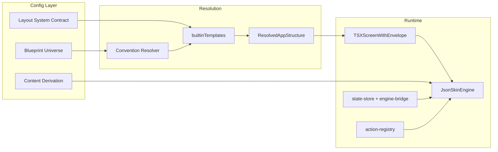

# HIcurv Blueprint–TSX Structural Alignment Plan (V4)

**Document type:** Strategic structural analysis only. No refactoring, no execution, no file edits.

**Authority references:** [BLUEPRINT_UNIVERSE_CONTRACT.md](src/02_Contracts_Reports/contracts/BLUEPRINT_UNIVERSE_CONTRACT.md), [LAYOUT_SYSTEM_CONTRACT.md](src/02_Contracts_Reports/contracts/LAYOUT_SYSTEM_CONTRACT.md), [CONTENT_DERIVATION_CONTRACT.md](src/02_Contracts_Reports/contracts/CONTENT_DERIVATION_CONTRACT.md), [APP_BUILD_PROTOCOL_V4.md](src/02_Contracts_Reports/build_protocol/APP_BUILD_PROTOCOL_V4.md), [RENDERING_PURITY_CONTRACT.md](src/02_Contracts_Reports/contracts/RENDERING_PURITY_CONTRACT.md).

---

## 1. TSX Wrapper Families

The system has **one universal wrapper entry point** ([TSXScreenWithEnvelope.tsx](src/lib/tsx-structure/TSXScreenWithEnvelope.tsx)) that resolves structure via [resolver](src/lib/tsx-structure/resolver/index.ts) and passes **resolved structure config** (not per-wrapper components) into the mounted Component. There are no distinct “wrapper families” as separate TSX components per structure type; instead there are **8 structure types** with **template variants** and **contracts** that define the JSON shape each structure expects.

| Structure Type | Template Variants                             | Expected JSON Shape (template)                                                                                   | State Slice Used                                                            | Engine Dependencies                    | Resolver Binding Strategy                        | Contract Compliance                                          |
| -------------- | --------------------------------------------- | ---------------------------------------------------------------------------------------------------------------- | --------------------------------------------------------------------------- | -------------------------------------- | ------------------------------------------------ | ------------------------------------------------------------ |
| **list**       | default, compact, dense, minimal              | [ListStructureConfig](src/lib/tsx-structure/types.ts): density, sort, filter, pagination, selection, orientation | Convention: none explicit; app-specific state via engine-bridge/state-store | list engine (optional)                 | Convention → metadata → default `list`/`default` | [list.ts](src/lib/tsx-structure/contracts/list.ts)           |
| **board**      | default, minimal, pipeline, swimlanes         | BoardStructureConfig: columns, cards, drag, swimlanes, density                                                   | Same                                                                        | board engine (optional)                | Same                                             | [board.ts](src/lib/tsx-structure/contracts/board.ts)         |
| **dashboard**  | default, compact, single-column, wide         | DashboardStructureConfig: grid, widgets, preset                                                                  | Same                                                                        | dashboard engine (optional)            | Same                                             | [dashboard.ts](src/lib/tsx-structure/contracts/dashboard.ts) |
| **editor**     | default, minimal, sidebar-left, fullscreen    | EditorStructureConfig: toolbar, sidebars, dirtyState, contentArea                                                | Same                                                                        | editor engine (optional)               | Same                                             | [editor.ts](src/lib/tsx-structure/contracts/editor.ts)       |
| **timeline**   | default, compact, day-only, week-month        | TimelineStructureConfig: slotMinutes, dayStart/dayEnd, axis, viewModes, interaction, dataBinding                 | Same; timeline often uses structure slice for events/tasks                  | scheduling, recurrence, prioritization | Same                                             | [timeline.ts](src/lib/tsx-structure/contracts/timeline.ts)   |
| **detail**     | default, minimal, detail-right, detail-bottom | DetailStructureConfig: split, master, detail                                                                     | Same                                                                        | detail engine (optional)               | Same                                             | [detail.ts](src/lib/tsx-structure/contracts/detail.ts)       |
| **wizard**     | default, minimal, linear, branched            | WizardStructureConfig: steps, navigation, branching                                                              | currentStep / flow state common                                             | abc, flow-router, learning             | Same                                             | [wizard.ts](src/lib/tsx-structure/contracts/wizard.ts)       |
| **gallery**    | default, minimal, masonry, uniform            | GalleryStructureConfig: layout, grid, lightbox, density                                                          | Same                                                                        | gallery engine (optional)              | Same                                             | [gallery.ts](src/lib/tsx-structure/contracts/gallery.ts)     |

- **Resolver binding:** [convention.ts](src/lib/tsx-structure/resolver/convention.ts): (1) co-located map, (2) path-pattern globs in resolverConfig, (3) metadata.structure, (4) default `list`/`default`. Template loaded from [builtinTemplates.ts](src/lib/tsx-structure/resolver/builtinTemplates.ts); no per-wrapper TSX—only one envelope that provides `ResolvedAppStructure` to the child Component.
- **Gap:** Actual screen components (e.g. landing, onboarding) often do **not** consume `structureType`/template; they use [JsonSkinEngine](src/05_Logic/logic/engines/json-skin.engine.tsx) with a **screen tree** (section/text/field/button/image/video/select/UserInputViewer). So “wrapper family” in practice is **JsonSkinEngine + screen JSON**, not the 8 structure-type contracts. The 8 types are **declared** and **resolved** but not yet **wired** to distinct renderers for list/board/timeline/etc.

---

## 2. Blueprint Compatibility

- **Blueprint → wrapper mapping:** Blueprint defines **molecules** (section, button, card, avatar, chip, field, footer, list, modal, stepper, toast, toolbar) and **organs** (header, hero, nav, footer, content-section, features-grid, gallery, testimonials, pricing, faq, cta). The **current runtime** renders via JsonSkinEngine, which switches on `node.type`: section, text, field, button, UserInputViewer, image, video, select. So:
  - **Blueprint molecules** section, button, field, (and list/modal/stepper/toast/toolbar/card if added) map to engine node types.
  - **Blueprint has no “text” or “image” or “video” or “select” as first-class molecule names**—content is slot-based (e.g. Card [title, body], Field [label]). So blueprint content slots (title, body, label, media) map to **content**; the **node type** in JSON is molecule (section, button, card, field, etc.).
- **Missing blueprint types:** The engine currently supports **non-molecule** node types: `text`, `image`, `video`, `select`, `UserInputViewer`. These are **not** in the 12-molecule contract ([allowed-molecules.ts](src/02_Contracts_Reports/contracts/allowed-molecules.ts)). So either (a) blueprint is extended to allow “primitive” content nodes (text, image, video, select) under a molecule, or (b) these are normalized to molecules (e.g. text → Section/Card body, image → Card media) so that blueprint stays molecule-only.
- **Required compatibility rules:**
  - Every blueprint node type in the tree must be one of the 12 molecules or an organ (organ expands to Section/Grid + slots).
  - Content keys must match CONTENT_DERIVATION_CONTRACT (outline tokens → content keys; slotKeys for organs).
  - Structure type (list/board/…/gallery) is **screen-level**; blueprint describes **node tree** (sections, molecules, organs). So blueprint can support all wrapper families **if** the screen declares structureType and the tree is valid for that type (e.g. timeline expects time-axis data; wizard expects steps).
- **Universal support:** Blueprint **can** universally support all 8 structure types **provided** (1) app/screen JSON declares `structure.type` and `structure.templateId`, (2) blueprint tree and content.manifest are valid for that structure (e.g. timeline screens have time-bound data; wizard has steps), and (3) a **renderer** exists that consumes ResolvedAppStructure and the blueprint-derived tree for that structure type. Today only the “single-screen tree + JsonSkinEngine” path is fully wired; list/board/timeline/dashboard etc. are contract + template only, not yet a full render path.

---

## 3. Content System Alignment

- **Binding into blueprint nodes:** Content is bound by **node id / rawId** ([CONTENT_DERIVATION_CONTRACT](src/02_Contracts_Reports/contracts/CONTENT_DERIVATION_CONTRACT.md)): `entry.content = contentMap[node.rawId] || {}`. Content keys must match molecule (and organ slotKey) contracts. So content files bind **per node**; blueprint defines structure and slot keys; content.manifest supplies values.
- **Universal across wrapper families:** Content is **structure-agnostic**: it keys by node, not by structure type. So the same content-binding model works for list, board, timeline, wizard, etc. **Gap:** Planner/journal/TRACK-style systems need **data-driven content** (e.g. checklist, timeline, steps) that may come from **state or engine output** (e.g. structure slice, journal slice), not only from static content.manifest. So:
  - **Planner:** Hierarchical tree + dates; content for items may be from `structure` state + content.manifest for labels/copy. Alignment: blueprint can have Section/List/Stepper; content can be mixed (manifest for static, state for dynamic). **Gap:** No explicit “planner” structure type; timeline + list + structure engines approximate it.
  - **Journal (TRACK-style):** Step/journal entries with acronym or dynamic steps. Content for steps may come from engine or state (e.g. journal.add, journal.set). **Gap:** TRACK as “dynamic acronym engine” is not a first-class blueprint organ or molecule; it would be a **flow/wizard** with engine-driven steps. Content binding is universal, but the **step source** (config vs data) must be declared (wizard template already has steps.source: config | data).
  - **TRACK-style step journal:** Would map to **wizard** structure with steps.source: "data", or a **list** of steps; content keys for each step come from molecule contract (e.g. Stepper [steps]). Gaps: (1) No explicit “TRACK acronym” blueprint entity—would be engine-defined steps + labels; (2) journal state shape (e.g. journal[track][key]) is state-resolver/behavior-listener concern, not content.manifest.

**Summary:** Content system is universal for **node-level** binding. Gaps for planner/journal/TRACK: (1) dynamic content from state/engines must be clearly allowed by contract; (2) TRACK/journal as first-class “pattern” may need a dedicated engine or wizard branch + engine declaration.

---

## 4. Engine Integration Layer

- **How engines plug in:** Engines register via [engineRegistry](src/system/registry/engineRegistry.ts) (name, integratesWith, description, tags). They are **not** tied to a specific TSX wrapper; they are invoked by actions (action-registry), flow-router, or by components reading state. **Blueprint-driven structures** are consumed by the envelope (structure type + template); the **screen tree** (from app JSON / blueprint) is rendered by JsonSkinEngine, which uses **state** (globalState + engineState) for gating (when.state/when.equals) and for field/button behavior. So engines plug in via (1) **state** (engine-bridge, state-store), (2) **actions** (action-registry), (3) **flow** (e.g. flow-router, abc, learning).
- **Wrapper-dependent vs structure-dependent:** Engine **declarations** are **structure-agnostic**. Usage is **structure-dependent** in practice: e.g. timeline screens use scheduling, recurrence, prioritization; wizard screens use abc, flow-router, learning. So: **declaration** = universal; **binding** = per screen/app (which engine state keys and actions the tree references).
- **Required to support:**
  - **Hierarchical planner (tree-based):** Structure slice + engines: scheduling, recurrence, prioritization, progression, aggregation, structure-mapper, parser-v4. Timeline or list structure type; data from structure state; blueprint = Section/List/Stepper nodes. **Existing**; no new engine type.
  - **Priority engine (1–10 scale + days before due):** [prioritization.engine](src/05_Logic/logic/engines/structure/prioritization.engine.ts) already provides effectivePriority with scale and ramp (daysOutForMin/Max). **Existing**.
  - **TRACK-style step journal:** Wizard structure with steps.source: "data"; steps content from state or from an engine (e.g. “TRACK acronym” engine that emits steps). **Gap:** No dedicated TRACK engine; could be a small engine that returns step list from config/acronym + state.
  - **Universal engine pattern:** (1) Register engine with name and integratesWith (state keys); (2) app JSON references state keys and actions that call the engine; (3) blueprint tree uses molecules that bind to that state (e.g. Field state.key, List items from state). Recommendation: **document** that engines are structure-agnostic; **per-app** declare which engines and state keys a screen uses; **wizard/timeline/list** templates declare dataBinding or steps.source so that engine-driven data is the source.

---

## 5. One-App Ecosystem Readiness

| App / Domain                   | Structure Type                   | Engine / State                                    | Supported?                     | Notes                                                                                                     |
| ------------------------------ | -------------------------------- | ------------------------------------------------- | ------------------------------ | --------------------------------------------------------------------------------------------------------- |
| **Planner**                    | timeline or list                 | scheduling, recurrence, prioritization, structure | Yes (contract + engines exist) | Full render path for “planner UI” may still be custom TSX; blueprint + structure engines cover data model |
| **Journal (TRACK-style)**      | wizard (steps from data) or list | flow-router, abc, custom TRACK engine             | Partial                        | TRACK acronym engine not first-class; wizard + data-driven steps can represent it                         |
| **Learning**                   | wizard / flow                    | learning, abc, flow-router                        | Yes                            | learning.engine + flow already used                                                                       |
| **Recovery**                   | list / detail                    | structure, aggregation                            | Yes                            | Structure slice + list/detail                                                                             |
| **Habit tracking**             | list / timeline                  | progression, recurrence, structure                | Yes                            | progression.engine (habit ramp/streak) exists                                                             |
| **Hierarchical business/home** | list + detail, or dashboard      | structure, aggregation, prioritization            | Yes                            | structure type list/detail/dashboard; engines for hierarchy and priority                                  |

**Fragmentation risk:** Currently **one** main render path (JsonSkinEngine + screen JSON). The 8 structure types are **resolved** but not each backed by a dedicated renderer. So “one-app” is **conceptually** supported (one envelope, one content model, one engine registry), but **implementationally** the system is still biased toward a single tree renderer. To avoid fragmentation: (1) keep a **single** content-binding and blueprint contract for all apps; (2) add **structure-type-specific** renderers (e.g. timeline component that consumes ResolvedAppStructure.structureType === "timeline" and template) so that planner/journal/learning/recovery/habit all use the same contracts but different structure types; (3) avoid duplicate state shapes or engine lists per app—use integratesWith and shared state keys.

---

## 6. Structural Risks

- **Drift risks:** (1) JsonSkinEngine node types (text, image, video, select, UserInputViewer) drift from the 12-molecule contract; (2) resolver default (list/default) used when metadata is missing, so screens may silently get wrong structure type; (3) content.manifest generation or merge logic omitted or out of sync with blueprint → blank UI.
- **Hardcoding risks:** (1) JsonSkinEngine has hardcoded layout/styles (e.g. section padding, button styles) that should come from palette/layout contract; (2) landing/onboarding flows may hardcode steps or intents instead of full blueprint + content.manifest; (3) Co-located map in convention is empty and not populated by build—structure type can be hardcoded in path patterns or metadata only.
- **Blueprint incompatibilities:** (1) UserInputViewer and non-molecule node types in app JSON cause molecule violations (Build Report already flags journal_track / my-interface); (2) organs expand to Section/Grid but compileSkinFromBlueprintScreen flattens to role-based nodes and does not enforce organ slotKeys; (3) blueprint HUMAN OUTLINE uses rawId and content tokens—if compiler does not emit contentMap by rawId, binding fails.
- **Wrapper rigidity:** (1) Single envelope + single tree renderer (JsonSkinEngine) means all screens look like “sections with children”; (2) list/board/timeline/dashboard/detail/wizard/gallery **contracts** exist but no corresponding **render components** that consume ResolvedAppStructure; (3) structure type is resolved but often unused by the mounted Component.
- **Engine coupling:** (1) JsonSkinEngine directly imports resolveContainerCreationsFit and dispatches state updates (landingStep, intent, recommendation)—business logic in renderer; (2) behavior-listener and state-resolver know about journal.add and state:currentView—engines and state shape are coupled to runtime; (3) flow execution (learning, calculator, abc) is separate from “structure” engines (scheduling, prioritization)—no single place that declares “this screen uses these engines.”

---

## 7. Proposed Clean Structure Strategy (No File Changes)

- **One-to-one wrapper ↔ structure contracts:** Formalize that **each** of the 8 structure types has **exactly one** contract (already so: list, board, dashboard, editor, timeline, detail, wizard, gallery). Ensure that any screen that declares a structure type is **rendered** by a component that accepts that structure’s RendererProps (or equivalent). Today: only the generic envelope exists; add or designate a **render component per structure type** that receives ResolvedAppStructure and the screen tree.
- **Blueprint type declarations:** (1) Keep the 12 molecules + organs as the only node types in the tree; (2) either **remove** or **reclassify** non-molecule node types (text, image, video, select, UserInputViewer) as content or as part of a molecule’s content shape so that app JSON never passes a node type outside the closed set; (3) document in blueprint that organs expand to Section (and optional Grid) with slotKeys and that content file supplies values keyed by slotKey.
- **Engine declaration format:** Keep EngineDefinition (name, integratesWith, description, tags). Add optional **structureTypes?: StructureType[]** to indicate “this engine is commonly used with these structure types” for build/reporting only; do not restrict invocation by structure type. Document that **per app** the Build Sheet lists which engines and state keys the app uses.
- **Content-binding model:** (1) Keep contentMap by node rawId; (2) document that **dynamic** content (from state or engine output) is allowed for specific slots (e.g. List items, Stepper steps) when the molecule contract allows data:list/data:timeline; (3) content.manifest remains the source for **static** copy; state/engines for **dynamic** slots; compiler merges both when producing app.json.
- **TSX wrapper purity enforcement:** (1) JsonSkinEngine must not contain business logic (e.g. resolveContainerCreationsFit, landingStep dispatch)—move to registered actions or a small landing engine; (2) all styles in JsonSkinEngine must come from palette tokens or layout config, not literals; (3) RENDERING_PURITY_CONTRACT and Build Report must flag UserInputViewer and any non-12 molecule type as violation; (4) enforce that the mounted Component in TSXScreenWithEnvelope receives ResolvedAppStructure and uses it (or explicitly ignores it with justification in Build Report).
- **No refactoring / no execution:** This plan is a **strategic structural analysis** only. Implementation of the above would be done in a separate, approved build following APP_BUILD_PROTOCOL_V4.

---

## Summary Diagram

---

**End of HIcurv Blueprint–TSX Structural Alignment Plan (V4).**