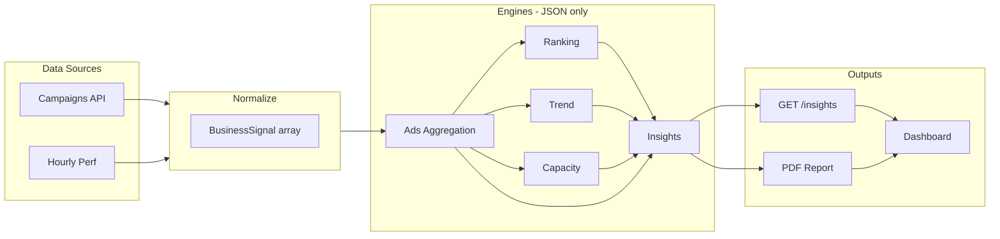

# BusinessSignal System Analysis + PDF Reporting Implementation

## Phase 0 — Analysis (Findings)

### What already exists

| Area                     | Location                                                                                                                                                                                                                         | Notes                                                                                                                                                                                                 |
| ------------------------ | -------------------------------------------------------------------------------------------------------------------------------------------------------------------------------------------------------------------------------- | ----------------------------------------------------------------------------------------------------------------------------------------------------------------------------------------------------- |
| **Aggregation**          | [src/05_Logic/logic/engines/structure/aggregation.engine.ts](src/05_Logic/logic/engines/structure/aggregation.engine.ts)                                                                                                         | `aggregateByDateRange`, `aggregateSignals` — operates on **StructureItem** (dueDate, signals/blockers/opportunities). **Not** ads metrics. Cannot reuse for spend/revenue/ROAS.                       |
| **Ranking**              | [src/05_Logic/logic/engines/structure/prioritization.engine.ts](src/05_Logic/logic/engines/structure/prioritization.engine.ts), [value-translation.engine.ts](src/05_Logic/logic/engines/comparison/value-translation.engine.ts) | Priority/sort for structure items; ranked value conclusions. **No** state-by-state or hour-by-hour performance ranking for ads.                                                                       |
| **Suggestion / control** | [src/05_Logic/logic/controllers/google-ads.controller.ts](src/05_Logic/logic/controllers/google-ads.controller.ts)                                                                                                               | Consumes `ScanEvent[]`, outputs `AdControlState` (budget/bid/schedule + reasons). **Not** a list of `{ level, target, reason, expectedImpact }`; no formal recommendations array.                     |
| **Summary engine**       | [src/05_Logic/logic/engines/summary/summary.engine.ts](src/05_Logic/logic/engines/summary/summary.engine.ts)                                                                                                                     | `processSummaryState(EngineState)` → key points, completion stats. **Onboarding/flow** summary only; not ads executive summary (totalSpend, ROAS, topState, etc.).                                    |
| **Decision engine**      | [src/05_Logic/logic/engines/decision/decision.engine.ts](src/05_Logic/logic/engines/decision/decision.engine.ts)                                                                                                                 | EngineState → decision state. Not used for ads recommendations.                                                                                                                                       |
| **Trend**                | [ScanEvent](src/07_Dev_Tools/scans/global-scans/types.ts) has `trend: "up" | "down" | "flat"`; [google-ads.controller.ts](src/05_Logic/logic/controllers/google-ads.controller.ts) computes dominant trend from events           | No **numeric slope** or trend engine that outputs e.g. `trendSlope` for indicator mapping.                                                                                                            |
| **PDF export**           | [src/05_Logic/logic/products/export-pdf.ts](src/05_Logic/logic/products/export-pdf.ts)                                                                                                                                           | `buildDecisionLedger`, `generatePdfHtml(ledger)`, `downloadPdf(ledger)` — **browser** print-to-PDF (no Puppeteer). Product/decision ledger only; no ads report.                                       |
| **Color / indicator**    | [google-ads-dashboard.tsx](src/01_App/(dead)%20Tsx/tsx-screens/google-ads/google-ads-dashboard.tsx) (lines 234, 273)                                                                                                             | Inline `color: increase ? "green" : decrease ? "red"`. **No** shared threshold config or `getIndicator(metricValue, trendSlope)`.                                                                     |
| **Google Ads API**       | [src/app/api/google-ads/campaigns/route.ts](src/app/api/google-ads/campaigns/route.ts), [client.ts](src/app/api/google-ads/client.ts)                                                                                            | Returns `campaigns` (id, name, status, budget, metrics) and `hourlyPerformance` (hour, campaignId, impressions, clicks, cost, conversions). **No geographic/state** dimension in current API or mock. |
| **Control flow**         | [src/05_Logic/logic/controllers/control-flow.ts](src/05_Logic/logic/controllers/control-flow.ts)                                                                                                                                 | `runControlFlow` → controller → executor. Uses `ScanEvent[]`; **no** unified BusinessSignal type.                                                                                                     |

### What is missing

- **BusinessSignal type and pipeline:** No single type for “one row of business metrics” (source, timestamp, region/state, hour, campaignId, impressions, clicks, cost, conversions, revenue). Plan doc ([google_ads_api_manager_breakdown_v2.plan.md](.cursor/plans/google_ads_api_manager_breakdown_v2.plan.md)) proposes it; not implemented.
- **Ads-specific aggregation:** No engine that aggregates by state and by hour to produce totalSpend, totalRevenue, roas, cpa, and per-state/per-hour breakdowns.
- **Ads ranking engine:** No “rank states by ROAS/conversions” or “rank hours” producing top N / worst N.
- **Trend slope:** No numeric trend slope (e.g. week-over-week or period delta) for use in `getIndicator(metricValue, trendSlope)`.
- **Capacity / projection engine:** No `ads-capacity.engine.ts`; no `projectedSafeBudget`, `projectedAggressiveBudget`, `expectedROASAtExpansion`, `marginalCPARisk`.
- **Insights engine:** No single JSON-only engine that takes signals + aggregated + ranking + trends + capacity and outputs `executiveSummary`, `recommendations[]`, `highlights[]`.
- **Indicator map:** No `indicator-map.ts` with configurable thresholds and `getIndicator()`.
- **PDF report for ads:** No report route or HTML template for executive summary, state table, time-of-day, capacity, action plan.
- **GET /api/google-ads/insights:** Does not exist.
- **Dashboard enhancements:** No Top 5 States/Hours, Growth Potential column, Capacity suggestion, or “Generate PDF” using indicator-map.

### Data availability note

- **State/region:** Current campaigns API and mock do **not** expose state/region. To support “State Allocation Table” and “topState/worstState”, either:
  - Add a **normalized BusinessSignal** that includes optional `region`/`state` and have aggregation/ranking tolerate missing state (e.g. single “Unknown” bucket or skip state ranking when absent), or
  - Extend mock/API/CSV to supply geographic breakdown when available.
- **Hour:** Mock already has `hourlyPerformance` per campaign; live API returns `hourlyPerformance: []`. Pipeline should accept hourly when present and rank “top 5 hours” from it.

### Reusable modules (no duplication)

- **Controller output:** Reuse `computeAdControlState` / `AdControlState` for budget/bid/schedule and reasons; insights engine should **derive** recommendation levels (increase/reduce/pause/test) and expectedImpact from this + capacity, not re-implement the math.
- **Existing PDF pattern:** Reuse the “build data object → generatePdfHtml(…) → output” pattern from [export-pdf.ts](src/05_Logic/logic/products/export-pdf.ts); for server-side PDF, add a single HTML→PDF step (Puppeteer or similar) in the report route only.
- **Normalization:** All metrics and timestamps should be normalized in one place (e.g. when building BusinessSignal[] from campaigns + hourly or CSV); engines consume normalized data only.

---

## Internal map (brief)

| Component                      | Exists  | Action                                                                                                                                                     |
| ------------------------------ | ------- | ---------------------------------------------------------------------------------------------------------------------------------------------------------- |
| Aggregation (ads)              | No      | **New** ads aggregation (by state, by hour; totals + breakdowns). Do not reuse structure aggregation (different domain).                                   |
| Ranking (states/hours)         | No      | **New** ranking engine: inputs aggregated state/hour buckets → top N / worst N.                                                                            |
| Suggestion / recommendations   | Partial | **Extend**: Controller already gives reasons; **new** insights engine formats them as `recommendations[]` with level + expectedImpact from capacity/trend. |
| Summary (executive)            | No      | **New** executive summary in insights engine (totalSpend, totalRevenue, roas, cpa, topState, topHour, worstState, growthOpportunities).                    |
| Trend slope                    | No      | **New** minimal trend computation (e.g. period-over-period delta or slope) from aggregated series; output numeric slope for indicator map.                 |
| Capacity / projection          | No      | **New** ads-capacity.engine.ts (projectedSafeBudget, projectedAggressiveBudget, expectedROASAtExpansion, marginalCPARisk).                                 |
| Indicator map                  | No      | **New** indicator-map.ts (thresholds + colors + arrows), `getIndicator(metricValue, trendSlope)`.                                                          |
| PDF report                     | No      | **New** report route + HTML template; optionally Puppeteer for server PDF.                                                                                 |
| Insights API                   | No      | **New** GET /api/google-ads/insights.                                                                                                                      |
| Dashboard (states, hours, PDF) | No      | **Extend** dashboard: Top 5 States/Hours, growth column, capacity, Generate PDF; use indicator-map.                                                        |

---

## Phase 1 — Insights Engine (JSON-driven)

- **Create** [src/05_Logic/logic/business/engines/ads-insights.engine.ts](src/05_Logic/logic/business/engines/ads-insights.engine.ts) (and directory if needed).
- **Input:** Single object with `signals`, `aggregated`, `ranking`, `trends`, `capacity` (types to be defined in a shared business types file).
- **Output:** Pure JSON:
  - `executiveSummary`: totalSpend, totalRevenue, roas, cpa, topState, topHour, worstState, growthOpportunities.
  - `recommendations`: array of `{ level: "increase" | "reduce" | "pause" | "test", target: string, reason: string, expectedImpact: number }`.
  - `highlights`: array of `{ label, value, direction: "up" | "down" | "stable", severity: "strong" | "moderate" | "weak" }`.
- **Contract:** No UI; no business math duplicated from controller or capacity—derive from passed-in aggregated/ranking/capacity/controller outputs.

---

## Phase 2 — Visual Indicator System

- **Create** [src/05_Logic/logic/business/ui/indicator-map.ts](src/05_Logic/logic/business/ui/indicator-map.ts).
- **Content:** JSON-driven config: `thresholds` (e.g. roas.strong/moderate, trendSlope.strongUp/strongDown), `colors` (strongPositive, moderatePositive, neutral, negative), `arrows` (up, down, flat).
- **API:** `getIndicator(metricValue, trendSlope)` → `{ color, arrow, label }`. Purely deterministic; no UI code in this file.

---

## Phase 3 — Capacity + Projection

- **Create** [src/05_Logic/logic/business/engines/ads-capacity.engine.ts](src/05_Logic/logic/business/engines/ads-capacity.engine.ts).
- **Input:** Aggregated metrics (and optionally current budget/campaign metrics).
- **Output (JSON only):** projectedSafeBudget, projectedAggressiveBudget, expectedROASAtExpansion, marginalCPARisk. All formulas in this engine only; no duplication in insights or UI.

---

## Phase 4 — PDF Report Generator

- **Create** [src/app/api/reports/google-ads-summary/route.ts](src/app/api/reports/google-ads-summary/route.ts).
- **Flow:** (1) Pull signals (from campaigns API + hourly, or normalized BusinessSignal[]). (2) Run aggregation → ranking → trend → capacity → insights (all existing/new engines). (3) Compose one structured report object. (4) Render: Option A — HTML template then convert to PDF via Puppeteer (or existing util); Option B — return styled HTML for print-to-PDF.
- **Report structure:** Page 1 Executive Summary; Page 2 State Allocation Table; Page 3 Time-of-Day Performance; Page 4 Growth Capacity & Recommendations; Page 5 Action Plan (Increase/Reduce/Pause/Test).
- **No duplication:** All math in engines; route only orchestrates and renders.

---

## Phase 5 — Live Dashboard Data Contract

- **Create** GET [src/app/api/google-ads/insights/route.ts](src/app/api/google-ads/insights/route.ts).
- **Return:** `{ executiveSummary, highlights, ranking, trends, capacity, recommendations }` (same pipeline as report, minus PDF rendering). No presentation logic; JSON only.

---

## Phase 6 — UI (Final Step)

- **When updating the dashboard** (e.g. move or clone [google-ads-dashboard.tsx](src/01_App/(dead)%20Tsx/tsx-screens/google-ads/google-ads-dashboard.tsx) into live app):
  - Add **Top 5 States** (with indicator-map for color + arrow).
  - Add **Top 5 Hours**.
  - Add **Growth Potential** column.
  - Add **Capacity Expansion** suggestion.
  - Add **“Generate PDF”** button (call report route or client-side PDF from insights payload).
- **Styling:** Use `getIndicator()` for colors and arrows; no hard-coded red/green in component.

---

## Architecture (high level)

---

## Rules compliance

- **JSON-driven:** Insights, capacity, indicator map config and outputs are JSON or typed JSON-like; no UI in engines.
- **No business math in UI:** Dashboard only displays data from API/insights and uses indicator-map for color/arrow.
- **No duplication:** Aggregation, ranking, trend, capacity, recommendations computed once in engines; report and insights API reuse same pipeline.
- **Metrics from BusinessSignal:** Define BusinessSignal and normalize campaigns + hourly (and optional state) into it; all downstream engines consume that or derived structures.
- **Timestamps normalized, region codes enforced:** Normalization layer at signal ingestion.
- **Deterministic, no AI, no black-box:** All logic explicit; every recommendation includes reason and (where specified) expectedImpact.

---

## Suggested implementation order

1. **Types and normalization:** Define `BusinessSignal` and normalize campaigns + hourlyPerformance (and optional state) into `BusinessSignal[]` in one place (e.g. in API or a small adapter).
2. **Ads aggregation engine:** By state, by hour; output totals + per-state/per-hour breakdowns.
3. **Ranking engine:** Top/worst state and top/worst hour from aggregated buckets.
4. **Trend engine:** Simple slope or direction from aggregated time series; output usable for indicator.
5. **Capacity engine:** projectedSafeBudget, projectedAggressiveBudget, expectedROASAtExpansion, marginalCPARisk.
6. **Insights engine:** Compose executiveSummary, recommendations, highlights from aggregated + ranking + trends + capacity (+ controller output where needed).
7. **Indicator map:** Config + `getIndicator(metricValue, trendSlope)`.
8. **GET /api/google-ads/insights:** Run pipeline; return JSON.
9. **PDF report route:** Same pipeline + HTML template + Option A or B for PDF.
10. **Dashboard:** Consume insights API; add Top 5 States/Hours, growth, capacity, Generate PDF; use indicator-map for visuals.

