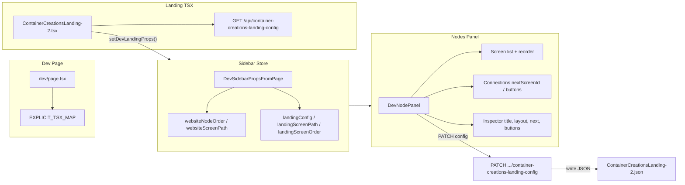

# Container Creations Landing — Node System Integration Plan

## 1. Current Node System (Technical Analysis)

### 1.1 Where nodes are defined

- **TSX Website (e.g. Container Creations Website):** Nodes come from a **contract** (JSON) fetched at runtime. The contract type is `TsxWebsiteContract` in `[src/04_Presentation/components/organs/tsx/website/types.ts](src/04_Presentation/components/organs/tsx/website/types.ts)`: `nodes: TsxWebsiteNode[]`, `nodeOrder: string[]`. Node order is the array order of section/organ IDs.
- **Container Creations Website** in `[src/01_App/(live) Business/Container_Creations/ContainerCreationsWebsite.tsx](src/01_App/(live)` Business/Container_Creations/ContainerCreationsWebsite.tsx) fetches the contract (e.g. from `content.apiContractPath`), then calls `setDevWebsiteNodeOrder(screenPath, contract.nodeOrder)` so the sidebar has a list of node IDs.
- **No separate “node definition” file** for the website flow: the contract is the source of truth; the TSX template renders sections from `contract.nodes` and order from `contract.nodeOrder` (or override).

### 1.2 How node order is derived for TSX screens

- For **website TSX screens:** order is `contract.nodeOrder` (array of id strings). The dev page does **not** derive order from the TSX file; the component (e.g. `ContainerCreationsWebsite`) must call `setDevWebsiteNodeOrder(screenPath, nodeOrder)` so the sidebar can show and reorder nodes.
- **Override:** `[src/04_Presentation/components/organs/tsx/website/node-order-override-store.ts](src/04_Presentation/components/organs/tsx/website/node-order-override-store.ts)` holds per–screen-path overrides (in-memory). `DevNodePanel` uses `effectiveOrder = override ?? baseOrder`.

### 1.3 How the sidebar reads node data

- **Store:** `[src/app/ui/control-dock/dev-right-sidebar-store.ts](src/app/ui/control-dock/dev-right-sidebar-store.ts)`.
  - `DevSidebarPropsFromPage`: `websiteScreenPath?: string`, `websiteNodeOrder?: string[]`.
  - `setDevSidebarProps()` is used by the dev page for layout/palette; `setDevWebsiteNodeOrder(screenPath, nodeOrder)` merges into `current` so the Nodes panel has a base order and a screen path.
- **Nodes panel:** When the user opens the “Nodes” pill, `[src/app/ui/control-dock/RightFloatingSidebar.tsx](src/app/ui/control-dock/RightFloatingSidebar.tsx)` (lines 709–711) renders `<DevNodePanel screenPath={searchParams.get("screen") ?? ""} />`.
- **DevNodePanel** in `[src/04_Presentation/components/organs/tsx/website/DevNodePanel.tsx](src/04_Presentation/components/organs/tsx/website/DevNodePanel.tsx)`:
  - Subscribes to `getDevSidebarProps()` and `getOverride(screenPath)`.
  - If `websiteScreenPath` matches `screenPath` and `websiteNodeOrder` has length, it shows a **list of node IDs** with **Up/Down** buttons to reorder. Reordering writes to `node-order-override-store` via `setOverride(screenPath, next)`.
  - There is **no node graph canvas** today—only a vertical list. There are **no connection lines** (e.g. nextScreenId or button targets).

### 1.4 What controls the “node inspector” and “node graph”

- **Node inspector:** There is no dedicated “node inspector” in the current codebase. The **Layout** panel (when a website-style screen is loaded) is `OrganPanel` + `DevNavigationPanel` (section layout presets, nav targets). The **Nodes** panel is only the list + reorder UI in `DevNodePanel`; it does not show or edit per-node fields (title, layout, nextScreenId, etc.).
- **Node graph:** Only the list in `DevNodePanel` exists; no visual graph or edges. Connections (e.g. nextScreenId, button targets) are not visualized.

---

## 2. Container Creations Landing Flow — Current Representation

### 2.1 ContainerCreationsLanding-2.tsx

- **Path:** `[src/01_App/(live) Business/Container_Creations/ContainerCreationsLanding-2.tsx](src/01_App/(live)` Business/Container_Creations/ContainerCreationsLanding-2.tsx).
- Fetches config from `CONFIG_URL` = `/api/container-creations-landing-config` (GET). No write API today.
- **Types:** `LandingConfig` with `screens: Screen[]`. Each `Screen` has: `id`, `stepLabel`, `layout`, `title`, `subtitle?`, `content[]`, `media[]`, `buttons[]`, `nextScreenId?`, `inlineControls?`, `dynamicSummary?`.
- **Screen order:** Determined solely by **array order** of `config.screens`. First screen’s `id` is used for initial `currentScreenId`.
- **Navigation:** `goNext()` uses `currentScreen.nextScreenId` if set, else next item in `screens`; `goBack()` uses previous index. Buttons: `type: "goto"` → `goToScreen(btn.target)`; `type: "next"` → `goNext()`; `type: "back"` → `goBack()`; `type: "link"` → external href.
- **Inline controls:** `screen.inlineControls` (array of ids like `containerLength`, `roofRibHeight`, …) drive `renderInlineControl()` / `renderInlineUI(screen, isLight)`. There are **no** separate `NEXT_BY_STEP` or `INLINE_UI_BY_STEP` maps; everything is driven by the JSON.

### 2.2 ContainerCreationsLanding-2.json

- **Path:** `[src/01_App/(live) Business/Container_Creations/ContainerCreationsLanding-2.json](src/01_App/(live)` Business/Container_Creations/ContainerCreationsLanding-2.json).
- Structure: `shopUrl`, `header`, `stepTracker`, `screens[]`. Each screen has the fields above; `buttons` include `nodeId` for instrumentation.

### 2.3 NEXT_BY_STEP / INLINE_UI_BY_STEP

- **Not present** in the codebase. Flow and inline UI are fully driven by:
  - **Screen order:** `screens` array order.
  - **Next step:** `screen.nextScreenId` or implicit next in array.
  - **Inline UI:** `screen.inlineControls` and the switch in `renderInlineControl(type)`.

---

## 3. Refactor: JSON as Single Authority

The landing is **already** JSON-authoritative: the TSX does not hardcode screen order, next, or inline controls. Optional tightening:

- **Screen order:** Keep using `config.screens` array order everywhere (step tracker, `goNext`/`goBack`, and—after integration—the Nodes panel).
- **Navigation:** Keep `nextScreenId` and button `target` as the only routing source; TSX already follows them.
- **Inline controls:** Keep `inlineControls` as the only source; no refactor needed.
- **Persistence:** Today the API is GET-only. To make “reorder/edit in Nodes panel → update flow” real, add a **PATCH/PUT** (or POST) handler for `/api/container-creations-landing-config` that writes the chosen variant JSON file (or document “override-only” with persistence as a later step).

---

## 4. Extend Node System: One Screen = One Node

### 4.1 Data model

- **Landing “nodes”** = landing screens. Node id = `screen.id`. One-to-one.
- **Fields to show per node (list or inspector):** `id`, `title`, `layout`, `inlineControls`, `nextScreenId`, `buttons` (and for inspector: `subtitle`, `content`, `media`, etc.).

### 4.2 Where to feed landing data into the sidebar

- **Option A (recommended):** Add **ContainerCreationsLanding-2** to the dev page’s TSX map so it can be loaded as a screen (e.g. `screen=Container_Creations/ContainerCreationsLanding-2` or a dedicated path). When that component mounts, it:
  - Fetches landing config (same as now).
  - Calls a **new** store API, e.g. `setDevLandingProps(screenPath, { screens, config })`, so the sidebar knows we’re in “landing flow” mode.
- **Option B:** Keep Container Creations Landing only on `/container-creations` and have that page render the RightFloatingSidebar in dev mode, and have `ContainerCreationsLanding-2` call the same `setDevLandingProps` when config is loaded. Then the Nodes panel must work with `screenPath` identifying the landing (e.g. a fixed string like `container-creations-landing`).

Recommendation: **Option A** so one place (/dev) drives both website TSX and landing TSX and the sidebar stays consistent.

### 4.3 Store extension

- In **dev-right-sidebar-store**, extend `DevSidebarPropsFromPage` with optional landing data, e.g.:

```ts
// Add to DevSidebarPropsFromPage
landingScreenPath?: string;   // e.g. "tsx:(live) Business/Container_Creations/ContainerCreationsLanding-2"
landingConfig?: LandingConfig; // full config so panel can read and eventually write back
landingScreenOrder?: string[]; // screen ids order (default: config.screens.map(s => s.id))
```

- Add `setDevLandingProps(screenPath, config, order?)` that sets these and notifies listeners. When both `websiteNodeOrder` and `landingConfig` could be set, the panel can decide by `screenPath` (e.g. if `screenPath` matches `landingScreenPath`, show landing UI; else show website node list).

---

## 5. Node list and connections

- **List:** Reuse the same list pattern as `DevNodePanel`: show one row per screen (id + title or stepLabel). Up/Down to reorder. Reordering = reordering `config.screens`; either update local state + call a new API to persist, or write to an override store and later persist.
- **Connections:** Today there is no graph. To “visualize nextScreenId and button goto targets”:
  - **Minimal:** In the list, show per node: “→ nextScreenId” and for each button with `target`, “→ target”. No new dependency.
  - **Graph:** If a visual graph is required, add a small canvas (e.g. SVG) or a library (e.g. react-flow) **inside** the same `DevNodePanel` (or a sibling component in the same panel) when `landingConfig` is present. Nodes = screens; edges = nextScreenId + button `type: "goto"` targets. This reuses the “existing node framework” in the sense of same store, same panel, same entry point.

### 5.1 When nodes are rearranged or connected

- **Reorder:** Changing order in the list (or in the graph if you implement drag-to-reorder) should:
  1. Update the ordered list of screen ids.
  2. Apply that order to `config.screens` (sort by that order).
  3. Either call a new **PATCH** endpoint for the landing config with the new `screens` array, or store in an override and pass the reordered config back to the landing component (e.g. via context or store) so the running landing reflects it without a full page reload.
- **Connections (nextScreenId / button target):** Editing “next” or a button’s `target` is an **inspector** action (see below). Changing a connection should update the corresponding `screen.nextScreenId` or `buttons[i].target` in the config and again persist via API or override.

---

## 6. Node sidebar: editing (inspector)

The current Nodes panel does not edit node fields. To support “edit title, subtitle, content blocks, media, inline controls, next screen routing”:

- **Option A:** Extend **DevNodePanel** so that when `landingConfig` is set, it shows:
  - The list (and optional graph) of screens.
  - When a screen is selected, an **inline inspector** below or beside the list: form fields for `title`, `subtitle`, `layout`, `nextScreenId`, `inlineControls` (e.g. multi-select), and for `buttons` (list of buttons with label, type, target/hrefKey). Content blocks and media can be a simple JSON or key-value list editor for the selected screen.
- **Option B:** Reuse the **Layout** panel slot for “landing screen inspector” when the current screen is the landing TSX: when `landingScreenPath` is set, the layout panel content could be a custom component that renders the same inspector. The Nodes panel would then focus on list + connections; the Layout panel on field editing.

Recommendation: **Option A** (all in Nodes panel) to keep “nodes + properties” in one place and avoid overloading the Layout panel, which is tied to section/organ layout for JSON/website screens.

---

## 7. Files to change (minimal)


| Area                      | File                                                                                                                                                               | Change                                                                                                                                                                                                                                                                                                                                                                                                                                                      |
| ------------------------- | ------------------------------------------------------------------------------------------------------------------------------------------------------------------ | ----------------------------------------------------------------------------------------------------------------------------------------------------------------------------------------------------------------------------------------------------------------------------------------------------------------------------------------------------------------------------------------------------------------------------------------------------------- |
| Dev TSX map               | `[src/app/dev/page.tsx](src/app/dev/page.tsx)`                                                                                                                     | Add `ContainerCreationsLanding-2` to `EXPLICIT_TSX_MAP` and path resolution (e.g. `Container_Creations/ContainerCreationsLanding-2` → same path pattern as other CC screens).                                                                                                                                                                                                                                                                               |
| Sidebar store             | `[src/app/ui/control-dock/dev-right-sidebar-store.ts](src/app/ui/control-dock/dev-right-sidebar-store.ts)`                                                         | Extend `DevSidebarPropsFromPage` with `landingScreenPath`, `landingConfig`, `landingScreenOrder`. Add `setDevLandingProps(screenPath, config, order?)`.                                                                                                                                                                                                                                                                                                     |
| Landing component         | `[src/01_App/(live) Business/Container_Creations/ContainerCreationsLanding-2.tsx](src/01_App/(live)` Business/Container_Creations/ContainerCreationsLanding-2.tsx) | After config load, call `setDevLandingProps(screenPath, config)` with a stable `screenPath` (e.g. from props or a constant). Optional: accept `config`/`onConfigChange` from parent so the dev page can inject updated config after sidebar edits.                                                                                                                                                                                                          |
| Nodes panel               | `[src/04_Presentation/components/organs/tsx/website/DevNodePanel.tsx](src/04_Presentation/components/organs/tsx/website/DevNodePanel.tsx)`                         | When `landingConfig`/`landingScreenPath` is set and matches `screenPath`, render landing UI: list of screens (id, title, layout), optional connection lines (nextScreenId, button targets), Up/Down reorder. On reorder, compute new `screens` order and call a callback or store setter that can persist (e.g. PATCH API or override store). Add optional “inspector” for selected screen: title, subtitle, layout, nextScreenId, inlineControls, buttons. |
| API (persistence)         | `[src/app/api/container-creations-landing-config/route.ts](src/app/api/container-creations-landing-config/route.ts)`                                               | Add **PATCH** (or PUT) that accepts `{ variant?, screens? }` (and optionally full config), writes to the same JSON file used by GET (by variant), so that reorder and edits from the Nodes panel persist.                                                                                                                                                                                                                                                   |
| Override store (optional) | New or existing                                                                                                                                                    | If persistence is deferred, add a small “landing override” store (similar to `node-order-override-store`) keyed by screen path, holding reordered screen ids and/or patched screen fields, and have the landing component read from it when provided by the dev page.                                                                                                                                                                                       |


---

## 8. Architecture summary (mermaid)




---

## 9. Implementation order (minimal steps)

1. **Store + landing feed:** Extend dev-right-sidebar-store with landing fields and `setDevLandingProps`. In ContainerCreationsLanding-2, after config load, call it (with a stable screenPath when running on dev).
2. **Dev page:** Add ContainerCreationsLanding-2 to EXPLICIT_TSX_MAP and path resolution so the landing can be opened on /dev and the sidebar receives the same `screen` search param.
3. **DevNodePanel landing mode:** If `landingConfig` and `landingScreenPath` match current `screenPath`, render list of screens (id, title, layout) with Up/Down; on reorder, update order and either call PATCH or write to an override store.
4. **Connections:** In the same list (or a small graph), show “→ nextScreenId” and “→ target” for goto buttons per screen.
5. **Inspector:** Add a selected-screen inspector in DevNodePanel (title, subtitle, layout, nextScreenId, inlineControls, buttons); wire to local state and then to PATCH or override.
6. **Persistence:** Implement PATCH on container-creations-landing-config that writes the variant JSON so reorder and edits persist.

This keeps the existing node framework (store, panel, list-based UI), uses the JSON as the single authority, and extends the panel to support the landing flow without a separate editor.