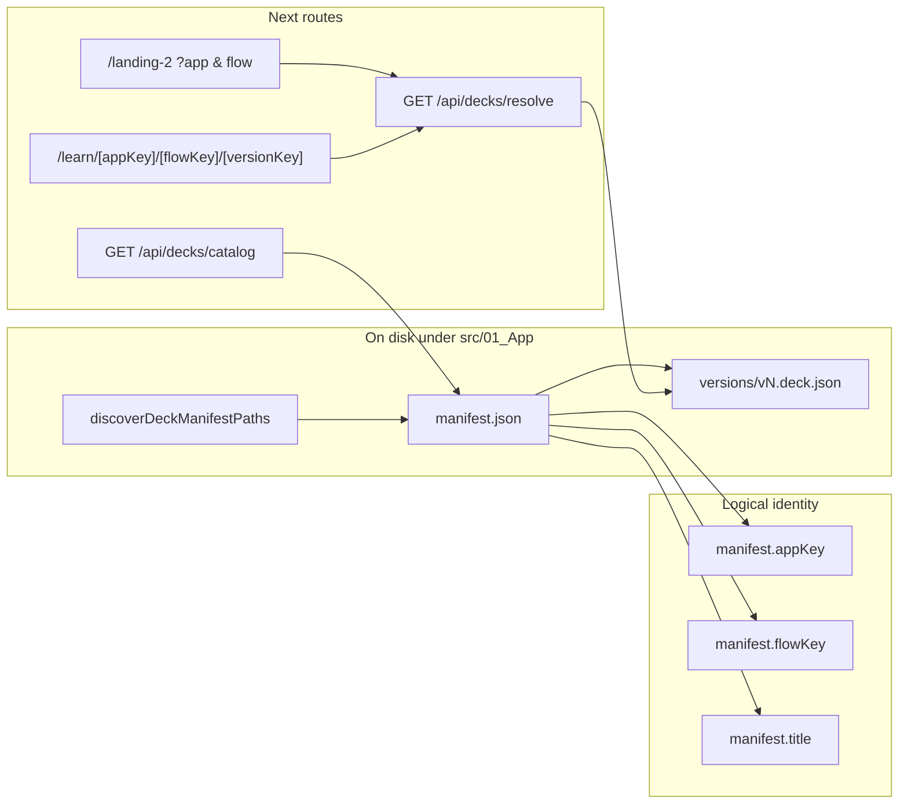

# Final deck-platform normalization and migration plan

## A. Current naming / path / routing model (as implemented today)

- **Discovery**: `[src/lib/deck-platform/registry.ts](C:/Users/New%20User/Documents/HiSense-1ea2985/src/lib/deck-platform/registry.ts)` walks `src/01_App`, collects any `.../decks/<folder>/manifest.json` where the parent of the flow folder is named `decks`. **Folder names are not used for `appKey`/`flowKey`/`title`**; they only determine `flowRootAbsPath` (= directory containing that manifest).
- **Source of truth for IDs and labels**: `[manifest.json](C:/Users/New%20User/Documents/HiSense-1ea2985/src/lib/deck-platform/manifest-schema.ts)` fields `appKey`, `flowKey`, `title`, `availableVersions`, optional schema fields, and `publicRoutes`.
- **Learn URL**: `[src/app/learn/[appKey]/[flowKey]/[versionKey]/page.tsx](C:/Users/New%20User/Documents/HiSense-1ea2985/src/app/learn/[appKey]/[flowKey]/[versionKey]/page.tsx)` does **exact string match** `catalog.find(e => e.deckRef.appKey === appKey && e.deckRef.flowKey === flowKey)`.
- **Public host hints**: `[src/lib/deck-platform/host-route-map.ts](C:/Users/New%20User/Documents/HiSense-1ea2985/src/lib/deck-platform/host-route-map.ts)` implements `resolvePublicUrlToLearnPath(host, pathname)` by reading `**loadCatalog()`** and matching `publicRoutes[]` with **lowercased host** comparison. **This helper is exported but not wired into Next middleware** (no `middleware.ts` in repo); it is a **Node-only** building block.
- **Host rewrites today**: `[next.config.js](C:/Users/New%20User/Documents/HiSense-1ea2985/next.config.js)` `rewrites.beforeFiles` maps **hardcoded** `source` + `has: host` → **hardcoded** `/learn/container-creations/vent-onboarding/vN` and `/learn/gospel-discipleship/track-1/v1`. **Not generated from manifests.**
- **Persistence APIs**: `[src/app/api/decks/save-draft/route.ts](C:/Users/New%20User/Documents/HiSense-1ea2985/src/app/api/decks/save-draft/route.ts)` and `[create-version/route.ts](C:/Users/New%20User/Documents/HiSense-1ea2985/src/app/api/decks/create-version/route.ts)` exist; **builder UI does not call them** (loads only via `[LandingDeckRenderer](C:/Users/New%20User/Documents/HiSense-1ea2985/src/lib/landing-deck/LandingDeckRenderer.tsx)` → `/api/decks/resolve`).
- **Live repo manifests (verified)**:
  - CC: `[.../decks/google onboarding/manifest.json](C:/Users/New%20User/Documents/HiSense-1ea2985/src/01_App/(live)`%20Business/Container_Creations/decks/google%20onboarding/manifest.json) — folder is `google onboarding` but `**appKey` is still `container-creations`**, `**flowKey` `vent-onboarding`** (identity decoupled from folder name).
  - HiClarify-shaped deck: `[.../Discipleship/decks/track-1/manifest.json](C:/Users/New%20User/Documents/HiSense-1ea2985/src/01_App/(live)`%20Gospel/Discipleship/decks/track-1/manifest.json) — `**appKey` `gospel-discipleship**`, not `hiclarify`.

## B. What is wrong or inconsistent now

| Area                              | Issue                                                                                                                                                                                                                                                                                                      |
| --------------------------------- | ---------------------------------------------------------------------------------------------------------------------------------------------------------------------------------------------------------------------------------------------------------------------------------------------------------- |
| **Brand keys**                    | Manifest uses `container-creations` and `gospel-discipleship`; target is `**containercreations`** and `**hiclarify**` (your confirmed rule: **dash-free brand only**; **flowKey stays kebab-case**).                                                                                                       |
| **Triple naming**                 | Physical area `(live) Business/Container_Creations`, manifest `appKey`, and domain `learn.containercreations.com` (no hyphen in subdomain) — **no single canonical brand string** in code.                                                                                                                 |
| **Rewrites vs manifests**         | `next.config.js` destinations must **exactly** match learn page params; today they mirror **old** manifest `appKey` values. After renaming `appKey`, **rewrites break** unless updated in the same change set.                                                                                             |
| `**resolvePublicUrlToLearnPath`** | Correctly lowercases **host** for matching, but **is unused** in the request pipeline — public routing actually depends on `**next.config` rewrites**, not this function.                                                                                                                                  |
| **Folder vs identity**            | Renaming flow folder (e.g. `google onboarding`) **does not** change picker labels or URLs; only **manifest** does. This feels like “live edit didn’t apply” but is **by design** of the current model.                                                                                                     |
| **Vercel / local**                | Host-conditioned rewrites **only run when the HTTP `Host` header** is `learn.containercreations.com` / `learn.hiclarify.com`. On `**localhost`**, those rules **do not fire** unless you map hosts locally. **No `vercel.json`** in repo; behavior is entirely Next config + deployment domain assignment. |
| **Editor persistence**            | Versions **do** load real `vN.deck.json` via resolve when manifest lists them; **saving** is not wired — edits are client state + export only.                                                                                                                                                             |

## C. Older git code still worth reusing

- **Commit `03c56d9` (“fix case issues… vercel-safe paths”)**: Added `[scripts/lowercase-01app-imports.cjs](C:/Users/New%20User/Documents/HiSense-1ea2985/scripts/lowercase-01app-imports.cjs)` / `[lowercase-01app-paths.cjs](C:/Users/New%20User/Documents/HiSense-1ea2985/scripts/lowercase-01app-paths.cjs)` — useful **precedent for mechanical path/import normalization**, not for learn routing. Large deletions removed legacy `src/01_App/hiclarify/learn/*` and monolithic landing TSX; **do not resurrect** those stacks — the current **deck-platform + `LandingDeckRenderer`** supersedes them.
- `**next.config.js` history** (`git log -- next.config.js`): Older commits predate current host rewrites; **no historical “live learn” implementation** in git for the **new** `/learn/[appKey]/...` + manifest model — the living spec is the Phase 1–6 plan + current files.

## D. Why the earlier “live domain” approach did not fully work

Concrete, repo-specific reasons (not guesses):

1. **Host-based rewrites require the real hostname** — `has: { type: 'host', value: 'learn.containercreations.com' }` in `[next.config.js](C:/Users/New%20User/Documents/HiSense-1ea2985/next.config.js)` **never matches** `localhost`, so developers see “routing doesn’t work” when testing only by path.
2. **Two parallel systems** — `publicRoutes` in manifests + **separate hardcoded** rewrite table. They **diverge** whenever manifest `appKey` or paths change (e.g. future `containercreations`).
3. `**resolvePublicUrlToLearnPath` not integrated** — correct idea (catalog-driven), but **fs-based `loadCatalog()` cannot run in Edge middleware**, so nobody wired it; **rewrites stayed static**.
4. **Case / slug inconsistency** — subdomain is `containercreations` while keys used `container-creations`; humans and bookmarks mix forms; learn page matching is **case-sensitive string equality** on `appKey`/`flowKey`.
5. **Folder renames ≠ identity renames** — file resolution follows **manifest path on disk**, while UI/URLs follow **manifest JSON**; without editing manifest, **behavior looks “stale”** even after restart.

## E. Recommended final normalized structure (single source of truth)

**Decision: keep on-disk folder name `decks/`** under each business/ministry area. **Do not rename disk trees to `learn/`** — `learn` should remain the **public URL segment** (`src/app/learn/...`) to avoid colliding with Next’s app router and to keep “content root” (`decks`) distinct from “delivery route” (`/learn/...`).

| Layer                    | Convention                                                                                                                                                                                                                                                                        |
| ------------------------ | --------------------------------------------------------------------------------------------------------------------------------------------------------------------------------------------------------------------------------------------------------------------------------- |
| **Brand key (`appKey`)** | `**containercreations`**                                                                                                                                                                                                                                                          |
| **Flow key (`flowKey`)** | **Kebab-case** slugs (e.g. `vent-onboarding`, `track-1`).                                                                                                                                                                                                                         |
| **Flow folder on disk**  | Under `.../decks/<flow-slug>/` — **recommend ASCII kebab folder names** (avoid spaces like `google onboarding`) to reduce tooling friction; must match team preference for human-readable dirs.                                                                                   |
| **Manifest**             | `appKey`, `flowKey`, `title` (display), `availableVersions`, `publicRoutes` with `**host`** matching real FQDN and `**path**` as public path.                                                                                                                                     |
| **Canonical in-app URL** | `/learn/{appKey}/{flowKey}/{versionKey}` — **must use normalized `appKey`** after migration.                                                                                                                                                                                      |
| **Public mapping**       | **Either** (pick one to avoid duplicates): **(1)** maintain `next.config.js` rewrites **manually** but in lockstep with manifests, **or (2)** add a **build-time script** that reads manifests and emits rewrite config (single SSOT). Middleware + fs is **not** viable on Edge. |

## F. Migration plan (ordered)

1. **Freeze a mapping table** (one-time doc in repo or ticket): old `appKey` → new; old public URLs → new `/learn/...` paths (for redirects if anything was bookmarked).
2. **Update manifests** under `[src/01_App/.../decks/](C:/Users/New%20User/Documents/HiSense-1ea2985/src/01_App)`:
  - Set `appKey` to `containercreations` for Container Creations flows.
  - Set `appKey` to `hiclarify` for the discipleship flow (replacing `gospel-discipleship`), **unless** you intentionally keep a separate product namespace — you asked for `**hiclarify`** as the brand key; use that.
  - Keep `flowKey` kebab-case; align `**publicRoutes.flowKey**` with the same `flowKey`.
3. **Rename flow disk folder** if needed (optional but recommended): e.g. `google onboarding` → `vent-onboarding` or your chosen slug — **then** ensure `manifest.json` path still valid (move manifest + `versions/` together).
4. **Update `[next.config.js](C:/Users/New%20User/Documents/HiSense-1ea2985/next.config.js)` rewrites** destinations to `/learn/containercreations/<flowKey>/vN` and `/learn/hiclarify/<flowKey>/v1` matching **post-migration** manifest keys.
5. **Update any hardcoded query defaults / links** (e.g. bookmarks, internal docs): `/landing-2?app=...&flow=...` must use new `appKey`.
6. **Legacy API bridge** `[src/app/api/container-creations-landing-config/route.ts](C:/Users/New%20User/Documents/HiSense-1ea2985/src/app/api/container-creations-landing-config/route.ts)`: if it still calls `resolveDeck` with `**container-creations`**, update to `**containercreations**` in the same release or keep a **temporary dual-key** read in resolver (narrow, time-boxed) — **avoid long-term duplicate naming**.
7. **Catalog / resolve / learn page**: no schema change required if `appKey` is still the field name; **values** change only. `[resolveDeck](C:/Users/New%20User/Documents/HiSense-1ea2985/src/lib/deck-platform/registry.ts)` already keys catalog by `${appKey}\0${flowKey}`.
8. **Live editor (after routing stable)**:
  - Wire **Save** in `[LandingDeckRenderer](C:/Users/New%20User/Documents/HiSense-1ea2985/src/lib/landing-deck/LandingDeckRenderer.tsx)` / panel to `POST /api/decks/save-draft` with `{ appKey, flowKey, versionKey, deck }` matching normalized keys.
  - Wire **Create version** (UI + confirmation) to `POST /api/decks/create-version`.
  - Keep **dev / `DECK_AUTHORING`** guards until auth strategy exists.

## G. Risks / regressions

- **Broken bookmarks** for `/learn/container-creations/...` and `?app=container-creations` after key change — mitigate with **Next redirects** (optional) from old paths to new.
- **Public host rewrites** out of sync with manifests — mitigate with **single generator** or strict checklist in PR.
- **Duplicate `(appKey, flowKey)`** manifests — `[loadCatalog](C:/Users/New%20User/Documents/HiSense-1ea2985/src/lib/deck-platform/registry.ts)` skips duplicates; migration must not leave two manifests claiming the same pair.
- **Production save**: `save-draft` / `create-version` are **403 in production** without `DECK_AUTHORING=1` — intentional; wiring UI without auth is risky.

## H. What must be done **before** wiring save-to-disk in the builder

1. **Normalize and deploy `appKey` + rewrite destinations** so **client, server, and URLs agree** (no mixed `container-creations` / `containercreations`).
2. **Confirm resolve + learn + landing-2** all work with new keys (manual + automated smoke).
3. **Decide auth** for write APIs (even if “dev only” initially): cookie, secret header, or restrict to `NODE_ENV !== 'production'`.
4. **Optional**: add **redirects** from old paths for one release to reduce support load.

---

## Deliverables you asked for at the end

### 1. Clean final structure (recommended)

- On disk: `src/01_App/(live) .../<OrgArea>/<OptionalApp>/decks/<flow-kebab>/manifest.json` + `versions/` + optional `schemas/`.
- URLs: `https://learn.containercreations.com/...` → Next rewrite → `/learn/containercreations/<flowKey>/<versionKey>`.
- Identity SSOT: `**manifest.appKey`** ∈ {`containercreations`, `hiclarify`}, `**manifest.flowKey**` kebab-case, `**title**` for human display.

### 2. Exact reasons the old live approach failed

- Host-conditioned rewrites **not exercised on localhost** without host mapping.
- **Static `next.config` rewrites** drifted from **manifest `publicRoutes` / appKey`**.
- **Catalog helper for host→path never wired** into the HTTP pipeline (fs vs Edge).
- **Folder renames** did not update **manifest keys**, so UI and URLs stayed on old labels.
- **Inconsistent slug shapes** (domain vs `appKey` with hyphens).

### 3. Next patch set to implement (when coding is allowed)

1. Migrate both manifests’ `**appKey`** (and `publicRoutes` if needed) to `containercreations` / `hiclarify`; keep **flowKey** kebab-case.
2. Update `[next.config.js](C:/Users/New%20User/Documents/HiSense-1ea2985/next.config.js)` rewrite `destination` paths to match.
3. Update legacy bridge / any hardcoded `resolveDeck({ appKey: ... })` call sites to new brand key (or time-boxed dual support).
4. Add optional **redirects** from old `/learn/...` paths.
5. Then: **builder Save / Create version** UI calling existing APIs + auth guard.

