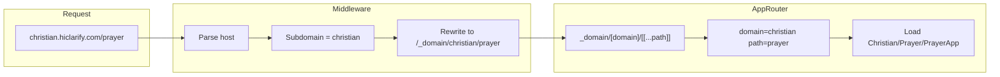

# Domain Architecture Refactor Plan

## Current state

- **01_App top-level folders:** `(dead) Json`, `(dead) screens`, `(dead) Tsx`, `(live) Business`, `(live) Gospel`, `apps-tsx`, `_auto-generated`.
- **Routing:** Path-based only. No middleware. Routes like `/`, `/prayer`, `/gospel`, `/container-creations`, `/dev`; pages import from `@/01_App/(live) Gospel/...` and `@/01_App/(live) Business/...`.
- **Key files:** [src/app/page.tsx](src/app/page.tsx) (root), [src/app/prayer/[[...slug]]/page.tsx](src/app/prayer/[[...slug]]/page.tsx) (PrayerApp), [src/app/gospel/page.tsx](src/app/gospel/page.tsx), [src/lib/tsx-screen-resolver.tsx](src/lib/tsx-screen-resolver.tsx), [src/lib/tsx-structure/resolver/convention.ts](src/lib/tsx-structure/resolver/convention.ts), [src/app/api/screens/route.ts](src/app/api/screens/route.ts). Many API routes and components import from the `(live) Gospel` and `(live) Business` paths.

---

## 1. Rename domain folders

- Rename `**(live) Business`** → `**Business**` (folder under `src/01_App`).
- Rename `**(live) Gospel**` → `**Christian**` (folder under `src/01_App`).

Do not rename `(dead) *` or `_auto-generated`; they stay as-is and are excluded from domain routing by the rules below.

---

## 2. Update all imports and path references

After renaming, every reference to the old paths must point to the new ones. Update:

- **Imports:** Replace `@/01_App/(live) Gospel/` with `@/01_App/Christian/` and `@/01_App/(live) Business/` with `@/01_App/Business/` in:
  - [src/app/api/prayer-room/end/route.ts](src/app/api/prayer-room/end/route.ts), [presence/route.ts](src/app/api/prayer/presence/route.ts), [listeners/route.ts](src/app/api/prayer/listeners/route.ts), [route.ts](src/app/api/prayer/route.ts), [chains/route.ts](src/app/api/prayer/chains/route.ts), [groups/route.ts](src/app/api/prayer/groups/route.ts), [groups/[id]/join/route.ts](src/app/api/prayer/groups/[id]/join/route.ts), [groups/[id]/leave/route.ts](src/app/api/prayer/groups/[id]/leave/route.ts), [groups/[id]/route.ts](src/app/api/prayer/groups/[id]/route.ts), [groups/members/route.ts](src/app/api/prayer/groups/members/route.ts), [groups/[id]/logo/route.ts](src/app/api/prayer/groups/[id]/logo/route.ts), [guided/route.ts](src/app/api/prayer/guided/route.ts), [audio/route.ts](src/app/api/prayer/audio/route.ts), [prayer-room/create/route.ts](src/app/api/prayer-room/create/route.ts), [join/route.ts](src/app/api/prayer-room/join/route.ts), [token/route.ts](src/app/api/prayer-room/token/route.ts), [mute/route.ts](src/app/api/prayer-room/mute/route.ts), [active/route.ts](src/app/api/prayer-room/active/route.ts), [signaling/route.ts](src/app/api/prayer-room/signaling/route.ts), [room/route.ts](src/app/api/prayer-room/room/route.ts).
  - [src/app/api/container-creations-landing-config/route.ts](src/app/api/container-creations-landing-config/route.ts), [src/app/api/prayer-stream-config/route.ts](src/app/api/prayer-stream-config/route.ts).
  - [src/app/prayer/[[...slug]]/page.tsx](src/app/prayer/[[...slug]]/page.tsx), [src/app/gospel/page.tsx](src/app/gospel/page.tsx), [src/app/prayer-stream/page.tsx](src/app/prayer-stream/page.tsx), [src/app/org/[slug]/admin/page.tsx](src/app/org/[slug]/admin/page.tsx).
  - [src/components/prayer/PlayerModule.tsx](src/components/prayer/PlayerModule.tsx), [src/components/prayer/RecorderModule.tsx](src/components/prayer/RecorderModule.tsx).
  - [src/01_App/Christian/Prayer/data/store.ts](src/01_App/(live) Gospel/Prayer/data/store.ts) (path comments only if present).
- **TSX resolver and convention:** [src/lib/tsx-screen-resolver.tsx](src/lib/tsx-screen-resolver.tsx) — change `(dead) Tsx` and `(live) Business` context paths to `Business`, and update `EXPLICIT_TSX_MAP` keys and imports from `(live) Gospel` to `Christian`. [src/lib/tsx-structure/resolver/convention.ts](src/lib/tsx-structure/resolver/convention.ts) — replace all `(live) Business/` and `(live) Gospel/` keys with `Business/` and `Christian/`.
- **Screen registry and API:** [src/07_Dev_Tools/nav/screen-registry.ts](src/07_Dev_Tools/nav/screen-registry.ts) — update `flattenIndexToPaths` so that `Business` and `Christian` (and other live domains) still get the `tsx:` prefix if needed for the dev menu. [src/app/api/screens/route.ts](src/app/api/screens/route.ts) — update root section names in fallbacks and defensive pushes from `"(live) Business"` / `"(live) Gospel"` to `"Business"` / `"Christian"`.
- **Dev/nav UI:** [src/app/components/CascadingScreenMenu.tsx](src/app/components/CascadingScreenMenu.tsx) — update any path tests or labels that reference `(live) Business` or `(live) Gospel` so they work with `Business` and `Christian` (and optionally retain styling for “live” vs “dead” by another rule if desired).

Use project-wide search for `(live) Business`, `(live) Gospel`, and `01_App/(live)` to catch any remaining references (e.g. in [src/01_App/(dead) Tsx/...](src/01_App/(dead) Tsx/HiClarify/AppsListV2.tsx), [src/01_App/(live) Business/Container_Creations/content.ts](src/01_App/(live) Business/Container_Creations/content.ts), [src/01_App/(live) Business/onboarding/content.ts](src/01_App/(live) Business/onboarding/content.ts)).

---

## 3. New domain folders and placeholder entry files

Create under `src/01_App`:

- **Plan/** with **Plan/PlanApp.tsx**
- **Protect/** with **Protect/ProtectApp.tsx**
- **Research/** with **Research/ResearchApp.tsx**
- **Learn/** with **Learn/LearnApp.tsx**

Each placeholder should be a minimal React component that renders a single line of text, e.g. `"Plan module coming soon"`, `"Protect module coming soon"`, etc. (no extra layout or routing inside the placeholder). Export as default.

---

## 4. Domain detection rules (authoritative list)

Treat a folder under `src/01_App` as a **domain** only if all of the following hold:

- It is a direct child of `src/01_App`.
- Its name does **not** contain parentheses (e.g. exclude `(dead) Json`, `(dead) Tsx`, `(dead) screens`).
- Its name does **not** start with `_` (e.g. exclude `_auto-generated`).
- Its name does **not** start with `dead` (covers any future `dead`* folders).

So after refactor, **domains** are: **Business**, **Christian**, **Plan**, **Protect**, **Research**, **Learn**. Optionally exclude **apps-tsx** by name from subdomain routing (e.g. do not map a subdomain `apps-tsx`); the plan keeps it as a non-domain folder.

Implement a small **domain list** (e.g. in `src/lib/domain-config.ts` or next to middleware):

- **Subdomain → folder map:** `christian` → `Christian`, `business` → `Business`, `plan` → `Plan`, `protect` → `Protect`, `research` → `Research`, `learn` → `Learn`.
- Optionally: a function that scans `src/01_App` (at build time or via API) and filters by the rules above to derive the same list for consistency with the report.

---

## 5. Subdomain routing design

**Behavior:**

- **Subdomain request:** e.g. `christian.hiclarify.com` or `christian.hiclarify.com/prayer`. Middleware runs first, reads host, extracts subdomain. If subdomain is one of the known domain keys (e.g. `christian`, `business`, `plan`, …), **rewrite** the request to an internal route that carries domain + path, e.g. `/_domain/christian` or `/_domain/christian/prayer`, so the browser URL stays `christian.hiclarify.com/prayer`.
- **Internal route:** Handle with a single dynamic route that loads the correct domain module (and optional sub-path). No change to the visible URL.

**Implementation:**

1. **Middleware** (create `src/middleware.ts`):
  - Run on all requests (or a matcher that excludes `_next`, static, api).
  - Read host from `request.headers.get('host')` or `request.nextUrl.hostname`.
  - Parse subdomain: if host is `christian.hiclarify.com` or `*.hiclarify.com`, subdomain = first label (e.g. `christian`). Ignore `www` (treat as no subdomain or main app).
  - If subdomain is in the domain map → rewrite to `/_domain/<subdomain>/<pathname without leading slash>`. Path can be empty for domain root.
  - Otherwise, do not rewrite (preserve current path-based behavior for `/`, `/dev`, `/prayer`, etc.).
2. **Dynamic route** (create `src/app/_domain/[domain]/[[...path]]/page.tsx`):
  - Read `params.domain` (e.g. `christian`) and `params.path` (e.g. `['prayer']` or `[]`).
  - Map `domain` to folder name (e.g. `christian` → `Christian`).
  - **Convention for resolving the component:**
    - If `path` is empty: load `01_App/<Domain>/<Domain>App.tsx` (e.g. `Christian/ChristianApp.tsx`). For Christian/Business, add **domain root entry** components if they don’t exist (e.g. `Christian/ChristianApp.tsx`, `Business/BusinessApp.tsx`) that render a simple landing or redirect to the first submodule; for Plan/Protect/Research/Learn use the new placeholders.
    - If `path` is e.g. `['prayer']`: load `01_App/Christian/Prayer/PrayerApp.tsx` (pattern: `01_App/<Domain>/<Segment1>/<Segment1>App.tsx`).
    - If `path` is `['discipleship']`: load `01_App/Christian/Discipleship/GospelDiscipleship` (or a thin `DiscipleshipApp.tsx` wrapper if you prefer consistency).
  - Use dynamic `import()` for the resolved path; if module not found, show a “Module not found” or 404.
  - Render the resolved component inside any shared layout (e.g. minimal shell or existing layout wrapper).
3. **Host parsing:** Support at least `*.hiclarify.com` (e.g. `christian.hiclarify.com`). Optionally support `localhost` with a query or host like `christian.localhost` for local dev; document in comments.

---

## 6. Domain root entry points for Business and Christian

- **Christian:** Add `src/01_App/Christian/ChristianApp.tsx` that either renders a simple “Christian” landing or redirects to the first submodule (e.g. `/prayer` or discipleship). Reuse existing layout expectations (e.g. SessionProvider/ThemeProvider) if this root is used under the same layout as `/prayer`.
- **Business:** Add `src/01_App/Business/BusinessApp.tsx` as domain root (e.g. simple “Business” landing or link to workspace/container-creations) so `business.hiclarify.com` has a defined entry.

---

## 7. Report (generated or documented)

Produce a short report (e.g. `src/01_App/DOMAIN_REFACTOR_REPORT.md` or a script output) that lists:

- **Detected domains:** Business, Christian, Plan, Protect, Research, Learn (and note that detection uses the rules: under 01_App, no parentheses, no leading `_`, no leading `dead`).
- **Generated placeholder modules:** Plan/PlanApp.tsx, Protect/ProtectApp.tsx, Research/ResearchApp.tsx, Learn/LearnApp.tsx (each rendering “X module coming soon”).
- **Routing logic added:** Middleware in `src/middleware.ts` (subdomain → rewrite to `/_domain/[domain]/[[...path]]`); dynamic page at `src/app/_domain/[domain]/[[...path]]/page.tsx` that maps domain + path to `01_App/<Domain>/.../<Module>App.tsx` and loads it dynamically.

---

## 8. Optional: keep path-based routes

Existing paths like `/prayer` and `/gospel` can remain as-is: they continue to import and render the same modules (from the new paths `Christian/...` and `Business/...`). Subdomain routing is additive. No need to remove `/prayer` or `/gospel` unless you explicitly want to force all access through subdomains.

---

## Summary diagram

---

## File change checklist

| Action                           | Target                                                                                                              |
| -------------------------------- | ------------------------------------------------------------------------------------------------------------------- |
| Rename folder                    | `(live) Business` → `Business`                                                                                      |
| Rename folder                    | `(live) Gospel` → `Christian`                                                                                       |
| Create folders + placeholder TSX | `Plan/PlanApp.tsx`, `Protect/ProtectApp.tsx`, `Research/ResearchApp.tsx`, `Learn/LearnApp.tsx`                      |
| Create domain roots              | `Christian/ChristianApp.tsx`, `Business/BusinessApp.tsx`                                                            |
| Create                           | `src/middleware.ts` (subdomain → rewrite)                                                                           |
| Create                           | `src/app/_domain/[domain]/[[...path]]/page.tsx` (load domain + path module)                                         |
| Create                           | `src/lib/domain-config.ts` (or equivalent: subdomain → folder map + optional scan)                                  |
| Update imports/paths             | All files referencing `(live) Gospel` or `(live) Business` (see section 2)                                          |
| Update                           | `tsx-screen-resolver.tsx`, `convention.ts`, `api/screens/route.ts`, `screen-registry.ts`, `CascadingScreenMenu.tsx` |
| Add report                       | `DOMAIN_REFACTOR_REPORT.md` or script output with domains, placeholders, routing summary                            |

