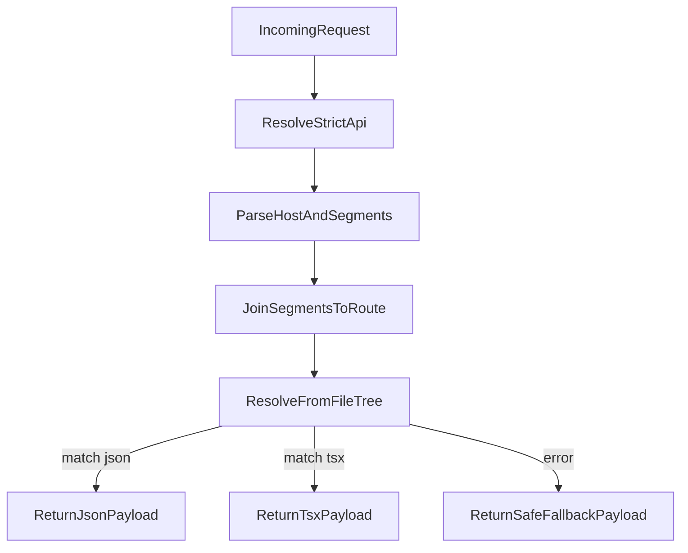

# Clean Resolver To Match File Tree

## Current Constraints Identified

- Segment-length restriction is hardcoded to exactly 2 in [C:/Users/New User/Documents/HiSense/src/lib/routing/strict-lowercase-router.ts](C:/Users/New User/Documents/HiSense/src/lib/routing/strict-lowercase-router.ts).
- `prayer` is hardcoded in API route fallback logic in [C:/Users/New User/Documents/HiSense/src/app/api/screens/resolve-strict/[...path]/route.ts](C:/Users/New User/Documents/HiSense/src/app/api/screens/resolve-strict/[...path]/route.ts).
- Domain page currently expects resolver payload shape `{ type: "json" | "tsx", path, jsonData? }` in [C:/Users/New User/Documents/HiSense/src/app/(domain)/[domain]/[[...path]]/page.tsx](C:/Users/New User/Documents/HiSense/src/app/(domain)/[domain]/[[...path]]/page.tsx).

## Implementation Plan

- Replace fixed 2-segment parser with flexible segment handling in [C:/Users/New User/Documents/HiSense/src/lib/routing/strict-lowercase-router.ts](C:/Users/New User/Documents/HiSense/src/lib/routing/strict-lowercase-router.ts):
  - Accept 1..N segments.
  - Normalize and validate lowercase only (keep strict lowercase policy, remove segment-count policy).
  - Build a dynamic route key from `segments.join("/")`.
- Implement pure file-tree resolver in [C:/Users/New User/Documents/HiSense/src/lib/routing/strict-lowercase-router.ts](C:/Users/New User/Documents/HiSense/src/lib/routing/strict-lowercase-router.ts):
  - Derive base folder from host domain mapping.
  - Resolve by traversing folder tree from incoming path only (no per-route if/else).
  - Support resolution order for path variants:
    - direct JSON/TSX file target
    - folder index conventions (`index.json` / `index.tsx`)
    - route-name file fallback within folder (`<last-segment>.json/.tsx`).
  - Return canonical payload with existing contract fields (`type`, `path`, `resolvedFilePath`, `jsonData?`).
- Remove hardcoded `prayer` route block in [C:/Users/New User/Documents/HiSense/src/app/api/screens/resolve-strict/[...path]/route.ts](C:/Users/New User/Documents/HiSense/src/app/api/screens/resolve-strict/[...path]/route.ts).
- Keep safe catch fallback in API route but align payload contract with domain page expectations:
  - fallback should return resolver-compatible JSON payload (not UI component schema), so domain page can render without crash.
- Add/adjust resolver logs in [C:/Users/New User/Documents/HiSense/src/app/api/screens/resolve-strict/[...path]/route.ts](C:/Users/New User/Documents/HiSense/src/app/api/screens/resolve-strict/[...path]/route.ts):
  - incoming host + segments
  - computed route key
  - selected resolved file path and response type
  - fallback path and error details.
- Harden client crash path in [C:/Users/New User/Documents/HiSense/src/app/(domain)/[domain]/[[...path]]/page.tsx](C:/Users/New User/Documents/HiSense/src/app/(domain)/[domain]/[[...path]]/page.tsx):
  - if resolver returns safe fallback payload, show non-fatal loading/fallback screen instead of throwing hard error.

## Verification

- API checks:
  - `/api/screens/resolve-strict/prayer` returns 200 with resolver-compatible payload.
  - `/api/screens/resolve-strict/containercreations` resolves dynamically without hardcoded route logic.
  - one deeper path (3+ segments) resolves when matching file-tree path exists.
- UI checks:
  - `/prayer` loads without full crash.
  - one containercreations route loads via same resolver pathing logic.
- Build check:
  - run `npm run build` to ensure no regressions.
- Regression guard:
  - search for removed hardcode: ensure no `if (route === "prayer")` remains in strict resolver route file.

## Resolution Flow (target)

