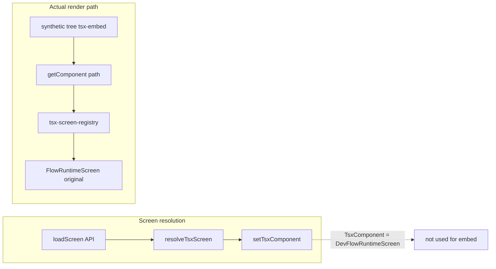

# Fix Dev Flow Screen: Editor, Grid, and Node Editing Not Applied

## Root cause

The dev page uses **two separate code paths** for TSX screens. Only one was updated to use `DevFlowRuntimeScreen`; the path that actually renders the screen was not.




- **Resolution path (correct):** `loadScreen` returns `tsx-screen` with path `Runtime/FlowRuntimeScreen` → `resolveTsxScreen(tsxPath)` returns the dynamic import of [DevFlowRuntimeScreen](src/07_Dev_Tools/flow/DevFlowRuntimeScreen.tsx) → `setTsxComponent(() => C)` stores it. So `TsxComponent` is `DevFlowRuntimeScreen`.
- **Render path (wrong):** The UI is rendered from a **synthetic tree** with a single `tsx-embed` node whose `params.path` is `"tsx:Runtime/FlowRuntimeScreen"`. [ExperienceRenderer](src/05_Logic/logic/engines/json-skin.engine.tsx) (via JsonSkinEngine) resolves the component by calling `**tsxEmbed.getComponent(path)`**. On the dev page, that is implemented as:

```ts
  getComponent: (path) => getComponentFromRegistry(path, { wrapInEnvelope: ... })
  

```

  So the component comes from [tsx-screen-registry.tsx](src/lib/tsx-screen-registry.tsx), where `"Runtime/FlowRuntimeScreen"` is registered as:

```41:42:src/lib/tsx-screen-registry.tsx
  registry["Runtime/FlowRuntimeScreen"] = () => import("@/engine/onboarding/FlowRuntimeScreen");
  

```

  So the **registry always returns the original FlowRuntimeScreen**, not `TsxComponent`. The envelope is applied to that original component, so the canvas still shows the non-dev screen. As a result:

- **Grid:** `FlowEngineDevGrid` lives only in `DevFlowRuntimeScreen`, so it never runs.
- **Editor / node editing:** `DevFlowAdapter`, node selection, and NodeInspector are used only when `DevFlowRuntimeScreen` is mounted, so they never activate.
- **Up/down reordering:** Same; it’s wired in the dev Flow branch that only runs when the dev screen is used.

So the fix is to make the **render path** use the same component as the resolution path for Flow screens, instead of the registry.

---

## Required change

**File: [src/app/dev/page.tsx](src/app/dev/page.tsx)** (inside the `if (TsxComponent)` block, where `tsxEmbedValue` is built)

- **Current behavior:** `getComponent` always delegates to `getComponentFromRegistry(path, { wrapInEnvelope: ... })`, so the registry’s `FlowRuntimeScreen` is used for `Runtime/FlowRuntimeScreen` (and for the alias `Business/Container_Creations/ContainerCreationsLanding-5`).
- **Desired behavior:** For paths that correspond to the Flow runtime screen, return the **envelope-wrapped `TsxComponent`** (which is already `DevFlowRuntimeScreen`) instead of calling the registry.

Implementation:

1. In the same block where `tsxEmbedValue` is defined, normalize the requested `path` the same way the registry does (strip `tsx:`, normalize slashes, trim). For example:
  `const normalized = (path ?? "").replace(/^tsx:/, "").replace(/\\/g, "/").trim();`
2. If the normalized path **includes** `"FlowRuntimeScreen"` **or** equals `"Business/Container_Creations/ContainerCreationsLanding-5"`, then **return** `EnvelopeWrapped` (the component that wraps `TsxComponent` in `TSXScreenWithEnvelope`) as the result of `getComponent(path)`.
3. Otherwise, keep the existing behavior: `return getComponentFromRegistry(path, { wrapInEnvelope: ... });`

`EnvelopeWrapped` is already defined in that block as:

```ts
const EnvelopeWrapped = () => (
  <TSXScreenWithEnvelope screenPath={resolvedPathForEnvelope} Component={TsxComponent} />
);
```

So for Flow paths, `getComponent` should return `EnvelopeWrapped as React.ComponentType<any>`. No changes to the registry or to `resolveTsxScreen` are required; production continues to use the registry.

---

## Optional: fix “3 errors” and console noise

- The **“3 errors”** badge is unrelated to this wiring; it comes from the app’s error reporting (e.g. Firebase or global error boundary). Fixing the component path may remove some of those if they were caused by dev-only code not mounting; any remaining errors should be inspected in the browser console and addressed separately.
- After the change, you can confirm behavior by checking the console for the existing log: `"DEV FLOW SCREEN ACTIVE — DevFlowRuntimeScreen mounted"` from [DevFlowRuntimeScreen.tsx](src/07_Dev_Tools/flow/DevFlowRuntimeScreen.tsx). Once the correct component is used, that log should appear when loading the Flow screen in `/dev`.

---

## Summary


| Issue                            | Cause                                                                                               | Fix                                                                   |
| -------------------------------- | --------------------------------------------------------------------------------------------------- | --------------------------------------------------------------------- |
| Grid layout does not change      | `FlowEngineDevGrid` is only in `DevFlowRuntimeScreen`; registry served original `FlowRuntimeScreen` | Use `EnvelopeWrapped` (TsxComponent) in `getComponent` for Flow paths |
| Editor/Preview no visible effect | Editor logic and NodeInspector live in dev Flow branch; wrong component mounted                     | Same: serve `DevFlowRuntimeScreen` for Flow paths                     |
| Cannot adjust nodes / text       | Node panel and inspector are wired to dev store/adapter used by `DevFlowRuntimeScreen`              | Same: ensure the dev screen is the one rendered                       |


Single change: in [src/app/dev/page.tsx](src/app/dev/page.tsx), inside the `getComponent` implementation passed to `TsxEmbedProvider`, add an early return that, for Flow-related paths (normalized path including `FlowRuntimeScreen` or equal to `Business/Container_Creations/ContainerCreationsLanding-5`), returns `EnvelopeWrapped` instead of calling `getComponentFromRegistry`.