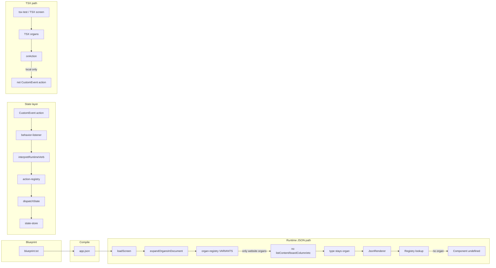

# Readiness Audit: Full Organism Build Capability

## 1. BLUEPRINT RUNTIME CAPABILITY

**Does the blueprint system define state schema, action definitions, mutation logic, event routing, derived state?**

- **State schema:** No. Blueprint (`[src/07_Dev_Tools/scripts/blueprint.ts](src/07_Dev_Tools/scripts/blueprint.ts)`) compiles to app.json (screen tree: sections, organ nodes, content). State shape is defined in `[src/03_Runtime/state/state-resolver.ts](src/03_Runtime/state/state-resolver.ts)` (`DerivedState`: journal, rawCount, currentView, values, layoutByScreen, scans, interactions). Blueprint does not declare or validate state.
- **Action definitions:** No. Actions are registered in `[src/05_Logic/logic/runtime/action-registry.ts](src/05_Logic/logic/runtime/action-registry.ts)` (structure:*, calendar:*, logic:*, diagnostics:*). Blueprint only emits node structure and content; behavior is attached to molecules (button, card, etc.) as `behavior.params` (e.g. `name: "state.update"`).
- **Mutation logic:** No. Mutations are implemented in state-resolver (intent branches) and in action-registry handlers (e.g. structure.actions). Blueprint does not contain mutation logic.
- **Event routing:** No. Routing is in `[src/03_Runtime/engine/core/behavior-listener.ts](src/03_Runtime/engine/core/behavior-listener.ts)`: `window.addEventListener("action", ...)` → state:* → `dispatchState`; navigate → `navigate(to)`; contract verbs → `runBehavior`; else → `interpretRuntimeVerb` → `runAction` → action-registry.
- **Derived state:** No. Derived state is computed in state-resolver (`deriveState(log)`). Blueprint does not define derivations.

**Is blueprint executed at runtime or only used for structural compilation?**

- **Compilation only.** Flow: Blueprint → compiler → app.json + content.manifest.json. At runtime: loadScreen loads JSON → assignSectionInstanceKeys → expandOrgansInDocument → applySkinBindings → composeOfflineScreen → JsonRenderer. No blueprint script runs at runtime (`[src/02_Contracts_Reports/system-architecture/03_ENGINE_SYSTEM.md](src/02_Contracts_Reports/system-architecture/03_ENGINE_SYSTEM.md)`: "Blueprint compiler (build-time only)").

**Can blueprint drive real-time updates (drag, reorder, create, delete, filter)?**

- **Partially.** Create/delete/update are supported via actions: `structure:addItem`, `structure:deleteItem`, `structure:updateItem` (and calendar/staging actions). These are triggered when a component fires `CustomEvent("action", { detail: { type: "Action", params: { name: "structure:addItem", ... } } })` and behavior-listener routes to interpretRuntimeVerb → runAction. Drag is a contract verb (tap, double, long, **drag**, scroll, swipe, …) routed to `runBehavior`; there is **no** BehaviorEngine handler that updates structure (e.g. move card between columns). Reorder within a list/column has no dedicated action (no `structure:reorderItems` or order field in StructureItem). Filter is not standardized (could use `state.update` with a filter key; no blueprint-driven filter evaluation).

---

## 2. STATE LAYER VERIFICATION

**Where application state is stored:**

| Store                        | File                                                                         | Contents                                                                                                                      |
| ---------------------------- | ---------------------------------------------------------------------------- | ----------------------------------------------------------------------------------------------------------------------------- |
| State log + derived snapshot | `[src/03_Runtime/state/state-store.ts](src/03_Runtime/state/state-store.ts)` | `log: StateEvent[]`, `state = deriveState(log)` (journal, rawCount, currentView, values, layoutByScreen, scans, interactions) |
| Layout (active)              | `src/engine/core/layout-store.ts`                                            | experience, type, preset, templateId, mode                                                                                    |
| Section/card/organ overrides | section-layout-preset-store, organ-internal-layout-store                     | Per-screen layout overrides                                                                                                   |

**How actions are dispatched:**

- `dispatchState(intent, payload)` in state-store (append to log → deriveState → persist → notify listeners).
- Entry points: behavior-listener (on `"action"` / `"input-change"`), action-registry handlers, JsonSkinEngine/button handlers, screen-loader.

**Can TSX organs connect via `onAction`?**

- **Contract:** TSX organs accept `onAction?: (actionName: string, payload?: unknown) => void` (`[src/04_Presentation/components/organs/tsx-organs/types.ts](src/04_Presentation/components/organs/tsx-organs/types.ts)`). To connect to the state layer, the parent must pass an `onAction` that dispatches the global pipeline, e.g. `window.dispatchEvent(new CustomEvent("action", { detail: { type: "Action", params: { name: actionName, ...payload } } }))`.
- **Current usage:** In `[src/app/tsx-test/page.tsx](src/app/tsx-test/page.tsx)`, `onAction` is local (setState for modal, console.log). It is **not** wired to the global behavior-listener/action-registry. When organs are rendered from the **JSON path** (see below), they are **not** rendered as TSX organs at all.

**Structural coupling:**

- No structural coupling is required for organs to use state: they only need `onAction` to be passed and to call it with action name + payload. The state layer does not depend on organ type.

---

## 3. ACTION PIPELINE

**Path: Organ → onAction → ??? → State mutation → Re-render**

- **Intended path:** Organ calls `onAction("structure:updateItem", { id, patch })` → parent forwards to `CustomEvent("action", { detail: { type: "Action", params: { name: "structure:updateItem", id, patch } } })` → behavior-listener → interpretRuntimeVerb → runAction → action-registry → structureUpdateItem → dispatchState("state.update", { key: "structure", value: nextSlice }) → listeners notify → JsonRenderer (and any subscriber) re-renders via useSyncExternalStore(subscribeState, getState).
- **Gap 1:** In the **blueprint → JSON** path, the 21 TSX structure organs (listContent, boardColumn, columnStrip, editorContent, timeline*, detailContent, wizardStep*, galleryGrid) are **never mounted**. Organ expansion uses `[src/04_Presentation/components/organs/organ-registry.ts](src/04_Presentation/components/organs/organ-registry.ts)`, which only has variants for **website** organs (header, hero, nav, footer, content-section, features-grid, gallery, testimonials, pricing, faq, cta). For `organId` listContent/boardColumn/columnStrip/etc., `loadOrganVariant(organId, variantId)` returns **null**, so `[expandOrgansInDocument](src/04_Presentation/components/organs/resolve-organs.ts)` leaves the node as `type: "organ"`. JsonRenderer then does `Component = Registry[resolvedNode.type]` (`[src/03_Runtime/engine/core/json-renderer.tsx](src/03_Runtime/engine/core/json-renderer.tsx)` ~946); **Registry has no "organ" entry** (`[src/03_Runtime/engine/core/registry.tsx](src/03_Runtime/engine/core/registry.tsx)`), so Component is undefined and the render path for that node is broken.
- **Gap 2:** When TSX organs **are** used (e.g. tsx-test or a TSX screen), nothing in the codebase passes an `onAction` that dispatches `CustomEvent("action", ...)`. So Organ → onAction → state mutation is **not** wired for TSX organ usage.

**Conclusion:** The pipeline exists for **JSON molecules** (button, card, etc. via handleTap → CustomEvent("action") → behavior-listener). It does **not** exist for the 21 TSX organs in the blueprint/JSON path (they are not rendered), and it is **not** wired for TSX screens that use those organs (onAction is not connected to the global event).

---

## 4. ENGINE COMPATIBILITY (8 STRUCTURE TYPES)

| Type          | State / actions                                                                                                        | Missing capabilities                                                                                                                                                             |
| ------------- | ---------------------------------------------------------------------------------------------------------------------- | -------------------------------------------------------------------------------------------------------------------------------------------------------------------------------- |
| **list**      | structure.items; structure:addItem, deleteItem, updateItem; List can bind itemsFromStatePath                           | No `structure:reorderItems`; no explicit order/index on item; filter possible via state.update but no standard filter contract.                                                  |
| **board**     | structure.items with categoryId (column); structureUpdateItem({ patch: { categoryId } }) can move between columns      | No reorder within column; no action that accepts (itemId, fromColumnId, toColumnId, index). Drag verb exists but no handler updates structure.                                   |
| **dashboard** | No dedicated dashboard state or actions; layout is in lib/tsx-structure (TSX path)                                     | No widget layout state in shared state-store; no actions for add/move/resize widgets.                                                                                            |
| **editor**    | No editor-specific state or actions                                                                                    | No rich-text or block state; no save/draft actions.                                                                                                                              |
| **timeline**  | structure.blocksByDate; calendar:setDay/week/month; structureSetBlocksForDate                                          | No event reorder in lane; no move-between-lanes action.                                                                                                                          |
| **detail**    | Could use state.values.selectedId; no dedicated actions                                                                | No detail:select or detail:navigate contract.                                                                                                                                    |
| **wizard**    | currentStepIndex in ExperienceRenderer/experience context; step prev/next dispatch state.update("currentStepIndex", …) | WizardStepStripOrgan / WizardStepContentOrgan are TSX-only (no JSON variant in organ-registry); step state works for experience flow but not for TSX wizard organs in JSON path. |
| **gallery**   | organ-registry has "gallery" (website grid variants); no gallery-specific actions                                      | Gallery as **structure type** (galleryGrid organ) has no variant in organ-registry; no gallery:select or reorder.                                                                |

---

## 5. FINAL DETERMINATION

**NOT READY TO BUILD ORGANISMS** with the existing blueprint + construct/state system for the 21 TSX structural organs and 8 structure-type compositions.

**Exact missing runtime capabilities:**

1. **Blueprint/JSON path does not render the 21 TSX organs.** Organ-registry has no variants for listContent, boardColumn, columnStrip, editorContent, timelineRuler, timelineLaneStrip, timelineLane, detailContent, wizardStepStrip, wizardStepContent, or galleryGrid. Unregistered `type: "organ"` nodes leave Component undefined in JsonRenderer; the JSON pipeline cannot render these organs.
2. **No wiring of organ `onAction` to the global action pipeline.** When TSX organs are used (e.g. in a TSX screen), no code passes `onAction` that dispatches `CustomEvent("action", { detail: { type: "Action", params: { name, ... } } })`, so organ events do not reach behavior-listener or action-registry.
3. **No structure actions for board reorder/drag.** Missing: `structure:moveItem` (or equivalent) and/or `structure:reorderItems` for reordering within a column and moving between columns. Drag is a contract verb but no BehaviorEngine handler updates `state.values.structure` on drag.
4. **No order/position field for list/board items.** StructureItem has no `order` or `index`; reordering would require a new field and an action that rewrites the items array.
5. **Dashboard, editor, timeline, detail, gallery** have no dedicated shared state or actions in the state-store/action-registry (dashboard/editor/timeline/detail/gallery behavior lives in TSX/structure libs, not in the global pipeline).
6. **Wizard step transitions** exist for experience/flow (currentStepIndex, prev/next in ExperienceRenderer), but WizardStepStripOrgan and WizardStepContentOrgan are not in organ-registry and are not rendered in the JSON path; no blueprint-driven wizard organism using TSX organs.

---

## Summary Diagram

To be **READY**, the system would need: (a) organ-registry variants or a JsonRenderer path that renders TSX organs for the 8 structure types, (b) a single place that wires organ `onAction` to `CustomEvent("action", ...)` when those organs are used, and (c) structure actions (and optionally BehaviorEngine drag handler) for move/reorder and, if desired, dedicated state/actions for dashboard, editor, timeline, detail, and gallery.