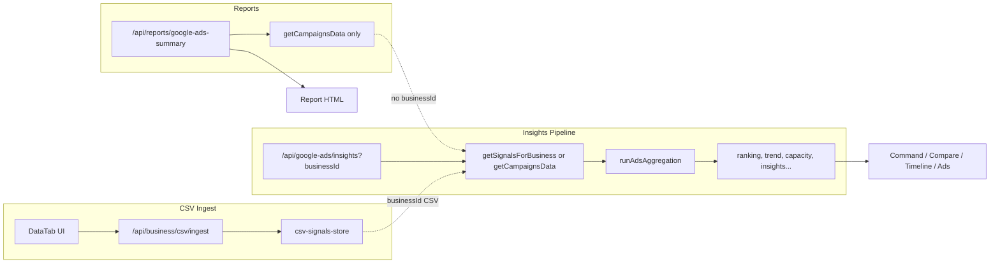

# Full System Reevaluation + CSV Import Priority (Analysis Only)

## PHASE 1 — Current Capability Audit

### Where CSV enters the system

- **Entry:** [DataTab.tsx](c:\Users\New User\Documents\HiSense\src\01_Applive) Business\workspace\DataTab.tsx) — file input → `POST /api/business/csv/ingest` with `{ csv: text, businessId }`.
- **API:** [route.ts](c:\Users\New User\Documents\HiSense\src\app\api\business\csv\ingest\route.ts) — validates `businessId`, requires `business.dataSourceType === "csv"` (e.g. `csv-placeholder`), calls `csvToSignals(csv)` then `setSignalsForBusiness(businessId, signals)`.
- **Store:** [csv-signals-store.ts](c:\Users\New User\Documents\HiSense\src\05_Logic\logic\business\csv-signals-store.ts) — in-memory `Map<businessId, BusinessSignal[]>`; no persistence (lost on server restart).

### CSV → BusinessSignal mapping

- **Mapper:** [csv-to-signals.ts](c:\Users\New User\Documents\HiSense\src\05_Logic\logic\business\csv-to-signals.ts) — header row (case-insensitive), column map defaults: `date`, `region`, `hour`, `campaign_id`, `impressions`, `clicks`, `cost`, `conversions`, `revenue`. Each row → one `BusinessSignal` with `source: "google-ads"`, `timestamp: options?.timestamp ?? Date.now()` (single value for whole run; `**date` column is not used for per-row timestamp**), `region` (normalized, default `"US"`), `hour` (0–23 if present), `campaignId`, and metrics.

### Signals → aggregation

- **Only path:** `GET /api/google-ads/insights?businessId=...` in [insights/route.ts](c:\Users\New User\Documents\HiSense\src\app\api\google-ads\insights\route.ts). When `business.dataSourceType === "csv"`, `signals = getSignalsForBusiness(businessId)`; else `getCampaignsData()` → `normalizeCampaignsToSignals`. Then `runAdsAggregation({ signals })` → `totals`, `byState`, `byHour`, `byCampaign`.

### Aggregation → insights

- Same route runs: `runAdsRanking`, `runAdsTrend`, `runAdsCapacity`, `runAdsSaturation`, `runAdsDemand`, `runAdsEfficiencyHistory`, `runAdsMarketDepth`, `runAdsBundleImpact`, `runAdsInsights`, and returns full response including `byCampaign`, `byHour`, `byState`.

### Insights → workspace tabs

- **CommandCenterTab, CompareTab, TimelineTab, AdsTab:** All call `GET /api/google-ads/insights?businessId=${businessId}`. So when the selected business is CSV and has ingested data, all four tabs receive CSV-driven insights.
- **ReportsTab:** Renders a link to `REPORT_URL = "/api/reports/google-ads-summary"` with **no** `businessId`. So reports do **not** use the workspace’s selected business or CSV data.

### Ads tab and CSV

- **Insights:** Uses same insights API with `businessId` → CSV-driven when business is CSV.
- **Ad definitions:** From `GET /api/google-ads/ad-definitions?businessId=...` → [loadAdDefinitions](c:\Users\New User\Documents\HiSense\src\05_Logic\logic\business\execute\ad-definitions-loader.ts) reads `src/00_Projects/Business_Files/<businessId>/ads/*.json`. For `csv-placeholder` there is **no** `ads` folder (only `default/ads/sample-search-ad.json` exists), so Ads tab shows “No ad definitions” for CSV business unless that folder and JSON are added.

### Compare / Timeline and CSV

- **CompareTab:** Fetches insights with `businessId` (CSV-driven) and `/api/google-ads/campaigns` (no businessId → Google only). Uses `campaignIds = campaigns.length > 0 ? campaigns.map(c => c.id) : Object.keys(byCampaign)` — so when using CSV, campaign list falls back to `byCampaign` keys; Compare **does** reflect CSV-driven data.
- **TimelineTab:** Uses only insights with `businessId`; displays `insights.byHour` → CSV-driven when CSV business has hourly data.

### Reports tab and CSV

- **Reports:** [reports/google-ads-summary/route.ts](c:\Users\New User\Documents\HiSense\src\app\api\reports\google-ads-summary\route.ts) has **no** `businessId` parameter. It always uses `getCampaignsData()` → `normalizeCampaignsToSignals` → same pipeline. So the report **never** uses CSV data; it uses live Google Ads or fails if Google is not configured.

### Onboarding and performance logic

- **Connection:** Onboarding is **not** wired into performance logic. Ads tab shows `onboardingFlowId` from ad definition and links to FlowViewer (`/dev?screen=...&flow=...`). No signals with `source: "onboarding"` are fed into aggregation or insights in this flow; it’s display/link only.

### Live data flow (high level)

---

## PHASE 2 — CSV Import Urgency

| Question                                               | Answer                                                                                                                                                                                                                                                                                                                                                                                |
| ------------------------------------------------------ | ------------------------------------------------------------------------------------------------------------------------------------------------------------------------------------------------------------------------------------------------------------------------------------------------------------------------------------------------------------------------------------- |
| Is CSV ingestion working end-to-end?                   | **Yes.** Upload in Data tab (business = CSV) → ingest API → store; insights API reads from store when `businessId` is CSV.                                                                                                                                                                                                                                                            |
| Does it fully populate byCampaign, byHour, byState?    | **Depends on CSV shape.** [ads-aggregation.engine.ts](c:\Users\New User\Documents\HiSense\src\05_Logic\logic\business\engines\ads-aggregation.engine.ts) splits: rows with `hour === undefined` → byState + byCampaign; rows with `hour !== undefined` → byHour only. So CSV with a `hour` column fills byHour; CSV without hour (campaign/region rows) fills byState and byCampaign. |
| Can reports be generated immediately after CSV import? | **No.** Report route does not accept `businessId` and never reads from the CSV store. It always uses `getCampaignsData()`.                                                                                                                                                                                                                                                            |
| What exact step is missing?                            | **Reports route:** Add optional `businessId` query param; when present and business is CSV, use `getSignalsForBusiness(businessId)` and run the same aggregation/insights pipeline as the insights route, then pass that payload to `generateGoogleAdsReportHtml`. No redesign of CSV ingestion.                                                                                      |

Additional note: CSV store is in-memory only; a server restart loses ingested data. Re-upload is required after restart (persistence would be a separate, future change).

---

## PHASE 3 — First Ad Creation (Minimum for Tonight)

| Capability                 | Status                                                                                                                                                                                                            |
| -------------------------- | ----------------------------------------------------------------------------------------------------------------------------------------------------------------------------------------------------------------- |
| Ad definition creation UI  | **Missing.** Definitions are file-based only; no form or “Create ad” in app.                                                                                                                                      |
| JSON save                  | **Missing.** Only [loadAdDefinitions](c:\Users\New User\Documents\HiSense\src\05_Logic\logic\business\execute\ad-definitions-loader.ts) exists; no write API.                                                     |
| Onboarding link attachment | **Exists.** `onboardingFlowId` in [ad-types.ts](c:\Users\New User\Documents\HiSense\src\05_Logic\logic\business\execute\ad-types.ts) and sample JSON; Ads tab shows “+ flow” and “Open flow in new tab” when set. |
| Export-ready Google copy   | **Display only.** Ads tab shows headlines, descriptions, final URL, display URL, CTA; no “Copy for Google” or export file.                                                                                        |

**Smallest addition for “create one ad tonight” (manual-ready, no API push):**

- **Option A (no code):** Manually create `src/00_Projects/Business_Files/csv-placeholder/ads/` and add one `.json` file matching [AdDefinition](c:\Users\New User\Documents\HiSense\src\05_Logic\logic\business\execute\ad-types.ts) (copy from `default/ads/sample-search-ad.json`, change id/campaignId/headlines/descriptions/URLs/CTA, set `onboardingFlowId` to desired flow). Then select business “CSV Upload” in workspace and open Ads tab to preview and open onboarding link. Export: copy from preview.
- **Option B (minimal code):** One “Save ad” API (e.g. `POST /api/google-ads/ad-definitions` with body validated as AdDefinition, write to `Business_Files/<businessId>/ads/<id>.json`) plus a simple form in Ads tab (or Data/Settings) to create one ad and save. Preview and onboarding link already work; export remains manual copy.

No automation, no Google API push; manual-ready only.

---

## PHASE 4 — Priority Plan (Tonight)

### Step-by-step execution

1. **Import 3-year CSV**
  - In workspace, select business **“CSV Upload”** (id `csv-placeholder`).
  - Open **Data** tab → Upload CSV (brother’s file).
  - Confirm “Ingested N rows” and optional “Refresh (re-fetch insights)” or switch to Command/Compare/Timeline to verify.
2. **Verify signals**
  - Stay on **“CSV Upload”**. Open **Command** or **Compare** or **Timeline**; they should show data from ingested CSV.
  - Optional: `GET /api/google-ads/insights?businessId=csv-placeholder` to confirm `noData: false` and populated `byCampaign` / `byHour` / `byState` (depending on CSV columns).
3. **Generate reports from CSV**
  - **Current behavior:** “Reports” tab → “Open HTML Report” uses live Google data only; CSV data is not used.
  - **Minimum change:** In [reports/google-ads-summary/route.ts](c:\Users\New User\Documents\HiSense\src\app\api\reports\google-ads-summary\route.ts), support optional `?businessId=`. When `businessId` is present and `getBusinessById(businessId)?.dataSourceType === "csv"`, use `getSignalsForBusiness(businessId)` (return 404 or empty report if no signals), then run the same aggregation + ranking + trend + capacity + … + insights pipeline as in the insights route, and pass that payload to `generateGoogleAdsReportHtml`. When no `businessId` or business is not CSV, keep current behavior (getCampaignsData). Then in [ReportsTab.tsx](c:\Users\New User\Documents\HiSense\src\01_Applive) Business\workspace\ReportsTab.tsx), set report link to include current workspace `businessId` (e.g. `REPORT_URL + '?businessId=' + encodeURIComponent(businessId)`), or pass `businessId` into ReportsTab and use it in the link.
4. **First new ad (manual-ready)**
  - Create folder `src/00_Projects/Business_Files/csv-placeholder/ads/` if missing.
  - Add one JSON file (e.g. copy `default/ads/sample-search-ad.json`, rename and edit id, campaignId, headlines, descriptions, finalUrl, displayUrl, callToAction, `onboardingFlowId`).
  - In workspace, select “CSV Upload”, open **Ads** tab → see variant, preview, and “Open flow in new tab” for onboarding.
  - Export: copy headlines/descriptions/URLs from preview for manual entry in Google Ads.

### What can realistically be done tonight

- **Works now:** CSV upload; Command/Compare/Timeline/Ads insights all driven by CSV when business is “CSV Upload”; ad preview and onboarding link when ad JSON exists under that business; manual first ad by adding one JSON file.
- **Needs 1 file change (reports):** Report route accepts `businessId` and uses CSV signals when business is CSV; Reports tab passes `businessId` in the report URL so “Open HTML Report” / “Print to PDF” use CSV data when that business is selected.
- **Needs future work:** Persistent CSV store across restarts; campaigns API or Compare UX when using CSV-only (campaign list already falls back to `byCampaign` keys); optional “Save ad” API + minimal form for creating first ad without touching the filesystem; date-column usage for per-row timestamp if time-series reports are needed later.

---

## Deliverable Summary

**Current system status (bullets)**

- CSV upload: Data tab → ingest API → in-memory store; works for business with `dataSourceType === "csv"`.
- CSV → BusinessSignal: csv-to-signals maps columns; timestamp is single value (date column unused); source “google-ads”.
- Insights API: For CSV business, reads from store and runs full pipeline; returns byCampaign, byHour, byState.
- Command, Compare, Timeline, Ads: All use insights with businessId → CSV-driven when CSV business.
- Reports: Always use getCampaignsData(); no businessId; do not use CSV.
- Ad definitions: File-based load only; no save API; Ads tab shows preview and onboarding link when JSON exists.
- Onboarding: Linked from ad definition to FlowViewer; not connected to performance/aggregation logic.

**Gap list**

- Reports route does not accept businessId or use CSV store.
- Reports tab does not pass businessId to report URL.
- CSV store is in-memory only (no persistence).
- No UI or API to create/save ad definition (only manual JSON file).
- Aggregation: byCampaign/byState vs byHour depend on presence of `hour` in CSV rows.

**Minimal execution plan for tonight**

1. Import CSV via Data tab (business = CSV Upload); verify in Command/Compare/Timeline.
2. Add businessId support to report route and report link so reports use CSV when that business is selected.
3. Create first ad by adding one JSON file under `Business_Files/csv-placeholder/ads/` and optionally set onboardingFlowId; use Ads tab to preview and open flow; copy from preview for manual Google entry.

No code written in this plan; no refactors, no deletion of files, no mocks, no changes to engines/projections/business-signal/flows/FlowViewer.