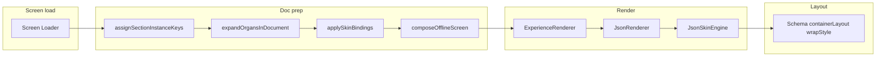

# Global Rendering Pipeline Audit and Enforcement

## STEP 1 — Screen loaders and entry points (discovered)

| Location                                                                                                   | What loads screens                                                                                                                                                                                                                                                                                                                                       |
| ---------------------------------------------------------------------------------------------------------- | -------------------------------------------------------------------------------------------------------------------------------------------------------------------------------------------------------------------------------------------------------------------------------------------------------------------------------------------------------- |
| [src/03_Runtime/engine/core/screen-loader.ts](src/03_Runtime/engine/core/screen-loader.ts)                 | `loadScreen(path)`: (1) `path === "container-creations-landing"` → fetch `/api/container-creations-landing-config` + `convertLandingConfigToJsonSkin(config)`; (2) `path.startsWith("tsx:")` → return `{ __type: "tsx-screen", path }`; (3) else → `safeImportJson` (fetch `/api/screens/[...path]`) → JSON                                              |
| [src/05_Logic/logic/runtime/landing-page-resolver.ts](src/05_Logic/logic/runtime/landing-page-resolver.ts) | `resolveLandingPage()`: returns `{ content: resolveContent("construction-cleanup"), flow }`. Used only in **dev** when no `screen` param.                                                                                                                                                                                                                |
| [src/app/landing/page.tsx](src/app/landing/page.tsx)                                                       | **No** `loadScreen`. Static import `container-creations.landing.json` → doc prep → `ExperienceRenderer`.                                                                                                                                                                                                                                                 |
| [src/app/page.tsx](src/app/page.tsx)                                                                       | `loadScreen(effectivePath)` (default `DEFAULT_SCREEN_PATH` = `"tsx:HiClarify/HiClarifyOnboarding"`). TSX branch → `TSXScreenWithEnvelope`; JSON branch → doc prep → `ExperienceRenderer`.                                                                                                                                                                |
| [src/app/dev/page.tsx](src/app/dev/page.tsx)                                                               | No screen: `resolveLandingPage()` → set json with `root: { type: "json-skin", children: content.blocks }`. With screen: `loadScreen(pathToLoad)` (or flow → loadScreen(engineViewerPath)). TSX → `TSXScreenWithEnvelope`; JSON → doc prep → `experience === "app"` ? direct `JsonRenderer` in `PreviewStage` : `ExperienceRenderer` in `wrappedContent`. |
| [src/app/container-creations/page.tsx](src/app/container-creations/page.tsx)                               | Fetch `/api/container-creations-landing-config` → `convertLandingConfigToJsonSkin(config)` → doc prep → `ExperienceRenderer`. **No** `loadScreen`.                                                                                                                                                                                                       |

**Doc prep (shared where JSON is used):** `assignSectionInstanceKeys` → `expandOrgansInDocument` → `applySkinBindings` → `composeOfflineScreen` ([src/06_Data/screens/compose-offline-screen.ts](src/06_Data/screens/compose-offline-screen.ts)). Then optional `collapseLayoutNodes`; `collectSectionKeysAndNodes` / `collectSectionLabels`.

**Rendering:** `ExperienceRenderer` ([src/03_Runtime/engine/core/ExperienceRenderer.tsx](src/03_Runtime/engine/core/ExperienceRenderer.tsx)) wraps `JsonRenderer`. `JsonRenderer` ([src/03_Runtime/engine/core/json-renderer.tsx](src/03_Runtime/engine/core/json-renderer.tsx)): when `node.type === "json-skin"` → `JsonSkinEngine` ([src/05_Logic/logic/engines/json-skin.engine.tsx](src/05_Logic/logic/engines/json-skin.engine.tsx)); else full `renderNode` (Registry, section compounds, etc.). Schema layout lives in JsonSkinEngine section case: `params.containerLayout` (full/contained/edge), `params.wrapStyle` (card/block/none).

---

## STEP 2 — Pipeline fragmentation table

| Screen / route                          | Route                                                                                  | Loader / source                                       | Renderer                                           | Layout engine                                         | Schema-driven?                                                   |
| --------------------------------------- | -------------------------------------------------------------------------------------- | ----------------------------------------------------- | -------------------------------------------------- | ----------------------------------------------------- | ---------------------------------------------------------------- |
| Container Creations (landing)           | `/landing`                                                                             | Static JSON file                                      | ExperienceRenderer → JsonRenderer → JsonSkinEngine | JsonSkinEngine (containerLayout/wrapStyle)            | Yes                                                              |
| Container Creations (dev or loadScreen) | `/dev?screen=container-creations-landing` or loadScreen("container-creations-landing") | loadScreen → API + **convertLandingConfigToJsonSkin** | ExperienceRenderer or JsonRenderer                 | JsonSkinEngine                                        | Yes, but **converter** not canonical JSON                        |
| Container Creations (standalone)        | `/container-creations`                                                                 | Fetch API + **convertLandingConfigToJsonSkin**        | ExperienceRenderer                                 | JsonSkinEngine                                        | Yes, but **converter**                                           |
| Default root                            | `/`                                                                                    | loadScreen → **TSX** (HiClarifyOnboarding)            | **TSXScreenWithEnvelope** (no JsonRenderer)        | Component layout                                      | **No**                                                           |
| JSON screen (root)                      | `/` with screen=... JSON path                                                          | loadScreen → API JSON                                 | ExperienceRenderer                                 | JsonRenderer (Registry + JsonSkinEngine if json-skin) | Yes for json-skin                                                |
| Dev no screen                           | `/dev` no param                                                                        | **resolveLandingPage()** → content.blocks             | ExperienceRenderer                                 | JsonSkinEngine                                        | Partial (blocks from resolveContent, not a single screen schema) |
| Dev TSX                                 | `/dev?screen=...` TSX                                                                  | loadScreen → tsx-screen                               | **TSXScreenWithEnvelope**                          | Component layout                                      | **No**                                                           |
| Dev JSON (website/learning)             | `/dev?screen=...` JSON                                                                 | loadScreen → JSON                                     | ExperienceRenderer                                 | JsonSkinEngine when json-skin                         | Yes                                                              |
| Dev JSON (app experience)               | `/dev?screen=...` JSON, experience=app                                                 | loadScreen → JSON                                     | **JsonRenderer directly** (no ExperienceRenderer)  | JsonSkinEngine when json-skin                         | Yes but **different wrapper**                                    |

---

## STEP 3 — Violations (why each breaks the architecture)

1. **TSX screens bypass JsonRenderer**
  **Where:** [src/app/page.tsx](src/app/page.tsx) (root), [src/app/dev/page.tsx](src/app/dev/page.tsx) (TSX branch).  
   **What:** When `data?.__type === "tsx-screen"`, UI renders `<TSXScreenWithEnvelope ... />`. No JsonRenderer, no JsonSkinEngine, no schema layout.  
   **Why it breaks:** Two separate rendering systems; layout and behavior are component-defined, not schema-driven.
2. **Two sources for “container-creations”**
  **Where:** (a) [src/app/landing/page.tsx](src/app/landing/page.tsx) uses static [container-creations.landing.json](src/05_Logic/logic/content/landing/container-creations.landing.json); (b) [screen-loader.ts](src/03_Runtime/engine/core/screen-loader.ts) (path `"container-creations-landing"`) and [container-creations/page.tsx](src/app/container-creations/page.tsx) use API + [convertLandingConfigToJsonSkin](src/05_Logic/logic/landing/convert-landing-config-to-json-skin.ts).  
   **Why it breaks:** Same logical screen can come from static JSON or from converter; schema and converter can diverge; “single source of truth” is violated.
3. **Dev “no screen” uses resolveLandingPage content.blocks**
  **Where:** [src/app/dev/page.tsx](src/app/dev/page.tsx) when `!screen`: `resolveLandingPage()` → `root: { type: "json-skin", children: content.blocks }`.  
   **What:** `content` from `resolveContent("construction-cleanup")` (e.g. [content-resolver](src/05_Logic/logic/content/content-resolver.ts) / cleanup content).  
   **Why it breaks:** Not a single screen schema; ad-hoc structure built from different content API; different from any other screen load path.
4. **layout.tsx applies stage maxWidth in dev**
  **Where:** [src/app/layout.tsx](src/app/layout.tsx) `RootLayoutBody`: `.json-stage` has `maxWidth: isOnboardingTsx ? "none" : \`min(100%, ${stageMaxWidth}px)` (e.g. 1100/768/420).  
   **Why it breaks:** Layout constraint lives outside the renderer; schema-driven full-bleed is constrained by the stage.
5. **PreviewStage adds padding**
  **Where:** [src/04_Presentation/components/stage/PreviewStage.tsx](src/04_Presentation/components/stage/PreviewStage.tsx): `canvasOuterStyle` has `padding: 20`.  
   **Why it breaks:** Content area gets padding outside the renderer; not neutral wrapper.
6. **Dev app experience uses JsonRenderer without ExperienceRenderer**
  **Where:** [src/app/dev/page.tsx](src/app/dev/page.tsx) when `experience === "app"`: renders `<JsonRenderer ... />` directly inside `PreviewStage`, not wrapped in `ExperienceRenderer`.  
   **Why it breaks:** Different wrapper path than website/learning; potential for different behavior/context; not “single pipeline.”
7. **/container-creations page uses converter and has error-state layout**
  **Where:** [src/app/container-creations/page.tsx](src/app/container-creations/page.tsx): fetch config → convertLandingConfigToJsonSkin; error state `<main style={{ ... padding: "2rem" }}>`.  
   **Why it breaks:** Same as (2) for converter; error UI applies layout in page.
8. **Navigator/editor layout not a single explicit structure**
  **Where:** [src/app/layout.tsx](src/app/layout.tsx) (app-chrome top bar, app-content, section panel, absolute `.stage-center`); [src/app/dev/layout.tsx](src/app/dev/layout.tsx) (flex row: PipelineDiagnosticsRail, children, RightFloatingSidebar).  
   **Why it breaks:** No single EditorRoot/TopBar/LeftSidebar/CanvasArea/RightSidebar contract; absolute positioning; z-index and scroll behavior not clearly layered.

---

## STEP 4 — Single valid rendering architecture (target)

**Rules:**  

- One screen loader: `loadScreen(path)` returns **only** JSON (or a single “json-skin” document). No TSX descriptor in the main path.  
- All routes that show a “screen” use: **Screen load (JSON)** → **composeOfflineScreen** → **ExperienceRenderer** → **JsonRenderer** → **JsonSkinEngine** → **Schema layout**.  
- Layout (full/contained/edge, card/block/none) only in JsonSkinEngine from `params.containerLayout` / `params.wrapStyle`.  
- Page wrappers and layout.tsx: no maxWidth, no margin auto, no padding on content; only neutral wrappers (width 100%, maxWidth none, padding 0, margin 0 where applicable).

---

## STEP 5 — Migrate all screens to the single pipeline

- **TSX screens (root + dev):**  
  - Option A (full migration): For each TSX screen (e.g. HiClarifyOnboarding, ContainerCreationsLanding, ContainerCreationsWebsite), produce a canonical json-skin JSON screen (file or API). Point `loadScreen` at that JSON. Remove TSX branch from page.tsx and dev/page.tsx so both always go: loadScreen → JSON → doc prep → ExperienceRenderer.  
  - Option B (bridge): Keep TSX for a transition period but render them inside a single “shell” that still goes through ExperienceRenderer with a minimal json-skin node that embeds the TSX component as a single section/organ. (More complex and still two systems.)  
  **Recommendation:** Plan for Option A; first migrate default root and Container Creations to JSON-only, then others.
- **Container Creations single source:**  
  - Use **one** source: the static [container-creations.landing.json](src/05_Logic/logic/content/landing/container-creations.landing.json) (or a single API that returns this shape).  
  - **Remove** `convertLandingConfigToJsonSkin` from the main path: for path `"container-creations-landing"`, loadScreen should return the same JSON as /landing (e.g. static import or fetch of that JSON).  
  - **Remove** converter usage from [container-creations/page.tsx](src/app/container-creations/page.tsx): load the same canonical JSON (or redirect to /landing).
- **Dev “no screen”:**  
  - Replace resolveLandingPage content.blocks with a **single** default screen (e.g. loadScreen("container-creations-landing") or another canonical JSON). So “no screen” = load that default JSON and render through the same pipeline.
- **Dev experience=app:**  
  - Use **ExperienceRenderer** for all experiences (app, website, learning). Remove the branch that renders `JsonRenderer` directly; always pass the same tree through ExperienceRenderer so the pipeline is identical.

---

## STEP 6 — Remove layout logic outside renderer

- **[src/app/layout.tsx](src/app/layout.tsx):**  
  - In `RootLayoutBody`, remove or relax **json-stage** `maxWidth` so the stage does not constrain schema-driven full-bleed (e.g. set to `"none"` when content is json-skin, or make stage always full width and let schema control containment).  
  - Ensure `app-content` remains neutral (already padding 0, maxWidth 100%).
- **[src/app/dev/page.tsx](src/app/dev/page.tsx):**  
  - No extra maxWidth/padding on the wrapper that contains ExperienceRenderer (or JsonRenderer until removed). Already largely neutral; confirm no hero/screen-specific layout.
- **[src/app/landing/page.tsx](src/app/landing/page.tsx):**  
  - Already neutral main (width 100%, maxWidth none, padding 0, margin 0). Confirm no remaining hero/main layout logic.
- **[src/app/page.tsx](src/app/page.tsx):**  
  - Wrapper around ExperienceRenderer is already flex column width 100%. Confirm no maxWidth/padding/margin auto.
- **[src/app/container-creations/page.tsx](src/app/container-creations/page.tsx):**  
  - Error state main: remove padding from layout (or use neutral wrapper). Normal state: ensure no layout constraints beyond what’s in the renderer.

---

## STEP 7 — Dev mode matches production

- **Single loader:** Dev uses the same `loadScreen(path)` (or equivalent) as production for every screen; no alternate “dev-only” loader that returns a different shape.  
- **No converters in pipeline:** For container-creations-landing, dev gets the same JSON as /landing (no convertLandingConfigToJsonSkin in the render path).  
- **Same renderer:** Always ExperienceRenderer → JsonRenderer → JsonSkinEngine for JSON screens. Remove direct JsonRenderer use when experience=app.  
- **Stage width:** Either remove json-stage maxWidth in layout.tsx for dev, or make it “none” so schema-driven layout controls width; dev UI (navigator, sidebars) should be overlays/side panels, not a narrow stage that overrides schema.

---

## STEP 8 — Navigator / editor layout (requirements)

- **Target structure:**  
  - **EditorRoot:** flex column, height 100vh.  
  - **TopBar:** fixed at top (or first row in flex).  
  - **LeftSidebar:** fixed width, not overlapping TopBar.  
  - **CanvasArea:** flex 1, scrollable (only this area scrolls).  
  - **RightSidebar:** optional, fixed width, not overlapping TopBar.
- **Rules:** No absolute layout for the main editor grid; explicit z-index layers; dropdowns above all layers.  
- **Current state:** [layout.tsx](src/app/layout.tsx) uses `.stage-center` (position absolute, inset 0) and app-chrome; [dev/layout.tsx](src/app/dev/layout.tsx) is flex row with rail + children + RightFloatingSidebar.  
- **Work:** Refactor to an explicit flex column (EditorRoot) with TopBar, then a flex row (LeftSidebar | CanvasArea | RightSidebar), and ensure only CanvasArea scrolls; replace absolute stage with flex layout and clear z-index for chrome vs canvas vs dropdowns.

---

## STEP 9 — System architecture report (deliverable)

Produce a document that includes:

- **Rendering pipeline diagram:** Single path from load → composeOfflineScreen → ExperienceRenderer → JsonRenderer → JsonSkinEngine → schema layout (as in Step 4).  
- **Every screen loader:** loadScreen (container-creations-landing branch, tsx branch, JSON fetch), resolveLandingPage (dev no-screen), static import (landing), fetch+converter (container-creations page). After fixes: single loader behavior and no converter in pipeline.  
- **Violations list:** The 8 items in Step 3, plus status (open/fixed) after implementation.  
- **Files to modify:**  
  - screen-loader.ts (container-creations-landing source; remove or replace converter).  
  - app/page.tsx (remove TSX branch or route TSX to JSON).  
  - app/dev/page.tsx (no-screen default to canonical JSON; experience=app use ExperienceRenderer; remove TSX or route to JSON).  
  - app/container-creations/page.tsx (use canonical JSON; remove converter; neutral layout).  
  - app/layout.tsx (json-stage maxWidth; ensure neutral).  
  - PreviewStage (padding; make configurable or 0 for main canvas).  
  - app/dev/layout.tsx + layout.tsx (editor layout refactor per Step 8).
- **Confirmation:** After implementation, every onboarding screen, task screen, dev preview, and landing screen uses the same schema-driven renderer (ExperienceRenderer → JsonRenderer → JsonSkinEngine) with layout only from schema.

---

## STEP 10 — Implementation order (recommended)

1. **Unify container-creations source:** Make loadScreen("container-creations-landing") and /container-creations use the same JSON as /landing (e.g. static module or single API). Remove convertLandingConfigToJsonSkin from the render path.
2. **Dev experience=app:** Always use ExperienceRenderer in dev (remove direct JsonRenderer branch).
3. **Dev no-screen:** Default to loadScreen("container-creations-landing") (or one canonical default JSON) instead of resolveLandingPage content.blocks.
4. **Layout constraints:** Remove or relax json-stage maxWidth in layout.tsx; set PreviewStage padding to 0 or make it not apply to content area.
5. **TSX migration:** Introduce canonical JSON for default root screen (and optionally for Container Creations TSX variants); switch root and dev to load that JSON and remove TSX branch (or do as Phase 2 after JSON is validated).
6. **Editor layout:** Refactor layout.tsx + dev/layout.tsx to EditorRoot/TopBar/LeftSidebar/CanvasArea/RightSidebar with flex and z-index as in Step 8.
7. **Report:** Write the system architecture report (Step 9) and keep it updated as changes are applied.

---

## Summary

- **Rendering pipeline map:** Single path: Load (JSON only) → composeOfflineScreen → ExperienceRenderer → JsonRenderer → JsonSkinEngine → schema layout.  
- **Violations:** 8 (TSX bypass, two container-creations sources, resolveLandingPage blocks, layout.tsx stage maxWidth, PreviewStage padding, dev JsonRenderer direct, container-creations converter + error layout, editor layout).  
- **Files to change:** screen-loader.ts, app/page.tsx, app/dev/page.tsx, app/container-creations/page.tsx, app/layout.tsx, PreviewStage.tsx, app/dev/layout.tsx; optionally remove or repurpose convertLandingConfigToJsonSkin and TSX entry points.  
- **Confirmation:** After fixes, all onboarding, task, dev preview, and landing screens use the same schema-driven renderer and no screen bypasses it.

