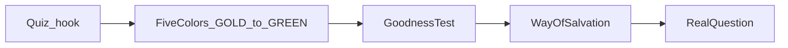

# Gospel tract — master deck, short mode, and `modes` upgrade (plan only)

## Platform constraints (unchanged)

- **Flow location:** `[discoverLearnFlowRoots](file:///C:/Users/New%20User/Documents/HiSense-1ea2985/src/lib/deck-platform/registry.ts)` — flow folder must be a **direct child** of `learn/` (e.g. `hiclarify/learn/gospel-tract-v1/v1.json`). `learn/tracts/...` is not registered today.
- **Interactive selects:** Use layouts that call `renderInlineUI` (`stamped`, `proofPanel`, `twoCol`, …), **not** `textOnly`.
- **Gating:** `walkthrough.gate.required` + `walkthrough.inputs`.
- **Navigation:** Prefer `stamped` + `{ "type": "next", ... }` so mobile users see Continue.

---

## 1. Long / expanded master deck (clean this first)

**Goal:** One main-point-per-slide, dense blocks split for mobile, **wording and theology unchanged** (no summarizing in the long version).

### A. Proposed screen-by-screen long version (outline)

Canonical **sequence** (flyer logic: Spiritual Quiz as hook → five “color” steps answer the big ideas → goodness test → inside panels = response/commitment).


| #   | Slide id (proposed)       | One main point                                                                                 | Source        |
| --- | ------------------------- | ---------------------------------------------------------------------------------------------- | ------------- |
| 1   | `intro-tract`             | Title / welcome to this tract (optional cover copy only if it does not add theology)           | Product shell |
| 2   | `quiz-intro`              | Header **SPIRITUAL Quiz** + sub **According to the Bible...**                                  | Front panel   |
| 3–7 | `quiz-q01` … `quiz-q05`   | One question each; interactive select                                                          | Front panel   |
| 8   | `gold-01-title`           | **01 God is perfect (THE TRUTH)** + icon/bar cue as text                                       | Back §01      |
| 9   | `gold-02-pleasure`        | Opening: artists / creation / God’s pleasure / relationship vs narcissism (first half of body) | Back §01      |
| 10  | `gold-03-holiness`        | Cannot dwell with sin; demands obedience (rest of body)                                        | Back §01      |
| 11  | `gold-scripture-1jn416`   | Scripture box 1 John 4:16                                                                      | Back §01      |
| 12  | `gold-scripture-rev411`   | Scripture box Revelation 4:11                                                                  | Back §01      |
| 13  | `dark-01-title`           | **02 We are Sinners (THE PROBLEM)**                                                            | Back §02      |
| 14  | `dark-02-fall`            | Inherent sin; thoughts/behaviors; separation; Satan parallel                                   | Back §02      |
| 15  | `dark-03-law`             | Law: right/wrong, conviction, Romans 3:23 quote inline                                         | Back §02      |
| 16  | `dark-scripture-rom319`   | Scripture box Romans 3:19                                                                      | Back §02      |
| 17  | `red-01-title`            | **03 Saved by Jesus (THE SOLUTION)**                                                           | Back §03      |
| 18  | `red-02-cross`            | Plan before creation; sinless life; law reveals righteousness; bearing our sin                 | Back §03      |
| 19  | `red-03-finished`         | Forsaken; raised; “It is finished”; reconciliation                                             | Back §03      |
| 20  | `red-scripture-1cor1534`  | Scripture box 1 Corinthians 15:3–4                                                             | Back §03      |
| 21  | `light-01-title`          | **04 Kept by Jesus (THE RESPONSE)**                                                            | Back §04      |
| 22  | `light-02-righteousness`  | Not “good enough”; only Jesus; religious leaders; gift                                         | Back §04      |
| 23  | `light-scripture-acts412` | Scripture box Acts 4:12                                                                        | Back §04      |
| 24  | `green-01-title`          | **05 Grow in Jesus (THE RESULT)**                                                              | Back §05      |
| 25  | `green-02-new-creation`   | New creation (2 Cor 5:17 quote inline); not perfect until He returns                           | Back §05      |
| 26  | `green-03-fruit`          | Beginning of Christian life; Eph 2:10; love others / share                                     | Back §05      |
| 27  | `green-scripture-john152` | Scripture box John 15:2                                                                        | Back §05      |
| 28  | `goodness-intro`          | **God’s ‘goodness’ test** + subtitle *A few of the 10 Commandments*                            | Sidebar       |
| 29  | `goodness-cmds-1`         | Commandments I–IV + reflection lines                                                           | Sidebar       |
| 30  | `goodness-cmds-2`         | Commandments V–VII + reflections                                                               | Sidebar       |
| 31  | `goodness-cmds-3`         | VIII–X + reflections                                                                           | Sidebar       |
| 32  | `goodness-guilty`         | **GUILTY** vertical emphasis + conclusion box verbatim                                         | Sidebar       |
| 33  | `way-intro`               | “The way of salvation is simple, but not easy.” + ONE WAY cue as text                          | Middle panel  |
| 34  | `way-rom109`              | Romans 10:9 boxed quote                                                                        | Middle panel  |
| 35  | `way-final-exam-title`    | **FINAL EXAM** (letter-blocks as text)                                                         | Middle panel  |
| 36  | `way-fe-01`               | Final Exam **01** question + explanatory paragraph                                             | Middle panel  |
| 37  | `way-fe-02`               | Final Exam **02** question + explanatory paragraph                                             | Middle panel  |
| 38  | `way-jesus-quote`         | “Repent, and believe in the gospel.” — Jesus                                                   | Middle panel  |
| 39  | `way-repentance-01`       | **Repentance is key!** — definition / change of mind                                           | Middle panel  |
| 40  | `way-repentance-02`       | Same box: urgency / don’t harden heart / He is coming                                          | Middle panel  |
| 41  | `way-link-coldcase`       | Link button *Other Religions Point to Jesus* (URL when known)                                  | Middle panel  |
| 42  | `real-title`              | **THE REAL QUESTION** + *What are you going to do about it?*                                   | Left panel    |
| 43  | `real-intro`              | Intro paragraph (acknowledgment vs true salvation)                                             | Left panel    |
| 44  | `married-01`              | **Married to God** — covenant / bride / return / commitment                                    | Left panel    |
| 45  | `married-02`              | Consequence / honoring Him / rejecting the call                                                | Left panel    |
| 46  | `employed-01`             | **Employed by God** — workplace analogy                                                        | Left panel    |
| 47  | `employed-02`             | Kingdom representation / Scripture / eternal consequences                                      | Left panel    |


**Approximate count:** ~47 slides (adjust after paste-in if a paragraph still feels long on a phone).

### B. Where flyer content splits into multiple slides

- **Back §01–05:** Split each **numbered section** into **title**, **body (2–3 paragraphs max per slide)**, **each scripture box alone** (mobile readability and “memory beats”).
- **Goodness test:** Never one wall of text — **intro**, **three commandment batches**, **GUILTY conclusion** (matches scan pattern on the flyer).
- **Middle panel:** **Romans 10:9** alone; **Final Exam** title alone; **each exam item** alone; **Jesus quote** alone; **Repentance** split **definition** vs **urgency** if either paragraph is long on device preview.
- **Left panel:** **Married** and **Employed** each **two slides** (promise/commitment vs consequence/obedience).

### C. Screens likely optional for a future short version

Best candidates to **drop or merge only in short mode** (not removed from master JSON — hidden via `modes` once the upgrade exists):

- `intro-tract` (if present).
- Extra splits inside GOLD/DARK/RED/LIGHT/GREEN: **secondary body slides** if the short path keeps one combined body slide per color (implementation detail when tagging).
- `**goodness-cmds-1` through `goodness-cmds-3`** — short path may keep **intro + one condensed commandments slide + guilty** (requires careful merge for “short,” or simply **hide** two of three batches).
- `**way-repentance-02`** (urgency paragraph) — long-only for a 5-minute path if timeboxed.
- `**married-02` / `employed-02**` — nuance slides; short might keep first slide each only.
- `**way-link-coldcase**` — optional enrichment.
- Scripture-alone slides could stay in long-only **if** short merges scripture into the section body (risky for verbatim policy); safer short strategy is **fewer section splits**, not dropping scripture text.

---

## 2. Short version (~5 min) as filtered from long

**Rules:** Short preserves **core gospel flow** (God → sin → Christ → faith/repentance → response). **Do not rewrite** — only **hide** long slides or skip to a reduced ordered list derived from the same `screens[]`.

### A. Shared slides (required in both short and long)

Typical minimal spine (ids from above):

- `quiz-intro` + **all five** `quiz-q01` … `quiz-q05` (engagement + diagnostic; if time is ultra-tight, product decision to collapse to one screen with five selects is **not** “filter-only” — avoid unless necessary).
- One slide per color track that still contains the **non-negotiable ideas**: e.g. keep **title + at least one body** per GOLD/DARK/RED/LIGHT/GREEN **or** the merged “short spine” slides you explicitly author as the only slides with `modes: ["short"]` (optional pattern below).
- `way-rom109`, `way-fe-01`, `way-fe-02`, `way-jesus-quote`, and **at least one** `way-repentance-*`.
- `real-title` + **short path** into commitment: at minimum **one** `married-*` and **one** `employed-*`.

*Exact list is finalized when tagging; the table above marks obvious expanded-only candidates.*

### B. Slides hidden in short mode (`modes: ["long"]` only)

- Section **body splits** that duplicate the same section (keep first body slide per section).
- **Scripture-only** slides **if** the same verse is duplicated on an adjacent body slide in short build (prefer **keep scripture** and hide duplicate body — product choice).
- **Goodness test:** `goodness-cmds-1` … `goodness-cmds-3` (or keep one combined long slide tagged `long` only and one short summary slide tagged `short` only — **second pattern needs slides that exist only in one mode**).
- `**way-repentance-02`**, `**way-link-coldcase**`, `**married-02**`, `**employed-02**` as listed in §1C.

### C. Final short-version order

Same master order as long, **with long-only slides removed**:

`quiz-intro` → `quiz-q01` … `quiz-q05` → **short spine of five colors** → **trimmed goodness** (`goodness-intro` + `goodness-guilty` OR single merged slide — decide at tagging) → `way-intro` (optional) → `way-rom109` → `way-final-exam-title` (optional) → `way-fe-01` → `way-fe-02` → `way-jesus-quote` → `way-repentance-01` → `real-title` → `real-intro` (optional) → `married-01` → `employed-01`.

---

## 3. Hide-slide upgrade (design only — do not implement yet)

**Goal:** One master deck JSON; runtime shows a **subset** of `screens` based on **mode**.

### A. Smallest JSON contract addition

Per `**screens[]` item**, add optional:

```json
"modes": ["short", "long"]
```

**Semantics (recommended):**

- **Omitted** or `**["short","long"]`** — visible in both default consumer modes (backward compatible).
- `**["long"]**` — hidden when the active deck mode is **short**.
- `**["short"]`** — only for rare short-exclusive slides (e.g. a 5-minute summary slide not shown in long); use sparingly.

**Deck-level default (optional later):** `deck.defaultMode` or query only — avoid duplicating mode on every screen.

**Future teacher/student/public:** Extend the same array, e.g. `"teacher"`, or add a separate optional field later (`audiences`) so `modes` stays length-oriented and `audiences` stays role-oriented.

### B. Smallest runtime filtering change

1. **Resolve active mode** from URL query (e.g. `?deckMode=short|long`) and/or learn page prop, default `**long`** for authoring fidelity or `**short**` for public fast path — pick one product default.
2. **After** `screens` is loaded (and optional order override applied), compute
  `visibleScreens = screens.filter(s => activeMode ∈ (s.modes ?? ["short","long"]))`.
3. Replace all consumer navigation (`orderedScreens`, indices, current screen) to use `**visibleScreens`**, not raw `screens`.
4. **Step tracker / progress labels** must use filtered list so the rail does not show hidden steps.
5. **Walkthrough persistence** keys should include `deckMode` so short vs long sessions do not collide.
6. **API `/api/learn/resolve`:** Either return full deck always (client filters) or support `deckMode` on resolve (optional optimization; client filter is enough for v1).

### C. Risk level

**Medium-low**

- **Low** if filtering is a thin slice and falls through to existing nav.
- **Medium** touchpoints: step tracker indices, `nextScreenId` if ever used across hidden slides (prefer linear `screens` order without `nextScreenId` overrides for this deck), keyboard next/prev, walkthrough storage key, slide builder node list (builder should probably show **all** slides regardless of mode, with a badge “long only”).

Mitigation: single function `filterScreensByDeckMode(screens, mode)` used in one place; exhaustive test with a 3-screen fixture.

### D. Files likely involved


| File                                                                                                                                                       | Role                                                             |
| ---------------------------------------------------------------------------------------------------------------------------------------------------------- | ---------------------------------------------------------------- |
| `[LandingDeckRenderer.tsx](file:///C:/Users/New%20User/Documents/HiSense-1ea2985/src/lib/landing-deck/LandingDeckRenderer.tsx)`                            | Filter `orderedScreens`; wire query param; merge walkthrough key |
| `[LearnDeckEditorPage.tsx](file:///C:/Users/New%20User/Documents/HiSense-1ea2985/src/app/learn/LearnDeckEditorPage.tsx)`                                   | Pass/searchParam for `deckMode`                                  |
| `[landing-walkthrough.ts](file:///C:/Users/New%20User/Documents/HiSense-1ea2985/src/lib/landing-walkthrough.ts)`                                           | Unchanged unless gate logic needs mode awareness                 |
| `[landing-tracker-responses.ts](file:///C:/Users/New%20User/Documents/HiSense-1ea2985/src/lib/landing-tracker-responses.ts)` / tracker UI                  | Ensure responses use filtered screen list                        |
| Deck / screen TypeScript types for `LandingConfig` / screen object                                                                                         | Add optional `modes?: ("short"|"long")[]`                        |
| `[DevNodePanel](file:///C:/Users/New%20User/Documents/HiSense-1ea2985/src/04_Presentation/components/organs/tsx/website/DevNodePanel.tsx)` (if applicable) | Show all slides in builder; optional visibility badge            |


### E. Recommended naming

- **Field name:** `modes` (your preference — **cleaner** than `audiences` for length).
- **Query / product:** `deckMode=short` | `deckMode=long` (query is explicit; avoids overloading `runtimeMode` which already means walkthrough/builder/presenter in this codebase).

---

## 4. Original implementation notes (retained)

- Author **long master** `[gospel-tract-v1/v1.json](file:///C:/Users/New%20User/Documents/HiSense-1ea2985/src/01_App/(live)`%20Gospel/hiclarify/learn/gospel-tract-v1/v1.json) first; tag `modes` when the engine ships.
- Optional `[schemas/schema-a.json](file:///C:/Users/New%20User/Documents/HiSense-1ea2985/src/01_App/(live)`%20Gospel/hiclarify/learn/track-1/schemas/schema-a.json) pattern for `deckPalette`.
- Remove stray placeholder `[learn/tracts/gospel-tract-v1](file:///C:/Users/New%20User/Documents/HiSense-1ea2985/src/01_App/(live)`%20Gospel/hiclarify/learn/tracts/gospel-tract-v1).

---

## Flow diagram (long spine)




---

## Execution order (when you approve implementation)

1. Implement **long** master JSON with stable ids (table §1A).
2. Implement `**modes` filter** in renderer + types + `deckMode` query.
3. Tag slides **long-only** per §2B; verify short path ~5 minutes in a read-through.

