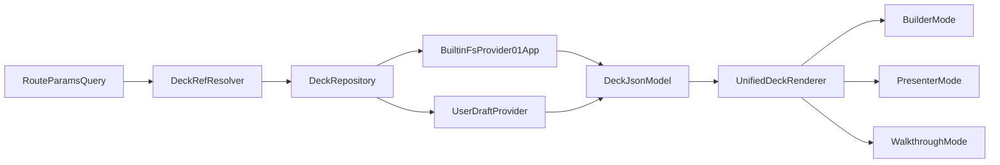

# HiSense Phase 3/4 Correction Pass

## 1) What Phase 3 and 4 Currently Contain

### Phase 3 (current plan intent)

- Add real walkthrough mode with JSON-driven inputs, validation, progression gates, dynamic summary, and resume behavior.
- Planned files center on `landing-2` stack:
  - [C:/Users/New User/Documents/HiSense-1ea2985/src/01_App/(live) Business/Container_Creations/landing-2.json](C:/Users/New%20User/Documents/HiSense-1ea2985/src/01_App/(live)%20Business/Container_Creations/landing-2.json)
  - [C:/Users/New User/Documents/HiSense-1ea2985/src/01_App/(live) Business/Container_Creations/ContainerCreationsLandingRenderer.tsx](C:/Users/New%20User/Documents/HiSense-1ea2985/src/01_App/(live)%20Business/Container_Creations/ContainerCreationsLandingRenderer.tsx)
  - [C:/Users/New User/Documents/HiSense-1ea2985/src/lib/landing-tracker-responses.ts](C:/Users/New%20User/Documents/HiSense-1ea2985/src/lib/landing-tracker-responses.ts)

### Phase 4 (current plan intent)

- Production parity/hardening for builder/presenter/walkthrough across local and deployed behavior.
- Planned files:
  - [C:/Users/New User/Documents/HiSense-1ea2985/src/app/api/container-creations-landing-config/route.ts](C:/Users/New%20User/Documents/HiSense-1ea2985/src/app/api/container-creations-landing-config/route.ts)
  - [C:/Users/New User/Documents/HiSense-1ea2985/src/app/landing-2/page.tsx](C:/Users/New%20User/Documents/HiSense-1ea2985/src/app/landing-2/page.tsx)
  - [C:/Users/New User/Documents/HiSense-1ea2985/src/01_App/(live) Business/Container_Creations/ContainerCreationsLandingRenderer.tsx](C:/Users/New%20User/Documents/HiSense-1ea2985/src/01_App/(live)%20Business/Container_Creations/ContainerCreationsLandingRenderer.tsx)

## 2) What Is Still Not Done (Phase 3 and 4)

### Phase 3 gaps

- **Walkthrough branch is not actually implemented** in renderer mode branching (`builder` and `presenter` are explicit; walkthrough is not).
- **Inputs are still hardcoded** as `StepInputs` and `inlineControls`; no typed per-screen walkthrough schema object in deck JSON.
- **Gate enforcement not wired to navigation** (input validation exists as guidance but does not block `next`).
- **Resume persistence not present** (no session/local storage restoration for walkthrough state).
- **Walkthrough state contract not generalized** for cross-deck use (currently landing-specific keys).

### Phase 4 gaps

- **Deck/file discovery is not real** for landing decks. Current API is fixed to one folder and fixed variant map:
  - `CONFIG_DIR = src/01_App/(live) Business/Container_Creations`
  - hardcoded `VARIANTS`.
- **Deck picker is not discovery-driven** (hardcoded version options `1/2/3` in panel, not filesystem/app-index backed).
- **No mapping layer from discovered deck to app subtree ownership** (business/ministry/app context missing from active deck model).
- **No unified route contract** for live deck pages (current routes are mixed static pages like `/landing-2`, `/onboarding`, `/gospel`, `/container-creations` instead of one deck routing family).
- **Hybrid storage seam missing** (no `DeckRepository` abstraction; load path tied directly to filesystem endpoint; save is export download only).
- **No server-side save draft endpoint** (GET-only config API; no draft save/update path).

### Cross-phase missing architecture

- Shared discovered deck identity is missing (`source`, `owner`, `deckId`, `version`) across builder/presenter/walkthrough.
- No canonical metadata index for decks under `src/01_App`.

## 3) Correct `01_App` Integration Model

### Canonical ownership model

- Each live app folder owns its decks under a local `decks` subtree.
- Standard pattern:
  - `src/01_App/(live) <Domain>/<App>/decks/<deckSlug>/deck.json`
  - optional variants: `src/01_App/(live) <Domain>/<App>/decks/<deckSlug>/variants/<variant>.json`
  - optional deck metadata: `src/01_App/(live) <Domain>/<App>/decks/<deckSlug>/deck.meta.json`

### Recommended target examples

- `src/01_App/(live) Business/Container_Creations/decks/landing-2/deck.json`
- `src/01_App/(live) Business/Container_Creations/decks/onboarding/deck.json`
- `src/01_App/(live) Gospel/Discipleship/decks/track-1/deck.json`
- `src/01_App/(live) Gospel/Discipleship/decks/track-2/deck.json`

### Asset/media ownership

- Deck-local media default:
  - `.../decks/<deckSlug>/assets/...`
- Keep support for shared global assets (`/images`, `/Videos`) but treat deck-local assets as preferred for portability.

### Discovery + builder ownership binding

- Build a deck index API that scans only `src/01_App/(live)*/**/decks/`** and returns:
  - `source: "builtin"`
  - `ownerPath` (`(live) Business/Container_Creations`)
  - `domain` (`Business`/`Gospel`)
  - `app` (`Container_Creations`)
  - `deckSlug`, `title`, `routeSlug`, available `variants`.
- Builder picker groups by domain/app from this index.
- The same resolved `deckRef` is passed to builder/presenter/walkthrough renderer.

### Future consistency rule

- Any new app/ministry adds decks only through its local `decks` folder + metadata/index conventions.
- No new hardcoded deck paths in route handlers or panels.

## 4) Hybrid Storage Model (Built-in + User Decks)

### Target model

- Keep one JSON deck schema and one renderer.
- Introduce a storage-provider abstraction now:
  - `DeckSource = "builtin" | "user"`
  - `DeckRef = { source, ownerPath?, deckSlug, version?, variant?, userDeckId? }`
  - `DeckRepository` interface:
    - `listDecks(query)`
    - `getDeck(ref)`
    - `saveDeckDraft(ref, deckJson)`
    - `exportDeck(ref)`

### What can be implemented now (no DB)

- Built-in provider backed by filesystem (`src/01_App` deck folders).
- User provider as local draft store (e.g. file-backed under a safe app data path or browser local drafts endpoint), clearly marked non-production.
- Shared picker showing builtin + local user drafts.
- Continue JSON export path.

### What should be abstracted now for DB later

- `DeckRepository` and typed `DeckRef` contracts.
- Route handlers should call repository, not direct `fs` logic in business handlers.
- Persist/edit flow should target repository methods, not component-level hardcoded endpoints.

### What should not be hardcoded

- Deck versions/variants options.
- Single app folder path (`Container_Creations` only).
- Route mapping fixed to one page.
- Assumptions that only built-in decks exist.

## 5) Corrected Phase 3 and Phase 4

### Corrected Phase 3 — Walkthrough Engine + Deck Identity Foundation

- **Goal**
  - Finish real walkthrough behavior while preserving existing builder/presenter behavior, and make all three modes operate on one resolved `DeckRef`.
- **Features included**
  - Add explicit walkthrough branch in renderer mode handling.
  - Add typed JSON walkthrough schema per screen (`inputs`, `validation`, `gate.required`) while honoring current inline controls as compatibility fallback.
  - Enforce progression gates in walkthrough mode (`next` blocked until required/valid).
  - Add session resume for walkthrough values and current step keyed by `DeckRef`.
  - Introduce shared deck identity object consumed by builder/presenter/walkthrough (`deckRef` from route/query).
- **Exact files/systems likely involved**
  - [C:/Users/New User/Documents/HiSense-1ea2985/src/01_App/(live) Business/Container_Creations/ContainerCreationsLandingRenderer.tsx](C:/Users/New%20User/Documents/HiSense-1ea2985/src/01_App/(live)%20Business/Container_Creations/ContainerCreationsLandingRenderer.tsx)
  - [C:/Users/New User/Documents/HiSense-1ea2985/src/lib/landing-tracker-responses.ts](C:/Users/New%20User/Documents/HiSense-1ea2985/src/lib/landing-tracker-responses.ts)
  - [C:/Users/New User/Documents/HiSense-1ea2985/src/lib/slide-builder-query.ts](C:/Users/New%20User/Documents/HiSense-1ea2985/src/lib/slide-builder-query.ts)
  - [C:/Users/New User/Documents/HiSense-1ea2985/src/app/landing-2/page.tsx](C:/Users/New%20User/Documents/HiSense-1ea2985/src/app/landing-2/page.tsx)
  - [C:/Users/New User/Documents/HiSense-1ea2985/src/01_App/(live) Business/Container_Creations/landing-2.json](C:/Users/New%20User/Documents/HiSense-1ea2985/src/01_App/(live)%20Business/Container_Creations/landing-2.json)
- **What remains frozen**
  - No large inspector redesign.
  - No DB/cloud integration yet.
  - No replacement of current inline editor UX.
- **Risk level**
  - High.
- **What done means**
  - `runtimeMode=walkthrough` has distinct gated behavior.
  - Input schema is deck-driven, not renderer-hardcoded only.
  - Refresh resumes walkthrough session for active deck.
  - Builder and presenter remain behaviorally unchanged.
- **Exact test URLs/checklist**
  - `/landing-2?runtimeMode=walkthrough`
  - `/landing-2?runtimeMode=presenter`
  - `/landing-2?runtimeMode=builder`
  - Checklist:
    - Required walkthrough fields block `Next` until valid.
    - Tracker response and final summary reflect entered values.
    - Refresh restores walkthrough position and values for same deck.
    - Builder add/duplicate/delete/export still work.
    - Presenter reveal stepping still works.
- **Regression indicators**
  - Walkthrough allows progression with missing required inputs.
  - Presenter reveal/navigation changes unexpectedly.
  - Builder editing or export breaks.
  - Deck context leaks between modes.

### Corrected Phase 4 — `01_App` Deck Discovery + Hybrid Storage + Route Readiness

- **Goal**
  - Move from hardcoded single-deck loading to discovery-driven deck loading from `src/01_App` with hybrid-ready repository seams and route-ready deck identity.
- **Features included**
  - Add deck discovery API for built-in decks under `src/01_App/(live)*/**/decks/`** (or transitional support for existing local JSON files).
  - Replace hardcoded deck version/variant picker with discovery-based picker (grouped by domain/app/deck).
  - Add `DeckRepository` abstraction with built-in provider and placeholder user provider.
  - Add route contract for deck pages (at minimum one dynamic route prototype) using shared `deckRef`.
  - Clarify save/export model:
    - export JSON remains available
    - add draft-save endpoint path behind repository (filesystem/local only for now).
  - Harden parity matrix across builder/presenter/walkthrough for discovered decks.
- **Exact files/systems likely involved**
  - [C:/Users/New User/Documents/HiSense-1ea2985/src/app/api/container-creations-landing-config/route.ts](C:/Users/New%20User/Documents/HiSense-1ea2985/src/app/api/container-creations-landing-config/route.ts) (refactor or replace with repository-backed deck endpoint)
  - [C:/Users/New User/Documents/HiSense-1ea2985/src/app/api/screens/route.ts](C:/Users/New%20User/Documents/HiSense-1ea2985/src/app/api/screens/route.ts) (reuse scan patterns or split deck-specific scanner)
  - [C:/Users/New User/Documents/HiSense-1ea2985/src/01_App/(live) Business/Container_Creations/LandingSlideBuilderPanel.tsx](C:/Users/New%20User/Documents/HiSense-1ea2985/src/01_App/(live)%20Business/Container_Creations/LandingSlideBuilderPanel.tsx)
  - [C:/Users/New User/Documents/HiSense-1ea2985/src/01_App/(live) Business/Container_Creations/ContainerCreationsLandingRenderer.tsx](C:/Users/New%20User/Documents/HiSense-1ea2985/src/01_App/(live)%20Business/Container_Creations/ContainerCreationsLandingRenderer.tsx)
  - [C:/Users/New User/Documents/HiSense-1ea2985/src/app/landing-2/page.tsx](C:/Users/New%20User/Documents/HiSense-1ea2985/src/app/landing-2/page.tsx)
  - [C:/Users/New User/Documents/HiSense-1ea2985/src/app/sites/[domain]/page.tsx](C:/Users/New%20User/Documents/HiSense-1ea2985/src/app/sites/%5Bdomain%5D/page.tsx) (candidate dynamic routing integration)
  - New shared files (planned): `src/lib/decks/`* (repository contracts/providers/indexing).
- **What remains frozen**
  - No migration of unrelated legacy `src/01_App/(dead)` systems.
  - No direct cloud/db coupling in this phase.
  - No replacement of editor UX with raw JSON editor.
- **Risk level**
  - Medium-high.
- **What done means**
  - Builder picker lists decks discovered from app-owned `01_App` structure.
  - Builder/presenter/walkthrough all load same selected `deckRef`.
  - Export and draft-save flow works via shared repository boundary.
  - At least one dynamic route path can render arbitrary discovered deck by `deckRef`.
- **Exact test URLs/checklist**
  - `/landing-2?runtimeMode=builder` (legacy compatibility)
  - `/landing-2?runtimeMode=presenter&deck=<deckRef>`
  - `/landing-2?runtimeMode=walkthrough&deck=<deckRef>`
  - `/sites/<domain>?deck=<deckRef>` or chosen dynamic deck route prototype
  - Checklist:
    - Deck picker enumerates multiple decks from `01_App` apps.
    - Selecting deck changes all mode renders consistently.
    - Export output matches selected discovered deck.
    - Draft save/reload works for non-built-in source.
    - Missing deck gracefully errors with clear fallback message.
- **Regression indicators**
  - Picker only shows hardcoded versions/variants.
  - Routes can only open Container_Creations fixed deck.
  - Different modes open different deck states unintentionally.
  - Export/save uses stale or wrong deck source.

## 6) What Should Be Implemented Next

- **Phase correction first?**
  - Yes: Phase 3 should be corrected before more coding (walkthrough is not complete yet).
  - Yes: Phase 4 should be corrected before more coding beyond landing-only scope (discovery and hybrid seams are architectural).
- **Exact next implementation phase after this correction pass**
  - Start with **Corrected Phase 3** implementation immediately:
    1. Complete walkthrough schema + gate + resume on current `landing-2` renderer.
    2. Introduce `deckRef` plumbing (minimal shared identity) so Phase 4 can plug discovery in without rework.
  - Then execute **Corrected Phase 4** for `01_App` discovery picker + repository abstraction + route readiness.

## 7) No-Cutover Checklist (Go/No-Go)

- **Do not cut over to canonical-only discovery until all are true**
  - Existing `/landing-2` routes and current query forms still resolve the same deck output as before.
  - Legacy + canonical dual discovery is active and stable for at least one full test cycle.
  - Alias resolution is verified for all migrated decks (`legacyId/file -> canonical deckRef`).
  - Builder, presenter, and walkthrough all resolve the same `deckRef` per selection.
  - Export output for migrated decks matches canonical source (no stale legacy merge behavior).
- **Required parity matrix before any legacy retirement**
  - Test each migrated deck in `builder`, `presenter`, and `walkthrough`.
  - Test both legacy URL/query form and canonical deck-ref form.
  - Validate refresh/reload behavior and missing-deck fallback behavior.
- **Automatic no-go conditions**
  - Any existing production URL fails to resolve a previously working deck.
  - Picker shows duplicate/conflicting deck identities for one logical deck.
  - Mode-to-mode deck mismatch appears (`builder != presenter != walkthrough` for same selection).
  - Export/save references a different source deck than the active view.
- **Rollback rule**
  - If any no-go condition is hit, keep legacy path as default resolver, disable canonical-preferred resolution flag, and log issue for per-deck remediation before retrying cutover.

## Data Flow Sketch (Corrected End-State)

