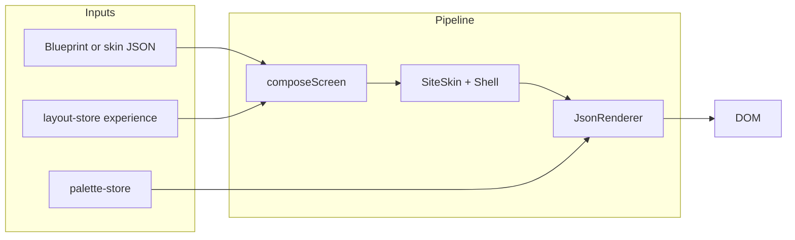

# Shippable Website & App Skins from JSON→Layout→Regions→Molecules

## Architecture (unchanged)

- **Content**: Role-tagged nodes in `.skin.json` (or from blueprint adapter [compileSkinFromBlueprint](src/lib/site-skin/compileSkinFromBlueprint.ts)).
- **Composition**: [composeScreen](src/layout/layout-engine/composeScreen.ts) (pure) → region sections by [region-policy](src/layout/layout-engine/region-policy.ts) + layout-store `experience`.
- **Rendering**: [SiteSkin](src/lib/site-skin/SiteSkin.tsx) → shell (WebsiteShell/AppShell/LearningShell) positions regions; each region’s children rendered by [JsonRenderer](src/engine/core/json-renderer.tsx) with [Registry](src/engine/core/registry.tsx) (12 molecules + 9 atoms). Palette from [palette-store](src/engine/core/palette-store.ts) via [palette-bridge](src/lib/site-renderer/palette-bridge.tsx). Verbs/state: CustomEvent → behavior-listener → state-store (unchanged).

---

## Phase 0: Baseline verification

**Objective:** Confirm the screen is rendered from JSON molecules (not TSX hardcoding) and document the proof path.

**Files involved:**

- [src/lib/site-skin/SiteSkin.tsx](src/lib/site-skin/SiteSkin.tsx)
- [src/engine/core/json-renderer.tsx](src/engine/core/json-renderer.tsx)
- [src/engine/core/registry.tsx](src/engine/core/registry.tsx)
- [src/content/sites/containercreations.com/compiled/skins/home.skin.json](src/content/sites/containercreations.com/compiled/skins/home.skin.json)
- [src/app/page.tsx](src/app/page.tsx) (TSX screen routing)
- [src/screens/tsx-screens/site-skin/SiteSkinPreviewScreen.tsx](src/screens/tsx-screens/site-skin/SiteSkinPreviewScreen.tsx)

**Steps:**

1. Add a single optional query or JSON-driven “proof” element: e.g. a small label or `data-*` attribute on the root of the skin output that includes a hash or the skin `pageId`/`domain` so the DOM can be inspected to show the tree came from that skin document.
2. Document the proof path in a short markdown section (or comment): skin JSON → loadSiteSkin / applySkinBindings → siteSkinToRoleTaggedNodes → composeScreen → collectRegionSections → renderRegion(JsonRenderer) → Registry lookup by `node.type` → molecule/atom components. No TSX screen may render fixed copy or structure for hero/header/cards; only shells may add layout containers.
3. Verify that changing `home.skin.json` (e.g. one `content.title` or one button label) and refreshing the preview updates the visible UI without code change.
4. Verify that `?debug=1` (JsonRenderer) and `?debugRegions=1` (SiteSkin) still show node/region structure for debugging.

**Acceptance tests:**

- Open the website-skin demo URL (see Demo checklist). Change one string in `home.skin.json`, save, refresh: that string appears in the UI.
- Inspect DOM: root of the skin content has a `data-*` (or similar) that ties to the skin document.
- `?debug=1` shows debug outlines; `?debugRegions=1` shows region list/overlay.

**Stop criteria:** Proof path is documented and reproducible; one content-only edit in JSON changes the visible screen without TSX edits.

---

## Phase 1: Radical visual differentiation (shells + profile)

**Objective:** Make website and app experiences radically different (hero, header/nav, background, spacing, maxWidth, sections, cards) using only region containers and existing palette tokens—no molecule/atom or palette definition changes.

**Files involved:**

- [src/lib/site-skin/shells/WebsiteShell.tsx](src/lib/site-skin/shells/WebsiteShell.tsx)
- [src/lib/site-skin/shells/AppShell.tsx](src/lib/site-skin/shells/AppShell.tsx)
- [src/lib/site-skin/shells/LearningShell.tsx](src/lib/site-skin/shells/LearningShell.tsx)
- [src/layout/presentation/website.profile.json](src/layout/presentation/website.profile.json)
- [src/layout/presentation/app.profile.json](src/layout/presentation/app.profile.json)
- [src/layout/profile-resolver.ts](src/layout/profile-resolver.ts)
- [src/engine/core/json-renderer.tsx](src/engine/core/json-renderer.tsx) (applyProfileToNode: section layout from profile only)

**Steps:**

1. **WebsiteShell:** Define a clear “marketing” look: full-bleed or gradient background (CSS vars from palette only), sticky header with maxWidth (e.g. 1200px), distinct hero block (padding, vertical rhythm), content and products sections with consistent spacing; footer with border/background. Use only `var(--color-*)` / existing palette tokens and layout (flex/grid) in the shell. No new tokens.
2. **AppShell:** Define a “productivity” look: optional side nav, compact header, primary content + sidebar layout, different maxWidth or no maxWidth for main area, different spacing and background treatment so it clearly does not look like the website shell.
3. **LearningShell:** Linear, reading-focused layout (header, content, actions, footer) with distinct spacing and background so it reads as a course/lesson layout.
4. Ensure experience profiles ([website.profile.json](src/layout/presentation/website.profile.json), [app.profile.json](src/layout/presentation/app.profile.json)) define section-level layout (row/column/grid, gap, align) for all region roles used by [composeScreen](src/layout/layout-engine/composeScreen.ts) and [region-policy](src/layout/layout-engine/region-policy.ts). JsonRenderer already applies these via [applyProfileToNode](src/engine/core/json-renderer.tsx) for `type: "section"` + `role`.
5. Optionally add a “content maxWidth” or “section padding” default in profiles (if supported by existing section/layout resolution) so hero and content sections get consistent width/spacing from profile, not from ad-hoc TSX.

**Acceptance tests:**

- Switch Experience dropdown (Website → App → Learning) on the same demo URL: same content nodes appear in clearly different full-page layouts (website = marketing, app = nav+primary+sidebar, learning = linear).
- All colors/spacing come from palette or profile; no hardcoded hex or px in shells except where already allowed (e.g. maxWidth 1200).

**Stop criteria:** Website and app (and learning) are visually distinct; layout and styling are driven only by shells + palette + experience profiles.

---

## Phase 2: Experience-driven reflow with same content

**Objective:** Ensure layout-store `experience` (Website/App/Learning) causes obvious reflow of the same role-tagged nodes via region ordering and shell choice only.

**Files involved:**

- [src/engine/core/layout-store.ts](src/engine/core/layout-store.ts)
- [src/ui/experience-dropdown.tsx](src/ui/experience-dropdown.tsx)
- [src/layout/layout-engine/region-policy.ts](src/layout/layout-engine/region-policy.ts)
- [src/layout/layout-engine/composeScreen.ts](src/layout/layout-engine/composeScreen.ts)
- [src/lib/site-skin/SiteSkin.tsx](src/lib/site-skin/SiteSkin.tsx)

**Steps:**

1. Confirm experience dropdown writes only to layout-store `experience` (no preset or JSON mutation). Verify [experience-dropdown](src/ui/experience-dropdown.tsx) (or equivalent) calls `setLayout({ experience: "website" | "app" | "learning" })`.
2. Confirm [composeScreen](src/layout/layout-engine/composeScreen.ts) uses `layoutState.experience` and [getRegionOrder](src/layout/layout-engine/region-policy.ts) so that the same flat `roleTaggedNodes` produce different region orderings (e.g. website: header, hero, content, products, footer; app: nav, header, primary, sidebar, actions, footer).
3. Confirm [resolveRegionForRole](src/layout/layout-engine/region-policy.ts) maps roles to regions per experience (e.g. “header” stays header; “content” may map to “primary” in app).
4. In [SiteSkin](src/lib/site-skin/SiteSkin.tsx), ensure the selected shell (WebsiteShell/AppShell/LearningShell) is chosen solely from `experience` and that each shell receives only the region slots produced by composeScreen for that experience. No duplicate or hardcoded content in TSX.
5. Add a simple acceptance checklist: for one fixed skin (e.g. home), list expected regions per experience and verify in UI (or with debugRegions) that the same nodes appear in the correct regions when switching experience.

**Acceptance tests:**

- Load demo with home skin. Note one unique string (e.g. hero title). Switch experience to App, then Learning: same string appears in a different place/layout each time; no content disappears or is replaced by TSX-only copy.
- With `?debugRegions=1`, console shows different region lists per experience; DOM order/structure matches.

**Stop criteria:** One URL, one skin; switching experience recomposes the same nodes into different regions and shells with no content loss or TSX-only content.

---

## Phase 3: Section/layout dropdown and blueprint output

**Objective:** Integrate section/layout dropdown without mutating JSON in dev-only ways, or sunset the dev tool; and ensure blueprint/content pipeline can output role-tagged nodes and content manifests.

**Files involved:**

- [src/dev/section-layout-dropdown.tsx](src/dev/section-layout-dropdown.tsx)
- [src/app/page.tsx](src/app/page.tsx)
- [src/engine/core/json-renderer.tsx](src/engine/core/json-renderer.tsx)
- [src/lib/site-skin/compileSkinFromBlueprint.ts](src/lib/site-skin/compileSkinFromBlueprint.ts)
- [src/scripts/onboarding/build-onboarding.ts](src/scripts/onboarding/build-onboarding.ts) (optional: if skins are ever emitted from onboarding)
- [src/app/api/sites/[domain]/skins/[pageId]/route.ts](src/app/api/sites/[domain]/skins/[pageId]/route.ts)
- Content path: `src/content/sites/<domain>/compiled/skins/<pageId>.skin.json`

**Steps:**

1. **Section layout dropdown:** It currently walks `screenJson` and mutates `node.layout` for `type === "section"` nodes. For TSX screens (e.g. SiteSkinPreviewScreen), `screenJson` is `{ __type: "tsx-screen", path: "..." }` so [findSections](src/dev/section-layout-dropdown.tsx) returns [] and the dropdown does not render—no mutation. For JSON screens that contain section nodes, the dropdown mutates in-memory state and re-renders; that is dev-only and does not persist to disk. Decide and document: (A) Keep as dev-only “section layout override” that only affects the current session and is not persisted, or (B) Sunset it for skin-based screens (hide when route is a TSX skin screen) and use only experience + profile for section layout. Plan recommends (A) with a one-line comment in code and in plan: “Section layout dropdown is dev-only; does not persist. Section layout in production comes from experience profile + skin JSON.”
2. **Blueprint/content → role-tagged nodes:** Today, skin JSON is hand-authored under `src/content/sites/<domain>/compiled/skins/*.skin.json`. The adapter [compileSkinFromBlueprintScreen](src/lib/site-skin/compileSkinFromBlueprint.ts) converts a blueprint-style screen (sections + children) into a SiteSkinDocument with `nodes[]` and inferred roles. Document that the canonical source for “website/app skin” content is either (1) hand-authored `.skin.json` with `nodes` and optional `dataSlots`, or (2) a build step that uses `compileSkinFromBlueprintScreen` and writes `.skin.json`. If a build step exists (e.g. in [build-onboarding](src/scripts/onboarding/build-onboarding.ts) or a separate script), ensure it outputs role-tagged nodes and, if needed, a minimal content manifest; if not, add a short “Content pipeline” note that skin JSON is the contract and can be generated by the existing adapter from any screen tree that matches the blueprint shape.
3. Ensure the skins API continues to serve from `src/content/sites/<domain>/compiled/skins/<pageId>.skin.json` (domain and pageId from route; no dev-only mutation of files).

**Acceptance tests:**

- On a JSON screen with sections, section layout dropdown still changes layout visually for the session only; refresh restores profile/skin-driven layout.
- On a TSX skin preview screen, section layout dropdown does not appear (or is hidden). Changing experience or profile changes section layout.
- A new or updated `.skin.json` with role-tagged `nodes` is served by the API and rendered correctly without code change.

**Stop criteria:** Section dropdown behavior is documented and either dev-only or hidden for skin routes; blueprint/content path to role-tagged skin JSON is documented and one working path (hand-authored or build) is confirmed.

---

## Phase 4: Demo routes and final polish

**Objective:** Provide one stable URL per experience (website, app, learning) that looks good and demonstrates the full pipeline.

**Files involved:**

- [src/app/page.tsx](src/app/page.tsx)
- [src/screens/tsx-screens/site-skin/SiteSkinPreviewScreen.tsx](src/screens/tsx-screens/site-skin/SiteSkinPreviewScreen.tsx)
- [src/screens/tsx-screens/site-skin/OnboardingSkinPreviewScreen.tsx](src/screens/tsx-screens/site-skin/OnboardingSkinPreviewScreen.tsx)
- [src/app/layout.tsx](src/app/layout.tsx) (experience + palette dropdowns)
- Navigator or entry that links to the three demo URLs (if applicable)
- [src/content/sites/containercreations.com/compiled/skins/home.skin.json](src/content/sites/containercreations.com/compiled/skins/home.skin.json) (and optionally onboarding.skin.json)

**Steps:**

1. Define three canonical demo URLs that open the same underlying skin (e.g. home) with a default experience or a query that sets experience: e.g. `/?screen=tsx:tsx-screens/site-skin/SiteSkinPreviewScreen&domain=containercreations.com&pageId=home` plus optional `&experience=website|app|learning` if the app supports setting experience from URL (otherwise rely on layout-store and dropdown).
2. Ensure the TSX screen resolver in [page.tsx](src/app/page.tsx) resolves `tsx:tsx-screens/site-skin/SiteSkinPreviewScreen` (and onboarding variant if desired). Experience is controlled by the global Experience dropdown (layout-store); palette by the palette dropdown.
3. Ensure layout includes the Experience and Layout/Palette dropdowns so that at each demo URL the user can switch experience and see reflow, and switch palette and see colors update.
4. Optionally add a “demo” query (e.g. `?demo=website`) that, when supported, sets initial experience from URL so deep links can open in a specific experience without clicking the dropdown.
5. Polish: Remove or minimize any temporary debug UI for the default view (debugRegions only when `?debugRegions=1`); ensure shells have no stray inline styles beyond layout and palette vars.

**Acceptance tests:**

- From the three demo URLs (or one URL + dropdown), user sees website skin, app skin, and learning skin with the same content, clearly different layouts, and palette dropdown affecting colors.
- No ad-hoc CSS or one-off styling in TSX screens beyond region placement containers and palette vars.

**Stop criteria:** Three demo entry points (or one URL + experience selector) are documented and working; each shows a shippable-looking website or app experience from JSON molecules.

---

## Final demo checklist

| #   | URL / Action                                                                                                                                        | What should be obvious                                                                                                                                           |
| --- | --------------------------------------------------------------------------------------------------------------------------------------------------- | ---------------------------------------------------------------------------------------------------------------------------------------------------------------- |
| 1   | **Website skin** — e.g. `/?screen=tsx:tsx-screens/site-skin/SiteSkinPreviewScreen&domain=containercreations.com&pageId=home` (Experience = Website) | Marketing layout: hero, header, content, products, footer; maxWidth; gradient/background from palette; all copy and structure from `home.skin.json` + molecules. |
| 2   | **App skin** — Same URL, switch Experience to App                                                                                                   | Same content in app layout: nav, header, primary, sidebar, footer/actions; clearly different from website; no new content, only reflow.                          |
| 3   | **Learning skin** — Same URL, switch Experience to Learning                                                                                         | Same content in linear/lesson layout: header, content, actions, footer; clearly different from website and app.                                                  |

**Proof of JSON-driven UI:** Change one label or title in `home.skin.json`, save, refresh demo URL — the change appears without any TSX or molecule/atom edit. Optional: `?debug=1` and `?debugRegions=1` show node and region structure.

---

## Out of scope (do not change)

- Molecules ([src/compounds/ui/12-molecules](src/compounds/ui/12-molecules)) and atoms ([src/components/9-atoms](src/components/9-atoms)).
- Palette token definitions/JSON ([src/registry/palettes.json](src/registry/palettes.json) or equivalent) unless explicitly listed as an optional improvement.
- Verbs/state pipeline: CustomEvent → behavior-listener → state-store.
- Core layout engine logic (composeScreen, region-policy) beyond ensuring they are correctly wired; no “micro-fix drift” — changes must be holistic and end-to-end.

