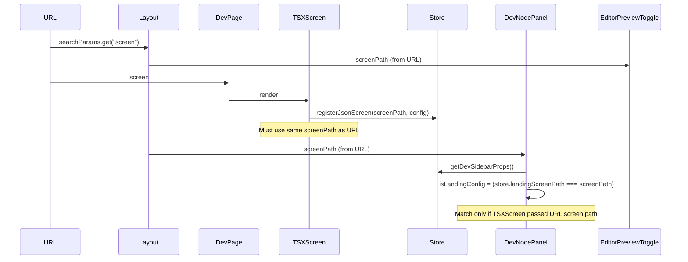

# Layout Node Editor and Editor Button Cleanup Plan

## Root cause summary

### 1. Nodes panel does not show content

- **DevNodePanel** ([src/04_Presentation/components/organs/tsx/website/DevNodePanel.tsx](src/04_Presentation/components/organs/tsx/website/DevNodePanel.tsx)) gets `screenPath` from the URL: `searchParams.get("screen")` (e.g. `"tsx:(live) Business/Container_Creations/ContainerCreationsLanding-2"`).
- **Landing registration** in [ContainerCreationsLanding-2.tsx](src/01_App/(live) Business/Container_Creations/ContainerCreationsLanding-2.tsx) calls `registerJsonScreen("container-creations-landing", config, ...)`, which calls `setDevLandingProps("container-creations-landing", ...)`.
- **Mismatch:** `isLandingConfig` is true only when `props.landingScreenPath === screenPath`. So `"container-creations-landing" === "tsx:(live) Business/Container_Creations/ContainerCreationsLanding-2"` is always false. The panel never shows `LandingConfigNodes` or `LandingFlowNodes` and falls through to the empty state: "Load a TSX website screen to see node order."
- **Website node order path:** For TSX website screens that use `setDevWebsiteNodeOrder(screenPath, nodeOrder)`, the same idea applies: `websiteScreenPath` must match the URL `screen` param. Any screen that registers must use the **same** screen path string the layout/dev page use (the URL `?screen=` value).

### 2. Editor button not engaging

- **Editor/Preview toggle** ([src/07_Dev_Tools/editor/EditorPreviewToggle.tsx](src/07_Dev_Tools/editor/EditorPreviewToggle.tsx)) returns `null` when `!isEditorCapable(decoded)`, so the buttons are hidden entirely for non–editor-capable screens.
- **Editor-capable rule** ([src/07_Dev_Tools/editor/editor-capable-screens.ts](src/07_Dev_Tools/editor/editor-capable-screens.ts)): path must include `"(live)"` and (end with `.tsx` or start with `tsx:`). So the current Container Creations URL should qualify; if the Editor button is visible but not clickable, the cause is likely **click interception or stacking**, not visibility.
- **Possible click blockers:** [dev-mobile.css](src/07_Dev_Tools/styles/dev-mobile.css) uses full-screen overlays and high `z-index` (e.g. 99999, 901, 898) when `body.dev-mobile-mode` is set. If the chrome is not given a higher stacking context, a fixed overlay could sit on top and swallow clicks. The app chrome in [layout.tsx](src/app/layout.tsx) has no explicit `z-index`, so it can end up under fixed content.

---

## Plan

### Phase 1: Unify screen path for Nodes panel (fix “Load a TSX website screen…”)

**1.1 Use URL screen param when registering landing (Container Creations)**

- In [ContainerCreationsLanding-2.tsx](src/01_App/(live) Business/Container_Creations/ContainerCreationsLanding-2.tsx), obtain the current screen path from the URL (e.g. `useSearchParams().get("screen")`) and pass that into `registerJsonScreen` instead of the hardcoded `"container-creations-landing"`.
- Fallback: if no `screen` param (e.g. direct mount), keep a fallback like `"container-creations-landing"` so the panel still has a key when URL is missing.

**1.2 Match logic in DevNodePanel (robust fallback)**

- In [DevNodePanel.tsx](src/04_Presentation/components/organs/tsx/website/DevNodePanel.tsx), treat landing as active when either:
  - `landingScreenPath === screenPath` (current), or
  - `landingScreenPath` is a **suffix** or **canonical match** of `screenPath` (e.g. after normalizing both to a canonical form like `getCanonicalNavScreenKey` or a normalized path), so that small differences (encoding, trailing segment) do not break matching.
- Prefer fixing registration (1.1) as the main fix; use (1.2) only if multiple screens can register under the same logical “landing” key.

**1.3 Document and centralize “current screen path” for dev**

- Ensure any TSX screen that calls `registerJsonScreen` or `setDevWebsiteNodeOrder` uses the same screen path that appears in the URL (e.g. from `useSearchParams().get("screen")`). Optionally add a small helper or note in [registerJsonScreen.ts](src/app/ui/control-dock/editor/registerJsonScreen.ts) so future screens pass the URL-derived path.

### Phase 2: Editor/Preview toggle for every view and reliable clicks

**2.1 Show toggle for all dev views (optional but recommended)**

- In [editor-capable-screens.ts](src/07_Dev_Tools/editor/editor-capable-screens.ts), either:
  - Broaden the rule so that **any** screen loaded on `/dev` (when `screen` param is present) is editor-capable, or
  - Add an explicit “always show in dev” path so the toggle is visible whenever we are in the navigator layout, and only hide for non-dev routes.
- Goal: “This should apply to every view” — Editor/Preview should be available for every dev view, not only `(live)` + `tsx` paths.

**2.2 Ensure app chrome is clickable (stacking)**

- In [layout.tsx](src/app/layout.tsx), give the dev app chrome (the bar containing Editor, Preview, Save Layout) a stacking context above the canvas and any full-bleed overlays:
  - e.g. `position: relative; zIndex: 100` (or a value above overlays in dev-mobile.css, e.g. > 901) on the `app-chrome` div when `devMode === "dev"`.
- This prevents fixed overlays (e.g. in `dev-mobile-mode`) from covering the chrome and blocking the Editor button.

**2.3 Verify Editor mode store and re-renders**

- Confirm [editor-mode-store.ts](src/07_Dev_Tools/editor/editor-mode-store.ts) `setEditorMode` is invoked on button click and that subscribers (e.g. ContainerCreationsLanding-2’s `useSyncExternalStore(subscribeEditorMode, ...)`) re-render. No code change needed if clicks reach the button after 2.2.

### Phase 3: Nodes panel behavior for “every view”

**3.1 Landing and website screens**

- After Phase 1, landing screens (e.g. Container Creations) will show **Landing flow / LandingConfigNodes** in the Nodes panel because `landingScreenPath` will match `screenPath`.
- For TSX website screens that expose node order, ensure they call `setDevWebsiteNodeOrder(currentScreenPathFromUrl, nodeOrder)` so `websiteScreenPath` and `websiteNodeOrder` match the same URL `screen` value that DevNodePanel receives.

**3.2 Empty state copy**

- Keep the current empty state message (“Load a TSX website screen to see node order” / “Select a TSX website screen…”) for screens that do not register landing or website node order; optionally make the copy slightly more generic so it’s clear it applies to “any view” that supports nodes (e.g. “Load a screen that supports node editing to see node order”).

---

## Key files

| Area                           | File                                                                                                                                                                                                         |
| ------------------------------ | ------------------------------------------------------------------------------------------------------------------------------------------------------------------------------------------------------------ |
| Nodes path mismatch            | [DevNodePanel.tsx](src/04_Presentation/components/organs/tsx/website/DevNodePanel.tsx) (isLandingConfig / isWebsiteScreen), [dev-right-sidebar-store.ts](src/app/ui/control-dock/dev-right-sidebar-store.ts) |
| Landing registration           | [ContainerCreationsLanding-2.tsx](src/01_App/(live) Business/Container_Creations/ContainerCreationsLanding-2.tsx), [registerJsonScreen.ts](src/app/ui/control-dock/editor/registerJsonScreen.ts)             |
| Editor visibility / capability | [EditorPreviewToggle.tsx](src/07_Dev_Tools/editor/EditorPreviewToggle.tsx), [editor-capable-screens.ts](src/07_Dev_Tools/editor/editor-capable-screens.ts)                                                   |
| Chrome stacking / clickability | [layout.tsx](src/app/layout.tsx) (app-chrome when dev), [dev-mobile.css](src/07_Dev_Tools/styles/dev-mobile.css) (overlays)                                                                                  |

---

## Optional diagram (data flow)

---

## Testing

- On `/dev?screen=tsx:(live) Business/Container_Creations/ContainerCreationsLanding-2`: after fix, Nodes panel shows the landing flow / config nodes; Editor and Preview buttons both respond and switch mode.
- Repeat for another TSX (live) screen and, if applicable, a JSON screen to confirm “every view” behavior.
- With dev-mobile mode enabled, confirm the Editor button remains clickable (chrome above overlays).

