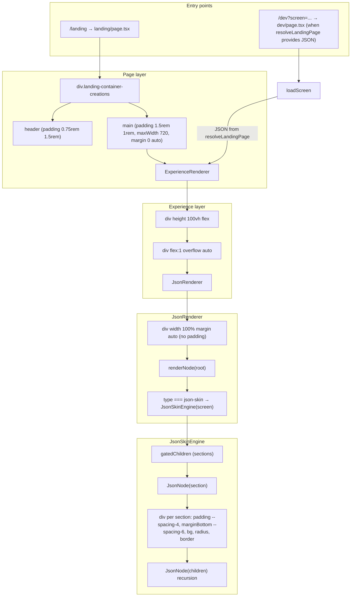

# Layout Wrappers Analysis and Full-Screen Refactor Plan

## 1. Render path: JSON to DOM

How `container-creations.landing.json` gets from config to pixels:

**Important:** The root node in the composed tree has `type: "json-skin"`, so **JsonRenderer** never recurses into the full registry (SectionCompound, etc.). It delegates the whole screen to **JsonSkinEngine**, which renders each section with a single hardcoded section wrapper and then recurses with `JsonNode` for children. The main pipeline (SectionCompound, layout-definitions, palette resolver) is not used for this screen.

---

## 2. Render tree (wrapper layers, top to bottom)

| Layer | Component / element               | File                                                                                                          | Role                                                                |
| ----- | --------------------------------- | ------------------------------------------------------------------------------------------------------------- | ------------------------------------------------------------------- |
| 1     | `div.landing-container-creations` | [src/app/landing/page.tsx](src/app/landing/page.tsx)                                                          | Page root (landing only).                                           |
| 2     | `header.landing-shop-bar`         | [src/app/landing/page.tsx](src/app/landing/page.tsx) L104–135                                                 | Sticky bar; adds horizontal padding.                                |
| 3     | `main`                            | [src/app/landing/page.tsx](src/app/landing/page.tsx) L136–143                                                 | **Adds padding, maxWidth, margin.**                                 |
| 4     | ExperienceRenderer outer `div`    | [src/03_Runtime/engine/core/ExperienceRenderer.tsx](src/03_Runtime/engine/core/ExperienceRenderer.tsx) L69–70 | `height: 100vh`, flex column.                                       |
| 5     | ExperienceRenderer scroll `div`   | [ExperienceRenderer.tsx](src/03_Runtime/engine/core/ExperienceRenderer.tsx) L71                               | `flex: 1`, `overflow: auto`.                                        |
| 6     | JsonRenderer root `div`           | [src/03_Runtime/engine/core/json-renderer.tsx](src/03_Runtime/engine/core/json-renderer.tsx) L1059–1071       | `width: 100%`, `marginLeft/Right: auto`; no padding.                |
| 7     | JsonSkinEngine fragment           | [src/05_Logic/logic/engines/json-skin.engine.tsx](src/05_Logic/logic/engines/json-skin.engine.tsx) L55–61     | Maps sections to `JsonNode`.                                        |
| 8     | **Section wrapper `div`**         | [json-skin.engine.tsx](src/05_Logic/logic/engines/json-skin.engine.tsx) L121–131                              | **Per-section: padding, marginBottom, background, radius, border.** |

When the same JSON is shown in **/dev** (e.g. via `resolveLandingPage()`):

| Layer | Location                                          | Role                                                                                                          |
| ----- | ------------------------------------------------- | ------------------------------------------------------------------------------------------------------------- |
| A     | [src/app/layout.tsx](src/app/layout.tsx) L391–402 | `div.app-content`: **paddingLeft 48px, paddingRight 44px** when `devMode === "dev"` and `!phoneFrameEnabled`. |
| B     | [src/app/layout.tsx](src/app/layout.tsx) L474–518 | `div.stage-center` → `div.json-stage`: **maxWidth** `min(100%, stageMaxWidth px)` (1100 / 768 / 420).         |
| C     | [src/app/layout.tsx](src/app/layout.tsx) L447     | Inner scroll div: `padding: 0, margin: 0`.                                                                    |
| D     | Phone frame (if on)                               | [src/app/layout.tsx](src/app/layout.tsx) L425                                                                 |

---

## 3. Padding / margin / width sources (exact locations)

### 3.1 Page (landing route)

| Source               | File:Line                                                    | Property   | Value / effect     |
| -------------------- | ------------------------------------------------------------ | ---------- | ------------------ |
| Main content wrapper | [src/app/landing/page.tsx](src/app/landing/page.tsx) 139–142 | `padding`  | `"1.5rem 1rem"`    |
|                      |                                                              | `maxWidth` | `720`              |
|                      |                                                              | `margin`   | `"0 auto"`         |
| Header               | [src/app/landing/page.tsx](src/app/landing/page.tsx) 113     | `padding`  | `"0.75rem 1.5rem"` |

### 3.2 JsonSkinEngine (sections)

| Source          | File:Line                                                                                                  | Property                               | Value / effect                     |
| --------------- | ---------------------------------------------------------------------------------------------------------- | -------------------------------------- | ---------------------------------- |
| Section wrapper | [src/05_Logic/logic/engines/json-skin.engine.tsx](src/05_Logic/logic/engines/json-skin.engine.tsx) 121–127 | `marginBottom`                         | `var(--spacing-6, 24px)`           |
|                 |                                                                                                            | `padding`                              | `var(--spacing-4, 16px)`           |
|                 |                                                                                                            | `background`, `borderRadius`, `border` | Card-like box around every section |

### 3.3 ExperienceRenderer

| Source           | File:Line                                                                                                      | Property            | Value / effect                     |
| ---------------- | -------------------------------------------------------------------------------------------------------------- | ------------------- | ---------------------------------- |
| Learning wrapper | [src/03_Runtime/engine/core/ExperienceRenderer.tsx](src/03_Runtime/engine/core/ExperienceRenderer.tsx) 108–118 | `maxWidth`          | `min(820px, 100%)` (learning only) |
| App wrapper      | [ExperienceRenderer.tsx](src/03_Runtime/engine/core/ExperienceRenderer.tsx) 99–106                             | `padding`, `margin` | `0` (no extra spacing)             |

### 3.4 JsonRenderer root

| Source   | File:Line                                                                                              | Property | Value / effect        |
| -------- | ------------------------------------------------------------------------------------------------------ | -------- | --------------------- |
| Root div | [src/03_Runtime/engine/core/json-renderer.tsx](src/03_Runtime/engine/core/json-renderer.tsx) 1060–1069 | `width`  | `"100%"`; no padding. |

### 3.5 App layout (dev)

| Source      | File:Line                                    | Property                      | Value / effect                         |
| ----------- | -------------------------------------------- | ----------------------------- | -------------------------------------- |
| app-content | [src/app/layout.tsx](src/app/layout.tsx) 399 | `paddingLeft`, `paddingRight` | `48`, `44` when dev and no phone frame |
| json-stage  | [src/app/layout.tsx](src/app/layout.tsx) 499 | `maxWidth`                    | `min(100%, stageMaxWidth px)`          |
| Phone frame | [src/app/layout.tsx](src/app/layout.tsx) 425 | `padding`                     | `"0 12px"`                             |

### 3.6 Debug / overlays (optional)

| Source                    | File:Line                                                                 | Property            | Value / effect                     |
| ------------------------- | ------------------------------------------------------------------------- | ------------------- | ---------------------------------- |
| DebugWrapper              | [json-renderer.tsx](src/03_Runtime/engine/core/json-renderer.tsx) 92–94   | `margin`, `padding` | `var(--spacing-1)` when `?debug=1` |
| SectionLayoutDebugOverlay | [json-renderer.tsx](src/03_Runtime/engine/core/json-renderer.tsx) 144–168 | overlay only        | No layout impact on normal render  |

---

## 4. Comparison: JSON vs original TSX

**Original TSX:** [ContainerCreationsLanding.tsx](src/01_App/(live) Business/Container_Creations/ContainerCreationsLanding.tsx)

- Root: `div.landing-container-creations` (no padding on root).
- Header: sticky shop bar with its own padding (same idea as landing page).
- **Main:** conditional styling (L195–204):
  - **Step 0 (hero):** no padding on main; hero section is full-width (video, etc.).
  - **Step 2 (measure):** `padding: 0`.
  - **Other steps:** `padding: "1.5rem 1rem"`, `maxWidth: 720`, `margin: "0 auto"`.
- Sections are custom JSX (hero, stamped, measure, vent, etc.), not a generic card wrapper — so no per-section box with padding/background/border.

**JSON path (landing page + JsonSkinEngine):**

- **Main** always has `padding: "1.5rem 1rem"`, `maxWidth: 720`, `margin: "0 auto"` — no hero full-bleed.
- **Every section** is wrapped in a single `div` with `padding: var(--spacing-4)`, `marginBottom: var(--spacing-6)`, background, radius, border — so the screen looks like a stack of padded cards instead of edge-to-edge hero + tailored sections.

**Summary:** The JSON version is constrained by (1) the landing page’s fixed main padding/maxWidth, and (2) JsonSkinEngine’s hardcoded section wrapper. The TSX version achieves edge-to-edge by omitting main padding for hero (and measure) and by not wrapping sections in a padded card.

---

## 5. Intended architecture (design goal)

- **Layout structure** comes from the JSON schema (sections, roles, optional layout hints).
- **Visual styling** comes from palette/tokens, not hardcoded in the engine.
- **Renderer** does not add padding or extra containers unless they are defined in the schema or via tokens.
- **Full width by default:** the renderer root is full width; padding/spacing is applied only when the schema or tokens say so (e.g. section params, or a future “container” block).

---

## 6. Proposed refactor (minimal, no JSON/palette changes)

### A. Renderer root: full width, no forced padding

- **JsonRenderer** ([json-renderer.tsx](src/03_Runtime/engine/core/json-renderer.tsx) L1059–1071): Already `width: 100%` and no padding. **No change.**
- **ExperienceRenderer**: Outer and scroll wrappers do not add horizontal padding. **No change** for website/JSON landing.

### B. JsonSkinEngine: section wrapper driven by schema/tokens

- **Current:** Every section is wrapped in a single `div` with fixed `padding`, `marginBottom`, `background`, `borderRadius`, `border` ([json-skin.engine.tsx](src/05_Logic/logic/engines/json-skin.engine.tsx) L121–131).
- **Proposed:**
  - **Option 1 (minimal):** Remove the section wrapper’s padding and box styling by default. Apply only when section has e.g. `params.padding` or `params.background` (or a small, documented set of optional keys). Use tokens for values (e.g. `params.padding` → `var(--spacing-4)` if present).
  - **Option 2 (schema-driven):** Introduce an optional section param (e.g. `params.wrapStyle: "card" | "block" | "none"`). Default `"block"`: no padding, no background/border. `"card"`: current card look using tokens. `"none"`: no wrapper div (just fragment). This keeps JSON structure unchanged and makes spacing opt-in.

Recommendation: **Option 1** for fastest path to edge-to-edge; **Option 2** if you need to preserve a “card” variant for some sections without affecting others.

### C. Landing page: conditional main wrapper (match TSX)

- **File:** [src/app/landing/page.tsx](src/app/landing/page.tsx).
- **Current:** `main` always has `padding: "1.5rem 1rem"`, `maxWidth: 720`, `margin: "0 auto"`.
- **Proposed:** Drive main style from state (e.g. `landingStep` from state). For step 0 (hero), use `padding: 0`, `maxWidth: "100%"`, `margin: 0` so the first section can be full-bleed. For other steps, keep or adjust padding/maxWidth as in the TSX (e.g. step 2 → `padding: 0`; others → current values). This restores edge-to-edge hero without changing the JSON.

### D. Dev layout (optional, for parity)

- **app-content** ([layout.tsx](src/app/layout.tsx) L399): Consider making the 48/44 horizontal padding conditional (e.g. skip for “full-bleed” screens or a dev flag) so the stage can be truly edge-to-edge when desired.
- **stage maxWidth** ([layout.tsx](src/app/layout.tsx) L499): Already bypassed for onboarding/ContainerCreationsLanding via `isOnboardingTsx`. Ensure the JSON-driven landing is treated the same when shown in dev (e.g. same screen key or flag) so maxWidth does not re-constrain it.

### E. Schema/token-driven spacing (medium term)

- Allow section-level params in JSON to specify padding/margin (e.g. `params.padding`, `params.paddingBlock`, `params.maxWidth`) and map them to CSS or token names in JsonSkinEngine.
- Prefer tokens (e.g. `--spacing-4`) over raw px in the engine so palette and layout stay consistent.

---

## 7. Summary: minimal changes for edge-to-edge

1. **JsonSkinEngine** ([json-skin.engine.tsx](src/05_Logic/logic/engines/json-skin.engine.tsx) ~L121–131): Remove or make optional the section wrapper’s padding and card styling; apply only from section params or a wrapStyle (schema-driven).
2. **Landing page** ([src/app/landing/page.tsx](src/app/landing/page.tsx) L136–143): Make `main` padding and maxWidth conditional on `landingStep` (and optionally step type) so hero can be full width.
3. **Dev layout** (optional): Align dev stage with “full-bleed” behavior for the JSON landing (no extra app-content padding or stage maxWidth when appropriate).

No changes to JSON structure or palette tokens are required; the refactor is confined to the page wrapper, JsonSkinEngine section wrapper, and optionally dev layout.