# Learn Stack Atom/Molecule Alignment Plan

## Architectural Diagnosis

The repo already has a canonical composition pipeline (`JsonRenderer` + `Registry` + layout/template resolvers + structure/template contracts), but the current learn stack is rendered through a separate engine centered on `LandingDeckRenderer` and custom deck schemas. This creates a one-off runtime path for learn, while the rest of the platform expects declarative atom/molecule/template composition.

The most important distinction:

- **Canonical path:** screen/node contracts -> compose/layout -> registry-backed atoms/molecules.
- **Current learn path:** learn deck JSON (`screens[]`) -> custom layout switches + custom block/control renderer -> learn-only save/version APIs.

Result: learn works operationally, but it is architecturally parallel, not integrated.

## Canonical Atom/Molecule Definitions (Exact Files)

These appear to be the strongest canonical sources for the intended model:

- Atoms export contract: `[C:/Users/New User/Documents/HiSense-1ea2985/src/04_Presentation/components/atoms/index.ts](C:/Users/New%20User/Documents/HiSense-1ea2985/src/04_Presentation/components/atoms/index.ts)`
- Atom token/param contract: `[C:/Users/New User/Documents/HiSense-1ea2985/src/04_Presentation/components/atoms/atoms.json](C:/Users/New%20User/Documents/HiSense-1ea2985/src/04_Presentation/components/atoms/atoms.json)`
- Molecule registry/factory: `[C:/Users/New User/Documents/HiSense-1ea2985/src/04_Presentation/components/molecules/index.ts](C:/Users/New%20User/Documents/HiSense-1ea2985/src/04_Presentation/components/molecules/index.ts)`
- Molecule contract data: `[C:/Users/New User/Documents/HiSense-1ea2985/src/04_Presentation/components/molecules/molecules.json](C:/Users/New%20User/Documents/HiSense-1ea2985/src/04_Presentation/components/molecules/molecules.json)`
- Runtime type->component registry: `[C:/Users/New User/Documents/HiSense-1ea2985/src/03_Runtime/engine/core/registry.tsx](C:/Users/New%20User/Documents/HiSense-1ea2985/src/03_Runtime/engine/core/registry.tsx)`
- Layout resolver/facade: `[C:/Users/New User/Documents/HiSense-1ea2985/src/04_Presentation/layout/resolver/layout-resolver.ts](C:/Users/New%20User/Documents/HiSense-1ea2985/src/04_Presentation/layout/resolver/layout-resolver.ts)`, `[C:/Users/New User/Documents/HiSense-1ea2985/src/04_Presentation/layout/index.ts](C:/Users/New%20User/Documents/HiSense-1ea2985/src/04_Presentation/layout/index.ts)`
- Layout/template definitions: `[C:/Users/New User/Documents/HiSense-1ea2985/src/04_Presentation/layout/data/layout-definitions.json](C:/Users/New%20User/Documents/HiSense-1ea2985/src/04_Presentation/layout/data/layout-definitions.json)`
- Layout slot requirements: `[C:/Users/New User/Documents/HiSense-1ea2985/src/04_Presentation/layout/requirements/layout-requirements.json](C:/Users/New%20User/Documents/HiSense-1ea2985/src/04_Presentation/layout/requirements/layout-requirements.json)`
- Structure/type contracts: `[C:/Users/New User/Documents/HiSense-1ea2985/src/lib/tsx-structure/types.ts](C:/Users/New%20User/Documents/HiSense-1ea2985/src/lib/tsx-structure/types.ts)`
- Structure resolver/templates: `[C:/Users/New User/Documents/HiSense-1ea2985/src/lib/tsx-structure/resolver/index.ts](C:/Users/New%20User/Documents/HiSense-1ea2985/src/lib/tsx-structure/resolver/index.ts)`, `[C:/Users/New User/Documents/HiSense-1ea2985/src/lib/tsx-structure/resolver/builtinTemplates.ts](C:/Users/New%20User/Documents/HiSense-1ea2985/src/lib/tsx-structure/resolver/builtinTemplates.ts)`
- Template registry contract: `[C:/Users/New User/Documents/HiSense-1ea2985/src/system/registry/templateRegistry.ts](C:/Users/New%20User/Documents/HiSense-1ea2985/src/system/registry/templateRegistry.ts)`
- Canonical architecture intent docs: `[C:/Users/New User/Documents/HiSense-1ea2985/.cursor/rules/CONTENT_AND_PRESENTATION.md](C:/Users/New%20User/Documents/HiSense-1ea2985/.cursor/rules/CONTENT_AND_PRESENTATION.md)`, `[C:/Users/New User/Documents/HiSense-1ea2985/.cursor/rules/TSX_BUILD_SYSTEM.md](C:/Users/New%20User/Documents/HiSense-1ea2985/.cursor/rules/TSX_BUILD_SYSTEM.md)`, `[C:/Users/New User/Documents/HiSense-1ea2985/docs/TSX_STRUCTURE_ENGINE_FINAL_ARCHITECTURE.md](C:/Users/New%20User/Documents/HiSense-1ea2985/docs/TSX_STRUCTURE_ENGINE_FINAL_ARCHITECTURE.md)`

## Files Making Learn Feel Too Custom Today (Exact Files)

- Learn renderer engine + custom layout/block/control logic: `[C:/Users/New User/Documents/HiSense-1ea2985/src/lib/landing-deck/LandingDeckRenderer.tsx](C:/Users/New%20User/Documents/HiSense-1ea2985/src/lib/landing-deck/LandingDeckRenderer.tsx)`
- Learn-specific block renderer path: `[C:/Users/New User/Documents/HiSense-1ea2985/src/lib/landing-content-blocks/renderContentBlocks.tsx](C:/Users/New%20User/Documents/HiSense-1ea2985/src/lib/landing-content-blocks/renderContentBlocks.tsx)`
- Learn route wrapper tied to custom renderer: `[C:/Users/New User/Documents/HiSense-1ea2985/src/app/learn/LearnDeckEditorPage.tsx](C:/Users/New%20User/Documents/HiSense-1ea2985/src/app/learn/LearnDeckEditorPage.tsx)`
- Learn route entry and editor path helpers: `[C:/Users/New User/Documents/HiSense-1ea2985/src/app/learn/page.tsx](C:/Users/New%20User/Documents/HiSense-1ea2985/src/app/learn/page.tsx)`, `[C:/Users/New User/Documents/HiSense-1ea2985/src/app/learn/learn-paths.ts](C:/Users/New%20User/Documents/HiSense-1ea2985/src/app/learn/learn-paths.ts)`
- Learn-specific editor panel wiring in app-specific UI: `[C:/Users/New User/Documents/HiSense-1ea2985/src/01_App/(live) Business/Container_Creations/LandingSlideBuilderPanel.tsx](C:/Users/New%20User/Documents/HiSense-1ea2985/src/01_App/(live)`%20Business/Container_Creations/LandingSlideBuilderPanel.tsx)
- Optional/possibly drifted learn controls (currently not central): `[C:/Users/New User/Documents/HiSense-1ea2985/src/app/learn/LearnNewFlowForm.tsx](C:/Users/New%20User/Documents/HiSense-1ea2985/src/app/learn/LearnNewFlowForm.tsx)`, `[C:/Users/New User/Documents/HiSense-1ea2985/src/app/learn/LearnNewVersionButton.tsx](C:/Users/New%20User/Documents/HiSense-1ea2985/src/app/learn/LearnNewVersionButton.tsx)`

## Keep / Refactor / Remove Map

- **Keep as-is (platform/infrastructure)**
  - Filesystem discovery/catalog/version normalization: `[.../src/lib/deck-platform/registry.ts](C:/Users/New%20User/Documents/HiSense-1ea2985/src/lib/deck-platform/registry.ts)`, `[.../src/lib/deck-platform/learn-fs.ts](C:/Users/New%20User/Documents/HiSense-1ea2985/src/lib/deck-platform/learn-fs.ts)`, `[.../src/lib/deck-platform/learn-launcher-utils.ts](C:/Users/New%20User/Documents/HiSense-1ea2985/src/lib/deck-platform/learn-launcher-utils.ts)`
  - Route/host rewrite and compatibility model: `[.../next.config.js](C:/Users/New%20User/Documents/HiSense-1ea2985/next.config.js)`, `[.../deck-public-rewrites.cjs](C:/Users/New%20User/Documents/HiSense-1ea2985/deck-public-rewrites.cjs)`, `[.../src/lib/deck-platform/host-route-map.ts](C:/Users/New%20User/Documents/HiSense-1ea2985/src/lib/deck-platform/host-route-map.ts)`, `[.../src/middleware.ts](C:/Users/New%20User/Documents/HiSense-1ea2985/src/middleware.ts)`
  - Save/version API persistence boundaries (keep contracts, maybe refactor internals later): `[.../src/app/api/learn/save-draft/route.ts](C:/Users/New%20User/Documents/HiSense-1ea2985/src/app/api/learn/save-draft/route.ts)`, `[.../src/app/api/learn/create-version/route.ts](C:/Users/New%20User/Documents/HiSense-1ea2985/src/app/api/learn/create-version/route.ts)`, `[.../src/app/api/learn/create-flow/route.ts](C:/Users/New%20User/Documents/HiSense-1ea2985/src/app/api/learn/create-flow/route.ts)`
- **Refactor into atoms/molecules/templates/screens/content**
  - `LandingDeckRenderer` presentation concerns -> split into:
    - **atoms/molecules:** field/input controls, content block renderers
    - **templates/layout wrappers:** existing `layoutKey` switch mappings
    - **screen definitions:** deck `screens[]` -> canonical node tree per screen
    - **content/data only:** persisted learn JSON remains file-driven and versioned
  - `renderContentBlocks` -> replace with node generation + registry rendering
  - `LandingSlideBuilderPanel` -> turn into generic authoring molecules (flow/version/schema selectors + actions), decoupled from container-specific assumptions
- **Remove or fold as redundant (post-migration)**
  - Learn-only duplicated path helpers (`learn-paths` vs other route builders)
  - Legacy fallback branches in `LandingDeckRenderer` once adapter pipeline is default
  - Duplicated version UI paths if `LearnNewVersionButton` and renderer controls overlap

## Simplest Target Architecture

Learn becomes an adapter + content profile on top of existing composition:

- Preserve `loadCatalog`, discovery, rewrite, version, save-to-disk APIs.
- Add a **learn deck -> canonical screen-node adapter** (pure transform).
- Render adapted nodes through **existing compose + registry + layout resolver**.
- Keep learn editor UX, but make controls render through reusable atom/molecule authoring components.
- Keep learn JSON as source data while incrementally normalizing toward canonical contracts.

```mermaid
flowchart LR
  learnRoute[LearnRoute] --> learnResolveApi[LearnResolveApi]
  learnResolveApi --> deckFs[DeckPlatformFSDiscovery]
  deckFs --> learnDeckJson[LearnDeckJSON]
  learnDeckJson --> learnAdapter[LearnToCanonicalAdapter]
  learnAdapter --> screenDefs[ScreenDefinitions]
  screenDefs --> composePipeline[ComposeOfflineScreen]
  composePipeline --> jsonRenderer[JsonRendererWithRegistry]
  jsonRenderer --> uiOutput[RenderedLearnUI]
  uiOutput --> editorMolecules[ReusableAuthoringMolecules]
  editorMolecules --> saveApi[SaveDraftCreateVersionApis]
  saveApi --> deckFs
```

## Phase Plan

### Phase 1: Minimum Structural Alignment

- Introduce adapter boundary (no UI rewrite yet): `learn deck model` -> `canonical screen-node DTO`.
- Keep `LandingDeckRenderer` outer orchestration and all APIs/routing unchanged.
- Add feature flag to render one pilot learn flow via canonical renderer path while preserving current path fallback.
- Add contract tests for discovery/version/save parity.

### Phase 2: Atom/Molecule Conversion of Learn Rendering

- Replace custom block rendering and inline-control switches with registry-backed node rendering.
- Map existing `layoutKey` values to canonical template/layout IDs.
- Move learn screen rendering to `composeOfflineScreen + JsonRenderer` as default; keep old renderer as temporary fallback.

### Phase 3: Editor Cleanup and Reusable Authoring Model

- Extract learn editor controls (flow/version/schema/persist actions) into reusable molecules.
- Remove container-specific assumptions from editor panel.
- Consolidate duplicated helper logic and ensure one route/link builder strategy.

### Phase 4: Optional Generalized Website/Page-Builder Reuse

- Promote learn adapter into generic “content profile adapter” interface.
- Reuse authoring molecules for non-learn page-builder surfaces.
- Optionally normalize learn JSON to broader content contracts over time (non-breaking migration).

## Readiness, Risks, and Simplifications

- **Readiness score:** 7.5/10
  - Strong because canonical contracts already exist and learn infra is stable.
  - Not higher because `LandingDeckRenderer` concentrates many coupled concerns.
- **Biggest risks**
  - Adapter misalignment with current `screens[]` semantics and schema overlay merge behavior.
  - Regressions in save/version flow ordering (save-before-copy behavior).
  - Hidden coupling in editor panel to container-specific data/control assumptions.
- **Biggest simplifications possible**
  - One renderer path (canonical) for learn and non-learn.
  - One layout/template resolution system (remove `layoutKey` switch engine).
  - One reusable authoring control set instead of learn-only UI fragments.
  - Learn as data profile, not a runtime exception.

## Validation Gates (must pass each phase)

- Discovery parity: same app/flow/version catalog before/after.
- Routing parity: existing `/learn/`* and host rewrite URLs unchanged.
- Persistence parity: draft save and create-version behavior unchanged on disk.
- Visual parity threshold: pilot flows render equivalently before old-path retirement.

