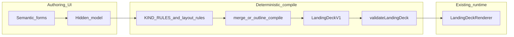

# Learn deterministic authoring platform — repo-grounded assessment

## What already exists

**Runtime and contract**

- Canonical deck shape: `[src/lib/landing-deck/schema.ts](C:/Users/New%20User/Documents/HiSense-1ea2985/src/lib/landing-deck/schema.ts)` (`LandingDeckV1`, `LandingDeckScreen`) consumed by `[src/lib/landing-deck/LandingDeckRenderer.tsx](C:/Users/New%20User/Documents/HiSense-1ea2985/src/lib/landing-deck/LandingDeckRenderer.tsx)` — **this is the Learn runtime you keep**.
- **Reveal / presenter behavior** is implemented in the renderer: `presentation.reveal` (`none` | `byBlock` | `custom`) and `revealSequence` (`block:N` keys); validator checks custom sequences in `[src/lib/landing-deck/validate-landing-deck.ts](C:/Users/New%20User/Documents/HiSense-1ea2985/src/lib/landing-deck/validate-landing-deck.ts)`.
- **Deck length modes**: `[src/lib/deck-platform/deck-slide-modes.ts](C:/Users/New%20User/Documents/HiSense-1ea2985/src/lib/deck-platform/deck-slide-modes.ts)` filters `screens[]` by `modes: short | long`.

**Compiler / deterministic pipelines**

- **Outline → deck**: `[src/lib/landing-deck/outline/compile-outline-to-deck.ts](C:/Users/New%20User/Documents/HiSense-1ea2985/src/lib/landing-deck/outline/compile-outline-to-deck.ts)` expands `[DeckOutline](C:/Users/New%20User/Documents/HiSense-1ea2985/src/lib/landing-deck/outline/types.ts)` (meta + slides with `templateId`, optional `mediaKeys`, `quizSelect`, `presentation`, etc.) into `LandingDeckV1`.
- **Structure + content → deck**: `[src/lib/landing-deck/translator/merge-structure-and-content.ts](C:/Users/New%20User/Documents/HiSense-1ea2985/src/lib/landing-deck/translator/merge-structure-and-content.ts)` merges ordered structure with a content map, applies `[KIND_RULES](C:/Users/New%20User/Documents/HiSense-1ea2985/src/lib/landing-deck/translator/kind-rules.ts)` / `[KIND_MAP](C:/Users/New%20User/Documents/HiSense-1ea2985/src/lib/landing-deck/translator/kind-map.ts)`, compiles, then can assert validation.
- **CLI**: `[scripts/deck-translate.ts](C:/Users/New%20User/Documents/HiSense-1ea2985/scripts/deck-translate.ts)` (structure + content → `v1.json`); `[scripts/deck-check.ts](C:/Users/New%20User/Documents/HiSense-1ea2985/scripts/deck-check.ts)` runs `validateLandingDeck` over catalog JSON files.

**Layouts, blocks, recipes**

- Layout IDs: `[src/lib/landing-layout-catalog.ts](C:/Users/New%20User/Documents/HiSense-1ea2985/src/lib/landing-layout-catalog.ts)` (`hero`, `stamped`, `twoCol`, `twoColImageLeft`, `proofPanel`, `splitProof`, `textOnly`).
- Content + media types: `[src/lib/landing-content-blocks/types.ts](C:/Users/New%20User/Documents/HiSense-1ea2985/src/lib/landing-content-blocks/types.ts)` + single renderer `[renderContentBlocks.tsx](C:/Users/New%20User/Documents/HiSense-1ea2985/src/lib/landing-content-blocks/renderContentBlocks.tsx)` (badge, paragraph, heading, checklist, testimonial, comparison, stats, trust strip, icon features, cta band, etc.; media: `image`, `video`, `beforeAfter`, `imageGrid`).
- Semantic presets: `[src/lib/slide-builder-recipes.ts](C:/Users/New%20User/Documents/HiSense-1ea2985/src/lib/slide-builder-recipes.ts)` (`hook`, `teaching`, `proof`, `comparison`, …) seed layout/theme/content; `builderMeta` is **editor-only** per schema comments.

**Authoring UI (today)**

- Learn entry: `[src/app/learn/LearnDeckEditorPage.tsx](C:/Users/New%20User/Documents/HiSense-1ea2985/src/app/learn/LearnDeckEditorPage.tsx)` delegates to `LandingDeckRenderer` with catalog/version query params.
- Slide builder shell: `[LandingSlideBuilderPanel.tsx](C:/Users/New%20User/Documents/HiSense-1ea2985/src/01_App/(live)`%20Business/Container_Creations/LandingSlideBuilderPanel.tsx), `[LandingSlideBuilderInspector.tsx](C:/Users/New%20User/Documents/HiSense-1ea2985/src/01_App/(live)`%20Business/Container_Creations/LandingSlideBuilderInspector.tsx) (not under `control-dock/editor`).
- Inspectors: `[NodeInspector.tsx](C:/Users/New%20User/Documents/HiSense-1ea2985/src/app/ui/control-dock/editor/NodeInspector.tsx)` (title, layout tiles, first media, buttons, content blocks), `[SlideContentBlocksEditor.tsx](C:/Users/New%20User/Documents/HiSense-1ea2985/src/app/ui/control-dock/editor/SlideContentBlocksEditor.tsx)` (add/reorder rich blocks), `[WalkthroughTrackerInspector.tsx](C:/Users/New%20User/Documents/HiSense-1ea2985/src/app/ui/control-dock/editor/WalkthroughTrackerInspector.tsx)` (optimized for **single select + gate** quiz).
- **Persistence**: learn resolve/save-draft/create-version API routes write **merged** `LandingDeckV1` JSON (see subagent notes: `buildMergedDeckForPersist`, `mergeScreenOrderIntoScreens` in `[src/lib/landing-deck-mutations.ts](C:/Users/New%20User/Documents/HiSense-1ea2985/src/lib/landing-deck-mutations.ts)`).

**Starter / real content**

- Example gospel tract flow files exist under `[src/01_App/(live) Gospel/hiclarify/learn/gospel-tract-v1/](C:/Users/New%20User/Documents/HiSense-1ea2985/src/01_App/(live)`%20Gospel/hiclarify/learn/gospel-tract-v1/) (`v1.json`, `v2.json`, `schemas/schema-a.json`).

---

## What is missing (relative to your target)

1. **Single authoring source of truth in the product UI** — Today the builder edits `screens[]` directly; the outline/translator path is powerful but **parallel** (CLI / future-only in-app). “Never touch JSON” implies the **UI state** should compile down to `LandingDeckV1`, not require authors to think in `screens` shape.
2. **First-class reveal authoring** — `presentation` is on the schema and in outline/translator merge, but `**NodeInspector` has no reveal controls** (only `presentationScreen` props for **layout tile** preview styling). Authors cannot manage `byBlock` / `custom` + `revealSequence` without leaving the forms.
3. **Vocabulary gap** — User-facing “slide types” in recipes (`[slide-builder-recipes.ts](C:/Users/New%20User/Documents/HiSense-1ea2985/src/lib/slide-builder-recipes.ts)`) and compiler template IDs (`[outline/types.ts](C:/Users/New%20User/Documents/HiSense-1ea2985/src/lib/landing-deck/outline/types.ts)`) are **smaller** than the marketing list (intro/hero/teaching/proof/comparison/objection/quiz/summary/CTA/scripture/media-heavy/two-column/before-after/expandable deep-dive). `[KIND_MAP](C:/Users/New%20User/Documents/HiSense-1ea2985/src/lib/landing-deck/translator/kind-map.ts)` maps only **five** kinds; `**proofStamped` exists in `OUTLINE_TEMPLATE_IDS` but not in `KIND_MAP`**.
4. **Blueprint “dormant regions”** — Compiler `[buildContent](C:/Users/New%20User/Documents/HiSense-1ea2985/src/lib/landing-deck/outline/compile-outline-to-deck.ts)` always emits paragraphs/checklist from outline fields; **empty fields do not remove block slots** the way a true blueprint/content split would (partial today: `composeScreen` falls back to a paragraph from title). True activation semantics need explicit rules in compile or a richer intermediate model.
5. **Contracts** — `KIND_RULES` are a good start but **narrow** (outline field keys only). Missing: per-layout button legality beyond validator **warnings**, media/reveal compatibility matrix, scripture-specific fields, FAQ/expandable block types (no `faq` / `expandable` in `[landing-content-blocks/types.ts](C:/Users/New%20User/Documents/HiSense-1ea2985/src/lib/landing-content-blocks/types.ts)`).
6. **Versioning in artifacts** — `LandingDeckV1` has **no** `schemaVersion` / `outlineVersion` field in `[schema.ts](C:/Users/New%20User/Documents/HiSense-1ea2985/src/lib/landing-deck/schema.ts)`; migration is “implicit by code + files on disk.”
7. **Design polish** — `[renderContentBlocks.tsx](C:/Users/New%20User/Documents/HiSense-1ea2985/src/lib/landing-content-blocks/renderContentBlocks.tsx)` mixes inline styles and utility classes; trust strip uses emoji mapping — **serviceable but not “premium presentation”** without a coordinated token/CSS pass in renderer + layouts (still runtime-only styling; aligns with “not rebuilding runtime” but **is** a renderer presentation-layer change).

---

## Assessment of the 12 upgrade bundles

| #   | Bundle                             | What exists                                                                                                             | What’s missing / how it maps to Learn                                                                                                                                                                                                                                                                                                                                                                                 |
| --- | ---------------------------------- | ----------------------------------------------------------------------------------------------------------------------- | --------------------------------------------------------------------------------------------------------------------------------------------------------------------------------------------------------------------------------------------------------------------------------------------------------------------------------------------------------------------------------------------------------------------- |
| 1   | **Full blueprint/template system** | 7 layouts; 7 outline `templateId`s including `proofStamped`; 8 recipe slide types; rich blocks in renderer.             | Map each **author-facing type** → `(layout default, default content blocks, optional media slots, button pattern, walkthrough pattern)` via compiler tables (extend `OUTLINE_TEMPLATE_IDS` + `templatePartial` **or** extend `KIND_MAP` + rules). **Scripture / objection / FAQ / expandable** need **new block types or conventions** (scripture could be `paragraph` + className or a dedicated `scripture` block). |
| 2   | **Hidden authoring layer**         | Strong: `NodeInspector`, `SlideContentBlocksEditor`, layout tiles, live preview in `LandingDeckRenderer`.               | Add **semantic slide wizard** that edits a **hidden model** (recommend: `DeckOutline` slide + `media` map, or `LearnStructureInput` + `LearnContentMap` in memory) and **compile on every preview/save**. Hide raw `screens` in Basic mode; keep Advanced “escape hatch” optional. **Walkthrough**: extend forms beyond single-select or generate walkthrough from quiz outline fields only in v1.                    |
| 3   | **Blueprint activation model**     | Partial: `layoutOverride`, optional fields on `OutlineSlide`.                                                           | **Not fully supported** today: compiler always builds default block lists. Needs **nullable slots** or “block recipes” keyed by field presence, and tests that empty → no block. **Can be phased**: v1 uses deterministic compile from filled fields only (simple rules); v2 adds full blueprint graph.                                                                                                               |
| 4   | **Reveal / staged teaching**       | Full **runtime**: `byBlock` / `custom`, presenter stepping in renderer; outline/translator pass `presentation` through. | **Authoring UI** for reveal mode, auto `revealSequence` from block order (custom), and guardrails in validator. **Self-guided vs presenter**: presenter already tied to renderer mode; self-guided may need explicit product rules (e.g. auto-advance vs tap) — behavior stays in renderer, **authoring** just sets `presentation`.                                                                                   |
| 5   | **Design system pass**             | Palettes + `visualTone` / `density` / `lightTheme`; layout components in renderer.                                      | Typography scale, card radii/shadows, media frame ratios, comparison table styling, CTA hierarchy — **centralize in renderer/layout CSS** and palette tokens; avoid one-off block inline styles where possible.                                                                                                                                                                                                       |
| 6   | **Rich content block expansion**   | Many blocks **render** and are **addable** in `SlideContentBlocksEditor`.                                               | **FAQ**, **objection/answer**, **proof grid**, **expandable deep-dive** need **new `LandingContentBlock` variants** + `renderContentBlocks` + editor sub-forms. **Reachability** today: advanced authors only; templates should **seed** these blocks.                                                                                                                                                                |
| 7   | **Media authoring**                | Types support tuning; `NodeInspector` focuses on **first** media item; before/after fields; full bleed toggles.         | **Multi-slot** authoring (hero vs column vs gallery), **decorative** flag usage in renderer, **poster/caption** UX for video, **grid** authoring for `imageGrid` — extend inspector beyond `media[0]`.                                                                                                                                                                                                                |
| 8   | **Learn rules/contracts**          | `KIND_RULES`, `validateLandingDeck`, merge asserts in translator.                                                       | Formalize **per-slide-kind** and **per-layout** matrices (required/forbidden, media/reveal/button compatibility); optionally generate errors (not only warnings) for illegal combos; share one module used by **merge**, **validator**, and **inspector** (disable invalid options).                                                                                                                                  |
| 9   | **Full compile pipeline**          | Pieces exist: compile, translate, validate, save, export, `deck-check`.                                                 | **Glue**: one in-app path — **edit hidden model → compile → validate → write `LandingDeckV1`** (and optionally **dual-write** outline JSON for round-trip later). Today save path is **direct deck** mutation.                                                                                                                                                                                                        |
| 10  | **Deck editing / regeneration**    | Reorder + merge on save; recipes can re-seed when empty/stub.                                                           | **Regenerate one slide**: compile from outline slice + preserve **manual overrides** (needs explicit override flags or `builderMeta` strip policy). **Swap template without losing content**: map shared fields across `templatePartial` branches + content block diff — medium complexity.                                                                                                                           |
| 11  | **Versioning / upgrade**           | File-based versions (`v1.json`, `v2.json`); schema overlay in learn resolve (per prior exploration).                    | Add `**formatVersion`** on outline + optional on deck output; migration functions **in compiler** (deterministic upgrades). Stable `**slide.id`** as primary key across regenerations.                                                                                                                                                                                                                                |
| 12  | **Starter packs**                  | Gospel tract folder; compiler templates for hero/teach/quiz/summary/cta/proof.                                          | Pack = **outline JSON + media manifest + palette** shipped under `learn/...`; expand packs as **new templateId + KIND_MAP entries** exist. Minimum set: **gospel tract**, **gospel teaching**, **study flow** (quiz + recap), **training** (checklist-heavy), **product education** (comparison + proof), **survey** (quiz variants).                                                                                 |

---

## Which bundles are required for v1 (“smallest complete useful version”)

**Required**

- **2 Hidden authoring layer** (minimal: compile-from-outline or structure+content in memory; Basic mode hides JSON).
- **9 Full compile pipeline** (single write path: compiled `LandingDeckV1` + validate before save).
- **8 Rules/contracts** (at least extend `KIND_RULES` / validator for new kinds you ship in v1).
- **1 Blueprint/template system** (only as many types as v1 promises — e.g. hero, teach, proof, comparison, quiz, summary, CTA).

**Strongly recommended with v1**

- **4 Reveal authoring** (mode selector + auto sequence for `custom`; `byBlock` explainer).
- **7 Media authoring** (incremental: improve beyond `media[0]` for hero + two-column flows).

**Can wait**

- **3 Full blueprint activation** (full dormant-region graph) — start with simpler “omit empty fields” compile rules.
- **5 Full design system pass** — can ship v1 with incremental CSS improvements.
- **6 All rich blocks** — add only blocks v1 templates need (FAQ/expandable later).
- **10 Advanced regeneration** — v1: regenerate via re-compile from outline; manual polish preserved only if you store outline+content as SSOT.
- **11 Full versioning** — v1: add `**outlineFormatVersion`** only; deck migration later.
- **12 Full starter pack library** — ship 1–2 packs; expand after kinds stabilize.

---

## Effort by bundle (easy / medium / hard)

- **Easy–medium**: 8 (extend existing rules/validator), 9 (wiring if model chosen), parts of 1 (add kinds/templates incrementally), 12 (clone existing tract flow).
- **Medium**: 2 (UX + state), 4 (inspector + validation), 6 (new block type = type + render + editor), 7 (multi-slot media), 10 (template swap / overrides).
- **Hard**: 3 (activation semantics + compiler refactor), 5 (cross-cutting visual QA), 11 (migrations + policy), 1 at “full vocabulary” scale.

---

## Risk by bundle

- **Low**: 8, 9 (if scope stays narrow), 12 (content packs).
- **Low–medium**: 1 (incremental), 4, 6, 7.
- **Medium**: 2 (UX complexity, two paths during transition), 10 (data loss fears), 11 (migration bugs).
- **Medium–high**: 3 (subtle compile bugs), 5 (visual regressions across layouts).

**No “rewrite runtime” risk** if you constrain changes to **compiler + editor + CSS** and keep `LandingDeckRenderer` contract backward compatible.

---

## Recommended architecture

- **Hidden model**: Prefer `**DeckOutline` + `media` map** as the SSOT for the product (maps cleanly to existing `[compileOutlineToLandingDeck](C:/Users/New%20User/Documents/HiSense-1ea2985/src/lib/landing-deck/outline/compile-outline-to-deck.ts)`). Alternative: keep `**LearnStructureInput` + `LearnContentMap`** if you want stricter per-slide kind enforcement from day one (`[merge-structure-and-content.ts](C:/Users/New%20User/Documents/HiSense-1ea2985/src/lib/landing-deck/translator/merge-structure-and-content.ts)`).
- **Output**: Always `**LandingDeckV1`** on disk (today’s save format) so the runtime unchanged.
- **Contracts**: Single module exporting rules consumed by **merge**, `**validateLandingDeck` extensions**, and **UI disabling**.

---

## Recommended execution order

1. **Pick SSOT**: `DeckOutline` vs structure+content (recommend outline for fewer files for authors).
2. **Wire compile-on-save** in slide builder: hidden outline state → `compileOutlineToLandingDeck` → existing save-draft path.
3. **Expand `OUTLINE_TEMPLATE_IDS` + `templatePartial`** (or `KIND_MAP`) for v1 slide vocabulary; align `[slide-builder-recipes.ts](C:/Users/New%20User/Documents/HiSense-1ea2985/src/lib/slide-builder-recipes.ts)` labels with compiler.
4. **Reveal inspector** + validator alignment for `revealSequence`.
5. **Media multi-slot** inspector for twoCol / proof layouts.
6. **CI**: keep `[deck-check.ts](C:/Users/New%20User/Documents/HiSense-1ea2985/scripts/deck-check.ts)`; add compile step for packs if outline stored separately.
7. **Version field** on outline; document upgrade policy.
8. **Design pass** after v1 behavior stabilizes.

---

## Go / no-go recommendation

**Go**, scoped: the repo **already proves** the deterministic compiler + runtime split. The upgrade is **product and glue**, not a new engine. **No-go** only if the team insists on shipping **full blueprint activation + full block library + full redesign** in one release — that should be phased.

---

## Direct answers (A–H)

|                                 | Answer                                                                                                                                                                                                                          |
| ------------------------------- | ------------------------------------------------------------------------------------------------------------------------------------------------------------------------------------------------------------------------------- |
| **A. Major upgrade?**           | **Yes — large relative to current UI/product surface.** Core algorithms exist; **authoring productization** (hidden model, rules, reveal, media, packs, versioning) is substantial.                                             |
| **B. Right next move?**         | **Yes** — aligns with existing `outline/` + `translator/` investment and `LandingDeckRenderer` SSOT.                                                                                                                            |
| **C. Technical risk?**          | **Medium.** Risk is **fragmentation and migration** (two authoring paths), not runtime feasibility. Mitigate with one SSOT and compile-on-save.                                                                                 |
| **D. Makes Learn much easier?** | **Yes** — once authors work in **forms + templates** and JSON is generated, cognitive load drops sharply (today: JSON-shaped mental model + walkthrough JSON escape hatch).                                                     |
| **E. Deep blocker?**            | **No** — no fundamental blocker in repo; **walkthrough generality** and **full blueprint activation** are the hardest *features*, not blockers for a v1.                                                                        |
| **F. Easy / medium / hard**     | **Easy**: narrow rules/validator extensions, CI, pack cloning. **Medium**: hidden UI, reveal UI, new blocks, media slots, template swap. **Hard**: dormant-region blueprints, full versioning+migrations, full visual redesign. |
| **G. Quick v1**                 | **Outline SSOT + compile to `LandingDeckV1` + Basic author UI + 6–7 slide kinds + reveal mode UI + `deck-check` + 1–2 starter flows.**                                                                                          |
| **H. Truly powerful**           | **Full kind/layout contract matrix, blueprint activation, rich blocks (FAQ/expandable/scripture), multi-slot media, regeneration with overrides, versioned migrations, premium design system, curated pack library.**           |

