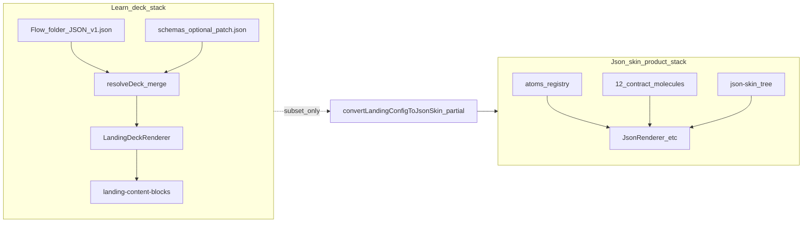

# Learn / deck platform architecture and easy-authoring plan

## 1. Plain-English diagnosis

**You effectively have two related but different “JSON products” in [HiSense-1ea2985](C:/Users/New User/Documents/HiSense-1ea2985):**

- **Learn / onboarding / teaching decks** — A **mature, specialized runtime**: flow folders under `src/01_App/**/learn/<flowKey>/`, version files like `v1.json`, optional `schemas/*.json` overlays merged server-side ([`registry.ts` `resolveDeck`](C:/Users/New User/Documents/HiSense-1ea2985/src/lib/deck-platform/registry.ts)), and one large client renderer: `[LandingDeckRenderer.tsx](C:/Users/New User/Documents/HiSense-1ea2985/src/lib/landing-deck/LandingDeckRenderer.tsx)`. Content is `**screens[]` + `landing-content-blocks`**, not the 12 “contract molecules.”
- **App / json-skin / product screens** — The **general HiSense presentation engine**: atoms registered in `[registry.tsx](C:/Users/New User/Documents/HiSense-1ea2985/src/03_Runtime/engine/core/registry.tsx)`, **12 closed molecules** (`[allowed-molecules.ts](C:/Users/New User/Documents/HiSense-1ea2985/src/02_Contracts_Reports/contracts/allowed-molecules.ts)`), compound components, layout presets, plus compilers like `[compileProductDataToScreen.ts](C:/Users/New User/Documents/HiSense-1ea2985/src/06_Data/product-screen-adapter/compileProductDataToScreen.ts)` and site compilation in `[compileSiteToSchema.ts](C:/Users/New User/Documents/HiSense-1ea2985/src/06_Data/site-compiler/compileSiteToSchema.ts)`.

**Pain point:** The **rendering contract is powerful** (many block types, layouts, walkthrough, modes, presenter reveal, tracker rules), but the **authoring surface is still “JSON-shaped”**: large repetitive structures (e.g. gospel tract quiz screens in `[gospel-tract-v1/v1.json](C:/Users/New User/Documents/HiSense-1ea2985/src/01_App/(live)`%20Gospel/hiclarify/learn/gospel-tract-v1/v1.json)), weak alignment between **documentation** (`[docs/1_ONBOARDING JSON - MASTER.md](C:/Users/New User/Documents/HiSense-1ea2985/docs/1_ONBOARDING%20JSON%20-%20MASTER.md)`) and **code** (e.g. `extraLinkKeys`, `walkthrough`, `modes`, `presentation.reveal` exist in code but are not fully documented there).

**Strategic takeaway:** The fastest path to “easy decks” is **not** to replace `LandingDeckRenderer`; it is to add a **higher-level source format + compiler** that emits the **existing** `screens[]` JSON, and to **tighten one canonical TypeScript contract** so generators and the editor stay aligned.

---

## 2. Full inventory — Learn JSON capabilities

**Authoritative implementation files:** `[LandingDeckRenderer.tsx](C:/Users/New User/Documents/HiSense-1ea2985/src/lib/landing-deck/LandingDeckRenderer.tsx)` (inline `Screen` / `LandingConfig` types), `[landing-content-blocks/types.ts](C:/Users/New User/Documents/HiSense-1ea2985/src/lib/landing-content-blocks/types.ts)`, `[landing-layout-catalog.ts](C:/Users/New User/Documents/HiSense-1ea2985/src/lib/landing-layout-catalog.ts)`, `[landing-walkthrough.ts](C:/Users/New User/Documents/HiSense-1ea2985/src/lib/landing-walkthrough.ts)`, `[landing-tracker-responses.ts](C:/Users/New User/Documents/HiSense-1ea2985/src/lib/landing-tracker-responses.ts)`, `[deck-slide-modes.ts](C:/Users/New User/Documents/HiSense-1ea2985/src/lib/deck-platform/deck-slide-modes.ts)`, `[slide-builder-query.ts](C:/Users/New User/Documents/HiSense-1ea2985/src/lib/slide-builder-query.ts)`.

### 2.1 Top-level deck fields (`LandingConfig` in renderer)

- `**shopUrl`**: base URL; used with `link` buttons when `hrefKey === "shopUrl"`.
- `**header`**: `{ logoSrc, logoAlt, shopNowLabel }`.
- `**stepTracker**`: `{ title, description, showResponses?, responsePlaceholder?, completedOnly? }` — sidebar step list + optional per-step response strings.
- `**screens**`: ordered steps (see below).
- `**extraLinkKeys**`: `Record<string, string>` — **named URL map** for `link` buttons: `resolveHref` uses `extraLinkKeys[hrefKey]` when not `shopUrl` ([`LandingDeckRenderer.tsx` around `resolveHref`](C:/Users/New User/Documents/HiSense-1ea2985/src/lib/landing-deck/LandingDeckRenderer.tsx)); falls back to `shopUrl` if missing.
- `**deckPalette`**: string key into `[@/palettes](C:/Users/New User/Documents/HiSense-1ea2985/src/lib/landing-deck/LandingDeckRenderer.tsx)` — whole-deck theming.

### 2.2 Per-screen fields (`Screen`)

- **Identity / nav:** `id`, `stepLabel`, `nextScreenId?`.
- **Layout:** `layout` — must be one of the **seven** ids in `[LANDING_LAYOUT_IDS](C:/Users/New User/Documents/HiSense-1ea2985/src/lib/landing-layout-catalog.ts)`: `hero`, `stamped`, `twoCol`, `twoColImageLeft`, `proofPanel`, `splitProof`, `textOnly`. Unknown layout → **nothing renders** (documented behavior; still true in spirit in `renderScreen` switch).
- **Copy:** `title`, `subtitle?` (subtitle used in `**hero`**), `content` (typed blocks), `media` (typed blocks), `buttons`.
- **Theme / density:** `lightTheme?`, `visualTone?` (`default` | `soft` | `bold`), `density?` (`comfortable` | `compact`) via `[landing-screen-presentation.ts](C:/Users/New User/Documents/HiSense-1ea2985/src/lib/landing-screen-presentation.ts)`.
- **Legacy product wizard:** `inlineControls?` — closed set: `containerLength`, `roofRibHeight`, `ventFitVerified`, `ventCount`, `orderSizeConfirmed` (drives hardcoded inline widgets + `stepInputs` state).
- **Summary:** `dynamicSummary?` + `dynamicSummaryConfig?` on `**textOnly`** — uses `[buildSummaryFromConfig](C:/Users/New User/Documents/HiSense-1ea2985/src/lib/landing-tracker-responses.ts)` vs legacy paragraph.
- **Tracker line:** `trackerResponse?` — `enabled?`, `rule?`, `fallbackText?`; rules: `valueLabel`, `boolean`, `numberTemplate`, `range`, `compoundTemplate`.
- **Presenter:** `presentation?` — `reveal: "none" | "byBlock" | "custom"`; `revealSequence?: string[]` for `custom` (keys must match `^block:\d+$`). In presenter runtime, `goNext` advances reveal steps before advancing screen ([`getRevealSequence` / `getPresenterScreen`](C:/Users/New User/Documents/HiSense-1ea2985/src/lib/landing-deck/LandingDeckRenderer.tsx)).
- **Walkthrough / gating:** `walkthrough?` — `inputs[]` and `gate.required[]` / `gate.message` (`[landing-walkthrough.ts](C:/Users/New User/Documents/HiSense-1ea2985/src/lib/landing-walkthrough.ts)`). Input types: `**select`** (with `options`), `**number`**, `**boolean**`, `**text**`.
- **Deck length modes:** `modes?` — array of `"short" | "long"`; `**filterScreensByDeckMode`** when `?deckMode=` is in URL (`[deck-slide-modes.ts](C:/Users/New User/Documents/HiSense-1ea2985/src/lib/deck-platform/deck-slide-modes.ts)`); omitted or empty = visible in all modes.
- **Builder-only:** `builderMeta?` — `slideType` / `stylePreset` from `[slide-builder-recipes.ts](C:/Users/New User/Documents/HiSense-1ea2985/src/lib/slide-builder-recipes.ts)` (ignored at render).
- **Dev graph:** `nodePosition?`.

### 2.3 Content blocks (`screen.content[]`)

From `[LandingContentBlock](C:/Users/New User/Documents/HiSense-1ea2985/src/lib/landing-content-blocks/types.ts)`: `badge`, `paragraph`, `heading`, `checklist`, `audio`, `rating`, `testimonial`, `trustStrip`, `stats`, `iconFeatures`, `comparison`, `ctaBand`, `divider`.

Editor support: `[SlideContentBlocksEditor.tsx](C:/Users/New User/Documents/HiSense-1ea2985/src/app/ui/control-dock/editor/SlideContentBlocksEditor.tsx)` can **add** all of these types with defaults; canvas inline editing is richer for text-like fields via callbacks in `[renderContentBlocks.tsx](C:/Users/New User/Documents/HiSense-1ea2985/src/lib/landing-content-blocks/renderContentBlocks.tsx)`.

### 2.4 Media (`screen.media[]`)

From `[MediaBlock](C:/Users/New User/Documents/HiSense-1ea2985/src/lib/landing-content-blocks/types.ts)`: `video`, `image`, `beforeAfter`, `imageGrid`, plus shared `**LandingMediaTuning`** (`poster`, `aspectRatio`, `objectFit`, `loading`, `decorative`, `fullBleed`, `maxHeight` where applicable).

### 2.5 Buttons (`screen.buttons[]`)

Types in renderer: `link` (`hrefKey`), `goto` (`target`), `next`, `back`. Optional `nodeId` for dev diagnostics.

**Layout × button matrix** (still as documented in onboarding doc): `hero` and `textOnly` have **restricted** button sets; other layouts get full nav. See §6 in `[docs/1_ONBOARDING JSON - MASTER.md](C:/Users/New User/Documents/HiSense-1ea2985/docs/1_ONBOARDING%20JSON%20-%20MASTER.md)`.

### 2.6 Runtime / URL modes

- `**slideBuilder`**: Learn defaults **off** unless truthy (`[parseSlideBuilderFlagDefaultOff](C:/Users/New User/Documents/HiSense-1ea2985/src/lib/slide-builder-query.ts)` via `[LearnDeckEditorPage.tsx](C:/Users/New User/Documents/HiSense-1ea2985/src/app/learn/LearnDeckEditorPage.tsx)`).
- `**runtimeMode`**: `builder` | `presenter` | `walkthrough` — controls presenter reveal and walkthrough storage keys (see renderer).
- `**deckMode`**: `short` | `long` — filters `screens` by `screen.modes`.

### 2.7 Deck platform (filesystem + API)

- **Discovery:** `[discoverLearnFlowRoots](C:/Users/New User/Documents/HiSense-1ea2985/src/lib/deck-platform/registry.ts)` — any folder that is a direct child of a `learn/` directory; version stems = `*.json` in flow root except `manifest.json`.
- **Schema overlay:** optional `schemas/<name>.json` **deep-merged** into version JSON when `schema` query/body requests it.
- **APIs:** `[/api/learn/resolve](C:/Users/New User/Documents/HiSense-1ea2985/src/app/api/learn/resolve/route.ts)`, `catalog`, `save-draft`, `create-flow`, `create-version` — authoring gated by `DECK_AUTHORING=1` in production (`[save-draft/route.ts](C:/Users/New User/Documents/HiSense-1ea2985/src/app/api/learn/save-draft/route.ts)`).
- **Blank deck:** `[learn-blank-deck.ts](C:/Users/New User/Documents/HiSense-1ea2985/src/lib/deck-platform/learn-blank-deck.ts)`.
- **Manifest:** `[manifest-schema.ts](C:/Users/New User/Documents/HiSense-1ea2985/src/lib/deck-platform/manifest-schema.ts)` only exports `MANIFEST_SUPPORT_REMOVED` — **no manifest**; avoid old docs that mention manifests for learn.

### 2.8 Slide builder UX (existing “ease” layer)

- **Recipes:** `[slide-builder-recipes.ts](C:/Users/New User/Documents/HiSense-1ea2985/src/lib/slide-builder-recipes.ts)` — semantic slide types (`hook`, `teaching`, `proof`, etc.) map to default `layout` + `content`/`media`/`buttons` seeds; `applySlideRecipe`, `inferSlideTypeFromNode`.
- **Panel:** `[LandingSlideBuilderPanel.tsx](C:/Users/New User/Documents/HiSense-1ea2985/src/01_App/(live)`%20Business/Container_Creations/LandingSlideBuilderPanel.tsx) — outline, version/schema/palette controls, save draft, create version.
- **Inspector:** `[NodeInspector.tsx](C:/Users/New User/Documents/HiSense-1ea2985/src/app/ui/control-dock/editor/NodeInspector.tsx)` + layout previews.

---

## 3. Full inventory — converters, generators, molecule/template tools

| System                       | Location                                                                                                                                                                                                                                       | Output                                          | Notes                                                                                                                                                                 |
| ---------------------------- | ---------------------------------------------------------------------------------------------------------------------------------------------------------------------------------------------------------------------------------------------- | ----------------------------------------------- | --------------------------------------------------------------------------------------------------------------------------------------------------------------------- |
| Landing → json-skin          | `[convert-landing-config-to-json-skin.ts](C:/Users/New User/Documents/HiSense-1ea2985/src/05_Logic/logic/landing/convert-landing-config-to-json-skin.ts)`                                                                                      | json-skin document with `state.currentScreenId` | **Partial:** `mapContentBlock` only handles **paragraph, badge, checklist**; does not map testimonial, comparison, CTA, walkthrough, tracker, most media tuning, etc. |
| Product → screen tree        | `[compileProductDataToScreen.ts](C:/Users/New User/Documents/HiSense-1ea2985/src/06_Data/product-screen-adapter/compileProductDataToScreen.ts)`                                                                                                | `ScreenTree` for JsonRenderer                   | Domain: product cards; not Learn decks.                                                                                                                               |
| Site ripper → schema         | `[normalizeSiteData.ts](C:/Users/New User/Documents/HiSense-1ea2985/src/06_Data/site-compiler/normalizeSiteData.ts)`, `[compileSiteToSchema.ts](C:/Users/New User/Documents/HiSense-1ea2985/src/06_Data/site-compiler/compileSiteToSchema.ts)` | `SiteSchema` / layout blocks                    | Websites, not slide decks.                                                                                                                                            |
| Module tree → blueprint text | `[module-tree.ts](C:/Users/New User/Documents/HiSense-1ea2985/src/module-system/module-tree.ts)`, `[module-autofill.ts](C:/Users/New User/Documents/HiSense-1ea2985/src/module-system/module-autofill.ts)`                                     | text manifests                                  | `[module-registry.ts](C:/Users/New User/Documents/HiSense-1ea2985/src/module-system/module-registry.ts)` — business/education/gov trees.                              |
| Dev / contract tooling       | `[run-apps.ts](C:/Users/New User/Documents/HiSense-1ea2985/src/07_Dev_Tools/scripts/run-apps.ts)`, `[param-key-mapping.test.ts](C:/Users/New User/Documents/HiSense-1ea2985/src/02_Contracts_Reports/contracts/param-key-mapping.test.ts)`     | reports / tests                                 | Molecule contract enforcement.                                                                                                                                        |
| Atoms                        | `[src/components/atoms](C:/Users/New User/Documents/HiSense-1ea2985/src/components/atoms)`, block defs under `[999_Cleanup/blocks](C:/Users/New User/Documents/HiSense-1ea2985/src/999_Cleanup/blocks)` (adapter)                              | N/A                                             | Wired in `[registry.tsx](C:/Users/New User/Documents/HiSense-1ea2985/src/03_Runtime/engine/core/registry.tsx)`.                                                       |
| Molecules                    | `[molecules.json](C:/Users/New User/Documents/HiSense-1ea2985/src/04_Presentation/components/molecules/molecules.json)`, compounds                                                                                                             | UI variants for **app JSON**                    | **Not** the same vocabulary as `LandingContentBlock`.                                                                                                                 |
| Layout engine                | `[layout/](C:/Users/New User/Documents/HiSense-1ea2985/src/layout)`, `[LayoutMoleculeRenderer](C:/Users/New User/Documents/HiSense-1ea2985/src/layout/renderer/LayoutMoleculeRenderer.tsx)`                                                    | section layouts for apps                        | Parallel to landing **layout strings**.                                                                                                                               |

---

## 4. Gap analysis

**Exists and solid**

- Full **Learn runtime** (navigation, layouts, media, walkthrough gating, presenter reveal, deck modes, tracker + summary rules).
- **Filesystem-backed** multi-version decks + optional schema patches.
- **APIs** for resolve/save/create.
- **Slide builder** shell with recipes and block editor for many types.

**Half-built / inconsistent**

- `**convertLandingConfigToJsonSkin`**: advertised as bridge but **covers a fraction** of landing blocks; easy to assume parity when there is none.
- **Documentation** `[docs/1_ONBOARDING JSON - MASTER.md](C:/Users/New User/Documents/HiSense-1ea2985/docs/1_ONBOARDING%20JSON%20-%20MASTER.md)`: still names `ContainerCreationsLandingRenderer` though implementation is consolidated in `[LandingDeckRenderer.tsx](C:/Users/New User/Documents/HiSense-1ea2985/src/lib/landing-deck/LandingDeckRenderer.tsx)`; **missing** sections for `walkthrough`, `modes`, `presentation`, `extraLinkKeys`, `deckPalette` (partially mentioned elsewhere); `**link` + `extraLinkKeys`** behavior in code is **better** than the doc’s “only shopUrl” warning.
- **Types duplicated**: `Screen` / `LandingConfig` are **inline** in the renderer; converter defines overlapping but **smaller** types — no single exported `zod`/`types` package for “deck contract v1.”

**Missing for “easy authoring”**

- **No high-level source** (outline, YAML, MD, or spreadsheet) with a **single compiler** to `screens[]`.
- **No pattern library** for repetitive structures (e.g. “quiz question template” generating N screens with walkthrough + tracker rules).
- **No validation** pipeline (CLI or CI) that fails on unknown `layout`, broken `goto` targets, or `gate.required` ids not in `inputs`.
- **Weak editor** for **walkthrough** and **tracker rules** (JSON still the path of least resistance for gospel-scale decks).
- **Media indirection**: no first-class **asset map** (logical id → URL) for reuse across flows.

---

## 5. Answers A–J (concise)

- **A.** What helps today: `deck-platform` + `LandingDeckRenderer` + `landing-content-blocks` + `slide-builder-recipes` + `SlideContentBlocksEditor` + learn APIs + real reference decks (`[gospel-tract-v1](C:/Users/New User/Documents/HiSense-1ea2985/src/01_App/(live)`%20Gospel/hiclarify/learn/gospel-tract-v1/v1.json), `[vent-onboarding](C:/Users/New User/Documents/HiSense-1ea2985/src/01_App/(live)`%20Business/containercreations/learn/vent-onboarding/)).
- **B.** Closest converter: `**convertLandingConfigToJsonSkin`** only for **json-skin export**; for **Learn authoring**, the closest “generator” is `**applySlideRecipe` / blank deck** — not a full document compiler.
- **C.** Templates/patterns: **7 layouts**; **8 slide recipe archetypes**; patterns in gospel tract (quiz + walkthrough + modes), vent flow (inline controls + tracker), track-1.
- **D.** Still raw: **volume** of JSON, **repetition** (quiz steps), **graph** (`nextScreenId` / `goto`), **cross-cutting** tracker rules, **modes** duplication, **presenter** reveal indices, **no compile-time checks**.
- **E.** Clean up first: **one canonical exported TypeScript contract** for deck JSON; **sync docs** to `LandingDeckRenderer` + new fields; **document converter limitations** or extend mapping; remove confusion around **manifest**; consider removing temporary learn SSR banner in `[LearnDeckEditorPage.tsx](C:/Users/New User/Documents/HiSense-1ea2985/src/app/learn/LearnDeckEditorPage.tsx)` once stable.
- **F.** Build: `**DeckOutline` schema** (slides as intents + templates) → **compiler** → existing `**screens[]`**; optional **media manifest**; optional **MD/YAML** front-end; **CLI `deck compile`** and `**deck check**`.
- **G.** Best easy-authoring architecture: **(1)** simplified **source schema** (outline + named templates), **(2)** **outline-to-deck compiler** emitting your **current** JSON, **(3)** **recipe/template library** (reuse `slide-builder-recipes` semantics), **(4)** **media mapping** layer, **(5)** **modes** as inherited deck-level defaults with per-slide overrides, **(6)** **reveal** as presenter concern driven by `presentation` or compiler-generated block order — **do not** add a second render engine.
- **H.** Learn options: listed in **§2** ( exhaustive field/block/button/media/mode list ).
- **I.** Molecule/converter options **for Learn**: **indirect only** — 12 molecules + atoms power **other** screens; **bridge** via `**convertLandingConfigToJsonSkin`** is **incomplete**. For universal authoring, treat **Learn JSON** and **json-skin** as **targets** of one outline compiler with **two backends** later if needed.
- **J.** Full plan: **§6–§9** below.

---

## 6. Recommended easy-authoring architecture (target state)

1. `**DeckOutline` (authoring source)** — minimal mental model, e.g. deck metadata, `media: Record<id, MediaRef>`, `slides: OutlineSlide[]` where each slide has `templateId`, short copy fields, `refs`, optional `walkthrough`/`tracker` **by convention** or embedded small structs.
2. `**compileOutlineToLandingDeck(outline) => LandingConfigJSON`** — pure function, unit-tested; uses **template registry** (TS objects or JSON) that maps `templateId` → partial `Screen` + `content[]` skeleton.
3. `**deck check`** — validates: layout ids, button matrix constraints, `goto` targets, walkthrough gate ids, unique screen ids, optional schema merge keys.
4. **Editor integration** — optional “import outline / export outline” beside raw JSON; reuse `[SlideContentBlocksEditor](C:/Users/New User/Documents/HiSense-1ea2985/src/app/ui/control-dock/editor/SlideContentBlocksEditor.tsx)` for fine edits after compile.
5. **Second backend (optional later)** — `compileOutlineToJsonSkin` only if you **extend** `[convert-landing-config-to-json-skin.ts](C:/Users/New User/Documents/HiSense-1ea2985/src/05_Logic/logic/landing/convert-landing-config-to-json-skin.ts)` to **full parity** or accept **lossy** export.

---

## 7. Staged implementation plan

**Stage 0 — Contract and docs (foundation)**

- Extract **exported** `LandingDeckV1` types from renderer logic into e.g. `src/lib/landing-deck/schema.ts` (single source of truth); re-import in renderer.
- Update `[docs/1_ONBOARDING JSON - MASTER.md](C:/Users/New User/Documents/HiSense-1ea2985/docs/1_ONBOARDING%20JSON%20-%20MASTER.md)`: rename renderer references to `LandingDeckRenderer`, add `extraLinkKeys`, `walkthrough`, `modes`, `presentation`, `deckPalette`, `deckMode` URL param.
- Add README note: `**convertLandingConfigToJsonSkin` coverage** vs full landing blocks.

**Stage 1 — Validation (`deck check`)**

- CLI or `pnpm` script: load `v1.json`, validate invariants (ids, layouts, links, walkthrough gates). Fails CI on broken decks.

**Stage 2 — Template registry + compiler MVP**

- Define **10–15** `templateId` entries mirroring your best real decks (intro, bullet teaching, quiz select, scripture/proof, CTA, summary, comparison).
- Implement `compileOutlineToLandingDeck` + golden tests (snapshot gospel tract **outline** → JSON subset).

**Stage 3 — Authoring UX**

- **Import/export outline** in slide builder panel or dev command.
- **Walkthrough inspector** (form for `inputs` + `gate`) to avoid raw JSON for quizzes.

**Stage 4 — Media and localization**

- Central `media` map in outline; compiler resolves `src` into `screen.media`.
- Optional: string table / i18n pass (future).

**Stage 5 — Json-skin parity (optional)**

- Either **expand** `mapContentBlock` / `mapMediaBlock` for all `LandingContentBlock` types **or** explicitly document **lossy** export and keep Learn canonical.

---

## 8. Effort tiers

- **Low-hanging fruit:** Doc sync; exported types; `deck check` for ids/layouts/links; document converter gaps; remove learn SSR debug strip when done.
- **Medium work:** Outline schema + compiler MVP; template library; golden tests; walkthrough form in inspector; media map.
- **Major work:** Full json-skin parity; visual WYSIWYG outline editor; collaborative authoring; CMS integration; i18n pipeline.

---

## 9. Reuse vs replace

- **Reuse directly:** `[LandingDeckRenderer](C:/Users/New User/Documents/HiSense-1ea2985/src/lib/landing-deck/LandingDeckRenderer.tsx)`, `[landing-content-blocks](C:/Users/New User/Documents/HiSense-1ea2985/src/lib/landing-content-blocks/)`, `[deck-platform/registry](C:/Users/New User/Documents/HiSense-1ea2985/src/lib/deck-platform/registry.ts)`, learn APIs, `[slide-builder-recipes](C:/Users/New User/Documents/HiSense-1ea2985/src/lib/slide-builder-recipes.ts)`.
- **Replace / avoid:** **Do not** replace the renderer with molecules for Learn. **Do not** assume `[convertLandingConfigToJsonSkin](C:/Users/New User/Documents/HiSense-1ea2985/src/05_Logic/logic/landing/convert-landing-config-to-json-skin.ts)` is a full bridge without extending it. **Deprecate mentally** any learn “manifest” flow (`[manifest-schema.ts](C:/Users/New User/Documents/HiSense-1ea2985/src/lib/deck-platform/manifest-schema.ts)`).

---

## 10. Recommended order of execution

1. **Canonical types + doc sync** (prevents generator drift).
2. `**deck check`** (safety net for generated JSON).
3. **Outline + compiler + templates** (real time savings for gospel/onboarding/teaching).
4. **Inspector improvements** for walkthrough/tracker (removes remaining JSON pain).
5. **Optional json-skin backend** only if a product requirement demands ExperienceRenderer for the same content.

This order maximizes reuse of what already works while making **outline → `screens[]`** the primary authoring path for **Learn first**, then the same pattern for **other subdomains** (business education, presentations) by swapping template packs and check rules.