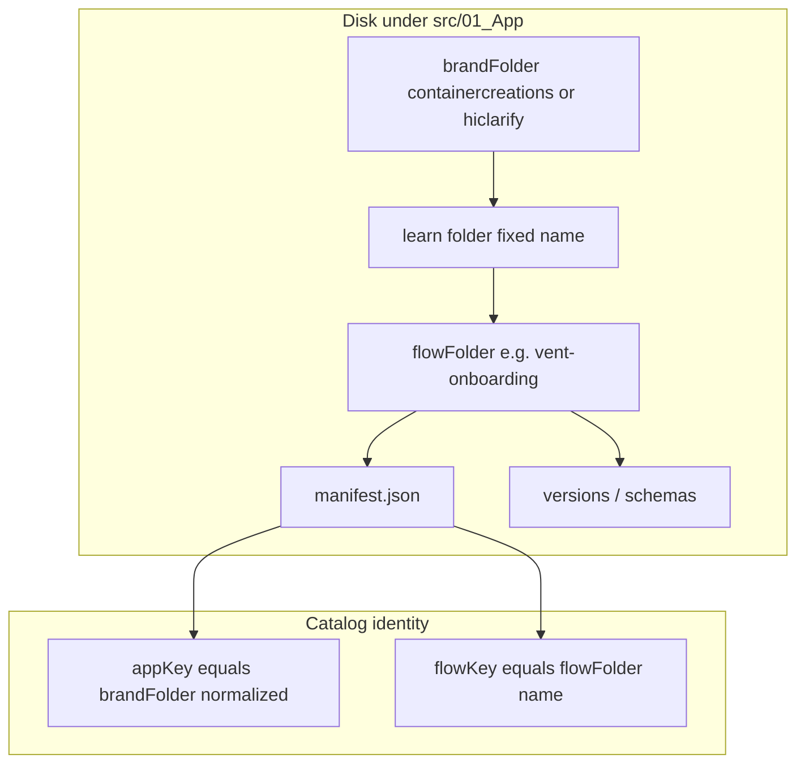

# Learn-folder + brand-folder as single source of truth

## Before / after map (concrete)

| Layer                   | Before                                                                                                                                                                                           | After                                                                                                                                                                       |
| ----------------------- | ------------------------------------------------------------------------------------------------------------------------------------------------------------------------------------------------ | --------------------------------------------------------------------------------------------------------------------------------------------------------------------------- |
| **CC flow root**        | `[src/01_App/(live) Business/Container_Creations/decks/vent-onboarding/](C:/Users/New%20User/Documents/HiSense-1ea2985/src/01_App/(live)`%20Business/Container_Creations/decks/vent-onboarding/) | `src/01_App/(live) Business/containercreations/learn/vent-onboarding/`                                                                                                      |
| **HiClarify flow root** | `[src/01_App/(live) Gospel/Discipleship/decks/track-1/](C:/Users/New%20User/Documents/HiSense-1ea2985/src/01_App/(live)`%20Gospel/Discipleship/decks/track-1/)                                   | `src/01_App/(live) Gospel/hiclarify/learn/track-1/`                                                                                                                         |
| **Discovery rule**      | `manifest.json` under `.../decks/<flow>/` (`[registry.ts` L54](C:/Users/New%20User/Documents/HiSense-1ea2985/src/lib/deck-platform/registry.ts))                                                 | `manifest.json` under `.../learn/<flow>/` where `learn`’s parent dir basename is the **brand** (`containercreations` | `hiclarify`, extend later as needed)                 |
| **Identity**            | Manifest `appKey` authoritative; folders could drift                                                                                                                                             | **Folder brand** and **flow folder name** must match manifest `appKey` / `flowKey` (after `normalizeDeckAppKey`); mismatch → skip + warn (same as duplicate handling today) |
| **Public HTTP API**     | `/api/decks/resolve`, `catalog`, `save-draft`, `create-version`                                                                                                                                  | `/api/learn/...` (same handlers, new path); keep **Next `redirects`** from `/api/decks/:path*` → `/api/learn/:path*` (308/307) for one release if desired                   |
| **Client fetch**        | `[LandingDeckRenderer.tsx](C:/Users/New%20User/Documents/HiSense-1ea2985/src/lib/landing-deck/LandingDeckRenderer.tsx)` `GENERIC_RESOLVE_URL`, save/create-version                               | Point to `/api/learn/...`                                                                                                                                                   |
| **Rewrite generator**   | `[deck-public-rewrites.cjs](C:/Users/New%20User/Documents/HiSense-1ea2985/deck-public-rewrites.cjs)` looks for `grandparent === "decks"`                                                         | `grandparent === "learn"`; still builds `/learn/{appKey}/{flowKey}/{version}` destinations from manifest `publicRoutes`                                                     |
| **Empty-state copy**    | `[landing-2/page.tsx](C:/Users/New%20User/Documents/HiSense-1ea2985/src/app/landing-2/page.tsx)` mentions `**/decks/`                                                                            | Update to `**/<brand>/learn/<flow>/`                                                                                                                                        |

**Unchanged (by design):** Next App Router public URLs remain `[/learn/[appKey]/[flowKey]/[versionKey]](C:/Users/New%20User/Documents/HiSense-1ea2985/src/app/learn/[appKey]/[flowKey]/[versionKey]/page.tsx)`. Host-conditioned rewrites still target those paths. Existing `[next.config.js` redirects](C:/Users/New%20User/Documents/HiSense-1ea2985/next.config.js) for legacy dashed **learn** paths (`container-creations`, `gospel-discipleship`) stay.

**TSX / design-time code:** Keep `[LandingSlideBuilderPanel.tsx](C:/Users/New%20User/Documents/HiSense-1ea2985/src/01_App/(live)`%20Business/Container_Creations/LandingSlideBuilderPanel.tsx) and related UI under `Container_Creations` unless you explicitly want a second move; this migration is scoped to **learn content + platform discovery/API naming**.

## Target directory contract

- **Path shape:** `**/containercreations/learn/<flow>/manifest.json` and `**/hiclarify/learn/<flow>/manifest.json` (allow any prefix under `01_App` so future roots do not require code changes beyond optional brand allowlist).
- **Validation (strict):** After parsing manifest, compute `brandFromPath = basename(dirname(dirname(manifestDir)))` and `flowFromPath = basename(manifestDir)`. Require `normalizeDeckAppKey(manifest.appKey) === normalizeDeckAppKey(brandFromPath)` and `manifest.flowKey === flowFromPath`. Optionally require brand folder to match `^[a-z0-9]+$` to enforce “domain-safe” names.
- **Manifests:** Keep `appKey` / `flowKey` in JSON for readability and for `publicRoutes`; filesystem is SSOT by **validation**, not by deleting fields.

## Historical / git note (analysis step before coding)

Run a short **read-only** history pass: `git log --oneline -- next.config.js deck-public-rewrites.cjs src/lib/deck-platform/registry.ts` to confirm no reverted assumptions (host rewrites, old `hiclarify/learn` trees). Do **not** resurrect deleted monolithic learn stacks; the living model stays manifest + `loadCatalog` + Next rewrites.

## Implementation sequence

1. **Add new discovery** in `[registry.ts](C:/Users/New%20User/Documents/HiSense-1ea2985/src/lib/deck-platform/registry.ts)`: replace `grandparent === "decks"` with `grandparent === "learn"`, implement path-derived brand/flow checks above, update `discoverDeckManifestPaths` naming/docs (optionally alias export `discoverLearnManifestPaths` and deprecate old name for clarity).
2. **Mirror discovery** in `[deck-public-rewrites.cjs](C:/Users/New%20User/Documents/HiSense-1ea2985/deck-public-rewrites.cjs)` (same `learn` grandparent rule).
3. **Move on-disk trees** (git mv):
  - `Container_Creations/decks` → `Business/containercreations/learn` (create `containercreations` if needed).  
  - `Discipleship/decks` → `Gospel/hiclarify/learn`.  
   Remove empty `decks` dirs. Ensure `manifest.json` paths in moved files still valid; `appKey` already `containercreations` / `hiclarify` in current manifests.
4. **API rename:** Move `[src/app/api/decks/](C:/Users/New%20User/Documents/HiSense-1ea2985/src/app/api/decks)` to `src/app/api/learn/` (same route segment names: `resolve`, `catalog`, `save-draft`, `create-version`). Update `[LandingDeckRenderer.tsx](C:/Users/New%20User/Documents/HiSense-1ea2985/src/lib/landing-deck/LandingDeckRenderer.tsx)`, panel JSDoc, and any other `fetch` callers. Add `[next.config.js` `redirects](C:/Users/New%20User/Documents/HiSense-1ea2985/next.config.js)` from `/api/decks/:path`* → `/api/learn/:path*` (non-permanent) if backward compatibility matters.
5. **Docs / UX strings:** `[landing-2/page.tsx](C:/Users/New%20User/Documents/HiSense-1ea2985/src/app/landing-2/page.tsx)` empty state; `[types.ts](C:/Users/New%20User/Documents/HiSense-1ea2985/src/lib/deck-platform/types.ts)` comment; sample text in `[v1.deck.json](C:/Users/New%20User/Documents/HiSense-1ea2985/src/01_App/(live)`%20Gospel/Discipleship/decks/track-1/versions/v1.deck.json) if it references `/api/decks/resolve`.
6. **Verification:** `npm run verify:deck-public-rewrites`; smoke `GET /api/learn/catalog`, `GET /api/learn/resolve?...`, `/landing-2`, `/learn/containercreations/vent-onboarding/v1`; confirm old `/api/decks/`* redirect if configured.

## Risks / mitigations

- **Case-sensitive CI:** Use lowercase brand folders consistently (`containercreations`, `hiclarify`).
- **Stale imports:** Grep `Discipleship/decks` and `Container_Creations/decks` after move (only content references).
- **Optional package rename:** Renaming `src/lib/deck-platform` → `learn-platform` is a large import churn; defer unless you want it in the same PR.

