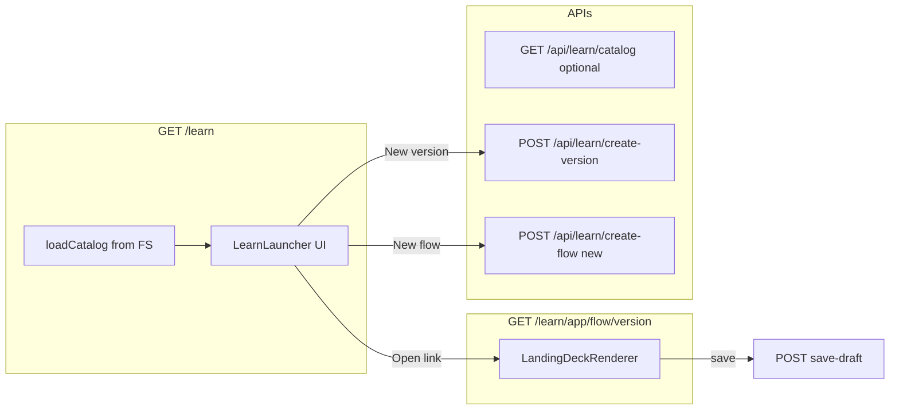

# Learn launcher (`/learn`) instead of default redirect

## 1. One-paragraph diagnosis

`[src/app/learn/page.tsx](C:/Users/New User/Documents/HiSense-1ea2985/src/app/learn/page.tsx)` is implemented only as a **server redirect**: it calls `[loadCatalog()](C:/Users/New User/Documents/HiSense-1ea2985/src/lib/deck-platform/registry.ts)`, picks **one** row (`containercreations`/`vent-onboarding` if present, else `catalog[0]`), and immediately `[redirect()](https://nextjs.org/docs/app/api-reference/functions/redirect)`s to `/learn/{appKey}/{flowKey}/{defaultVersion}`. It never renders markup, so `/learn` cannot behave as a **browser/launcher**—it is a hardcoded shortcut, which is why it “forces” a single deck and ignores the rest of the discovered catalog.

## 2. Target behavior (launcher + editor)

- **Launcher**: Lists **all** entries from `loadCatalog()` (same discovery rules as today: `**/.../<brand>/learn/<flow>/manifest.json` under `[src/01_App](C:/Users/New User/Documents/HiSense-1ea2985/src/01_App)`, with existing validation in `[registry.ts](C:/Users/New User/Documents/HiSense-1ea2985/src/lib/deck-platform/registry.ts)`). Display: **brand** (= path-normalized folder / manifest `appKey`), **flowKey**, **title**, **availableVersions**, **defaultVersion** (and optionally **manifestRelPath** for a “file path” feel).
- **Open**: Navigate to `/learn/{appKey}/{flowKey}/{versionKey}` (version from row control or dropdown).
- **Resume default**: Same URL with `defaultVersion`.
- **Resume latest**: Navigate using **max `vN`** derived from `availableVersions` (numeric tail), falling back to `defaultVersion` if none match.
- **New version (from launcher)**: Call existing `[POST /api/learn/create-version](C:/Users/New User/Documents/HiSense-1ea2985/src/app/api/learn/create-version/route.ts)` with `fromVersion` + client-computed next `vN` (same algorithm as `[nextLearnVersionKey](C:/Users/New User/Documents/HiSense-1ea2985/src/lib/landing-deck/LandingDeckRenderer.tsx)`), then `router.push` to the new editor URL. Reuse **DECK_AUTHORING** / dev gating consistent with save/create-version.
- **New flow / blank scratch**: New `**POST /api/learn/create-flow`** that:
  - Resolves the brand’s `**learn` directory** on disk by walking `src/01_App` for a folder whose basename matches `appKey` (registry rules: `[a-z0-9]+`, child `learn` exists)—same structural assumption as discovery.
  - Creates `{learnDir}/{flowKey}/manifest.json` (valid per `[validateManifest](C:/Users/New User/Documents/HiSense-1ea2985/src/lib/deck-platform/manifest-schema.ts)`) and `{learnDir}/{flowKey}/versions/v1.deck.json` from a **minimal blank deck** constant (screens array with one stub screen—enough for editor to load).
  - Validates `flowKey` (safe slug, no path segments, not colliding with existing folder).
  - Returns `{ ok, appKey, flowKey, versionKey }` for redirect.
- **Editor unchanged**: `[/learn/[appKey]/[flowKey]/[versionKey]/page.tsx](C:/Users/New User/Documents/HiSense-1ea2985/src/app/learn/[appKey]/[flowKey]/[versionKey]/page.tsx)` stays the real editor; still uses `/api/learn/resolve` + save/create-version inside `LandingDeckRenderer`.

**No manual registry**: Launcher only uses `loadCatalog()` / filesystem discovery + one new write path for `create-flow`.

## 3. Exact files to change / add

| Action                                           | File                                                                                                                                                                                                                    |
| ------------------------------------------------ | ----------------------------------------------------------------------------------------------------------------------------------------------------------------------------------------------------------------------- |
| Replace redirect with launcher shell             | `[src/app/learn/page.tsx](C:/Users/New User/Documents/HiSense-1ea2985/src/app/learn/page.tsx)`                                                                                                                          |
| New client UI (picker + actions)                 | `src/app/learn/LearnLauncher.tsx` (new)                                                                                                                                                                                 |
| Resolve `.../{appKey}/learn` abs path for writes | `[src/lib/deck-platform/registry.ts](C:/Users/New User/Documents/HiSense-1ea2985/src/lib/deck-platform/registry.ts)` (add `findLearnDirAbsForAppKey` or similar) **or** small `src/lib/deck-platform/learn-fs.ts` (new) |
| Minimal blank deck JSON                          | `src/lib/deck-platform/learn-blank-deck.ts` (new)                                                                                                                                                                       |
| Create flow API                                  | `src/app/api/learn/create-flow/route.ts` (new)                                                                                                                                                                          |

Optional (only if you want launcher to fetch without RSC props): extend nothing—**prefer server `loadCatalog()` → serialized props** to avoid duplicate round-trip; `[/api/learn/catalog](C:/Users/New User/Documents/HiSense-1ea2985/src/app/api/learn/catalog/route.ts)` already exists if needed later.

## 4. Implementation notes

- **Styling**: Practical, dense table/cards (readable without pulling in heavy dev-nav dependencies); keyboard-friendly links.
- **After create-flow / create-version**: `router.refresh()` on launcher if still on `/learn`, or navigate away to editor.
- **Production**: Mirror `[assertAuthoringAllowed](C:/Users/New User/Documents/HiSense-1ea2985/src/app/api/learn/save-draft/route.ts)` for `create-flow` (and surface 403 in UI).
- **Do not** reintroduce “pick primary CC vent” as main `/learn` behavior; primary entry is the **list**.

