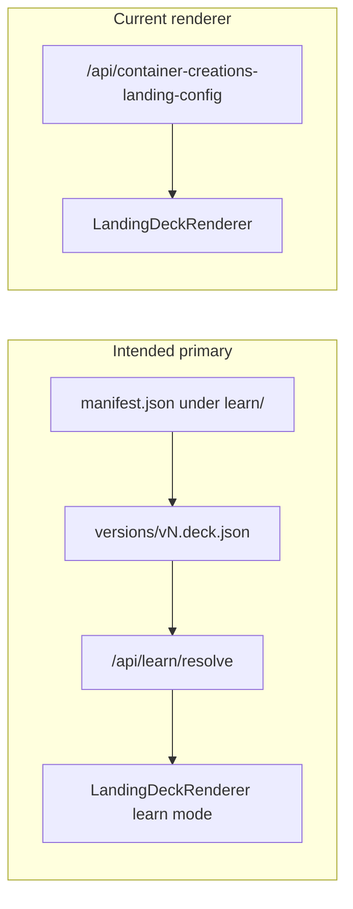

# Learn platform recovery and final execution plan

## Diagnosis (what survived vs broken)

**Survived (aligned with intended SSOT):**

- Folder SSOT: manifests at `[src/01_App/**/<brand>/learn/<flow>/manifest.json](C:/Users/New User/Documents/HiSense-1ea2985/src/01_App/(live)`%20Business/containercreations/learn/vent-onboarding/manifest.json) with lowercase `appKey`, version files under `versions/vN.deck.json`.
- Automatic discovery: `[src/lib/deck-platform/registry.ts](C:/Users/New User/Documents/HiSense-1ea2985/src/lib/deck-platform/registry.ts)` (`discoverDeckManifestPaths`, `loadCatalog`, `resolveDeck`, `normalizeVersionKey`).
- APIs: `[src/app/api/learn/resolve/route.ts](C:/Users/New User/Documents/HiSense-1ea2985/src/app/api/learn/resolve/route.ts)`, `catalog`, `save-draft`, `create-version` — all functional.
- Public host routing: `[deck-public-rewrites.cjs](C:/Users/New User/Documents/HiSense-1ea2985/deck-public-rewrites.cjs)` reads each manifest’s `publicRoutes` and rewrites `learn.containercreations.com` / `learn.hiclarify.com` paths to internal `/learn/{appKey}/{flowKey}/{version}`; `[next.config.js](C:/Users/New User/Documents/HiSense-1ea2985/next.config.js)` mounts `beforeFiles` rewrites and normalizing redirects for old path spellings.

**Broken / incomplete (primary gap):**

- `[src/lib/landing-deck/LandingDeckRenderer.tsx](C:/Users/New User/Documents/HiSense-1ea2985/src/lib/landing-deck/LandingDeckRenderer.tsx)` **only** fetches `[LEGACY_CONFIG_URL](C:/Users/New User/Documents/HiSense-1ea2985/src/lib/landing-deck/LandingDeckRenderer.tsx)` (`/api/container-creations-landing-config`) and uses numeric `configVersion` / `landing-1/2/3` dropdown fallbacks in `[LandingSlideBuilderPanel](C:/Users/New User/Documents/HiSense-1ea2985/src/01_App/(live)`%20Business/Container_Creations/LandingSlideBuilderPanel.tsx). It does **not** call `/api/learn/resolve`, does not pass `appKey`/`flowKey`, and does not wire `onSaveDraft` / `onCreateVersion`.
- `[src/app/learn/[appKey]/[flowKey]/[versionKey]/page.tsx](C:/Users/New User/Documents/HiSense-1ea2985/src/app/learn/[appKey]/[flowKey]/[versionKey]/page.tsx)` ignores route params for deck identity: it strips `v` from `versionKey` and passes a bogus `configVersion`, so it never targets the manifest version files.
- `[src/app/learn/page.tsx](C:/Users/New User/Documents/HiSense-1ea2985/src/app/learn/page.tsx)` is explicitly still the legacy builder entry (`configVersion` default `"2"`).
- `[src/app/api/container-creations-landing-config/route.ts](C:/Users/New User/Documents/HiSense-1ea2985/src/app/api/container-creations-landing-config/route.ts)` remains a parallel loader (JSON files + optional bridge to `resolveDeck`); it should not be the **primary** path once the renderer uses learn APIs.

Git history on these paths is shallow (large commits only); most learn work appears as **current working tree / untracked** pieces rather than a long-lived branch history.

## Minimum execution steps (after plan approval)

1. **Enrich resolve metadata** so one `GET /api/learn/resolve?includeBody=1` can drive the builder dropdown without a second round trip: extend `[DeckResolveMetadata](C:/Users/New User/Documents/HiSense-1ea2985/src/lib/deck-platform/types.ts)` and the successful branch of `[resolveDeck](C:/Users/New User/Documents/HiSense-1ea2985/src/lib/deck-platform/registry.ts)` to include `title`, `availableVersions`, and optional `allowedSchemas` / `defaultSchema` / `versionSchema` (copied from the validated manifest). The route handler already spreads `metadata` into JSON.
2. **Add learn mode to `LandingDeckRenderer`** (keep legacy branch when learn props absent — needed for `[dev/page.tsx](C:/Users/New User/Documents/HiSense-1ea2985/src/app/dev/page.tsx)` / `[tsx-screen-resolver](C:/Users/New User/Documents/HiSense-1ea2985/src/lib/tsx-screen-resolver.tsx)` dynamic imports):
  - New props, e.g. `learnDeck?: { appKey: string; flowKey: string }`, `initialLearnVersion?: string` (normalized on the server).
  - Replace the config `useEffect` when `learnDeck` is set: fetch `/api/learn/resolve?app=...&flow=...&version=...&includeBody=1` (add `schema` only if you introduce a manual schema override; otherwise rely on manifest `versionSchema` / `defaultSchema` as today).
  - Initialize and maintain `selectedDeckVersion` from manifest keys (`v1`, `v2`, …); pass `versionOptions` into `LandingSlideBuilderPanel` from `availableVersions`.
  - **Schema row**: set `showVariantSelect` / `variantSelectLabel` / `variantOptions` from `allowedSchemas` only when there is a real multi-schema choice; for single-schema flows (e.g. hiclarify) hide the row and let resolve pick the schema.
  - **Save / new version**: implement `onSaveDraft` → `POST /api/learn/save-draft` with `{ appKey, flowKey, versionKey: selectedDeckVersion, deck: config }`; `onCreateVersion` → compute next `vN` (max over `v\d+` in `availableVersions`), `POST /api/learn/create-version` with `{ appKey, flowKey, fromVersion, toVersion }`, then refresh local `availableVersions` from the response and switch `selectedDeckVersion` to `toVersion`; use `diskPersistBusy` + `alert`/toast on errors.
  - **URL sync**: when `learnDeck` is set and user changes version in the builder, `router.replace` to `/learn/{appKey}/{flowKey}/{selectedDeckVersion}` preserving `runtimeMode`, `slideBuilder`, `screen` query params.
  - Use a stable `componentName` for learn mode (e.g. `${appKey}-${flowKey}`) for walkthrough / registration keys instead of hard-coded `landing-2`.
3. **Fix Next learn pages (server)** using `[loadCatalog](C:/Users/New User/Documents/HiSense-1ea2985/src/lib/deck-platform/registry.ts)` + `[normalizeVersionKey](C:/Users/New User/Documents/HiSense-1ea2985/src/lib/deck-platform/registry.ts)` + `[normalizeDeckAppKey](C:/Users/New User/Documents/HiSense-1ea2985/src/lib/deck-platform/legacy-app-keys.ts)`:
  - `[[appKey]/[flowKey]/[versionKey]/page.tsx](C:/Users/New User/Documents/HiSense-1ea2985/src/app/learn/[appKey]/[flowKey]/[versionKey]/page.tsx)`: resolve catalog entry; if missing, `notFound()`; compute canonical `initialLearnVersion`; pass `learnDeck` + `initialLearnVersion` + existing slide-builder query parsing.
  - `[learn/page.tsx](C:/Users/New User/Documents/HiSense-1ea2985/src/app/learn/page.tsx)`: **redirect** to the first catalog entry’s `defaultVersion` (deterministic sort already exists in discovery), preserving relevant query params — removes duplicate legacy builder entry.
4. **Demote `/landing-2`**: change `[src/app/landing-2/page.tsx](C:/Users/New User/Documents/HiSense-1ea2985/src/app/landing-2/page.tsx)` to a **server redirect** into `/learn/containercreations/vent-onboarding/{version}` with a small explicit map for old numeric `?version=` (`2` → manifest `defaultVersion`, `3` → `v3` if present) so bookmarks keep working. Single code path in the renderer for the Container Creations deck.
5. **Legacy API**: turn off or narrow the generic bridge in `[container-creations-landing-config](C:/Users/New User/Documents/HiSense-1ea2985/src/app/api/container-creations-landing-config/route.ts)` (e.g. default `DECK_PLATFORM_LEGACY_BRIDGE=0` behavior) so accidental reliance on `landing-2.json` as SSOT does not compete with folder decks; keep route only if something external still calls it.
6. **Verify**
  - `GET /api/learn/catalog` lists both flows.
  - `GET /api/learn/resolve?app=containercreations&flow=vent-onboarding&version=v2&includeBody=1` returns deck + `availableVersions`.
  - Hit `/learn/containercreations/vent-onboarding/v2?runtimeMode=builder` — builder shows v1/v2/v3 from manifest; Save touches `versions/v2.deck.json`; New version creates `v4.deck.json` and updates manifest.
  - Same for `/learn/hiclarify/track-1/v1` (schema merge path).
  - Optional: run `next build` or `npm run lint` per project norms.

## Execution constraint (this session)

You are in **plan mode**: this document is the agreed blueprint. **Implementation (steps 1–6) and verification run after you confirm the plan** in the IDE; the assistant will not edit files until then.