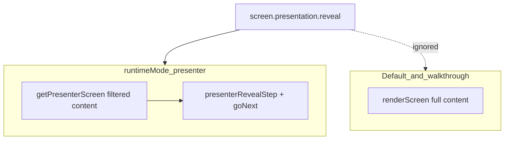

# Learn deck: reveal, templates, and presentation interactivity (audit)

## 1. Plain-English feature audit

**What “presentation” means in this codebase**

- `**landing-screen-presentation`** (`[landing-screen-presentation.ts](C:/Users/New User/Documents/HiSense-1ea2985/src/lib/landing-screen-presentation.ts)`) is **CSS-only**: `visualTone` and `density` become `data-visual-tone` / `data-density` on wrappers. It is **not** progressive disclosure.
- **Real progressive disclosure** for slide body content exists in **one place**: `**runtimeMode=presenter`** plus `**screen.presentation.reveal`** in `[LandingDeckRenderer.tsx](C:/Users/New User/Documents/HiSense-1ea2985/src/lib/landing-deck/LandingDeckRenderer.tsx)`. Normal learner/onboarding views (`walkthrough`, default consumer flow, slide builder canvas) render `**renderScreen(screen)**` with the **full** `content` array—no reveal filtering.

**Presenter-mode reveal (the only built-in “reveal bullets / blocks one step at a time”)**

- Activation: `?runtimeMode=presenter` (see `[slide-builder-query.ts](C:/Users/New User/Documents/HiSense-1ea2985/src/lib/slide-builder-query.ts)`; wired in `[LandingDeckRenderer.tsx](C:/Users/New User/Documents/HiSense-1ea2985/src/lib/landing-deck/LandingDeckRenderer.tsx)` ~640–651).
- JSON: optional `presentation` on each screen (`[schema.ts](C:/Users/New User/Documents/HiSense-1ea2985/src/lib/landing-deck/schema.ts)`):
  - `reveal: "none"` — no stepping (default if omitted).
  - `reveal: "byBlock"` — sequence is **every** `content` index: `block:0`, `block:1`, … (`getRevealSequence`, lines 1015–1024).
  - `reveal: "custom"` — sequence from `revealSequence`, entries must match `^block:\d+$` (invalid keys filtered out).
- Mechanics: `getPresenterScreen` keeps only blocks whose keys are in `sequence.slice(0, presenterRevealStep)` (lines 1032–1039). `**goNext` / `goBack` advance reveal steps before changing slides** when `canRevealForward` / `canRevealBackward` (lines 1050–1081).
- Input: **Space** and **ArrowRight** call `goNext`; **ArrowLeft** calls `goBack` (keyboard listener ~~1084–1101). The on-screen **Next/Prev** buttons call the same handlers (~~2888–2906).
- **Important behavior (easy to miss):** `presenterRevealStep` starts at **0**, and `slice(0, 0)` is empty—so **with reveal enabled, the slide initially shows no `content` blocks** (title/layout/media may still show). The first advance shows `block:0`. That is “stage black” unless authors add a dedicated first block or you change semantics.
- **Walkthrough vs presenter:** In presenter mode, `**isInteractiveGatedFlow` is false** (lines 655–657), so **walkthrough gates do not block Next**—appropriate for presenting, but means quiz gating and reveal are **different modes**.

**What content blocks do *not* do**

- `[renderContentBlocks.tsx](C:/Users/New User/Documents/HiSense-1ea2985/src/lib/landing-content-blocks/renderContentBlocks.tsx)`: **no** `reveal`, **no** `accordion`, **no** `collaps*`. A `**checklist`** renders **all** `<li>` items in one pass (lines 128–164). Splitting “bullets” across presenter steps requires **multiple top-level `content` blocks** (e.g. several `paragraph`/`heading` blocks), not one checklist with staged items.

**“Expand section on slide, then continue”**

- **No** first-class expandable section component in `landing-content-blocks`.
- **Indirect patterns that exist today:**
  - **Multiple screens** with **Next** (navigation disclosure).
  - **Presenter + `byBlock`**: same slide, multiple blocks, **Next** advances one block (not tap-on-bullet, and only in presenter mode).
  - **Walkthrough + gate**: “complete input then Continue” is **form gating**, not expanding copy.

**Templates / recipes**

- `[slide-builder-recipes.ts](C:/Users/New User/Documents/HiSense-1ea2985/src/lib/slide-builder-recipes.ts)`: **semantic defaults** (`hook`, `teaching`, `proof`, …) for layout + starter `content`/`media`/`buttons`; `**builderMeta`** is **ignored at runtime**. Recipes **do not** set `presentation.reveal` or any interactivity.
- `[landing-layout-catalog.ts](C:/Users/New User/Documents/HiSense-1ea2985/src/lib/landing-layout-catalog.ts)`: **seven layout ids** only—no reveal semantics.
- **Outline compiler** (`[outline/compile-outline-to-deck.ts](C:/Users/New User/Documents/HiSense-1ea2985/src/lib/landing-deck/outline/compile-outline-to-deck.ts)`): **does not** emit `presentation` today.

**Editor / docs**

- `[docs/1_ONBOARDING JSON - MASTER.md](C:/Users/New User/Documents/HiSense-1ea2985/docs/1_ONBOARDING%20JSON%20-%20MASTER.md)` documents `presentation` and Learn URL params at a high level.
- `[NodeInspector.tsx](C:/Users/New User/Documents/HiSense-1ea2985/src/app/ui/control-dock/editor/NodeInspector.tsx)`: **no** UI for `presentation.reveal` / `revealSequence` (grep hits are layout preview `presentationScreen` props, not deck `presentation` JSON). Authors must hand-edit JSON or post-process.

---

## 2. Existing template / reveal inventory (concise)

| Mechanism                              | Where                            | Works in default Learn UX?                 | Notes                                               |
| -------------------------------------- | -------------------------------- | ------------------------------------------ | --------------------------------------------------- |
| `presentation.reveal` + presenter mode | `LandingDeckRenderer`            | **No** — requires `?runtimeMode=presenter` | Block-level (array index), not checklist-item-level |
| Keyboard Next/Prev in presenter        | Same                             | Presenter only                             | Space / arrows                                      |
| On-screen Next in presenter            | Same                             | Presenter only                             | See edge case below                                 |
| `visualTone` / `density`               | `landing-screen-presentation`    | Yes                                        | Cosmetic only                                       |
| Walkthrough gate                       | `landing-walkthrough` + renderer | Walkthrough / default flow                 | Answer to continue—not reveal                       |
| Slide recipes                          | `slide-builder-recipes`          | N/A                                        | Seeds content; no reveal flags                      |
| Outline compiler                       | `outline/*`                      | N/A                                        | No `presentation` yet                               |

**Partial / hidden / undocumented (repo-specific)**

- Reveal is **only** applied in `renderScreen(getPresenterScreen(screen))` for **presenter** branch (~~2874); all other branches use full `screen` (~~2842, ~2918, ~2945).
- Initial **empty body** at `presenterRevealStep === 0` when reveal is on (see slice logic ~1037).
- **Possible presenter bug:** Next button `disabled` is `currentIndex >= orderedScreens.length - 1 && !currentScreen.nextScreenId` (~2901–2902). On the **last** slide, if `revealMax > 0` and `presenterRevealStep < revealMax`, the user may still need **Next** to finish reveals, but the button can stay **disabled**. Keyboard Space might still work via the key handler—**inconsistent UX** worth fixing if you lean on presenter.

---

## 3. Direct answers to main questions

**A. What reveal/presentation features already exist?**

- **Presenter-mode, block-index reveal** (`none` / `byBlock` / `custom` + `revealSequence`).
- **Cosmetic** `data-visual-tone` / `data-density`.
- **Walkthrough gating** (separate from reveal).

**B. Do bullets / blocks support progressive reveal?**

- **Indirectly:** only by making each bullet a **separate `content` block** and using **presenter + `byBlock`** (or `custom`).
- **Not directly:** a single `**checklist`** block always shows **all** items at once.

**C. Pattern for “expand section on slide, then continue”?**

- **No** dedicated expand/collapse. Closest: **extra slide**, **presenter stepping**, or **walkthrough** (interaction is “answer”, not “expand copy”).

**D. Templates/recipes that map to these behaviors?**

- **None** automatically. Recipes could be **extended** to set `presentation: { reveal: "byBlock" }` for teaching slides—that would be a small product change, not present today.

**E. What’s missing for your three goals?**

1. **Click/tap to reveal bullets one-by-one (in normal mode):** **Missing.** Presenter uses **global Next**, not per-bullet tap; consumer mode has **no** reveal.
2. **Click/tap to expand a collapsed section on the same slide:** **Missing** (no disclosure block/component).
3. **Cleaner teaching slides without giant blobs:** **Partially** supported structurally (many small blocks, layouts, checklists) but **no** staged disclosure in consumer mode; presenter helps only in presenter URL.

**F. Smallest upgrade path using what exists**

1. **Authoring:** One line per idea as separate `content` blocks + `presentation.reveal: "byBlock"` + teach users `**?runtimeMode=presenter`** for “presentation run.”
2. **Tooling (tiny):** Add inspector fields + outline compiler flag for `presentation` so JSON isn’t hand-written; document the step-0 empty body and last-slide Next disabled issue.
3. **Runtime (small):** Optionally reuse presenter logic under default mode with a flag (e.g. `?presentationStep=1` or deck-level `presentationMode: "consumer"`) so tap/Next reveals without switching “presenter” semantics—or fix Next disabled + initial step UX only (**tiny**).

---

## 4. Recommended smallest next implementation plan (ordered)

1. **Tiny — Fix presenter footguns:** Initial reveal step (show 0 vs 1 blocks intentionally); Next button disabled on last slide when reveals remain; document in `[docs/1_ONBOARDING JSON - MASTER.md](C:/Users/New User/Documents/HiSense-1ea2985/docs/1_ONBOARDING%20JSON%20-%20MASTER.md)`.
2. **Tiny — Authoring:** `NodeInspector` (or collapsible) for `presentation.reveal` + textarea/list for `revealSequence`.
3. **Small — Outline:** Optional `reveal?: "byBlock" | "custom" | "none"` on `OutlineSlide` → compiler sets `screen.presentation`.
4. **Small — Consumer tap reveal (if required):** Either duplicate “filtered content by step” in non-presenter branch with explicit “tap to advance” control, or add a `**disclosure` / `stagedBlocks`** content type in `[renderContentBlocks.tsx](C:/Users/New User/Documents/HiSense-1ea2985/src/lib/landing-content-blocks/renderContentBlocks.tsx)` (local state per slide)—**medium** if you want parity with checklist editing and validation.

---

## 5. Effort estimate

| Scope                                                    | Size             |
| -------------------------------------------------------- | ---------------- |
| Docs + presenter Next/initial-step fixes                 | **Tiny**         |
| Inspector + outline `presentation` emission              | **Small**        |
| Consumer-mode block stepping (reuse presenter filtering) | **Small–medium** |
| New expandable section block + editor                    | **Medium**       |
| Per-checklist-item reveal + rich WYSIWYG                 | **Medium–large** |

---

## 6. Summary diagram

This matches the current implementation: **interactive stepping is presenter-only**; everything else is **static layout + optional walkthrough gating**.