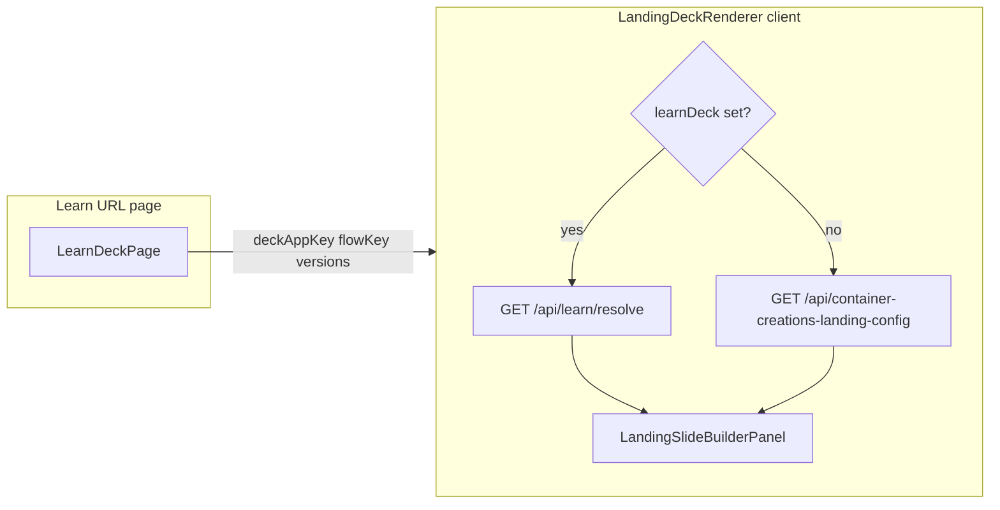

# Learn runtime end-to-end fix

## Forensic baseline (read-only summary from repo)

| URL | What renders | `LandingDeckRenderer` inputs |
|-----|----------------|------------------------------|
| [`/learn`](C:/Users/New User/Documents/HiSense-1ea2985/src/app/learn/page.tsx) | Server-only: `loadCatalog()` then **`redirect`** to `/learn/{firstEntry.appKey}/{firstEntry.flowKey}/{defaultVersion}`. **Does not mount** `LandingDeckRenderer`. | N/A |
| [`/learn/[appKey]/[flowKey]/[versionKey]`](C:/Users/New User/Documents/HiSense-1ea2985/src/app/learn/[appKey]/[flowKey]/[versionKey]/page.tsx) | `LandingDeckRenderer` with **`deckAppKey`**, **`deckFlowKey`**, **`initialDeckVersion`**, **`availableDeckVersions`** from catalog entry. | All four are passed today. |
| [`/landing-2`](C:/Users/New User/Documents/HiSense-1ea2985/src/app/landing-2/page.tsx) | **`redirect`** into `/learn/containercreations/vent-onboarding/{mappedVersion}`. | N/A |

**Learn vs legacy inside** [`LandingDeckRenderer.tsx`](C:/Users/New User/Documents/HiSense-1ea2985/src/lib/landing-deck/LandingDeckRenderer.tsx):

- **Learn identity**: `learnDeck` is derived from `deckAppKey` + `deckFlowKey` (or deprecated `learnDeck` prop). When truthy, the load effect hits **`/api/learn/resolve?...&includeBody=1`** (lines ~743–797). Legacy branch uses **`LEGACY_CONFIG_URL`** (`/api/container-creations-landing-config`) only when `learnDeck` is falsy (lines ~800–833).
- **Panel**: [`LandingSlideBuilderPanel.tsx`](C:/Users/New User/Documents/HiSense-1ea2985/src/01_App/(live) Business/Container_Creations/LandingSlideBuilderPanel.tsx) shows **Save to disk / New version** only when `onSaveDraft` / `onCreateVersion` are passed; the renderer passes those **only if `learnDeck`** (lines ~2682–2683). It shows **`landing-1.json`…** when `versionOptions` is **null or empty** (lines ~367–383).

**Conclusion for “why legacy still appears” (to confirm at runtime):** Legacy dropdown + missing Save/New version **implies `learnDeck` is null** (or the user is not actually on the learn app route — e.g. `/dev` dynamic import of [`ContainerCreationsLandingRenderer`](C:/Users/New User/Documents/HiSense-1ea2985/src/01_App/(live) Business/Container_Creations/ContainerCreationsLandingRenderer.tsx) with **no** deck props). Separately, **even with `learnDeck` set**, if `learnVersionOptions` is **empty**, the panel still renders the **landing-1/2/3** `<select>` (because it treats `length === 0` like “no manifest options”) while Save could still show — your reported “both wrong” points to **`learnDeck` null** as the primary hypothesis.

**Implementation-phase forensic (after you approve):** Add **short-lived** `console.info` in `LandingDeckRenderer` (e.g. log `deckAppKey`, `deckFlowKey`, computed `learnDeck`, and which fetch branch runs), load the three URLs on `localhost:3000`, then **remove or gate** logs.

---

## 1) Fix `/learn` default (explicit primary)

Today [`learn/page.tsx`](C:/Users/New User/Documents/HiSense-1ea2985/src/app/learn/page.tsx) redirects to **first catalog entry** (deterministic path sort). That is usually `containercreations/vent-onboarding` (folder `(live) Business` sorts before `(live) Gospel`), but it is **implicit**.

**Change:** If catalog contains `appKey === "containercreations"` and `flowKey === "vent-onboarding"`, **`redirect` to `/learn/containercreations/vent-onboarding/v1`** (or that entry’s `defaultVersion` from manifest). Otherwise keep current “first catalog entry” behavior. Preserve query passthrough (`runtimeMode`, `slideBuilder`, `screen`).

---

## 2) Harden learn route → renderer contract

[`LearnDeckPage`](C:/Users/New User/Documents/HiSense-1ea2985/src/app/learn/[appKey]/[flowKey]/[versionKey]/page.tsx) already passes the four props. Optional belt-and-suspenders: also pass **`learnDeck={{ appKey, flowKey }}`** so identity survives any future prop rename confusion (renderer already merges `learnDeck` with `deckAppKey`/`deckFlowKey`).

**Version normalization:** Keep using [`normalizeVersionKey`](C:/Users/New User/Documents/HiSense-1ea2985/src/lib/deck-platform/registry.ts) for **URL segments** only; in the client, avoid treating **`selectedDeckVersion` / `?version=`** as legacy numeric **when `learnDeck` is set** (see renderer fix below).

---

## 3) Fix `LandingDeckRenderer` (learn never “looks legacy”)

Files: [`LandingDeckRenderer.tsx`](C:/Users/New User/Documents/HiSense-1ea2985/src/lib/landing-deck/LandingDeckRenderer.tsx).

- **Initial `selectedDeckVersion`:** When `learnDeck` is set, initialize from **`resolvedInitialVersion` / URL path only**, not `searchParams.get("version") ?? configVersion` (those are legacy API semantics).
- **Version options passed to panel:** Today `learnVersionOptions` is only from **`learnAvailableVersions` state**. If the resolve response omits `availableVersions` or state is briefly empty, the panel falls back to landing-1/2/3. **Fix:** Build `panelVersionOptions = learnDeck ? (nonEmpty learnVersionOptions OR map `resolvedAvailableSeed` / `availableDeckVersions`) : null` so **learn never passes an empty list**.
- **Primary fetch:** Keep current rule: **if `learnDeck`**, only **`/api/learn/resolve`**; do **not** use `/api/container-creations-landing-config` as primary. On resolve failure, show **`configError`** (existing UI) — **do not** fall back to legacy config for learn identity.
- **Refresh after mutations:** After successful **save** / **create-version**, call **`router.refresh()`** (in addition to local state updates) so the next server render picks up an updated manifest if needed.
- **Logging:** Remove minimal debug after verification.

---

## 4) Optional small panel guard

[`LandingSlideBuilderPanel.tsx`](C:/Users/New User/Documents/HiSense-1ea2985/src/01_App/(live) Business/Container_Creations/LandingSlideBuilderPanel.tsx): If `onSaveDraft`/`onCreateVersion` are non-null, **never** render the legacy landing-N options (defensive). Prefer fixing the parent so `versionOptions` is never empty in learn mode; this is a safety net only.

---

## 5) `/landing-2`

Already redirects into `/learn/containercreations/vent-onboarding/...`. **Verify** no other page still mounts `LandingDeckRenderer` as the “primary editor” for that flow without learn props (grep already shows only learn route + dev/tsx resolver).

---

## 6) Verification checklist (post-fix)

Manual on **`http://localhost:3000`**:

- `/learn` → lands on learn URL (prefer **`/learn/containercreations/vent-onboarding/v1`**).
- `/learn/containercreations/vent-onboarding/v1` → version select shows **`v1` / `v2` / `v3`**, **Save to disk** and **New version** visible, network shows **`/api/learn/resolve`** (not primary config API).
- Save updates the correct **`versions/vN.deck.json`** under [`containercreations/learn/vent-onboarding/`](C:/Users/New User/Documents/HiSense-1ea2985/src/01_App/(live) Business/containercreations/learn/vent-onboarding/).
- New version creates new file + updates [`manifest.json`](C:/Users/New User/Documents/HiSense-1ea2985/src/01_App/(live) Business/containercreations/learn/vent-onboarding/manifest.json).

**`learn.containercreations.com/version-1`:** [`deck-public-rewrites.cjs`](C:/Users/New User/Documents/HiSense-1ea2985/deck-public-rewrites.cjs) + [`next.config.js`](C:/Users/New User/Documents/HiSense-1ea2985/next.config.js) emit a **host-conditioned rewrite** to `/learn/containercreations/vent-onboarding/v1`. That applies when the **Host** header is `learn.containercreations.com` (production / hosts-file test). **Plain `localhost:3000/version-1` does not use that rule** unless you spoof Host — use the explicit `/learn/...` path locally.

---

## Files expected to change

- [`src/app/learn/page.tsx`](C:/Users/New User/Documents/HiSense-1ea2985/src/app/learn/page.tsx)
- [`src/app/learn/[appKey]/[flowKey]/[versionKey]/page.tsx`](C:/Users/New User/Documents/HiSense-1ea2985/src/app/learn/[appKey]/[flowKey]/[versionKey]/page.tsx) (optional `learnDeck` prop)
- [`src/lib/landing-deck/LandingDeckRenderer.tsx`](C:/Users/New User/Documents/HiSense-1ea2985/src/lib/landing-deck/LandingDeckRenderer.tsx) (main behavioral fixes)
- Optionally [`src/01_App/(live) Business/Container_Creations/LandingSlideBuilderPanel.tsx`](C:/Users/New User/Documents/HiSense-1ea2985/src/01_App/(live) Business/Container_Creations/LandingSlideBuilderPanel.tsx) (defensive UI)

**After implementation**, the four-line report you asked for (root cause, files changed, exact localhost URLs, `learn.containercreations.com/version-1` rewrite) will be filled from the actual diff and test run.
