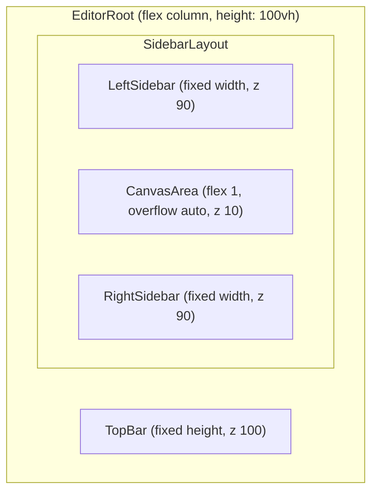

# Navigator UI Layout Audit and Cleanup Plan

## STEP 1 — Layout containers scanned

**Files and roles:**

| File                                                                                                           | Role                                                                                                                                                                         |
| -------------------------------------------------------------------------------------------------------------- | ---------------------------------------------------------------------------------------------------------------------------------------------------------------------------- |
| [src/app/layout.tsx](src/app/layout.tsx)                                                                       | Root layout for /dev: renders `RootLayoutBody` with **app-chrome** (black bar), optional **app-section-layout-panel**, and **app-content** (wraps dev page).                 |
| [src/app/dev/layout.tsx](src/app/dev/layout.tsx)                                                               | Dev route wrapper: flex row with **PipelineDiagnosticsRail** | main area | **RightFloatingSidebar**. Rail and right sidebar are **portaled to `document.body`**.             |
| [src/app/dev/page.tsx](src/app/dev/page.tsx)                                                                   | Renders screen content inside **PreviewStage** (TSX or JSON); sets dev sidebar props; no direct layout structure.                                                            |
| [src/04_Presentation/components/stage/PreviewStage.tsx](src/04_Presentation/components/stage/PreviewStage.tsx) | Device preview shell (desktop/tablet/phone/phoneGrid); adds padding (20px), minHeight 100vh, canvas background.                                                              |
| [src/03_Runtime/engine/core/ExperienceRenderer.tsx](src/03_Runtime/engine/core/ExperienceRenderer.tsx)         | Wraps JsonRenderer; uses flex column + inner scroll div; learning/app use sticky progress/footer.                                                                            |
| [src/03_Runtime/engine/core/json-renderer.tsx](src/03_Runtime/engine/core/json-renderer.tsx)                   | Renders JSON tree; no layout chrome (flex column root, no absolute).                                                                                                         |
| [src/app/ui/control-dock/PipelineDiagnosticsRail.tsx](src/app/ui/control-dock/PipelineDiagnosticsRail.tsx)     | **Left rail**: `createPortal(..., document.body)`, **position: fixed**, left: 0, top: 0, height: 100vh, **zIndex: 500**.                                                     |
| [src/app/ui/control-dock/RightFloatingSidebar.tsx](src/app/ui/control-dock/RightFloatingSidebar.tsx)           | **Right sidebar**: `createPortal(..., document.body)`, **position: fixed**, right: 0, top: 0, height: 100vh, **zIndex: 999999**.                                             |
| [src/07_Dev_Tools/styles/site-theme.css](src/07_Dev_Tools/styles/site-theme.css)                               | **.app-chrome**: sticky, top: 0, **z-index: 1000**; **.app-section-layout-panel**: sticky, top: 0, **z-index: 0**; **.app-content**: relative, z-index: 0, overflow visible. |
| [src/app/components/CascadingScreenMenu.tsx](src/app/components/CascadingScreenMenu.tsx)                       | Screen dropdown: trigger zIndex 60, panel **position: absolute**, **zIndex: 9999**.                                                                                          |

**Current DOM (simplified) when dev mode:**

- **body**: root div (from layout) + portal(left rail) + portal(right sidebar).
- **Root div**: DevHome, then [dev] wrapper > **app-chrome**, [dev] **app-section-layout-panel**, **app-content**.
- **app-content** (dev): flex div from dev layout; middle cell contains **page content** (PreviewStage, etc.). Rail and right sidebar are not in this tree (portaled).

---

## STEP 2 — Layout failures identified

### 1. **Left rail draws on top of the black header bar**

- **Cause**: Left rail is portaled to body with **z-index: 500**. App-chrome is inside the root div (no z-index on root). Root is a stacking context sibling to the portals; its effective order is below the left rail (500). So the rail paints over the chrome.
- **CSS cause**: Sibling stacking: root (auto) vs fixed rails (500 and 999999). Chrome (z 1000) only wins inside root; it cannot out-rank the portaled rail.

### 2. **Top navigation bar can be covered by the right sidebar**

- **Cause**: Right sidebar uses **z-index: 999999**, higher than app-chrome’s 1000. When both are visible, the sidebar overlaps the top bar.
- **CSS cause**: Same sibling relationship; right portal wins.

### 3. **Black header bar stacking not guaranteed**

- **Cause**: App-chrome uses **position: sticky** and z-index: 1000 but lives inside the root. Portaled UI (rails) are siblings to root with higher z, so the bar does not form a reliable top layer.
- **CSS cause**: Sticky + z-index only orders within the root; it does not raise the bar above body-level fixed elements.

### 4. **Section layout panel (VerticalSpacingReport) behind other content**

- **Cause**: **.app-section-layout-panel** has **z-index: 0** and **position: sticky**. It can go behind the chrome or other in-flow content depending on paint order.
- **CSS cause**: z-index: 0 and sticky without a clear stacking role.

### 5. **Scroll behavior: multiple scroll containers**

- **Cause**: **.app-content** has **overflow: visible** (and overflowX: hidden). Inner structure in layout.tsx uses **position: absolute; inset: 0** on **.stage-center** and a child with **overflowY: auto**. So the document (body) can still scroll when content is tall, and there is also an inner scroll in the stage. Dev-mobile CSS sets **.app-content** to overflow-y: auto, adding another scroll layer.
- **CSS cause**: No single “editor viewport”; mix of body scroll and inner overflow-y: auto, plus absolute positioning for the stage.

### 6. **Dev toolbar (DevicePreviewToggle, etc.) can “disappear” when scrolling**

- **Cause**: App-chrome is **sticky**, so it only sticks within its scroll-containing ancestor. If the effective scroll is on body and the chrome’s containing block is not the viewport, sticky behavior can make the bar scroll away in some cases. Also, if the left rail covers the bar (see #1), the bar appears hidden.
- **CSS cause**: Sticky containment + stacking (rail on top).

### 7. **Right debug sidebar: text overflow and layout push**

- **Cause**: Right sidebar panel uses **overflowY: auto** and **overflowX: visible** on [data-dev-panel-content]. Long paths or debug text can overflow horizontally (overflowX: visible) and there is a duplicate “DEV SIDEBAR (DEBUG)” header block and malformed JSX in [RightFloatingSidebar.tsx](src/app/ui/control-dock/RightFloatingSidebar.tsx) (lines 263–270: duplicate `data-dev-right-sidebar-open`, orphan `>`, duplicate hamburger block) that suggest layout/structural noise.
- **CSS cause**: Panel width fixed; content not constrained (word-break/overflow) so text can push or spill.

### 8. **Drop-down menus (CascadingScreenMenu) stacking**

- **Cause**: Dropdown panel uses **zIndex: 9999** and is inside the root. Portaled right sidebar has z 999999, so the dropdown can appear **behind** the right sidebar.
- **CSS cause**: Dropdown’s z-index is effective only within root; it cannot beat the right sidebar’s body-level 999999.

### 9. **Panels not respecting a single editor grid**

- **Cause**: Layout is not a single full-height grid. Top bar and section panel are in flow; app-content is a sibling; sidebars are portaled and fixed full height. Center “canvas” is inside app-content with absolute positioning (stage-center). No explicit grid/flex that defines TopBar | SidebarLayout (Left | Canvas | Right) with one scroll area.
- **CSS cause**: No EditorRoot with flex column + flex row and a single scroll container for the canvas.

### 10. **PreviewStage / page injecting padding into editor stage**

- **Cause**: [PreviewStage.tsx](src/04_Presentation/components/stage/PreviewStage.tsx) applies **padding: 20** and **minHeight: 100vh** on the canvas outer div. This is intentional for the preview frame but effectively injects padding into the editor stage.
- **CSS cause**: Inline style on the wrapper; can be kept but documented as “preview chrome” so layout calculations account for it.

---

## STEP 3 — Stable editor layout architecture

**Target structure (Figma/Webflow style):**

**Rules:**

- **No absolute positioning for layout** — use flex (or grid) only for the editor shell.
- **Explicit z-index layers**: TopBar = 100, Sidebars = 90, Canvas = 10, Dropdowns/Overlays = 200.
- **Sidebars must never overlap the TopBar** — TopBar always on top (z 100 > 90).
- **Only CanvasArea scrolls** — TopBar and sidebars fixed in place (flex children, not scrollable).
- **Single viewport height** — EditorRoot height 100vh so the center can use flex: 1 and overflow: auto.

**Two implementation options:**

- **A (recommended):** Keep sidebars as body portals for now. Add an **EditorRoot** wrapper (flex column, 100vh) that contains: (1) TopBar row with explicit height and z-index 100, (2) Content row (flex 1, minHeight 0) containing a single scrollable canvas area. Give the main content div (canvas area) left/right margin (or padding) equal to rail width and right sidebar width so content doesn’t sit under the overlays. Set left rail and right sidebar to **top: [TopBar height]** and **height: calc(100vh - TopBar height)** and **z-index: 90** so they sit below the bar and don’t cover it.
- **B:** Move sidebars out of portals and into the React tree as EditorRoot’s children (TopBar | SidebarLayout with LeftSidebar | CanvasArea | RightSidebar). Single flex layout, no body portals for layout. Larger refactor but one source of truth for layout.

---

## STEP 4 — Z-index layering (explicit)

| Layer                | z-index | Elements                                                                   |
| -------------------- | ------- | -------------------------------------------------------------------------- |
| Canvas               | 10      | Center scrollable area (or root content div if not using overlay sidebars) |
| Sidebars             | 90      | PipelineDiagnosticsRail, RightFloatingSidebar                              |
| TopBar               | 100     | app-chrome (black bar)                                                     |
| Dropdowns / overlays | 200     | CascadingScreenMenu panels, any modal/menu                                 |

**Changes:**

- In [site-theme.css](src/07_Dev_Tools/styles/site-theme.css): keep or set `.app-chrome` to **z-index: 100** (or ensure the TopBar wrapper has 100).
- In [PipelineDiagnosticsRail.tsx](src/app/ui/control-dock/PipelineDiagnosticsRail.tsx): fixed rail **z-index: 90**; optionally **top: 56px** (or CSS var for bar height) and **height: calc(100vh - 56px)** so it doesn’t cover the bar.
- In [RightFloatingSidebar.tsx](src/app/ui/control-dock/RightFloatingSidebar.tsx): fixed sidebar **z-index: 90**; same **top** and **height** as left rail so it stays below the bar.
- In [CascadingScreenMenu.tsx](src/app/components/CascadingScreenMenu.tsx): dropdown panel **z-index: 200** so it’s above TopBar and sidebars. Consider rendering the menu in a portal so it’s under body and its z-index 200 is globally above 90/100.

---

## STEP 5 — Scroll behavior

- **EditorRoot**: flex column, **height: 100vh**, overflow hidden.
- **TopBar**: flex-shrink: 0, fixed height (e.g. 56px).
- **Content row**: flex: 1, minHeight: 0, display flex, flexDirection: row (or single canvas div with margin for sidebars).
- **CanvasArea**: flex: 1, minWidth: 0, **overflow: auto** (only this region scrolls).
- Remove or avoid **overflow-y: visible** on the main content wrapper so the only scroll is inside CanvasArea. In [layout.tsx](src/app/layout.tsx), the div that wraps the stage (and has overflowY: auto) should be the single scroll container; ensure the outer app-content does not introduce a second scroll (e.g. overflow: hidden on app-content when in dev editor mode).

---

## STEP 6 — Debug sidebar cleanup

- In [RightFloatingSidebar.tsx](src/app/ui/control-dock/RightFloatingSidebar.tsx):
  - Fix JSX: remove duplicate `data-dev-right-sidebar-open` and orphan `>` (lines 265–270); remove duplicate “DEV SIDEBAR (DEBUG)” block and duplicate dev-mobile hamburger block if present.
  - Panel content: set **overflow-x: hidden** and **word-break: break-word** (or **overflow-wrap: break-word**) on [data-dev-panel-content] so long text doesn’t overflow or push layout.
  - Enforce **max-width: 100%** and **min-width: 0** on the panel so flex doesn’t grow past the sidebar width.
  - Keep **overflow-y: auto** on the panel body so only the panel scrolls.

---

## STEP 7 — Editor toolbar (device preview in TopBar)

- **Current**: [DevicePreviewToggle](src/07_Dev_Tools/dev/DevicePreviewToggle.tsx) already lives in app-chrome (layout.tsx) with Desktop / Tablet / Phone / Phone Grid; [EditorPreviewToggle](src/07_Dev_Tools/editor/EditorPreviewToggle.tsx) is there as well.
- **Improvement**: Replace any “rough” controls with a clean icon toolbar in the TopBar:
  - **Desktop** — monitor icon; **Tablet** — tablet icon; **Phone** — phone icon; **Phone grid** — grid-of-phones icon.
  - Icons in TopBar, selected mode visually highlighted (e.g. filled vs outline, or background).
- **Files**: [DevicePreviewToggle.tsx](src/07_Dev_Tools/dev/DevicePreviewToggle.tsx) (use icons; keep same store/API); optionally [site-theme.css](src/07_Dev_Tools/styles/site-theme.css) or a small TopBar component for spacing/alignment. Reuse existing `getDevicePreviewMode` / `setDevicePreviewMode` and device-preview-store.

---

## STEP 8 — Implementation plan and files to modify

### Layout problems summary

- Left rail (z 500) and right sidebar (z 999999) portaled to body; app-chrome (z 1000) inside root → **chrome can sit behind rails**.
- Right sidebar z 999999 → **overlaps TopBar**.
- Section layout panel z 0 → **can sit behind other content**.
- Multiple scroll containers (body + inner stage) → **toolbar can “disappear” and behavior is inconsistent**.
- Dropdown z 9999 inside root → **can sit behind right sidebar**.
- Right sidebar: **text overflow**, **duplicate/malformed JSX**, no single scroll region for panel content.
- No single **EditorRoot** with TopBar + SidebarLayout + one scrollable Canvas.

### Target editor layout structure

- **EditorRoot**: flex column, height 100vh, overflow hidden.
- **TopBar**: fixed height, z 100.
- **Sidebars**: fixed, z 90, top = TopBar height, height = calc(100vh - TopBar height).
- **CanvasArea**: flex 1, overflow auto, z 10; only this scrolls.
- **Dropdowns**: z 200 (and consider portal for menu).

### Files to modify

| File                                                                                                       | Changes                                                                                                                                                                                                                                         |
| ---------------------------------------------------------------------------------------------------------- | ----------------------------------------------------------------------------------------------------------------------------------------------------------------------------------------------------------------------------------------------- |
| [src/app/layout.tsx](src/app/layout.tsx)                                                                   | Wrap dev UI in EditorRoot (flex column, 100vh). TopBar in first row; content row with canvas area (flex 1, overflow auto). Add left/right margin to canvas for sidebar widths when sidebars are open. Optionally pass TopBar height as CSS var. |
| [src/07_Dev_Tools/styles/site-theme.css](src/07_Dev_Tools/styles/site-theme.css)                           | Set .app-chrome z-index to 100. Ensure .app-content in dev has overflow hidden where appropriate; .app-section-layout-panel z-index raised to sit above canvas (e.g. 50) if it should stay visible when sticky.                                 |
| [src/app/ui/control-dock/PipelineDiagnosticsRail.tsx](src/app/ui/control-dock/PipelineDiagnosticsRail.tsx) | z-index 90. top: 56px (or var), height: calc(100vh - 56px).                                                                                                                                                                                     |
| [src/app/ui/control-dock/RightFloatingSidebar.tsx](src/app/ui/control-dock/RightFloatingSidebar.tsx)       | z-index 90. top/height same as left rail. Fix JSX (duplicate attributes and duplicate blocks). Panel content: overflow-x hidden, word-break, min-width 0.                                                                                       |
| [src/app/components/CascadingScreenMenu.tsx](src/app/components/CascadingScreenMenu.tsx)                   | Dropdown panel z-index 200; consider createPortal to document.body so it stacks above sidebars.                                                                                                                                                 |
| [src/07_Dev_Tools/dev/DevicePreviewToggle.tsx](src/07_Dev_Tools/dev/DevicePreviewToggle.tsx)               | Replace text buttons with icon toolbar (Desktop, Tablet, Phone, Phone grid); highlight selected mode.                                                                                                                                           |
| [src/app/dev/layout.tsx](src/app/dev/layout.tsx)                                                           | Optional: simplify to a single “canvas” slot if EditorRoot is moved to root layout; otherwise keep as-is and rely on root layout + sidebar positioning.                                                                                         |

### Implementation order

1. **Z-index and TopBar dominance** — Set TopBar (app-chrome) to z 100, sidebars to z 90 and position below the bar (top + height). Verify no overlapping.
2. **RightFloatingSidebar** — Fix JSX and panel overflow/word-break; set z 90 and top/height.
3. **PipelineDiagnosticsRail** — z 90, top 56px, height calc(100vh - 56px).
4. **EditorRoot and scroll** — In root layout, add EditorRoot (100vh, flex column); make only the canvas area scroll (overflow auto); add canvas margin for sidebars.
5. **Dropdowns** — CascadingScreenMenu panel z 200 and optionally portal.
6. **Section panel** — Adjust z-index if it should stay above canvas when sticky.
7. **DevicePreviewToggle** — Icon toolbar and selected state.

---

## Confirmation (post-implementation)

After implementation:

- **Layout problems list** — Addressed by: TopBar z 100 and sidebars z 90 with top/height; single scroll in CanvasArea; dropdown z 200; right sidebar JSX and overflow fixed.
- **New editor layout** — EditorRoot (100vh) → TopBar (fixed) + content row → canvas (scroll) with margins for sidebars; sidebars fixed below bar.
- **Files modified** — As in the table above.
- **Navigator UI** — Clean and stable: no overlapping panels, no clipped controls, predictable stacking and scroll.

