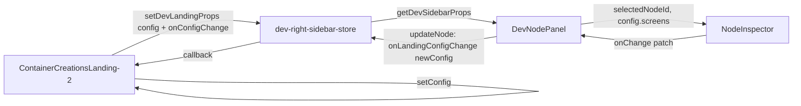

# Complete Node Editor System

## Step 1 — Analysis (confirmed, no changes)

**Nodes source:** `landingConfig.screens` from [dev-right-sidebar-store.ts](src/app/ui/control-dock/dev-right-sidebar-store.ts) (`LandingConfig.screens`). The landing page passes config via `setDevLandingProps("container-creations-landing", config)` in [ContainerCreationsLanding-2.tsx](src/01_App/(live)%20Business/Container_Creations/ContainerCreationsLanding-2.tsx) (useEffect around lines 406–410).

**DevNodePanel:** [DevNodePanel.tsx](src/04_Presentation/components/organs/tsx/website/DevNodePanel.tsx) subscribes to `getDevSidebarProps()` and `getOverride(screenPath)`. For landing config it renders `LandingConfigNodes` with `config={props.landingConfig}`, `orderOverride={override}`, `onReorder={(newOrder) => setOverride(screenPath, newOrder)}`. Reordering uses [node-order-override-store.ts](src/04_Presentation/components/organs/tsx/website/node-order-override-store.ts) (`setOverride`). This logic stays as-is.

---

## Step 2 — Node selection in DevNodePanel

**File:** [DevNodePanel.tsx](src/04_Presentation/components/organs/tsx/website/DevNodePanel.tsx)

- Add local state: `const [selectedNodeId, setSelectedNodeId] = useState<string | null>(null)`.
- In the **LandingConfigNodes** branch, pass `selectedNodeId`, `onSelectNode: setSelectedNodeId` into the list (or inline the list in `DevNodePanel` and add click handler there). The reorderable row `div` gets `onClick={() => setSelectedNodeId(screen.id)}` and a visual highlight when `screen.id === selectedNodeId` (e.g. border/background using existing CSS variables like `var(--color-border)`, `var(--color-surface-1)`).
- Keep `LandingConfigNodes` as the reorderable list; either lift selection state and handlers into it via props or move the row rendering into the parent so selection lives in one place. Minimal approach: add optional props `selectedNodeId?: string | null` and `onSelectNode?: (id: string) => void` to `LandingConfigNodes`, and use them on the row wrapper.

---

## Step 3 — NodeInspector component

**New file:** `src/app/ui/control-dock/node-editor/NodeInspector.tsx`

- **Props:** `node` (single screen object), `onChange: (patch: Partial<EditableNode>) => void`. Define an `EditableNode` type that includes at least: `id`, `title`, `subtitle?`, `layout`, `nextScreenId?`, `buttons` (array of `{ type, label?, target? }`), and `content` (array of blocks with `type`, `text?`, etc.). Use types compatible with the store’s `LandingConfig` and the landing’s `Screen` (store uses `[key: string]: unknown` so full screen shape is available at runtime).
- **Editable fields and controls:**
  - **Title:** `<input value={node.title ?? ""} onChange={...} />`
  - **Subtitle:** `<textarea value={node.subtitle ?? ""} onChange={...} />`
  - **Layout:** `<select value={node.layout}>` with options from known layouts (e.g. `hero`, `stamped`, `twoCol`, `twoColImageLeft`, `textOnly` if used).
  - **Next screen:** `<select value={node.nextScreenId ?? ""}>` with options from a list of screen ids (pass `screenIds: string[]` as prop or derive from parent).
  - **Buttons:** list of button objects; each row: label input, target input (for `goto`), type if needed. `onChange` receives a patch that can include `buttons: [...]`.
  - **Content blocks:** simple list/edit for `content[]` (e.g. paragraph `text`); at minimum support editing `text` for `paragraph` and `heading` blocks.
- Style with the same panel styling as the rest of the dev sidebar (e.g. from [RightFloatingSidebar.tsx](src/app/ui/control-dock/RightFloatingSidebar.tsx) GOOGLE / CSS variables). No new design system.

---

## Step 4 — Render NodeInspector in DevNodePanel

**File:** [DevNodePanel.tsx](src/04_Presentation/components/organs/tsx/website/DevNodePanel.tsx)

- When `isLandingConfig && props.landingConfig` and `selectedNodeId` is set:  
`const node = props.landingConfig.screens.find(s => s.id === selectedNodeId)`.
- If `node` exists, render below the list (or in a second column/section):

```tsx
<NodeInspector
  node={node}
  screenIds={props.landingConfig.screens.map(s => s.id)}
  onChange={(patch) => updateNode(selectedNodeId!, patch)}
/>
```

- `updateNode` is implemented in Step 5. Only show NodeInspector when **editor mode** is active (subscribe to `getEditorMode` from [editor-mode-store.ts](src/07_Dev_Tools/editor/editor-mode-store.ts)); in preview mode do not render NodeInspector (per Step 7).

---

## Step 5 — Implement updateNode and wire config updates

**File:** [dev-right-sidebar-store.ts](src/app/ui/control-dock/dev-right-sidebar-store.ts)

- Add to `DevSidebarPropsFromPage`: `onLandingConfigChange?: (config: LandingConfig) => void`.
- Extend `setDevLandingProps` to accept an optional third argument:  
`setDevLandingProps(screenPath: string, config: LandingConfig, onConfigChange?: (config: LandingConfig) => void)`. When provided, set `current.onLandingConfigChange = onConfigChange` (merge into `current` like other props).

**File:** [ContainerCreationsLanding-2.tsx](src/01_App/(live)%20Business/Container_Creations/ContainerCreationsLanding-2.tsx)

- In the `useEffect` that calls `setDevLandingProps`, pass a callback that updates local state:  
`setDevLandingProps("container-creations-landing", config, (newConfig) => setConfig(newConfig))`. Use the same `LandingConfig` type so the landing’s state stays in sync.

**File:** [DevNodePanel.tsx](src/04_Presentation/components/organs/tsx/website/DevNodePanel.tsx)

- Implement `updateNode(nodeId: string, patch: Partial<LandingFlowScreen> & Record<string, unknown>)`:  
  - Read `config = props.landingConfig` and `onChange = props.onLandingConfigChange`. If either is missing, return.  
  - `newScreens = config.screens.map(s => s.id === nodeId ? { ...s, ...patch } : s)`.  
  - Call `onChange({ ...config, screens: newScreens })`.  
  This updates the in-memory config; the landing’s `setConfig` runs and the preview re-renders immediately. Do not write JSON to disk.

---

## Step 6 — InlineEditableText component

**New file:** `src/app/ui/control-dock/node-editor/InlineEditableText.tsx` (or under `src/04_Presentation` if preferred for reuse)

- **Props:** `value: string`, `onChange: (value: string) => void`, `isEditing: boolean` (editor mode), optional `as`: `"span" | "p" | "h1" | "h2" | "h3"`, `className`, `style`.
- **Behavior:**  
  - If `!isEditing`: render the text in the chosen element (no input).  
  - If `isEditing`: render text; on click, switch to an `<input>` or `<textarea>` (for multiline) and focus; on blur or Enter, call `onChange` with the new value and switch back to text. Use local state for the “editing” and “draft value” so the parent only receives commits on blur/Enter.
- Use for **title**, **paragraph text**, and **button labels** in the landing screen render path in [ContainerCreationsLanding-2.tsx](src/01_App/(live)%20Business/Container_Creations/ContainerCreationsLanding-2.tsx). Pass `isEditing={isEditor}` and `onChange` callbacks that call a small helper (e.g. `updateScreenField(screenId, field, value)` or `updateScreenContent(screenId, blockIndex, value)`) that updates local `config` via `setConfig` with the same pattern as Step 5 (replace one screen or one content block in `screens` and set the new config). Ensure the landing’s `config` is the single source of truth; both the sidebar’s `updateNode` and inline edits update that same state via `setConfig` (sidebar updates come from `onLandingConfigChange` which the landing passes as `setConfig`).

---

## Step 7 — Editor vs Preview behavior

- **Editor mode:**  
  - Dev sidebar remains visible (already so in [dev/layout.tsx](src/app/dev/layout.tsx)).  
  - In DevNodePanel, show NodeInspector when a node is selected (only when `getEditorMode() === "editor"`).  
  - InlineEditableText is active (click to edit) when `isEditor` is true in the landing.
- **Preview mode:**  
  - Do not render NodeInspector (even if a node is selected).  
  - InlineEditableText renders as normal text only (`isEditing={false}`).  
  - Sidebar can stay open; only the inspector and inline editing are disabled.

Implement by: DevNodePanel subscribing to `subscribeEditorMode` / `getEditorMode` and rendering NodeInspector only when `editorMode === "editor"`. Landing already has `isEditor = (editorMode === "editor")`; pass that into InlineEditableText and into any wrapper that decides whether to show edit controls.

---

## Step 8 — No JSON write to disk

- All edits (NodeInspector + InlineEditableText) only update in-memory state (`setConfig` in the landing and the config held in the dev store via `setDevLandingProps`). Do not add any `fetch(PATCH)`, file write, or save-to-disk logic. A future “Save” could be added later.

---

## Data flow summary




---

## Files to create


| File                                                         | Purpose                                                                             |
| ------------------------------------------------------------ | ----------------------------------------------------------------------------------- |
| `src/app/ui/control-dock/node-editor/NodeInspector.tsx`      | Edit selected node: title, subtitle, layout, nextScreenId, buttons, content blocks. |
| `src/app/ui/control-dock/node-editor/InlineEditableText.tsx` | Click-to-edit text in editor mode; plain text in preview.                           |


---

## Files to modify


| File                                                                                                                | Changes                                                                                                                                                                                                                                 |
| ------------------------------------------------------------------------------------------------------------------- | --------------------------------------------------------------------------------------------------------------------------------------------------------------------------------------------------------------------------------------- |
| [dev-right-sidebar-store.ts](src/app/ui/control-dock/dev-right-sidebar-store.ts)                                    | Add `onLandingConfigChange` to type; extend `setDevLandingProps(path, config, onConfigChange?)`.                                                                                                                                        |
| [DevNodePanel.tsx](src/04_Presentation/components/organs/tsx/website/DevNodePanel.tsx)                              | Add `selectedNodeId` state; row click and highlight; subscribe to editor mode; render NodeInspector when node selected and editor mode; implement `updateNode` and pass to NodeInspector.                                               |
| [ContainerCreationsLanding-2.tsx](src/01_App/(live)%20Business/Container_Creations/ContainerCreationsLanding-2.tsx) | Pass `(newConfig) => setConfig(newConfig)` to `setDevLandingProps`; use InlineEditableText for title, paragraph text, and button labels where those are rendered, with `isEditor` and `onChange` that updates `config` via `setConfig`. |


---

## Editable fields (summary)

- **NodeInspector (sidebar):** title, subtitle, layout, nextScreenId, buttons (label, target per button), content blocks (e.g. paragraph text).
- **InlineEditableText (on canvas):** title, paragraph text, button labels (editor mode only).

---

## Post-implementation report (to produce after implementation)

- **Files created:** NodeInspector.tsx, InlineEditableText.tsx.
- **Files modified:** dev-right-sidebar-store.ts, DevNodePanel.tsx, ContainerCreationsLanding-2.tsx.
- **Editable fields:** as above.
- **How node editing works:** User selects a node in the Nodes panel; NodeInspector shows and edits that screen’s fields; changes are applied via `updateNode` → `onLandingConfigChange` → `setConfig` in the landing so the preview updates immediately. Inline edits on the landing use the same `setConfig` for title/paragraph/button label. All edits are in-memory only.

