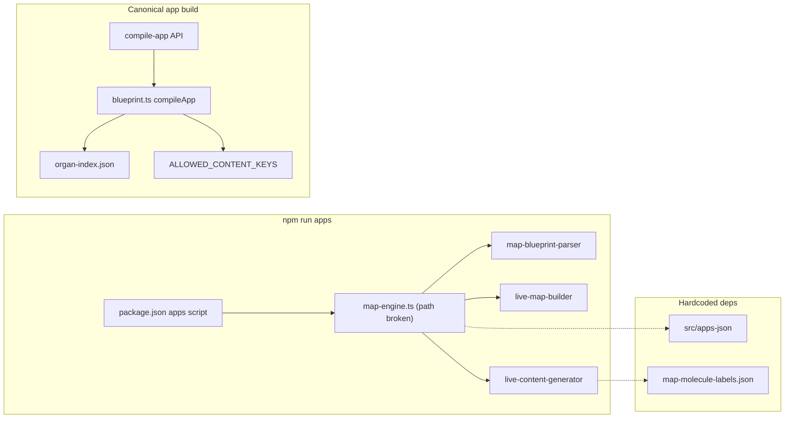

# npm run apps — Analyze and Harden (Enforcement Audit)

## Scope

- **npm run apps** (package.json): `ts-node src/map/engine/map-engine.ts` — **entry path is invalid**; implementation lives under `src/999_Cleanup/map-old/engine/`.
- **Canonical app compilation** used by the product: [src/07_Dev_Tools/scripts/blueprint.ts](src/07_Dev_Tools/scripts/blueprint.ts) `compileApp()` invoked via [src/app/api/compile-app/route.ts](src/app/api/compile-app/route.ts). Apps live under `src/01_App/(dead) Json/apps` (and `generated/`).
- This audit covers **both** the `npm run apps` script (map-engine) and the **app build pipeline** (blueprint + compile-app) that actually produces `app.json`.

---

## Phase 1 — Entry Point and Execution Chain

### 1.1 npm run apps (map-engine)

| Item                      | Value                                                                                                                                     |
| ------------------------- | ----------------------------------------------------------------------------------------------------------------------------------------- |
| **package.json script**   | `"apps": "ts-node src/map/engine/map-engine.ts"`                                                                                          |
| **Declared entry file**   | `src/map/engine/map-engine.ts`                                                                                                            |
| **Actual implementation** | [src/999_Cleanup/map-old/engine/map-engine.ts](src/999_Cleanup/map-old/engine/map-engine.ts) (path **mismatch** — script fails at invoke) |

**Execution chain:**

1. **map-engine.ts**
  - `APPS_ROOT = path.resolve(process.cwd(), "src/apps-json")` — directory does not exist at repo root (apps are under `src/01_App/(dead) Json/apps`).  
  - `fs.readdirSync(APPS_ROOT)` → list app dirs.  
  - For each app: read `blueprint.txt` → `parseBlueprint()` → `buildRuntime(tree)` → `generateContent(tree.nodes)`.
2. **map-blueprint-parser.ts**
  - `parseBlueprint(text)` → `BlueprintTree` (nodes keyed by id, edges array). No file I/O; parses line format `id | name | molecule [slots]` and `-> action target`.
3. **live-map-builder.ts**
  - `buildRuntime(tree)` → `{ flow, renderGraph }` (derived from tree.edges and tree.nodes). No file I/O.
4. **live-content-generator.ts**
  - `LABELS_PATH = path.resolve(process.cwd(), "src/map/map-molecule-labels.json")` — **file does not exist** (path is under removed `src/map`).  
  - `generateContent(nodes)` reads `LABELS_PATH` (will throw if run), then walks nodes and emits content lines using `LABELS[molecule]`.

**Functions invoked (order):**

- `runMapEngine()` → `readdirSync` → per app: `readFileSync(blueprint.txt)` → `parseBlueprint()` → `buildRuntime()` → `generateContent()` → `writeFileSync(map-flow.json)` → `writeFileSync(map-render-graph.json)` → `writeFileSync(content.txt)`.

**Files scanned (intended):**

- `src/apps-json/*/blueprint.txt` (per app dir).
- `src/map/map-molecule-labels.json` (single JSON; path invalid).

**Files written (per app):**

- `{appPath}/map-flow.json`
- `{appPath}/map-render-graph.json`
- `{appPath}/content.txt`

**Output shape:**

- **map-flow.json:** `Array<{ from, action, to }>`.
- **map-render-graph.json:** `Array<{ id, name, molecule, parentId, children }>`.
- **content.txt:** plain text lines (APP: Content + indented `id | name (molecule)` and slot stubs).

---

### 1.2 Canonical app build (blueprint.ts + compile-app)

| Item           | Value                                                                                                                             |
| -------------- | --------------------------------------------------------------------------------------------------------------------------------- |
| **Entry**      | `compileApp(appPath)` from [src/07_Dev_Tools/scripts/blueprint.ts](src/07_Dev_Tools/scripts/blueprint.ts).                        |
| **Invocation** | POST `/api/compile-app` with `{ action: "compile", appPath }`; appPath relative to `src/01_App/(dead) Json/apps` or `generated/`. |

**Execution chain:**

1. Read `blueprint.txt`, `content.txt` from app folder.
2. `loadOrganIndex()` from `src/07_Dev_Tools/scripts/organ-index.json`.
3. `parseBlueprint()` → raw nodes; `buildIdMaps()`; `validateOrganNodes()`; `parseContent()`; `generateContentManifest()`; `runValidation()`; `runContentSync()`; `buildTree()`.
4. Write `app.json`, `content.manifest.json`, optionally `validation-report.json`.

**Files scanned:** App dir `blueprint.txt`, `content.txt`; organ index JSON (single path).  
**Files written:** `app.json`, `content.manifest.json`, optional `validation-report.json`.

---

## Phase 2 — Discovery Audit

For **npm run apps** (map-engine) and the **blueprint/compile-app** pipeline:

| Discovery target                                        | npm run apps (map-engine) | Blueprint / compile-app | Proof (file paths)                                                                                                                                                                                                                                                                                                                                                                           |
| ------------------------------------------------------- | ------------------------- | ----------------------- | -------------------------------------------------------------------------------------------------------------------------------------------------------------------------------------------------------------------------------------------------------------------------------------------------------------------------------------------------------------------------------------------- |
| **Palettes** from `src/04_Presentation/palettes/*.json` | NO                        | NO (not used by script) | map-engine and blueprint do not import palettes. Runtime: [src/04_Presentation/palettes/index.ts](src/04_Presentation/palettes/index.ts) uses `require.context(".", false, /\.json$/)` — **fully auto** at runtime only.                                                                                                                                                                     |
| **Layout IDs** from layout JSON                         | NO                        | NO                      | map-engine has no layout concept. Blueprint uses node types and organ index only. Layout IDs come from [layout-definitions.json](src/04_Presentation/layout/data/layout-definitions.json) at runtime, not from this script.                                                                                                                                                                  |
| **Molecules** from filesystem                           | NO                        | PARTIAL                 | map-engine: molecule names come from blueprint text only. Blueprint: [blueprint.ts](src/07_Dev_Tools/scripts/blueprint.ts) lines 56–70 **ALLOWED_CONTENT_KEYS** hardcoded (button, avatar, chip, field, list, stepper, toast, toolbar, modal, section, footer, card). Molecules component map: [molecules/index.ts](src/04_Presentation/components/molecules/index.ts) manual COMPONENT_MAP. |
| **Organs** from filesystem                              | NO                        | PARTIAL                 | map-engine: no organs. Blueprint: reads [organ-index.json](src/07_Dev_Tools/scripts/organ-index.json) (single JSON); organ-index is **hand-maintained** (no script generates it from `organs/*/variants/*.json`). Runtime organs: [organ-registry.ts](src/04_Presentation/components/organs/organ-registry.ts) static imports + VARIANTS map — **manual**.                                   |
| **Engines** from registry                               | NO                        | NO                      | map-engine and blueprint do not load engines. Runtime: [engine-registry.ts](src/05_Logic/logic/engine-system/engine-registry.ts) and [system/registry/engineRegistry.ts](src/system/registry/engineRegistry.ts) — manual registration.                                                                                                                                                       |
| **Actions** from action-registry                        | NO                        | NO                      | [action-registry.ts](src/05_Logic/logic/runtime/action-registry.ts) — manual map; not discovered by apps script or blueprint.                                                                                                                                                                                                                                                                |
| **TSX wrapper types** from registry                     | NO                        | NO                      | [registry.tsx](src/03_Runtime/engine/core/registry.tsx) — manual type→component map; not used by map-engine or blueprint.                                                                                                                                                                                                                                                                    |
| **Blueprint node types**                                | PARTIAL                   | PARTIAL                 | map-engine: parsed from blueprint text (no fixed enum). Blueprint: type from line regex + ALLOWED_CONTENT_KEYS for content keys only; no single JSON-driven node-type catalog.                                                                                                                                                                                                               |
| **Contract types**                                      | NO                        | NO                      | No contract-type discovery in map-engine or blueprint.                                                                                                                                                                                                                                                                                                                                       |

**Summary:**

- **Fully auto:** Palettes at runtime only (palettes/index.ts); not used by npm run apps or blueprint.
- **PARTIAL:** Organs (blueprint uses organ-index.json; organ-index not auto-generated). Molecules (blueprint uses hardcoded ALLOWED_CONTENT_KEYS; molecules/index.ts manual).
- **NO (manual registry dependency):** Layout IDs (layout JSON exists but not “discovered” by apps script), engines, actions, TSX wrappers, contract types.

---

## Phase 3 — Registry Dependency Detection

Registries and lists that **npm run apps** (map-engine) or the **app build pipeline** (blueprint + compile-app) depend on, or that the **runtime** depends on to render those apps:

| Registry / list                           | Location                                                                                                                              | Required for build?                   | New component = code edit?                                             | Violates “no manual registry updates”? |
| ----------------------------------------- | ------------------------------------------------------------------------------------------------------------------------------------- | ------------------------------------- | ---------------------------------------------------------------------- | -------------------------------------- |
| **organ-index.json**                      | [src/07_Dev_Tools/scripts/organ-index.json](src/07_Dev_Tools/scripts/organ-index.json)                                                | Yes (blueprint: organ slots/variants) | Yes (add organ/variant → edit JSON + keep in sync with organ-registry) | Yes                                    |
| **organ-registry.ts**                     | [src/04_Presentation/components/organs/organ-registry.ts](src/04_Presentation/components/organs/organ-registry.ts)                    | Runtime only                          | Yes (import + VARIANTS + getOrganLabel)                                | Yes                                    |
| **Registry (type→component)**             | [src/03_Runtime/engine/core/registry.tsx](src/03_Runtime/engine/core/registry.tsx)                                                    | Runtime only                          | Yes                                                                    | Yes                                    |
| **molecules/index.ts COMPONENT_MAP**      | [src/04_Presentation/components/molecules/index.ts](src/04_Presentation/components/molecules/index.ts)                                | Runtime only                          | Yes                                                                    | Yes                                    |
| **action-registry.ts**                    | [src/05_Logic/logic/runtime/action-registry.ts](src/05_Logic/logic/runtime/action-registry.ts)                                        | Runtime only                          | Yes                                                                    | Yes                                    |
| **layoutThumbnailRegistry.ts**            | [src/app/ui/layoutThumbnailRegistry.ts](src/app/ui/layoutThumbnailRegistry.ts)                                                        | Dev UI only                           | Yes (SECTION/CARD/ORGAN_LAYOUT_THUMBNAILS)                             | Yes                                    |
| **Palette list in layout.tsx**            | [src/app/layout.tsx](src/app/layout.tsx) lines 81–91 `PALETTES` array                                                                 | Dev UI (picker)                       | Yes                                                                    | Yes (duplicate of palettes/*.json)     |
| **Engine registries**                     | [engine-registry.ts](src/05_Logic/logic/engine-system/engine-registry.ts), [engineRegistry.ts](src/system/registry/engineRegistry.ts) | Runtime / governance                  | Yes                                                                    | Yes                                    |
| **ALLOWED_CONTENT_KEYS** (blueprint)      | [blueprint.ts](src/07_Dev_Tools/scripts/blueprint.ts) lines 56–70                                                                     | Yes (content manifest + validation)   | Yes                                                                    | Yes                                    |
| **map-molecule-labels.json** (map-engine) | Referenced `src/map/map-molecule-labels.json` (missing)                                                                               | Would be required if map-engine ran   | N/A (file absent)                                                      | Yes (single hardcoded path)            |

**Conclusion:** Both the map-engine and the blueprint/compile-app pipeline rely on manual or single-file inputs; adding a new molecule, organ, or action requires code or JSON edits and violates “no manual registry updates” for those surfaces.

---

## Phase 4 — Enforcement Gaps (Invariants)

| Invariant                                       | Status        | Reason (file references)                                                                                                                                                                                                                                                                                                                                                                                      |
| ----------------------------------------------- | ------------- | ------------------------------------------------------------------------------------------------------------------------------------------------------------------------------------------------------------------------------------------------------------------------------------------------------------------------------------------------------------------------------------------------------------- |
| No hardcoding allowed                           | **VIOLATION** | ALLOWED_CONTENT_KEYS in [blueprint.ts](src/07_Dev_Tools/scripts/blueprint.ts); PALETTES in [layout.tsx](src/app/layout.tsx); LABELS_PATH in [live-content-generator.ts](src/999_Cleanup/map-old/engine/live-content-generator.ts); APPS_ROOT in map-engine and blueprint.                                                                                                                                     |
| TSX must be dumb wrappers                       | **COMPLIANT** | Molecules/organ TSX render from props/JSON; registry only maps type→component.                                                                                                                                                                                                                                                                                                                                |
| All structure must be JSON-driven               | **PARTIAL**   | Screen tree is JSON (app.json); layout IDs and molecule/organ catalogs are JSON or code maps; blueprint content keys are code.                                                                                                                                                                                                                                                                                |
| No registry edits required to add new component | **VIOLATION** | New molecule: edit [molecules/index.ts](src/04_Presentation/components/molecules/index.ts) and [registry.tsx](src/03_Runtime/engine/core/registry.tsx). New organ: edit [organ-registry.ts](src/04_Presentation/components/organs/organ-registry.ts) and [organ-index.json](src/07_Dev_Tools/scripts/organ-index.json). New action: edit [action-registry.ts](src/05_Logic/logic/runtime/action-registry.ts). |
| Palettes must be auto-discovered                | **PARTIAL**   | Runtime palettes are auto via [palettes/index.ts](src/04_Presentation/palettes/index.ts); [layout.tsx](src/app/layout.tsx) PALETTES array is a hardcoded duplicate for UI.                                                                                                                                                                                                                                    |
| Layouts must be auto-discovered                 | **PARTIAL**   | Layout definitions in JSON; [layoutThumbnailRegistry.ts](src/app/ui/layoutThumbnailRegistry.ts) and card/section presets in code are manual.                                                                                                                                                                                                                                                                  |
| Organs must be manifest-driven                  | **VIOLATION** | organ-registry.ts uses static imports and VARIANTS; organ-index.json is manual and not generated from filesystem or manifest.                                                                                                                                                                                                                                                                                 |
| Molecules must be manifest-driven               | **VIOLATION** | COMPONENT_MAP in molecules/index.ts is manual; blueprint ALLOWED_CONTENT_KEYS is code.                                                                                                                                                                                                                                                                                                                        |
| Engines must be pure and discoverable           | **PARTIAL**   | Engines are registered in code; system/registry has self-registration but runtime engine-registry is still manual.                                                                                                                                                                                                                                                                                            |
| Blueprint nodes switchable via content          | **PARTIAL**   | Node types come from blueprint text; content keys validated against ALLOWED_CONTENT_KEYS (hardcoded). No single JSON “blueprint node types” catalog.                                                                                                                                                                                                                                                          |

---

## Phase 5 — Required Changes to Reach 100% Enforcement

**Minimal changes (no system redesign, no doctrine rewrite, no runtime behavior refactor):**

### 5.1 Fix npm run apps script (map-engine)

- **Point script at existing file:** In [package.json](package.json), set `"apps"` to the actual path, e.g. `"ts-node src/999_Cleanup/map-old/engine/map-engine.ts"`, **or** move [src/999_Cleanup/map-old/engine/*.ts](src/999_Cleanup/map-old/engine/) to `src/map/engine/` and add `src/map` (or restore `src/apps-json`) so that `APPS_ROOT` and `LABELS_PATH` resolve.
- **APPS_ROOT:** Either align with canonical apps location (e.g. `src/01_App/(dead) Json/apps`) or document that `npm run apps` targets a different root and require that root to exist.
- **LABELS_PATH:** Replace hardcoded `src/map/map-molecule-labels.json` with a path derived from config or from a discovered manifest (e.g. scan molecules from a single JSON or from `molecules.json` keys); or remove content generation from map-engine if blueprint is the sole authority.

### 5.2 Registries to replace with auto-discovery (for enforcement)

- **organ-index.json:** Generate from filesystem or from a single manifest: scan `src/04_Presentation/components/organs/*/variants/*.json` (or a manifest that lists them) and emit `organ-index.json` in a build step; blueprint and compile-app keep reading the file but no hand edits.
- **ALLOWED_CONTENT_KEYS (blueprint):** Derive from [molecules.json](src/04_Presentation/components/molecules/molecules.json) (or a dedicated content-keys manifest) so adding a molecule type + keys doesn’t require editing blueprint.ts.
- **Palette list in layout.tsx:** Replace `PALETTES` with a list derived from `@/palettes` (or from `require.context` in a shared module) so one source of truth.
- **layoutThumbnailRegistry:** Optional: derive SECTION/CARD/ORGAN maps from layout JSON or a thumbnails manifest (path convention or manifest) so new layout IDs don’t require code edits.

### 5.3 Scripts to extend

- **npm run apps (map-engine):**  
  - Add optional discovery of app roots (e.g. env or config listing `src/01_App/(dead) Json/apps` and `generated/`).  
  - Optionally call or share logic with blueprint (e.g. emit content.manifest or validate against same organ/molecule catalog).
- **Build step for organ-index:** New script or existing script: scan organs (or read manifest) → write `organ-index.json`; run before compile or in CI so blueprint always sees up-to-date index.

### 5.4 Output structure npm run apps must produce

- **Current (map-engine):** Per app: `map-flow.json`, `map-render-graph.json`, `content.txt`.
- **Enforcement-friendly:** Either (a) keep this shape and document it as the “map” output, or (b) align with blueprint by also writing `app.json`/`content.manifest.json` via calling `compileApp()` for each app (then map-engine becomes a driver that discovers app dirs and runs compileApp). No duplicate competing shapes without clear ownership.

### 5.5 Refusal conditions

- **map-engine:** Refuse to run if APPS_ROOT does not exist or is empty (or if config is missing). Refuse to generate content if molecule labels source is missing or invalid.
- **blueprint (compileApp):** Already can throw on missing blueprint.txt; add: refuse if organ-index is required and missing or if organId not in index (configurable strict vs warn). Optionally refuse if ALLOWED_CONTENT_KEYS would be empty (derived from manifest).

### 5.6 Final compliance checklist

- package.json `"apps"` resolves to an existing entry file.
- map-engine APPS_ROOT and LABELS_PATH (or equivalent) are config-driven or convention-based, not hardcoded legacy paths.
- organ-index.json is generated from filesystem or manifest; no hand edits.
- ALLOWED_CONTENT_KEYS (or equivalent) is derived from molecules/manifest; no hardcoded map in blueprint.ts.
- Palette list in layout.tsx (or dev UI) comes from palettes index; no duplicate PALETTES array.
- Adding a new molecule does not require edits to blueprint.ts or molecules/index.ts (manifest + discovery).
- Adding a new organ/variant does not require edits to organ-registry.ts or organ-index.json (manifest + discovery or generated index).
- Refusal conditions documented and enforced for missing app root, missing labels/manifest, and (optional) strict organ/content validation.

---

## Diagram (Execution and dependency)

---

## Files to refactor (minimal set)

| File                                                                                                                                                         | Change                                                                                                      |
| ------------------------------------------------------------------------------------------------------------------------------------------------------------ | ----------------------------------------------------------------------------------------------------------- |
| [package.json](package.json)                                                                                                                                 | Fix `"apps"` script path to existing map-engine (or move map-engine under `src/map/engine/` and fix roots). |
| [src/999_Cleanup/map-old/engine/map-engine.ts](src/999_Cleanup/map-old/engine/map-engine.ts) or [src/map/engine/map-engine.ts](src/map/engine/map-engine.ts) | APPS_ROOT from env/config; optional integration with canonical apps path.                                   |
| [src/999_Cleanup/map-old/engine/live-content-generator.ts](src/999_Cleanup/map-old/engine/live-content-generator.ts)                                         | LABELS_PATH from config or derive from molecules manifest.                                                  |
| [src/07_Dev_Tools/scripts/blueprint.ts](src/07_Dev_Tools/scripts/blueprint.ts)                                                                               | Replace ALLOWED_CONTENT_KEYS with load from molecules.json or content-keys manifest.                        |
| [src/app/layout.tsx](src/app/layout.tsx)                                                                                                                     | Replace PALETTES array with import from palettes index.                                                     |
| New or existing script                                                                                                                                       | Generate organ-index.json from organs filesystem or manifest.                                               |

No redesign of doctrine, runtime, or app semantics—only path fixes, config/manifest-driven discovery, and the above refactors to satisfy the enforcement checklist.