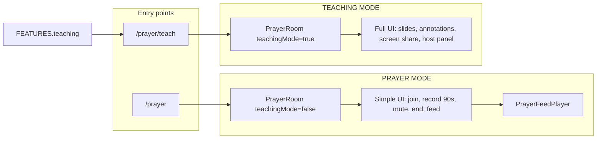

# Prayer Mode vs Teaching Mode — Implementation Plan

## Current state (summary)

- **PrayerApp** ([PrayerApp.tsx](src/01_App/Christian/Prayer/PrayerApp.tsx)): Root; derives `roomId` from slug when segment `"room"` exists; renders **PrayerRoom** for `/prayer/room/{id}` (or `/prayer/teach/room/{id}` once we add `teach`).
- **PrayerRoom** ([PrayerRoom.tsx](src/01_App/Christian/Prayer/PrayerRoom.tsx)): Single component for both “voice prayer” and “teaching”: WebRTC, **ModeratorPanel** (recording, publish, screen share, study pages, deck, annotations, export), content area (ScreenShareView, SlideViewer, SessionSlidesView, AnnotationOverlay), **PrayerRoomControls** (mute, host controls, end room).
- **Recording**: [useRoomRecording.ts](src/01_App/Christian/Prayer/room/useRoomRecording.ts) — no max duration; [PrayerRoomRecorder](src/01_App/Christian/Prayer/room/PrayerRoomRecorder.ts) used for MediaRecorder. Upload via existing `uploadPrayer` (FormData with audio, duration, roomId, etc.); [Prayer](src/01_App/Christian/Prayer/PrayerTypes.ts) already has `userId`, `roomId`, `audioUrl`, `duration`, `timestamp` (createdAt).
- **Feed / playback**: [MomentsSection](src/01_App/Christian/Prayer/moments/MomentsSection.tsx) lists prayers with per-item `<audio>`; no sequential “feed player”. [PrayerPlayer](src/01_App/Christian/Prayer/PrayerPlayer.tsx) has `onEnded`; used in main Pray view for a single prayer and in PlayerModule.
- **Routing**: [page.tsx](src/app/(domain)/[domain]/[[...path]]/page.tsx) rewrites `prayer` → `christian`, passes `appSlug` (leading `"prayer"` stripped). So `/prayer`, `/prayer/live`, `/prayer/room/xyz` become slug `[]`, `["live"]`, `["room", "xyz"]`. Adding `/prayer/teach` will yield slug `["teach"]`; `/prayer/teach/room/id` → `["teach", "room", "id"]`.

---

## Step 1 — Two feature modes (definition only)


| Mode              | Purpose                                                                                                                                                                             |
| ----------------- | ----------------------------------------------------------------------------------------------------------------------------------------------------------------------------------- |
| **PRAYER MODE**   | Primary: short voice prayers (60–90 s), upload/share, prayer feed, simple join room, mute/unmute, record, playback. No screen share, slides, annotations, or complex host controls. |
| **TEACHING MODE** | Secondary: screen share, slides, annotation tools, study pages, advanced host controls.                                                                                             |


No code change in this step; this is the contract for gating below.

---

## Step 2 — Feature flag

- **Add** a small feature module under Prayer, e.g. [src/01_App/Christian/Prayer/features.ts](src/01_App/Christian/Prayer/features.ts):

```ts
export const FEATURES = {
  prayer: true,
  teaching: false, // set true to enable /prayer/teach and full teaching UI in room
} as const;
```

- **Use** `FEATURES.teaching` to:
  - Show or hide the “Teach” / “Teaching” entry in the app nav (link to `/prayer/teach` only when `FEATURES.teaching`).
  - In **PrayerRoom**, decide whether to render teaching-only UI (moderator panel full features, content area, annotations, etc.): only when `teachingMode && FEATURES.teaching`.

Do not remove any teaching code; wrap it in conditionals so it is hidden when teaching is disabled.

---

## Step 3 — Simplify Prayer Room UI when in Prayer Mode

- **PrayerRoom** must accept a prop such as `teachingMode: boolean` (derived from route: slug includes `"teach"` and `FEATURES.teaching`).
- When `teachingMode === false`:
  - **Show**: Join prayer, Record prayer (with optional 60–90 s cap), Mute/Unmute, End prayer, and a way to “Listen to prayer feed” (link back to main app or to Moments).
  - **Hide** (do not render):
    - Full **ModeratorPanel** (or replace with a minimal host bar: mute self, end room, “Record prayer” / “Stop & publish” only — no screen share, study pages, deck, annotations, export).
    - Content area: **ScreenShareView**, **SlideViewer**, **SessionSlidesView**, **AnnotationOverlay**.
    - “Host controls” that open the full moderator panel; in prayer mode either hide the button or open a minimal panel only.
- When `teachingMode === true`: keep current behavior (full moderator panel, content area, annotations, etc.).

Implementation: in **PrayerRoom.tsx**, gate the existing blocks that render ModeratorPanel, content area (hasVisibleContent + screen share/slides/session slides/annotation), and the “Host controls” button in **PrayerRoomControls** with `teachingMode`. Optional: extract a minimal **PrayerRoomHostBar** (mute, end, record, publish) used only when `!teachingMode` and host.

---

## Step 4 — Prayer record flow (BeReal-style short prayer)

- **Data model**: Existing **Prayer** type and `/api/prayer` upload already support `userId`, `roomId`, `audioUrl`, `duration`, `timestamp` (e.g. `createdAt`). No schema change.
- **Recording cap**: In **useRoomRecording**, add an optional `maxDurationSec` (e.g. 90). When provided, use an effect so that when `recordDurationSec >= maxDurationSec` and status is `"recording"`, call `stop()`. **PrayerRoom** passes `maxDurationSec={90}` when `!teachingMode` (prayer mode).
- **Flow**: User clicks “Record prayer” → start recording → optional countdown/timer (e.g. 90 s) → auto-stop at 90 s or manual stop → “Upload prayer clip” reuses existing publish/upload (FormData with audio, duration, roomId, etc.). No new API; reuse `uploadPrayer` and existing prayer creation.

---

## Step 5 — Prayer feed player (sequential playback)

- **Add** a dedicated component, e.g. **PrayerFeedPlayer**, under Prayer (e.g. [src/01_App/Christian/Prayer/PrayerFeedPlayer.tsx](src/01_App/Christian/Prayer/PrayerFeedPlayer.tsx)):
  - Props: `prayers: Prayer[]`, optional `startIndex`, optional `onPrayerChange(index)`.
  - Internally: one **PrayerPlayer** (or existing player) for current prayer; on `onEnded` advance to next index and set `src` to next prayer’s `audioUrl`; state: `currentIndex`, `isPlaying`.
  - Controls: Play/Pause, Skip (next), optional “Play next” (same as skip). No dependency on slides, annotations, or teaching components.
- **Use** this component:
  - On the main “Pray” view: optionally show a “Prayer feed” strip or section that uses **PrayerFeedPlayer** with `allPrayers` (or a subset), so users can play Prayer 1 → 2 → 3 with pause/skip/next.
  - And/or from **MomentsSection**: add a “Play all” (or “Play feed”) that opens or focuses **PrayerFeedPlayer** with the moments list.

This keeps the feed player independent of the live teaching system.

---

## Step 6 — Keep teaching system available and hidden when teaching is off

- **Conditional rendering** (already implied in Step 3):
  - **ModeratorPanel** (full): only render when `teachingMode` (and optionally `FEATURES.teaching`).
  - Content area (screen share, SlideViewer, SessionSlidesView, AnnotationOverlay, VideoContentView for teaching): only when `teachingMode`.
  - **PrayerRoomControls**: pass a prop so “Host controls” (open moderator panel) is only shown when `teachingMode`; in prayer mode show only mute, end, and optional minimal “Record / Publish”.
- **No deletion**: All teaching code (slides, annotations, screen share, study pages, export, session replay) remains in the codebase; it is simply not rendered when `teachingMode === false`.

---

## Step 7 — Clean entry points

- **/prayer** (e.g. `/christian/prayer` after rewrite): Simple prayer experience. Slug `[]` or `["live"]`, `["moments"]`, etc. No `"teach"` in slug → `teachingMode = false` when entering a room from here. Room links from this path: `basePath + "/room/" + id` → `/prayer/room/{id}` (prayer mode).
- **/prayer/teach**: Full teaching/live room entry. Add `"teach"` to the reserved segments in **PrayerApp** (e.g. in `RESERVED` and in section/slug handling). When slug includes `"teach"` (e.g. `["teach"]` or `["teach", "room", "id"]`):
  - `teachingMode = true` for **PrayerRoom**.
  - Base for links: `prayerBase = basePath + "/teach"` so “Start room” from teach section goes to `/prayer/teach/room/{id}`.
- **PrayerApp** changes:
  - Compute `isTeachingRoute = slug?.includes("teach") ?? false` and `prayerBase = isTeachingRoute ?` ${basePath}/teach `: basePath`.
  - When rendering **PrayerRoom**, pass `teachingMode={isTeachingRoute && FEATURES.teaching}` and `prayerBase` (so back link and room URLs stay under `/prayer/teach` when in teach).
  - In top nav, show a “Teach” (or “Live teaching”) link to `prayerBase + "/teach"` only if `FEATURES.teaching`.
- **Domain page**: No change required; slug for `/prayer/teach` will be `["teach"]`, for `/prayer/teach/room/xyz` will be `["teach", "room", "xyz"]`. App loader key remains `Christian/prayer`; only slug content changes.

---

## Step 8 — Stability

- **Isolation**: When `!teachingMode`, teaching-only components are not mounted, so their failures (e.g. in slides or annotations) cannot crash the prayer room.
- **Recording**: Use existing try/catch in upload/publish; optional error boundary around the “Record / Publish” block in the minimal host bar so a recording/upload error does not take down the whole UI.
- **Feed player**: **PrayerFeedPlayer** uses only prayer list and audio URLs plus **PrayerPlayer**; no slides or annotation components, so playback works without the teaching system.
- **WebRTC / existing routes**: No changes to WebRTC hooks or API route signatures; only UI visibility and optional `maxDurationSec` in the existing recording hook.

---

## Step 9 — Output report

- **Generate** [PRAYER_MODE_IMPLEMENTATION_PLAN.md](src/01_App/Christian/Prayer/PRAYER_MODE_IMPLEMENTATION_PLAN.md) (in the Prayer folder) with:
  - **Gated components**: List (ModeratorPanel full UI, ScreenShareView, SlideViewer, SessionSlidesView, AnnotationOverlay, Host controls button, study/export in panel) and that they render only when `teachingMode && FEATURES.teaching`.
  - **Prayer recording**: Short flow (Record → optional 90 s cap → stop → upload via existing API); payload shape `{ userId, roomId, audioUrl, duration, timestamp }` (existing Prayer/API).
  - **Prayer feed playback**: **PrayerFeedPlayer** with sequential play, pause, skip, next; independent of teaching; where it’s used (main Pray and/or Moments).
  - **Teaching preserved**: All teaching code remains; visibility controlled by route and feature flag; entry via `/prayer/teach` and `/prayer/teach/room/{id}`.

---

## File-level checklist (no large moves)


| Action | File / location                                                                                                                                                                                                                          |
| ------ | ---------------------------------------------------------------------------------------------------------------------------------------------------------------------------------------------------------------------------------------- |
| Add    | `Prayer/features.ts` — `FEATURES = { prayer: true, teaching: false }`.                                                                                                                                                                   |
| Add    | `Prayer/PrayerFeedPlayer.tsx` — sequential feed player (play/pause, skip, next).                                                                                                                                                         |
| Add    | `Prayer/PRAYER_MODE_IMPLEMENTATION_PLAN.md` — report per Step 9.                                                                                                                                                                         |
| Edit   | `Prayer/PrayerApp.tsx` — `isTeachingRoute`, `prayerBase`, pass `teachingMode` and `prayerBase` to PrayerRoom; add “Teach” nav link when `FEATURES.teaching`; add `"teach"` to reserved/section handling.                                 |
| Edit   | `Prayer/PrayerRoom.tsx` — accept `teachingMode` (and optional `prayerBase` if not already); gate ModeratorPanel, content area, and Host controls; optional minimal host bar when `!teachingMode`.                                        |
| Edit   | `Prayer/PrayerRoomControls.tsx` — accept prop to hide “Host controls” when in prayer mode (e.g. `showHostControls?: boolean`).                                                                                                           |
| Edit   | `Prayer/room/useRoomRecording.ts` — optional `maxDurationSec`; effect to auto-stop when duration >= max.                                                                                                                                 |
| Edit   | `Prayer/live/LiveSection.tsx` (or equivalent) — when used under teach section, use `prayerBase` that includes `/teach` so “Start room” → `/prayer/teach/room/id`. (PrayerApp already passes `prayerBase`; ensure teach section uses it.) |


---

## Flow summary




- **Prayer mode**: Room shows only core controls; recording can be capped at 90 s; feed player plays list sequentially.
- **Teaching mode**: Same room component with full UI; entry only when `FEATURES.teaching` and path contains `teach`; no removal of existing behavior.

