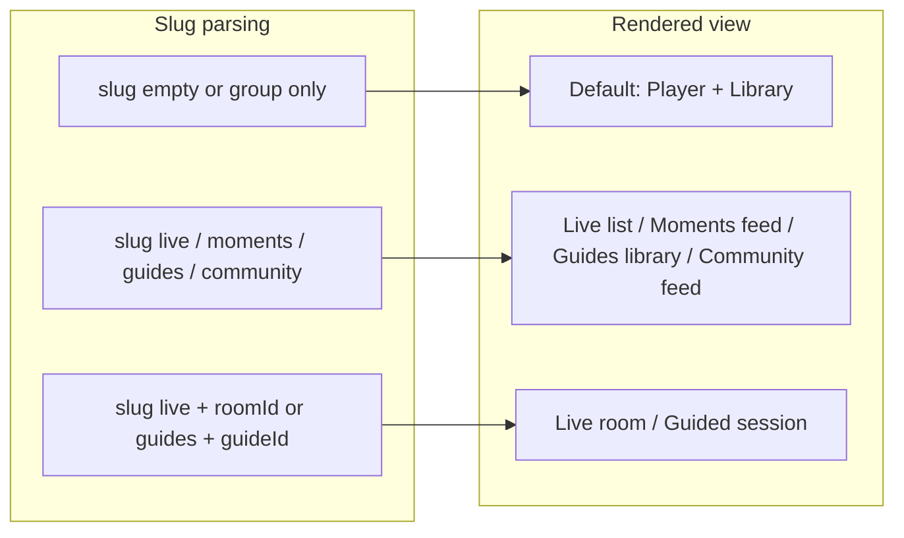

# Prayer Platform Full Upgrade — Build Plan

## Current state (preserved)

- **Entry**: `[src/app/prayer/[[...slug]]/page.tsx](src/app/prayer/[[...slug]]/page.tsx)` passes `slug` to `PrayerApp`.
- **Root UI**: `[PrayerApp.tsx](src/01_App/(live)` Gospel/Prayer/PrayerApp.tsx) — hero card, `PrayerPlayer`, metrics row, **current tabs** (Prayer, Discipleship, Scripture, Community), expandable prayer text, `PrayerLibrary`, share.
- **Player**: `[PrayerPlayer.tsx](src/01_App/(live)` Gospel/Prayer/PrayerPlayer.tsx) + `[PrayerWaveform.tsx](src/01_App/(live)` Gospel/Prayer/PrayerWaveform.tsx) — play/pause, seek, ±15s, speed, waveform; no changes to behavior.
- **Data**: `Prayer/data/prayers.json`, `groups.json`, `live-sessions.json`; APIs under `src/app/api/prayer/` read/write only under Gospel/Prayer.
- **Slug today**: `slug[0]` = group slug or prayer id or `admin`; `slug[1]` = prayer id or `groups` (admin). No `live` / `moments` / `guided` / `community` yet.

---

## 1. Live Prayer Rooms

**Purpose**: Host-led live audio (and later video) rooms; invite by link; multiple mics; host mute/unmute; optional recording → prayer replay.

**Routes**

- `/prayer/live` — list/start room (or redirect to room).
- `/prayer/live/[roomId]` — room page. With group: `/prayer/[groupSlug]/live`, `/prayer/[groupSlug]/live/[roomId]`.

**Components** (new under `Prayer/`)

- `live/LivePrayerRoom.tsx` — room container: participants, controls, optional video, embed recorder.
- `live/LiveRoomParticipants.tsx` — list of participants; host view shows mute/unmute.
- `live/LiveRoomControls.tsx` — mute self, leave, (host) end room, start/stop recording.
- `live/LiveRoomRecorder.tsx` — capture room audio (and later video); upload as prayer replay when session ends.

**Backend / real-time**

- **Signaling**: Lightweight signaling server (e.g. Node/Next API route with WebSockets or Server-Sent Events) for SDP/ICE. Alternative: use a small WebRTC signaling service (e.g. PeerJS server or custom WS in `src/app/api/`).
- **WebRTC**: Peer connections for audio (and later video); limit active microphones (e.g. max 6–8); unlimited listeners via single “mixed” stream or listen-only role.
- **Storage**: Room metadata and recording metadata in `Prayer/data/` (e.g. `live-rooms.json`, recordings referenced from `prayers.json` as `contentType: "prayer"` with `source: "live-replay"`).

**File structure**

- `src/01_App/(live) Gospel/Prayer/live/LivePrayerRoom.tsx`
- `src/01_App/(live) Gospel/Prayer/live/LiveRoomParticipants.tsx`
- `src/01_App/(live) Gospel/Prayer/live/LiveRoomControls.tsx`
- `src/01_App/(live) Gospel/Prayer/live/LiveRoomRecorder.tsx`
- `src/01_App/(live) Gospel/Prayer/api/live-api.ts` (create room, get room, join, leave, list)
- API routes: e.g. `src/app/api/prayer/live/route.ts`, `src/app/api/prayer/live/[roomId]/route.ts`; optional `src/app/api/prayer/live/signaling` (WebSocket or SSE) for signaling.

---

## 2. Guided Prayer

**Purpose**: Structured prompts with scripture, context, focus points, and suggested duration.

**Content model** (e.g. in `Prayer/data/guided-guides.json` or per-group)

- `id`, `title`, `scripture`, `context`, `focusPoints[]`, `suggestedMinutes`, `category`, `groupId?`.

**Routes**

- `/prayer/guides` — library of guides (and group-scoped: `/prayer/[groupSlug]/guides`).
- `/prayer/guides/[guideId]` — single guided session.

**Components**

- `guided/GuidedPrayerView.tsx` — display one guide: scripture, context, focus points, timer/suggested time.
- `guided/GuidedPrayerLibrary.tsx` — list/filter by category (Government, Persecuted Church, Family, Church, Community, Global Missions).
- `guided/GuidedPrayerSession.tsx` — run a session (show guide + optional timer; optional “I prayed” or completion).

**Admin**

- Create / edit / import guide (admin UI or API). Import = add from global library into group.

**Files**

- `src/01_App/(live) Gospel/Prayer/guided/GuidedPrayerView.tsx`
- `src/01_App/(live) Gospel/Prayer/guided/GuidedPrayerLibrary.tsx`
- `src/01_App/(live) Gospel/Prayer/guided/GuidedPrayerSession.tsx`
- `Prayer/data/guided-guides.json` (or API-backed); categories as in spec.

---

## 3. Prayer Moments

**Purpose**: Short user-recorded prayers (30–120 s); submit → appear in feed; optional delayed release (e.g. Morning / Afternoon / Evening “moment” slots).

**Flow**: Record → Submit → (optional) queue for slot → appear in feed when released.

**Components**

- `moments/PrayerMomentRecorder.tsx` — record 30–120 s, preview, submit (with optional slot).
- `moments/PrayerMomentFeed.tsx` — list of moments (by slot or chronological); no likes/ranking.
- `moments/PrayerMomentCard.tsx` — single moment: play button, duration, label (e.g. “Morning Prayer Moment”), optional submitter display name.

**Data**

- `Prayer/data/prayer-moments.json` or API; fields: `id`, `audioUrl`, `durationSeconds`, `slot?`, `releasedAt`, `groupId?`, `submitterDisplayName?`.

**Rules**: No likes, no ranking; focus on participation.

**Files**

- `src/01_App/(live) Gospel/Prayer/moments/PrayerMomentRecorder.tsx`
- `src/01_App/(live) Gospel/Prayer/moments/PrayerMomentFeed.tsx`
- `src/01_App/(live) Gospel/Prayer/moments/PrayerMomentCard.tsx`
- API: e.g. `POST/GET /api/prayer/moments` (and group-scoped).

---

## 4. Community Prayer Feed

**Purpose**: Prayer chain — multiple short prayers played sequentially; optional auto-play full chain.

**Components**

- `community/PrayerChainFeed.tsx` — list of chains or single chain’s items (each item: user/label + duration).
- `community/PrayerChainPlayer.tsx` — play list of clips in order; show “John – 0:52”, “Sarah – 1:12”, etc.; optional “Play entire chain” button.

**Data**

- Reuse or extend moments (chain = ordered list of moment IDs) or separate `prayer-chains.json`: `id`, `title`, `momentIds[]`, `groupId?`, `createdAt`.

**Files**

- `src/01_App/(live) Gospel/Prayer/community/PrayerChainFeed.tsx`
- `src/01_App/(live) Gospel/Prayer/community/PrayerChainPlayer.tsx`

---

## 5. Prayer Library (shared guides)

**Purpose**: Shared library of guided prayer guides; admins can import into their group.

**Routes**

- `/prayer/guides` (global library)
- `/prayer/guides/[guideId]` (view/use guide)
- Group: `/prayer/[groupSlug]/guides` (group’s imported + created guides).

**Categories**: Government, Persecuted Church, Family, Church, Community, Global Missions.

**Implementation**: Same as Guided Prayer (section 2); “library” = list of guides with category filter; “import” = copy guide into group’s guides.

---

## 6. Tab navigation update

**Current** (in `PrayerApp.tsx`): Prayer (active), Discipleship, Scripture, Community — last three link to `/gospel`.

**New tabs** (under the player, same row style in `prayer-theme.css`):

| Tab       | Purpose             | Link (no group)     | Link (group)                    |
| --------- | ------------------- | ------------------- | ------------------------------- |
| Prayer    | Daily prayer player | `/prayer`           | `/prayer/[groupSlug]`           |
| Live      | Live rooms          | `/prayer/live`      | `/prayer/[groupSlug]/live`      |
| Moments   | Short moments feed  | `/prayer/moments`   | `/prayer/[groupSlug]/moments`   |
| Guided    | Guided prayer       | `/prayer/guides`    | `/prayer/[groupSlug]/guides`    |
| Community | Prayer chains       | `/prayer/community` | `/prayer/[groupSlug]/community` |

- Tabs remain **under the player** (and under metrics).
- Active tab derived from current path (e.g. `slug` or `pathname`).
- **No removal of existing player**: “Prayer” tab keeps current behavior (latest/selected prayer + library).

**File to change**: `[PrayerApp.tsx](src/01_App/(live)` Gospel/Prayer/PrayerApp.tsx) — replace tab `<Link>`s and active logic; optionally extract `PrayerTabs.tsx` for clarity.

**Routing**: Extend slug handling so that:

- `slug = []` or `slug = [groupSlug]` → main Prayer (player) view.
- `slug = ['live']` or `['groupSlug','live']` → Live list; `slug = ['live', roomId]` or `['groupSlug','live', roomId]` → Room.
- `slug = ['moments']` or `['groupSlug','moments']` → Moments.
- `slug = ['guides']` or `['groupSlug','guides']`, `['guides', guideId]` → Guided.
- `slug = ['community']` or `['groupSlug','community']` → Community.

This may require rendering different content in `PrayerApp` by slug (or moving to a small router inside Prayer that picks Live/Moments/Guided/Community vs default player).

---

## 7. Integration with existing player

- **Prayer tab**: Keep current behavior: same `PrayerPlayer`, `PrayerLibrary`, metrics, share, expandable prayer text. No changes to `PrayerPlayer.tsx` or `PrayerWaveform.tsx` logic.
- **URLs**: Existing `/prayer`, `/prayer/[id]`, `/prayer/[groupSlug]`, `/prayer/[groupSlug]/[prayerId]`, `/prayer/admin`, `/prayer/admin/groups` remain valid.
- **APIs**: Existing `GET/POST /api/prayer`, `/api/prayer/audio`, `/api/prayer/listeners`, `/api/prayer/groups/`* unchanged. New routes live alongside (e.g. `/api/prayer/moments`, `/api/prayer/guides`, `/api/prayer/live/*`).
- **Theme**: All new components use `prayer-theme.css` and existing CSS variables (`--prayer-`*); same card, tabs, and layout patterns.
- **Group context**: When `groupSlug` is present, pass `groupId` (or group object) into new features so Live/Moments/Guided/Community are group-scoped when applicable.

---

## 8. Group integration

- **Paths**: `/prayer/calvary`, `/prayer/calvary/live`, `/prayer/calvary/moments`, etc., with `calvary` = group slug.
- **Admins**: Control who can record moments, host live rooms, submit prayers (via group settings or roles; stored in group or `groups.json`). Implementation can be minimal at first (e.g. “group member” vs “admin” only).
- **Data**: Moments, guides, chains, live rooms can have `groupId` to scope to group.

---

## 9. UI improvements

- **Waveform**: Ensure vertical bars (already drawn as vertical in `PrayerWaveform.tsx`); if “vertical bars” means a different style (e.g. thicker, more gap), adjust `barWidth`/`gap` and bar height in `PrayerWaveform.tsx` and/or `prayer-theme.css`.
- **Spacing**: Increase margin/padding between player, metrics row, tabs, and content sections in `prayer-theme.css` (e.g. `.prayer-metrics-row`, `.prayer-tabs`, section wrappers).
- **“Listening now”**: Visually highlight the “Listening now” metric when `liveCount > 0` (e.g. accent color, subtle pulse, or icon) via class and CSS.
- **Prayer text**: Keep collapsible; ensure toggle and block use existing `.prayer-text-section`, `.prayer-text-toggle`, `.prayer-text-block`.

---

## New files summary

| Area          | Files                                                                                                                                                                                                                                                   |
| ------------- | ------------------------------------------------------------------------------------------------------------------------------------------------------------------------------------------------------------------------------------------------------- |
| **Live**      | `Prayer/live/LivePrayerRoom.tsx`, `LiveRoomParticipants.tsx`, `LiveRoomControls.tsx`, `LiveRoomRecorder.tsx`, `api/live-api.ts`; `data/live-rooms.json`; API routes `api/prayer/live/route.ts`, `api/prayer/live/[roomId]/route.ts`, optional signaling |
| **Guided**    | `Prayer/guided/GuidedPrayerView.tsx`, `GuidedPrayerLibrary.tsx`, `GuidedPrayerSession.tsx`; `data/guided-guides.json`; API `api/prayer/guides/route.ts`, `api/prayer/guides/[id]/route.ts`                                                              |
| **Moments**   | `Prayer/moments/PrayerMomentRecorder.tsx`, `PrayerMomentFeed.tsx`, `PrayerMomentCard.tsx`; `data/prayer-moments.json`; API `api/prayer/moments/route.ts`                                                                                                |
| **Community** | `Prayer/community/PrayerChainFeed.tsx`, `PrayerChainPlayer.tsx`; optional `data/prayer-chains.json`; API if not reusing moments                                                                                                                         |
| **Shared**    | `Prayer/PrayerTabs.tsx` (optional); extend `PrayerTypes.ts` for Moment, Guide, Room, Chain                                                                                                                                                              |
| **Config**    | `Prayer/data/guided-guides.json`, `prayer-moments.json`, `live-rooms.json`                                                                                                                                                                              |

---

## Phase implementation order

1. **Phase 1 — Navigation**
  Update tabs in `PrayerApp.tsx` to Prayer | Live | Moments | Guided | Community; extend slug parsing and route to placeholder content for Live/Moments/Guided/Community; optional `PrayerTabs.tsx`. Ensure `/prayer` and `/prayer/[groupSlug]` still show current player.
2. **Phase 2 — Prayer Moments**
  Data model + API for moments; `PrayerMomentRecorder`, `PrayerMomentFeed`, `PrayerMomentCard`; wire `/prayer/moments` and `/prayer/[groupSlug]/moments`; delayed release slots optional.
3. **Phase 3 — Guided Prayer**
  Data model + API for guides; `GuidedPrayerView`, `GuidedPrayerLibrary`, `GuidedPrayerSession`; routes `/prayer/guides`, `/prayer/guides/[id]`; admin create/edit/import.
4. **Phase 4 — Community Prayer Feed**
  Chains (reuse or new store); `PrayerChainFeed`, `PrayerChainPlayer`; routes `/prayer/community`; auto-play full chain.
5. **Phase 5 — Live Prayer Rooms (audio)**
  Signaling + WebRTC audio-only; create/join room; `LivePrayerRoom`, `LiveRoomParticipants`, `LiveRoomControls`, `LiveRoomRecorder`; save recording as replay; routes `/prayer/live`, `/prayer/live/[roomId]`; limit mics, unlimited listeners.
6. **Phase 6 — Video upgrade**
  Add optional video to live rooms (camera tracks); same components, extended media constraints.

---

## Test checklist

- **Regression**
  - Play/pause, seek, ±15s, speed on existing prayer.
  - `/prayer`, `/prayer/[id]`, `/prayer/[groupSlug]`, `/prayer/admin`, `/prayer/admin/groups` unchanged.
  - Upload new prayer; appears in library; play from library.
  - Share URL and copy link still correct.
- **Navigation**
  - All five tabs present; active state matches route.
  - Prayer tab shows current player and Past Prayers.
  - Live / Moments / Guided / Community routes render correct views (and 404 or redirect when not implemented yet).
- **Moments**
  - Record 30–120 s; submit; appears in feed; no likes/ranking.
  - Delayed release (if implemented): moment appears at slot time.
- **Guided**
  - List guides by category; open guide; session shows scripture, context, focus points, suggested time.
  - Admin: create/edit/import guide.
- **Community**
  - View chain; play items in order; “Play entire chain” works.
- **Live (audio)**
  - Host creates room; invite link works; participant joins; multiple mics; host mute/unmute; recording saves as replay.
- **UI**
  - Waveform vertical bars; spacing between player, metrics, tabs, sections; “Listening now” highlighted when live > 0; prayer text collapsible.
- **Groups**
  - `/prayer/[groupSlug]/live`, `/moments`, `/guides`, `/community` scope correctly; admin controls (when implemented) apply.

---

## Deliverable 1: BUILD_PLAN.md

Create `**src/01_App/(live) Gospel/Prayer/BUILD_PLAN.md`** with the content above (sections 1–9, new files summary, phase order, test checklist), so the document is the single reference for the Prayer Platform upgrade and can be updated as implementation progresses.

---

## Diagram (slug → view)

