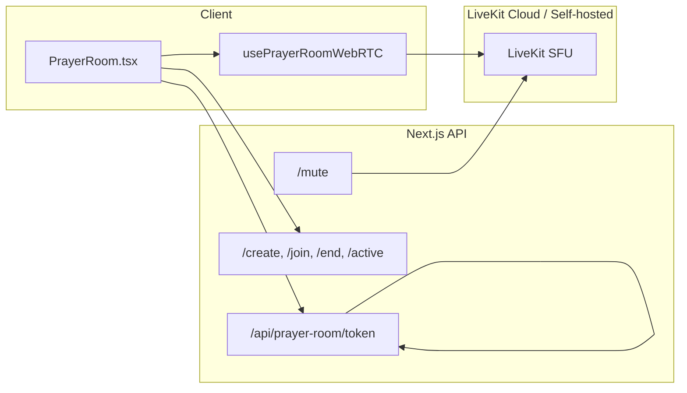

# Prayer Live Room — LiveKit (SFU) Upgrade Plan

## Current architecture (to replace only in one hook)

- **Mesh today:** [usePrayerRoomWebRTC.ts](src/01_App/(live) Gospel/Prayer/room/usePrayerRoomWebRTC.ts) uses RTCPeerConnection per peer: host mixes audio and sends one stream to each listener; speakers send to host. Signaling (offer/answer/ICE) goes through [usePrayerRoomSignaling.ts](src/01_App/(live) Gospel/Prayer/room/usePrayerRoomSignaling.ts) and `/api/prayer-room/signaling`.
- **Room metadata:** [prayer-room-api.ts](src/01_App/(live) Gospel/Prayer/room/prayer-room-api.ts) calls create/join/end/active/room/mute. Rooms and participants are stored in `src/01_App/(live) Gospel/Prayer/data/rooms.json`.
- **UI:** [PrayerRoom.tsx](src/01_App/(live) Gospel/Prayer/PrayerRoom.tsx) uses the WebRTC hook, shows [PrayerRoomParticipants](src/01_App/(live) Gospel/Prayer/PrayerRoomParticipants.tsx) and [PrayerRoomControls](src/01_App/(live) Gospel/Prayer/PrayerRoomControls.tsx). Listener hears a single `remoteStream`; host has `mixedStream` for recording.

## Target architecture




- **LiveKit:** One room per prayer room (`roomId`). Participants join with `identity = participantId`. Host and speakers publish microphone; listeners only subscribe. Mute enforced via server SDK in `/mute`.
- **Same surface:** Hook still exposes `localStream`, `remoteStream`, `mixedStream`, `myMuted`, `setMyMuted`, `error`, and a merged `participants` list. No changes to PrayerRoomControls or PrayerRoomParticipants props.

---

## 1. Dependencies

- **Client:** `livekit-client` (browser SDK for Room, connect, publish, subscribe).
- **Server:** `livekit-server-sdk` (token generation and `RoomServiceClient` for mute).

Add to [package.json](package.json):

- `livekit-client`
- `livekit-server-sdk`

---

## 2. Environment and config

**Add to `.env` and `.env.example`** (document only; do not commit secrets):

```bash
# LiveKit (Prayer Live Room SFU)
LIVEKIT_URL=
LIVEKIT_API_KEY=
LIVEKIT_API_SECRET=
```

- Use a LiveKit Cloud project or self-hosted instance; put the WebSocket URL in `LIVEKIT_URL` (e.g. `wss://your-project.livekit.cloud`).

---

## 3. Token API

**New file:** `src/app/api/prayer-room/token/route.ts`

- **Method:** POST.
- **Body:** `{ roomId: string, participantId: string, role: "host" | "speaker" | "listener" }`. Optionally `displayName`.
- **Logic:**
  - Validate `roomId`, `participantId`, `role`. Optionally validate that the participant is in the room (e.g. read rooms.json and ensure participantId is in that room’s participants) to avoid issuing tokens for arbitrary users.
  - Use `livekit-server-sdk`: `AccessToken` with `LIVEKIT_API_KEY`, `LIVEKIT_API_SECRET`, `identity: participantId`, `name: displayName || participantId`.
  - Grant: `roomJoin: true`, `room: roomId`. For `host` and `speaker`: allow publish (e.g. `canPublish: true`); for `listener`: subscribe only (e.g. `canPublish: false`). Use default `canSubscribe: true` for all.
  - Return JSON: `{ token: string, url: process.env.LIVEKIT_URL }`.
- **Errors:** 400 if body invalid; 500 if env missing or token creation fails.

---

## 4. Replace mesh logic in usePrayerRoomWebRTC.ts

**File:** [usePrayerRoomWebRTC.ts](src/01_App/(live) Gospel/Prayer/room/usePrayerRoomWebRTC.ts)

- **Keep the same export types** `UsePrayerRoomWebRTCOptions` and `UsePrayerRoomWebRTCResult` as far as possible so PrayerRoom and UI stay compatible.
- **Options changes:**
  - **Add:** `token: string | null`, `liveKitUrl: string | null` (both required to connect).
  - **Remove:** `sendOffer`, `sendAnswer`, `sendIce`, and `participants` from options if no longer needed for connection logic (participants can still be passed for merge, see below).
  - **Keep:** `roomId`, `participantId`, `role`, `hostId`, `onMuteRequest` (for when server mutes us; hook can set local mute state).
- **New behavior:**
  - If `!token || !liveKitUrl`, set `error` and return; no connection.
  - Create `Room` from `livekit-client`, connect with `token` and `liveKitUrl`.
  - **Publish:** For `role === "host"` or `role === "speaker"`, get user media (audio only), create `LocalTrack` and publish with `room.localParticipant.publishTrack(track, { ... })`. Map `localStream` from the same media stream for compatibility. When `myMuted` is true, disable the published track (or unpublish/mute); when false, enable.
  - **Subscribe:** Listen to `room.on("trackSubscribed", ...)`. For each remote audio track, attach to an internal representation. For **listeners:** mix all remote audio tracks into a single `MediaStream` using `AudioContext` + `MediaStreamDestination` and set `remoteStream` to that mixed stream (so the existing listener `<audio>` element keeps working). For **host:** build `mixedStream` from local mic + all remote speaker tracks for future recording.
  - **Presence:** Use `participantConnected`, `participantDisconnected`, and optionally `trackSubscribed` to maintain a live list of participant identities and mute state from track enabled/disabled. Expose a **merged participants list**: combine `participants` from options (from room API: role, displayName, joinedAt) with LiveKit-derived presence and mute so the hook returns `participants: RoomParticipant[]` with up-to-date `muted` and presence. If options no longer pass `participants`, the hook can take `room.participants` from LiveKit and map identities to `RoomParticipant` (e.g. from room API fetch or metadata).
  - **Mute request:** When LiveKit fires a mute/disable event for our track (or when app calls mute via server), call `onMuteRequest?.(true)`. When we unmute, `onMuteRequest?.(false)`. So host-triggered mute still updates local `myMuted` state.
  - **Cleanup:** On unmount or when `token`/`roomId` changes, disconnect room and release tracks.
- **Result shape (unchanged):** `localStream`, `remoteStream`, `mixedStream`, `handleSignalingEvent` (no-op for LiveKit path), `myMuted`, `setMyMuted`, `error`. Add `participants` to the result so PrayerRoom can pass `webrtc.participants` to PrayerRoomParticipants and Controls.

---

## 5. PrayerRoom.tsx updates

**File:** [PrayerRoom.tsx](src/01_App/(live) Gospel/Prayer/PrayerRoom.tsx)

- **Flow:** After user joins (existing `joinRoom()`), call new token API with `roomId`, `participantId`, `role` (and optional `displayName`). Store returned `token` and `url` in state (or pass directly into hook).
- **Wire hook:** Call `usePrayerRoomWebRTC` with `token`, `liveKitUrl`, `roomId`, `participantId`, `role`, `hostId`, `onMuteRequest`, and (if kept) `participants: room?.participants ?? []` for merge. Do **not** pass `sendOffer`, `sendAnswer`, `sendIce`.
- **Signaling:** Remove `usePrayerRoomSignaling` and the `handleSignalingEventRef` / `webrtc.handleSignalingEvent` wiring. SDP/ICE are handled by LiveKit; mute is handled by server + LiveKit events.
- **Participants:** Pass `webrtc.participants` (or the merged list from the hook) to `PrayerRoomParticipants` and `PrayerRoomControls` instead of `room?.participants`, so the list reflects LiveKit presence and mute state.
- **Listener audio:** Keep `<ListenerAudio stream={webrtc.remoteStream} />` unchanged.
- **Mute:** Keep `handleMuteParticipant` calling `setParticipantMute(roomId, hostId, pid, muted)`; the mute route will also call LiveKit (see below).

---

## 6. Room APIs — no changes

- **Do not change:** [create/route.ts](src/app/api/prayer-room/create/route.ts), [join/route.ts](src/app/api/prayer-room/join/route.ts), [end/route.ts](src/app/api/prayer-room/end/route.ts), [active/route.ts](src/app/api/prayer-room/active/route.ts). They remain the room directory and metadata store (rooms.json). LiveKit room name = `roomId`; participants join the same `roomId` after joining via API.

---

## 7. Mute API — add LiveKit server mute

**File:** [mute/route.ts](src/app/api/prayer-room/mute/route.ts)

- After validating host and updating local `rooms.json` (participant `muted` flag), if LiveKit env vars are set, call LiveKit server to mute the published track:
  - Use `RoomServiceClient` from `livekit-server-sdk` with `LIVEKIT_URL`, `LIVEKIT_API_KEY`, `LIVEKIT_API_SECRET`.
  - Call `mutePublishedTrack(roomId, participantId, trackSid, muted)` (or equivalent: mute the participant’s audio track by SID). If the API mutes by participant identity, use `participantId` as identity. Implement according to [LiveKit RoomServiceClient docs](https://docs.livekit.io/reference/server-sdk-js/classes/RoomServiceClient.html) (e.g. list participant’s published tracks, then mute the audio track).
- If LiveKit is not configured, keep only the file-based mute update so the app still works without LiveKit for local/dev.

---

## 8. Participant presence (LiveKit events)

- Implemented **inside** `usePrayerRoomWebRTC.ts`: subscribe to `participantConnected`, `participantDisconnected`, `trackSubscribed` (and optionally `trackUnsubscribed`). Update internal state for current participants and their track mute state. Merge with `room.participants` (from API) so that `participants` returned by the hook have correct `participantId`, `role`, `displayName`, `muted`, and reflect who is actually in the LiveKit room. PrayerRoomParticipants and PrayerRoomControls already consume `RoomParticipant[]`; no component changes.

---

## 9. PrayerRoomRecorder (Phase 3 prep)

**File:** [PrayerRoomRecorder.ts](src/01_App/(live) Gospel/Prayer/room/PrayerRoomRecorder.ts)

- **Do not change behavior.** Add a short comment that this class is used for client-side recording of the host’s mixed stream today, and that Phase 3 may add server-side LiveKit room recording or a separate path that feeds LiveKit composite audio into a similar pipeline. No new methods or stub implementations required unless you want an empty `recordFromLiveKitRoom()` for future use.

---

## 10. Optional: remove or keep signaling

- **Recommendation:** Keep [usePrayerRoomSignaling.ts](src/01_App/(live) Gospel/Prayer/room/usePrayerRoomSignaling.ts) and [signaling/route.ts](src/app/api/prayer-room/signaling/route.ts) for now (unused in LiveKit path). Removing them can be a follow-up. PrayerRoom simply stops using the signaling hook when using LiveKit.

---

## Result

- Rooms use LiveKit SFU instead of browser mesh; 100+ listeners and 5–10 speakers are supported.
- Same UI: PrayerRoom, PrayerRoomControls, PrayerRoomParticipants unchanged in structure; only data source for participants and streams comes from the updated hook and token flow.
- Room APIs (create, join, end, active) unchanged; mute API extended with LiveKit server mute.
- PrayerPlayer and PrayerWaveform untouched; routing and tabs unchanged.
- Recording: current client recorder unchanged; architecture ready for server-side or LiveKit-based recording later.

