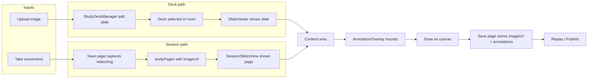

# Prayer Slide + Annotation Recovery Plan

## 1. Workflow trace: where the chain is and where it breaks

**Current flow (as implemented):**

| Step                        | Implementation                                                                                                                                                                                                                                                                                                                                                                                                                                                                      | Break points                                                                                                                                                                                                                                                                                                                                                                                                                  |
| --------------------------- | ----------------------------------------------------------------------------------------------------------------------------------------------------------------------------------------------------------------------------------------------------------------------------------------------------------------------------------------------------------------------------------------------------------------------------------------------------------------------------------- | ----------------------------------------------------------------------------------------------------------------------------------------------------------------------------------------------------------------------------------------------------------------------------------------------------------------------------------------------------------------------------------------------------------------------------- |
| **Upload image**            | [StudyDeckManager.tsx](src/01_App/Christian/Prayer/study/StudyDeckManager.tsx): file input → `handleAddSlide` → `FileReader.readAsDataURL` → `addSlide(deckId, { imageUrl, title, notes })` → localStorage via [study-deck-store.ts](src/01_App/Christian/Prayer/study/study-deck-store.ts).                                                                                                                                                                                        | No try/catch on FileReader; no `reader.onerror`; localStorage can throw (quota) for large data URLs; no validation that result is a valid image.                                                                                                                                                                                                                                                                              |
| **Take screenshot**         | No dedicated “Take snapshot” button. “Save page” in [StudyPagesManager](src/01_App/Christian/Prayer/room/StudyPagesManager.tsx) → [PrayerRoom](src/01_App/Christian/Prayer/PrayerRoom.tsx) `handleSaveStudyPage` → [capture-content.ts](src/01_App/Christian/Prayer/room/capture-content.ts) `findCaptureSource(contentWrapperRef)` then `captureElementToDataURL(source)`.                                                                                                         | `findCaptureSource` returns first `video` or `img` in wrapper. For **video**: `videoWidth`/`videoHeight` can be 0 before loaded → `captureElementToDataURL` returns null. For **img**: `naturalWidth`/`naturalHeight` can be 0 before load → null. So saved page can have **no imageUrl**; it’s still pushed to `studyPages`, but `SessionSlidesView` only shows `pages.filter(p => p.imageUrl)`, so the page is “invisible.” |
| **Create slide**            | Deck slide: already a slide when deck is selected. Session slide: created by Save page (above).                                                                                                                                                                                                                                                                                                                                                                                     | If capture fails, “slide” exists in state but has no image and doesn’t appear as content.                                                                                                                                                                                                                                                                                                                                     |
| **Show slide**              | [PrayerRoom.tsx](src/01_App/Christian/Prayer/PrayerRoom.tsx) content block: `screenShareStream` → [ScreenShareView](src/01_App/Christian/Prayer/room/ScreenShareView.tsx); else `activeDeck` → [SlideViewer](src/01_App/Christian/Prayer/room/SlideViewer.tsx); else `studyPages.length > 0` → [SessionSlidesView](src/01_App/Christian/Prayer/room/SessionSlidesView.tsx); else `hasParticipantVideo` → [VideoContentView](src/01_App/Christian/Prayer/room/VideoContentView.tsx). | Correct. Session slides only show when no deck and no screen share; they only show pages that have `imageUrl`.                                                                                                                                                                                                                                                                                                                |
| **Mount annotation canvas** | Same content wrapper: `hasVisibleContent && annotationVisible` → [AnnotationOverlay](src/01_App/Christian/Prayer/room/AnnotationOverlay.tsx) with canvas `position: absolute; inset: 0`.                                                                                                                                                                                                                                                                                            | Canvas **resize** runs only on mount and `window.resize` ([AnnotationOverlay.tsx](src/01_App/Christian/Prayer/room/AnnotationOverlay.tsx) ~96–108). If the content wrapper size changes after mount (e.g. image loads, or layout settles), canvas backing size and/or `getBoundingClientRect()` used in `drawStrokes` can be stale → **wrong coordinates or zero-size canvas**. No ResizeObserver.                            |
| **Draw on canvas**          | Mouse: `onMouseDown` → `handlePointerDown`, `onMouseMove` → `handlePointerMove`, `onMouseUp` / `onMouseLeave` → `handlePointerUp`. Strokes stored in parent state; overlay redraws via `drawStrokes(ctx, rect.width, rect.height)`.                                                                                                                                                                                                                                                 | **Touch**: only mouse events; no `onPointerDown`/`onPointerMove`/`onPointerUp` → drawing fails on touch devices. **Coordinates**: if canvas internal size doesn’t match displayed size (resize not re-run), strokes can be misdrawn or not visible.                                                                                                                                                                           |
| **Save page**               | Same `handleSaveStudyPage`: capture + push `{ id, title, createdAt, timestampSec, imageUrl?, annotations? }`.                                                                                                                                                                                                                                                                                                                                                                       | If capture returns null, page is saved without image; no user feedback that capture failed.                                                                                                                                                                                                                                                                                                                                   |
| **Replay page**             | [SessionReplayViewer](src/01_App/Christian/Prayer/room/SessionReplayViewer.tsx) uses `sessionStudyPages`, `annotationTimeline`, `sessionTimeline`.                                                                                                                                                                                                                                                                                                                                  | Replay is correct when data exists; no extra break points identified.                                                                                                                                                                                                                                                                                                                                                         |

**Summary of break points:**

1. **Drawing**: Canvas resize only on mount/window resize → possible wrong/zero size; mouse-only → no touch; no crash but “drawing doesn’t work.”
2. **Snapshot**: Capture can return null (video/img not ready or zero size) → saved page has no `imageUrl` → not shown as annotatable surface; no error message.
3. **Upload**: FileReader and localStorage without try/catch/onerror → possible crash or unhandled rejection on large/invalid files.
4. **UX**: No clear “Add slide” / “Take snapshot” / “Annotate” order; annotation tools (and panel toggles) visible even when there is no slide/screen (e.g. only participant video or nothing), and no message when there’s nothing to annotate.

---

## 2. Why drawing fails (audit)

**Files:** [AnnotationOverlay.tsx](src/01_App/Christian/Prayer/room/AnnotationOverlay.tsx), [PrayerRoom.tsx](src/01_App/Christian/Prayer/PrayerRoom.tsx), [SlideViewer.tsx](src/01_App/Christian/Prayer/room/SlideViewer.tsx), [SessionSlidesView.tsx](src/01_App/Christian/Prayer/room/SessionSlidesView.tsx).

**Findings:**

- **Pointer events**: Overlay uses `onMouseDown`/`onMouseMove`/`onMouseUp`/`onMouseLeave` only. No pointer or touch events → **touch devices do not draw**.
- **Canvas sizing**: Resize runs in `useEffect` with `[drawStrokes]` and only calls `resize()` on mount and on `window.resize`. **No ResizeObserver** on the canvas or its container → when the content wrapper gets its size from an image loading or layout, the canvas may keep old dimensions → **strokes in 0–1 coords drawn with wrong rect or on a zero-height canvas**.
- **Mouse/touch**: Handlers are correct for mouse; **touch must be supported** via same relative coords (e.g. `pointer` events or touch event translation).
- **Annotatable surface mounted**: Yes: overlay is a sibling of the content view inside the same wrapper; `position: absolute; inset: 0` covers the content. When `hasVisibleContent` is true and `annotationVisible` is true, overlay is mounted.
- **Strokes recorded but not rendered**: Strokes are in state and passed to `drawStrokes`. If the canvas context or size is wrong (e.g. zero or stale), they won’t render correctly. **Stale rect** in the resize effect (which passes `rect.width`/`rect.height` to `drawStrokes`) is the likely cause when the container size changes after mount.
- **Toolbar vs canvas state**: Toolbar (Draw/Highlight/Erase/Clear) and canvas share the same component; mode is internal or from props. No disconnect identified; **toolbar is only visible when overlay is mounted**, which is when there is content.

**Fixes to apply:**

- **AnnotationOverlay**: Use **ResizeObserver** on the canvas (or a wrapper div) to run the same resize/redraw logic when the element size changes (not only window resize). Optionally use **pointer events** (`onPointerDown`/`onPointerMove`/`onPointerUp` + `pointerLeave`) so drawing works with both mouse and touch.
- **AnnotationOverlay**: Ensure canvas has explicit dimensions (e.g. width/height from the observed rect) so it’s never 0×0 when the container has a size.

---

## 3. Why snapshot / slide flow fails (audit)

**Files:** [StudyPagesManager.tsx](src/01_App/Christian/Prayer/room/StudyPagesManager.tsx), [PrayerRoom.tsx](src/01_App/Christian/Prayer/PrayerRoom.tsx), [capture-content.ts](src/01_App/Christian/Prayer/room/capture-content.ts), [SessionSlidesView.tsx](src/01_App/Christian/Prayer/room/SessionSlidesView.tsx).

**Findings:**

- **Uploaded images (deck)**: Stored in [study-deck-store.ts](src/01_App/Christian/Prayer/study/study-deck-store.ts) via `addSlide`; no try/catch in [StudyDeckManager](src/01_App/Christian/Prayer/study/StudyDeckManager.tsx) `handleAddSlide` (FileReader or localStorage). **Crashes**: FileReader can fail; `reader.onerror` not set; `saveDecks` can throw on quota.
- **Snapshot creating image URL**: `captureElementToDataURL` returns a PNG data URL only when `width` and `height` of the element are > 0. For **video**, that’s `videoWidth`/`videoHeight` (often 0 until first frame or metadata). For **img**, that’s `naturalWidth`/`naturalHeight` (0 until loaded). So **snapshot often returns null** if the user clicks “Save page” before the media is ready.
- **Slide state**: When capture succeeds, the new page is pushed to `studyPages` with `imageUrl`; when it fails, the page is still pushed but without `imageUrl`, so it never appears in SessionSlidesView. State is preserved but **user sees no new slide** and gets no feedback.
- **Crashes**: No crash in capture (it returns null); crash risk is in **upload** (FileReader/localStorage) and in **SessionSlidesView** if `slide` were ever undefined (it’s guarded by `withImages.length > 0` and clamped index). [SlideViewer](src/01_App/Christian/Prayer/room/SlideViewer.tsx) assumes `deck.slides[index]` exists after the empty-deck check; safe. [StudyDeckManager](src/01_App/Christian/Prayer/study/StudyDeckManager.tsx) thumbnails use `slide.imageUrl` without null check — if a slide had no imageUrl it could render a broken img; deck store only adds slides with imageUrl, so risk is from future bugs or corrupted storage.

**Fixes to apply:**

- **capture-content.ts**: For **video**, if `videoWidth`/`videoHeight` are 0, use a fallback: e.g. canvas dimensions from `element.getBoundingClientRect()` and draw the current frame (or wait for `loadedmetadata` in the caller). Document that capture may still be null if no frame is available.
- **PrayerRoom handleSaveStudyPage**: If `captureElementToDataURL` returns null but we have a source, still add the page (for timestamp/annotations) but **optionally** set a placeholder or show a short message (e.g. “Capture failed; save again when the slide/video is visible.”). Prefer not to add a page with no imageUrl and no feedback.
- **StudyPagesManager / ModeratorPanel**: When “Save page” is used, if the backend (PrayerRoom) can report capture failure, show a brief toast or inline message. If not in scope, at least ensure **no crash** and that when imageUrl is missing the list item doesn’t assume an image (e.g. show “No preview” or title only).
- **StudyDeckManager**: Wrap FileReader in try/catch; add `reader.onerror`; wrap localStorage in try/catch; optionally validate data URL or image dimensions before calling `addSlide`; on failure, set local error state and show a short message instead of crashing.

---

## 4. Simple usable flow (implementation order)

**Target order:**  
A. Upload image **or** take snapshot →  
B. That image becomes the **active slide** (deck slide or session slide with imageUrl) →  
C. Annotation canvas mounts on top of that slide →  
D. Draw / highlight / erase work →  
E. Save page stores image + annotations + timestamp.

**Changes (small, no big refactor):**

- **Take snapshot**: Keep using “Save page” as the snapshot action. Ensure capture is robust (video fallback in capture, and/or wait for video dimensions). After save, if we have session slides and no screen share, main view already switches to SessionSlidesView; ensure the latest saved page is the one shown (e.g. set `currentSessionSlideIndex` to the new page when adding) so the host immediately sees the new slide and can annotate. **Already**: when `studyPages.length > 0` and no deck/screen share, SessionSlidesView is shown; **missing**: after `setStudyPages(prev => [...prev, page])`, set `currentSessionSlideIndex` to the new index so the new slide is active.
- **Upload image**: Stays as “add slide to deck” in StudyDeckManager; after adding, host selects the deck and uses it in the room. Add crash protection (see above); no routing/auth change.
- **Screen share**: If screen share is active, “Save page” already captures the first video in the wrapper (ScreenShareView). Make capture robust for video (fallback size); after stopping screen share, if we have studyPages with imageUrl, SessionSlidesView shows and overlay is on top — no change needed except capture and “active session slide” behavior above.
- **When no active slide**: When there is no slide/screen (e.g. no deck, no screen share, no session slides with imageUrl), the content area can still show participant video. In that case, either: (a) show annotation overlay only when there is a “slide” (deck, screen share, or at least one session page with imageUrl), or (b) keep overlay for video but make it clear that “Save page” will capture the video. Prefer (b) for flexibility; add a short inline message when the content is “only video” so the host knows they can snapshot it. When there is **no** content at all (`!hasVisibleContent`), do not show annotation tools in the main area; in the panel, **disable** or hide “Annotate” / “Clear annotations” and show a single line: “Add a slide or take a snapshot to annotate.”
- **Implement**:  
  - In **PrayerRoom**: When adding a study page with `imageUrl`, set `currentSessionSlideIndex` to `studyPages.length` (the new page’s index).  
  - In **ModeratorPanel**: When there is no slide/screen/session-slide (or no “annotatable” content by your definition), show the message above and disable annotation actions.  
  - In **capture-content**: Add video fallback (canvas size from getBoundingClientRect when video dimensions are 0).  
  - In **AnnotationOverlay**: ResizeObserver + optional pointer events (see above).

---

## 5. Clean up host UX

- **Labels and order**: In ModeratorPanel, group and label so the order is clear:  
  - **Add slide** = “Open deck” + use a deck (with slides), or rely on “Save page” to create a session slide.  
  - **Take snapshot** = “Save page” (capture current slide/screen/video). Optionally add a short tooltip: “Captures the current slide or screen.”  
  - **Annotate** = “Show annotations” / toolbar (Draw, Highlight, Erase, Clear).  
  - **Save page** = same button; clarify it “Saves current view + annotations.”
- **When nothing to annotate**: Do not show confusing controls. When there is no deck, no screen share, and no session slide with imageUrl (and optionally when there’s no participant video), **disable** “Show annotations” / “Clear annotations” and show one line: “Add a slide or take a snapshot to annotate.” When content is only participant video, you can leave annotation on but add a hint: “You can annotate on the video and use Save page to capture it.”
- **Study slides section**: Keep “Open deck” and deck selection; keep “Save page” in Study pages. No need to rename sections heavily; just make the one “no slide” state clear and the sequence obvious.

---

## 6. Crash protection

Add try/catch and null guards in:

- **StudyDeckManager handleAddSlide**: Wrap `FileReader` usage in try/catch; set `reader.onerror` to set error state and not throw; validate `reader.result` (e.g. string and optionally starts with `data:image`); catch `addSlide`/localStorage errors and show “Failed to add slide” (e.g. quota or invalid data).
- **study-deck-store saveDecks**: Keep existing try/catch; ensure no throw leaks (already catches and ignores; verify).
- **PrayerRoom handleSaveStudyPage**: Ensure `findCaptureSource` and `captureElementToDataURL` are called in try/catch; if they throw, do not push a broken page; set a brief error state or callback for the panel to show “Capture failed.”
- **AnnotationOverlay**: In resize and draw, guard against missing `ctx` or zero size; no throw.
- **SessionSlidesView / SlideViewer**: Already use filtered lists and clamped index; ensure any `slide!.imageUrl` is only used when slide is defined and imageUrl exists (SessionSlidesView uses `withImages` so imageUrl is present; add a guard if needed so `slide` is never undefined when accessing `slide.imageUrl`).

Result: **App does not crash** on image upload failure, capture failure, or invalid storage.

---

## 7. Report: PRAYER_SLIDE_ANNOTATION_RECOVERY_PLAN.md

Generate a single markdown file at `src/01_App/Christian/Prayer/PRAYER_SLIDE_ANNOTATION_RECOVERY_PLAN.md` (or repo root if you prefer) containing:

- **Exact failure points**: Drawing (canvas resize, mouse-only); snapshot (null capture when media not ready); upload (FileReader/localStorage); UX (annotation tools shown with no slide, no feedback on failed capture).
- **Files involved**: AnnotationOverlay.tsx, PrayerRoom.tsx, ModeratorPanel.tsx, StudyPagesManager.tsx, StudyDeckManager.tsx, capture-content.ts, study-deck-store.ts, SessionSlidesView.tsx, SlideViewer.tsx, ScreenShareView.tsx, VideoContentView.tsx.
- **What was fixed**: ResizeObserver + optional pointer events in AnnotationOverlay; video fallback in capture-content; set currentSessionSlideIndex when adding a study page with imageUrl; try/catch and onerror in StudyDeckManager and handleSaveStudyPage; guards in capture and draw; UX: disable annotation tools and show message when no slide/snapshot; clarify “Add slide / Take snapshot / Annotate / Save page.”
- **What is still missing**: Optional: dedicated “Take snapshot” button that only captures and creates a session slide (currently “Save page” does both). Optional: wait for video `loadedmetadata` before enabling “Save page” when source is video. Optional: shape/text tools.
- **Shortest path to usable**: Implement fixes in sections 2, 3, 4, 5, 6; then run the verification in section 8. No large refactor; no routing or auth changes.

---

## 8. Final verification (manual)

After implementation, verify this exact flow:

1. Open room (as host).
2. Add/upload image: e.g. create a deck, add one slide (file upload or URL), select “Use in room.”
3. See the image as the main slide (SlideViewer).
4. Draw on it (mouse and, if possible, touch).
5. Clear annotations (Clear button).
6. Save page (title, then Save page).
7. Confirm the saved page exists in the list and, if you stop screen share / leave deck, that the session slide appears and is annotatable.
8. No crash during upload, capture, or save.

Do not claim success until this full flow works in the app.

---

## File change summary (concise)

| File                                                                                 | Change                                                                                                                                                                       |
| ------------------------------------------------------------------------------------ | ---------------------------------------------------------------------------------------------------------------------------------------------------------------------------- |
| [room/AnnotationOverlay.tsx](src/01_App/Christian/Prayer/room/AnnotationOverlay.tsx) | ResizeObserver on canvas (or wrapper) to resize/redraw on size change; optional pointer events for touch; guard ctx/size in draw.                                            |
| [room/capture-content.ts](src/01_App/Christian/Prayer/room/capture-content.ts)       | For video with zero videoWidth/videoHeight, use getBoundingClientRect() as canvas size and draw current frame; keep try/catch.                                               |
| [PrayerRoom.tsx](src/01_App/Christian/Prayer/PrayerRoom.tsx)                         | handleSaveStudyPage: try/catch around capture; on new page with imageUrl, set currentSessionSlideIndex to new index; optional error state/callback for “Capture failed.”     |
| [study/StudyDeckManager.tsx](src/01_App/Christian/Prayer/study/StudyDeckManager.tsx) | handleAddSlide: try/catch, reader.onerror, validate result; catch addSlide/localStorage; show “Failed to add slide” on error.                                                |
| [room/ModeratorPanel.tsx](src/01_App/Christian/Prayer/room/ModeratorPanel.tsx)       | When no annotatable content (no deck, no screen share, no session slide with imageUrl): disable annotation toggles/clear, show “Add a slide or take a snapshot to annotate.” |
| [room/StudyPagesManager.tsx](src/01_App/Christian/Prayer/room/StudyPagesManager.tsx) | Optional: show “No preview” for pages without imageUrl; or accept callback from parent to show “Capture failed” once.                                                        |
| New or existing doc                                                                  | Add PRAYER_SLIDE_ANNOTATION_RECOVERY_PLAN.md with failure points, files, fixes, missing items, and shortest path.                                                            |

No routing or auth changes; scope limited to `src/01_App/Christian/Prayer/`** with small, safe fixes and wiring improvements.