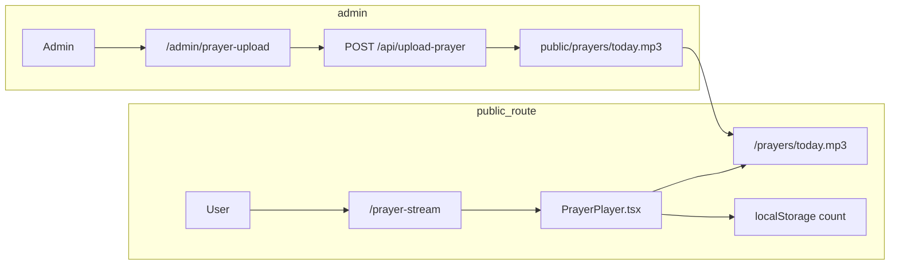

# Prayer Stream: Player + Admin Upload Refactor

## Current state

- [src/app/prayer-stream/page.tsx](src/app/prayer-stream/page.tsx) renders `PrayerStreamOnboarding` (4-step wizard with config from `/api/prayer-stream-config`).
- [src/01_App/(live) Business/Prayer_Stream/PrayerStreamOnboarding.tsx](src/01_App/(live) Business/Prayer_Stream/PrayerStreamOnboarding.tsx) implements the wizard; uses `/api/prayer-stream-config` and [PrayerStreamOnboarding.json](src/01_App/(live) Business/Prayer_Stream/PrayerStreamOnboarding.json). Already has "I prayed" and localStorage keys `prayer-stream-count` and `prayer-stream-last`.
- Dev navigator and [src/app/api/screens/route.ts](src/app/api/screens/route.ts) list `Prayer_Stream` with `PrayerStreamOnboarding`; [src/app/dev/page.tsx](src/app/dev/page.tsx) maps short path `Prayer_Stream/PrayerStreamOnboarding` to the TSX.
- Current audio path in config: `/audio/daily-prayer.mp3`. Target path for refactor: `**/prayers/today.mp3**`.

---

## Step 1 — Create player component

**New file:** [src/01_App/(live) Business/Prayer_Stream/PrayerPlayer.tsx](src/01_App/(live) Business/Prayer_Stream/PrayerPlayer.tsx)

- **Purpose:** Single-screen prayer audio player (no steps, no config fetch).
- **Layout (top to bottom):**
  - Title (e.g. "Daily Prayer" or configurable via prop/env).
  - Large play button (can wrap or sit beside native `<audio controls>`).
  - Native `<audio controls src="/prayers/today.mp3">` for progress bar and playback (and optional loop via `loop` attribute).
  - Short prayer description (static or prop).
  - "Mark prayed" button.
  - Optional: "You have prayed X times" from `localStorage.getItem("prayer-stream-count")` (reuse existing keys).
- **Implementation details:**
  - Client component (`"use client"`).
  - Use existing keys: `prayer-stream-count`, `prayer-stream-last` for increment and optional display.
  - Optional loop: add a small toggle or prop that sets `<audio loop />`.
  - Optional cache-busting: `src={\`/prayers/today.mp3?t=${Date.now()}}` only on mount so a new upload is picked up after refresh (or use a fixed URL and document that users refresh after admin upload).
- **Styling:** Reuse existing prayer-stream styling (e.g. dark background, centered card) from the current onboarding for consistency.

---

## Step 2 — Modify prayer-stream route

**Edit:** [src/app/prayer-stream/page.tsx](src/app/prayer-stream/page.tsx)

- Remove import of `PrayerStreamOnboarding`.
- Import and render `<PrayerPlayer />` only.
- Keep the same outer wrapper (minHeight, background, color) so the player is the only content.
- Result: opening `/prayer-stream` shows the player immediately with no onboarding.

---

## Step 3 — Create admin upload page

**New file:** [src/app/admin/prayer-upload/page.tsx](src/app/admin/prayer-upload/page.tsx)

- **Purpose:** Allow a trusted user to upload the daily prayer file.
- **UI:** Simple form:
  - Heading: "Upload Prayer"
  - `<input type="file" accept="audio/*" />` (or `accept=".mp3,audio/mpeg"`).
  - Submit button: "Upload" that POSTs the file to `/api/upload-prayer`.
- **Behavior:** On submit, build `FormData`, append the file (e.g. field name `file` or `prayer`), `fetch("/api/upload-prayer", { method: "POST", body: formData })`. On success, show a short success message; on error, show error. No auth in scope unless you add it later (plan assumes trusted environment or add auth in a follow-up).

---

## Step 4 — Create API route for upload

**New file:** [src/app/api/upload-prayer/route.ts](src/app/api/upload-prayer/route.ts)

- **Method:** POST.
- **Input:** `multipart/form-data` with one file (e.g. field name `file` or `prayer`).
- **Logic:**
  - Call `request.formData()`, get the file from the field.
  - Validate: presence of file, optional type check (e.g. audio/mpeg or application/octet-stream).
  - Target path: `public/prayers/today.mp3`. Use `path.join(process.cwd(), "public", "prayers", "today.mp3")`.
  - Ensure directory exists: `fs.mkdirSync(dir, { recursive: true })` for `public/prayers`.
  - Write file: stream or buffer to the path (overwrite). Example: `const bytes = await file.arrayBuffer(); fs.writeFileSync(targetPath, Buffer.from(bytes));`.
  - Return JSON: `{ success: true }` or `{ success: false, error: "..." }` with appropriate status (400 for validation, 500 for write errors).
- **Caveat:** Writing to `public/` works in local Node dev. On serverless (e.g. Vercel), the filesystem is read-only; uploads would need to go to a writable store (e.g. blob storage) and the player would need to use a URL that serves from that store. Plan assumes dev/self-hosted Node where `public` is writable; document production limitation or add a note in the route.

---

## Step 5 — Create prayer directory and default file

- **Ensure directory exists:** `public/prayers/`.
- **Default file:** Add a placeholder `public/prayers/today.mp3` so the player does not 404 before the first upload. Use a minimal valid MP3 or a short silent MP3; alternatively a small placeholder that can be overwritten by the first admin upload. If the repo should not hold binary assets, document that the admin must upload once before the player works.

---

## Step 6 — Mark prayed feature in player

- Implement inside [PrayerPlayer.tsx](src/01_App/(live) Business/Prayer_Stream/PrayerPlayer.tsx):
  - "Mark prayed" button: on click, read `localStorage.getItem("prayer-stream-count")`, parse as number, increment, `localStorage.setItem("prayer-stream-count", String(count))`, and optionally set `prayer-stream-last` to `new Date().toISOString()`.
  - Display below or near the button: "You have prayed X times" (read from localStorage; handle SSR by rendering count only in a `useEffect` or client-only block).
  - Reuse the same keys as the current onboarding so existing users keep their count.

---

## Step 7 — Remove wizard from default flow and rename

- **Rename file:** `PrayerStreamOnboarding.tsx` → `PrayerDevotionalFlow.tsx` in the same folder [src/01_App/(live) Business/Prayer_Stream/](src/01_App/(live) Business/Prayer_Stream/).
- **Rename component:** Default export in that file from `PrayerStreamOnboarding` to `PrayerDevotionalFlow` (so the file name and export align).
- **Do not load by default:** Already achieved by Step 2 (route only renders `PrayerPlayer`). No imports of the devotional flow on the main `/prayer-stream` route.
- **Dev navigator:** Update references so the old flow is still reachable from dev if desired:
  - [src/app/api/screens/route.ts](src/app/api/screens/route.ts): For `Prayer_Stream`, include both `PrayerPlayer` and `PrayerDevotionalFlow` in `directFiles` (e.g. `["PrayerPlayer", "PrayerDevotionalFlow"]`) so the dropdown can show both; or keep only `PrayerDevotionalFlow` for the archived flow and add `PrayerPlayer` as the first entry.
  - [src/app/dev/page.tsx](src/app/dev/page.tsx): Add short path for `Prayer_Stream/PrayerPlayer` so it resolves to `tsx:(live) Business/Prayer_Stream/PrayerPlayer`; optionally keep or update the alias for `Prayer_Stream/PrayerDevotionalFlow` to point at the renamed TSX.
- **Config/API:** [src/app/api/prayer-stream-config/route.ts](src/app/api/prayer-stream-config/route.ts) and [PrayerStreamOnboarding.json](src/01_App/(live) Business/Prayer_Stream/PrayerStreamOnboarding.json) can remain for the devotional flow when opened from dev; no need to change unless you want to rename the config file to match (e.g. `PrayerDevotionalFlow.json`). Optional: leave as-is for minimal change.

---

## Step 8 — Validation checklist

- Opening `/prayer-stream` shows the prayer player immediately (no onboarding).
- Admin can open `/admin/prayer-upload`, select an audio file, and click Upload.
- Upload succeeds and replaces `public/prayers/today.mp3`.
- After upload, refreshing `/prayer-stream` causes the player to play the new file (native audio src is `/prayers/today.mp3`; if browser caches, user may need a hard refresh or optional cache-busting).
- "Mark prayed" increments and persists count; "You have prayed X times" displays correctly.
- Optional: From dev navigator, selecting the devotional flow (PrayerDevotionalFlow) still loads the old wizard; selecting PrayerPlayer loads the new player.

---

## Files summary

| Action     | File                                                                                                                                                     |
| ---------- | -------------------------------------------------------------------------------------------------------------------------------------------------------- |
| **Create** | [src/01_App/(live) Business/Prayer_Stream/PrayerPlayer.tsx](src/01_App/(live) Business/Prayer_Stream/PrayerPlayer.tsx)                                   |
| **Create** | [src/app/admin/prayer-upload/page.tsx](src/app/admin/prayer-upload/page.tsx)                                                                             |
| **Create** | [src/app/api/upload-prayer/route.ts](src/app/api/upload-prayer/route.ts)                                                                                 |
| **Create** | `public/prayers/` directory and placeholder `today.mp3` (or document first-time upload)                                                                  |
| **Modify** | [src/app/prayer-stream/page.tsx](src/app/prayer-stream/page.tsx) — render `PrayerPlayer` only                                                            |
| **Rename** | `PrayerStreamOnboarding.tsx` → `PrayerDevotionalFlow.tsx` (and default export name)                                                                      |
| **Modify** | [src/app/api/screens/route.ts](src/app/api/screens/route.ts) — add `PrayerPlayer` to Prayer_Stream directFiles; keep or rename entry for devotional flow |
| **Modify** | [src/app/dev/page.tsx](src/app/dev/page.tsx) — add short path `Prayer_Stream/PrayerPlayer`; update `Prayer_Stream/PrayerDevotionalFlow` if desired       |

---

## Data flow (high level)

No new backend storage beyond the file `public/prayers/today.mp3` and existing localStorage keys for the count.