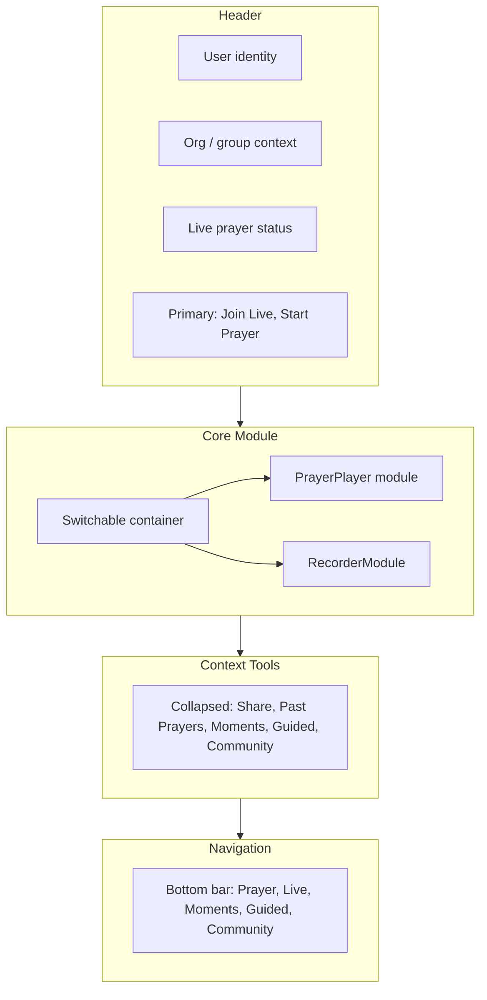

# Prayer UI Refactor: Apple-Level Simplicity and Palette System

## Phase A — UI Analysis (Findings)

### Components scanned

| File                                                                                  | Purpose                                                                                        |
| ------------------------------------------------------------------------------------- | ---------------------------------------------------------------------------------------------- |
| [PrayerApp.tsx](src/01_App/(live)%20Gospel/Prayer/PrayerApp.tsx)                      | Root: hero card with title, CTAs, player, metrics, share, library, tabs                        |
| [PrayerPlayer.tsx](src/01_App/(live)%20Gospel/Prayer/PrayerPlayer.tsx)                | Play/pause, waveform, time remaining, -15s/+15s, speed                                         |
| [ReplayTimeline.tsx](src/01_App/(live)%20Gospel/Prayer/ReplayTimeline.tsx)            | Markers for live replay; hard-coded colors                                                     |
| [PrayerRoom.tsx](src/01_App/(live)%20Gospel/Prayer/PrayerRoom.tsx)                    | Live room: join UI, ScreenShareView, AnnotationOverlay, participants, controls, ModeratorPanel |
| [AnnotationOverlay.tsx](src/01_App/(live)%20Gospel/Prayer/room/AnnotationOverlay.tsx) | Canvas strokes; hard-coded `#f97316`                                                           |

### Current layout (PrayerApp main view)

- **Single hero card** contains: brand/group logo, title, subtitle, **three primary buttons** (Pray Now, Record Prayer, Join Live Prayer), **player**, ReplayTimeline (when `source === "live_room"`), **metrics row**, LivePrayerCta, PrayerTimerSelector, **Prayer Text** (expandable), **PrayerShare**, **PrayerLibrary** (Past Prayers), **group selector**, and **tabs** (Prayer | Live | Moments | Guided | Community). Auth and admin links sit below the card.
- **Recording** is not inline: “Record Prayer” links to `/prayer/admin` where [PrayerUpload.tsx](src/01_App/(live)%20Gospel/Prayer/PrayerUpload.tsx) provides the full form + recording UI. Live room recording is in [ModeratorPanel.tsx](src/01_App/(live)%20Gospel/Prayer/room/ModeratorPanel.tsx).

### Duplicated / overlapping

- **Primary actions**: Pray Now (scroll to #player), Record Prayer (navigate to admin), Join Live (navigate to live section) are three equal-weight buttons; no clear “one thing” on the main surface.
- **Navigation**: Tabs live inside the hero card; same five areas could be a single bottom nav.
- **Context vs core**: Share, Past Prayers, Live CTA, Timer, Prayer Text, and metrics all sit in the same scroll as the player, increasing cognitive load.

### Mixing of concerns

- **Player** and **recording entry** (link) and **live entry** (link) and **metrics/share/library** are all in one vertical flow.
- **PrayerPlayer** is already focused (play, waveform, time, skip, speed) but its props are incomplete: `seekToSeconds` and `onSeekDone` are used in `useEffect` (lines 69–74) but **not** in the destructured props (line 31)—fix during refactor.

### Simplification opportunities

- Move **identity, org/group, live status** and **primary actions** (Join Live, Start Prayer) into a **Header**.
- Render **one** of: **Player module** or **Recorder module** in a **Core Module** area (no recording UI on main screen today; add RecorderModule and mode).
- Move **Share, Past Prayers, Moments, Guided, Community** into a **collapsed Context Tools** section.
- Use **bottom nav only** for Prayer | Live | Moments | Guided | Community; remove in-card tabs.
- Keep **PrayerRoom** and **ModeratorPanel** as-is for live flow; keep **PrayerUpload** for admin; add a **RecorderModule** for the main-screen “Start Prayer” → record flow (optional: RecorderModule can redirect to admin or embed minimal record UI).

---

## Phase B — Apple-style layout structure

**Target structure (PrayerApp main view only; admin/group-admin/room unchanged):**

**Tasks:**

1. Add a **Header** section at top of the main prayer view (not for platformSection pages, not for admin/room): user identity (from session), org/group context (current group name/logo), live prayer status (e.g. “X people praying now”), and exactly two primary actions: **Join Live**, **Start Prayer**.
2. Introduce a **Core Module** container that renders either **PlayerModule** or **RecorderModule** based on `mode` (see Phase E). Only one visible at a time.
3. Add a **Context Tools** section (collapsed by default): Share, Past Prayers, Moments, Guided, Community. Use a single “More” or “Tools” affordance to expand/collapse; keep existing components (PrayerShare, PrayerLibrary, links or sections for Moments/Guided/Community).
4. Replace in-card **tabs** with a **bottom navigation bar** for: Prayer, Live, Moments, Guided, Community. Route via existing `platformSection` and `basePath`/`sectionPath`; ensure layout has padding so content is not hidden behind the bar (e.g. `padding-bottom` on prayer layout or wrapper).
5. Keep **group selector** in Header or Context Tools (recommend Header for visibility).
6. Preserve **PrayerRoom** route (`/prayer/room/[roomId]`); **Join Live** can go to `/prayer/live` (or open a room from LiveSection) as today.

**Files to change:** [PrayerApp.tsx](src/01_App/(live)%20Gospel/Prayer/PrayerApp.tsx). Optionally [app/prayer/layout.tsx](src/app/prayer/layout.tsx) to add a bottom-nav wrapper or padding for the bar.

---

## Phase C — Player module

**Goal:** A single, focused player component with only playback controls.

1. **Create** [src/components/prayer/PlayerModule.tsx](src/components/prayer/PlayerModule.tsx).
2. **Contents:** Play/pause, waveform, remaining time, seek controls (-15s / +15s or click-to-seek), speed control. Use existing [PrayerPlayer.tsx](src/01_App/(live)%20Gospel/Prayer/PrayerPlayer.tsx) and [PrayerWaveform.tsx](src/01_App/(live)%20Gospel/Prayer/PrayerWaveform.tsx) internally, or move the same UI into PlayerModule and keep PrayerPlayer as a thin wrapper for backward compatibility.
3. **Fix** PrayerPlayer: add `seekToSeconds` and `onSeekDone` to the component’s destructured props so ReplayTimeline seek works (currently referenced in useEffect but not in signature).
4. **Remove** any non-player UI from the player surface (no share, no library, no record buttons inside the module). ReplayTimeline can remain **below** the player in the Core area when `current?.source === "live_room"` (or pass into PlayerModule as optional child).
5. **API:** PlayerModule receives `src`, `title?`, `onPlayingChange`, `onDurationChange`, `seekToSeconds?`, `onSeekDone?`, optional `replayTimeline` (node or data for ReplayTimeline). It does not receive navigation or record actions.

**Deliverable:** PlayerModule is the only content of the Core Module when `mode === "player"`.

---

## Phase D — Recorder module

**Goal:** A dedicated recorder for the main-screen “Start Prayer” flow with only record-specific controls.

1. **Create** [src/components/prayer/RecorderModule.tsx](src/components/prayer/RecorderModule.tsx).
2. **Contents:** Record indicator (e.g. red dot + “Recording”), timer (elapsed), **Stop** (finish and proceed to metadata/upload or hand off to existing upload flow), **Cancel** (discard and return to player mode). No play/pause or waveform; recording actions must not appear when in player mode.
3. **Logic:** Use the same pattern as [PrayerUpload.tsx](src/01_App/(live)%20Gospel/Prayer/PrayerUpload.tsx) for `MediaRecorder` (getUserMedia, start/stop, blob). Optionally reuse a small hook (e.g. `useRecording()`) shared with PrayerUpload. After Stop, either: (A) open a minimal modal/screen for title + optional description then call existing `uploadPrayer`, or (B) switch to a “preview + publish” step that reuses PrayerUpload’s submit path. Keep upload API and form data shape unchanged.
4. **Placement:** RecorderModule is rendered only when `mode === "record"` in the Core Module container.

**Deliverable:** RecorderModule is self-contained; no recording UI in the player view.

---

## Phase E — Mode switching

**Goal:** Single `mode` state driving which module is visible and which primary action is emphasized.

1. **Add mode state** in PrayerApp: `type PrayerMode = "player" | "record" | "live"`. Default `"player"` when there is a `current` prayer or when on the main prayer view; `"record"` when user chose “Start Prayer”; `"live"` when user chose “Join Live” (can be represented by navigating to `/prayer/live` or into a room, so `mode` may reset to `"player"` when returning to main view).
2. **Primary actions:**
  - **Start Prayer** → set `mode = "record"`; show RecorderModule in Core; hide PlayerModule.
  - **Join Live** → navigate to `/prayer/live` (or open room); no need to set `mode` on main screen if user leaves.
  - **Play** / having a prayer loaded and viewing main screen → `mode = "player"`; show PlayerModule; hide RecorderModule.
3. **Transitions:** After RecorderModule “Stop” + publish (or “Cancel”), set `mode = "player"` and optionally set `current` to the new prayer if published. When navigating back from Live to main prayer view, ensure `mode` is `"player"`.
4. **Implementation:** In PrayerApp, `const [mode, setMode] = useState<PrayerMode>("player")`. Render Core Module with `{mode === "player" && <PlayerModule ... />}` and `{mode === "record" && <RecorderModule ... />}`. Header buttons call `setMode("record")` or `router.push(sectionPath("live"))` (or equivalent).

**Deliverable:** Only one of PlayerModule or RecorderModule visible at a time; primary actions drive mode and navigation.

---

## Phase F — Palette system

**Goal:** Central palette definitions for Prayer (and reusable) theming.

1. **Create** [src/lib/ui/palette.ts](src/lib/ui/palette.ts).
2. **Define palette type** with at least: `background`, `surface`, `textPrimary`, `textSecondary`, `accent`, `border`. Add optional tokens if needed (e.g. `danger`, `success`) for record button and status.
3. **Define palettes:**
  - **Dark (default):** Map from existing [prayer-theme.css](src/01_App/(live)%20Gospel/Prayer/prayer-theme.css) vars (e.g. `--prayer-bg-`*, `--prayer-card-bg`, `--prayer-text`, `--prayer-text-muted`, `--prayer-accent`, `--prayer-card-border`).
  - **Light:** Light background, dark text, same structure.
  - **Church / Warm:** Warm neutrals and accent (e.g. amber/soft orange).
4. **Export:** e.g. `export const palettes = { dark: {...}, light: {...}, church: {...} }` and `export type PaletteId = keyof typeof palettes`. Components will read from React context (Phase G), not import palettes directly for rendering.

**Deliverable:** Single source of truth for palette tokens; no component uses hard-coded hex/rgba for these tokens.

---

## Phase G — Theme provider

**Goal:** Provide palette via context and allow switching.

1. **Create** [src/components/ui/ThemeProvider.tsx](src/components/ui/ThemeProvider.tsx).
2. **Responsibilities:**
  - Read current palette by id (e.g. `dark` | `light` | `church`); default `dark`.  
  - Store in React context: palette object (and optionally `setPaletteId`).  
  - Allow switching: either a small control in Prayer header/settings or a dev-only control; persist choice in `localStorage` if desired.
3. **API:** `ThemeProvider` wraps the prayer subtree (e.g. in [app/prayer/layout.tsx](src/app/prayer/layout.tsx)); children consume `useTheme()` or `usePalette()` to get `{ palette, paletteId, setPaletteId }`.
4. **Apply to root:** Inject CSS variables or inline styles from `palette` onto the prayer platform root (e.g. `className="prayer-platform"` div) so existing CSS vars can be overridden from the palette, or have components use the context directly. Prefer one place (root style block or provider wrapper) that sets vars from `palette` so existing prayer-theme.css can stay and be overridden.

**Deliverable:** ThemeProvider in place; palette switchable; default Dark.

---

## Phase H — Component color refactor

**Goal:** Replace hard-coded colors with palette tokens in Prayer and related UI.

1. **PrayerApp:** Replace inline `style={{ ... }}` and any hex/rgba with palette tokens (from context). Keep group accent override logic but map it to palette `accent` or equivalent.
2. **PrayerPlayer / PlayerModule:** Use tokens for play button, waveform, time text, skip/speed buttons (e.g. `palette.surface`, `palette.accent`, `palette.textSecondary`).
3. **RecorderModule:** Use tokens for record indicator, timer, stop/cancel buttons (e.g. `palette.accent` or `danger` for stop).
4. **Navigation (bottom bar):** Background, border, text, active state from palette.
5. **Buttons (Header, Context Tools):** Primary and secondary from palette.
6. **ReplayTimeline:** Replace `rgba(15,23,42,0.9)` and `#38bdf8` with `palette.surface` and `palette.accent` (or marker color token).
7. **AnnotationOverlay:** Replace `#f97316` with `palette.accent` or a dedicated `annotation` token.
8. **PrayerRoom, ModeratorPanel, PrayerRoomControls:** Replace any hard-coded colors with palette tokens from context (ensure ThemeProvider wraps room view or provide palette via layout).

**Deliverable:** No hard-coded colors in the refactored Prayer UI; all from palette/context.

---

## Phase I — Visual clarity improvements

**Goal:** Improve readability and reduce clutter without changing behavior.

1. **Contrast:** Ensure sufficient contrast between `surface` and `background` in all three palettes (WCAG AA where applicable).
2. **Typography:** Larger typography for primary actions (Header “Join Live”, “Start Prayer”); keep hierarchy clear (title > subtitle > body).
3. **Buttons:** Simplify button styling (consistent radius, padding, one primary style for one primary action per context).
4. **Spacing:** Clear spacing between Header, Core Module, Context Tools, and Bottom Nav; avoid cramped controls in PlayerModule and RecorderModule.
5. **Clutter:** Remove redundant labels or duplicate controls; keep Context Tools collapsed by default so the main surface is only Header + Core + Nav.

**Deliverable:** Clearer hierarchy and spacing; no new features.

---

## Phase J — Module containment

**Goal:** Player and Recorder are reusable, self-contained components.

1. **PlayerModule:** No dependency on PrayerApp route or global prayer state beyond props (`src`, callbacks, optional ReplayTimeline data). Can be imported and used in other screens (e.g. embed in another app).
2. **RecorderModule:** Same: only props for callbacks (onPublish, onCancel) and optional initial group id; no direct use of router or prayer list state inside. Publish is via callback with blob + metadata.
3. **Document** in a short comment or README that PlayerModule and RecorderModule are the canonical prayer player and recorder for the platform and can be reused.

**Deliverable:** Both modules are clearly self-contained and reusable.

---

## Phase K — Backward compatibility

**Do not break:**

- **LiveKit:** [PrayerRoom.tsx](src/01_App/(live)%20Gospel/Prayer/PrayerRoom.tsx), [usePrayerRoomWebRTC](src/01_App/(live)%20Gospel/Prayer/room/usePrayerRoomWebRTC.ts), [room/prayer-room-api](src/01_App/(live)%20Gospel/Prayer/room/), token and join flows unchanged.
- **Recording APIs:** [uploadPrayer](src/01_App/(live)%20Gospel/Prayer/api/prayer-api.ts), [useRoomRecording](src/01_App/(live)%20Gospel/Prayer/room/useRoomRecording.ts), [PrayerRoomRecorder](src/01_App/(live)%20Gospel/Prayer/room/PrayerRoomRecorder.ts); RecorderModule and PrayerUpload both use the same upload endpoint and form shape.
- **Prayer feed:** `getPrayers`, `getPrayer`, `current`, `allPrayers`, `loadPrayers`; PrayerLibrary and player still use them.
- **Annotation system:** AnnotationOverlay and signaling in PrayerRoom unchanged; only stroke color uses palette.
- **Organization system:** Groups, `getGroupBySlug`, `group`, `groupSlug`, admin and group-admin routes unchanged.

**Refactors are UI/structure only:** no changes to API contracts, auth, or data fetching.

---

## Phase L — Build validation

1. **Run** `npm run build` and fix any TypeScript errors (including the PrayerPlayer `seekToSeconds`/`onSeekDone` fix).
2. **Verify manually (or with minimal smoke tests):**
  - Player loads: main view shows PlayerModule when `mode === "player"` and a prayer is loaded; play/pause, seek, speed work.
  - Recording works: Start Prayer → RecorderModule → Stop → publish (or cancel); new prayer appears in feed when published.
  - Live room join works: Join Live → navigate to live section → join room → audio and (if host) recording in ModeratorPanel work.
  - Palette switching works: change palette in ThemeProvider; UI updates (colors and contrast).

**Deliverable:** Clean build and confirmation that the four flows above work.

---

## Implementation order summary

| Phase | Key deliverables                                                                                       |
| ----- | ------------------------------------------------------------------------------------------------------ |
| A     | Documented (this plan)                                                                                 |
| B     | Header, Core switchable area, Context Tools collapsed, Bottom nav only                                 |
| C     | PlayerModule.tsx; fix PrayerPlayer props                                                               |
| D     | RecorderModule.tsx with record indicator, timer, stop, cancel                                          |
| E     | mode state and primary actions drive Player vs Recorder vs Live                                        |
| F     | palette.ts with Dark, Light, Church                                                                    |
| G     | ThemeProvider.tsx; wrap prayer layout; default Dark                                                    |
| H     | Replace hard-coded colors in PrayerApp, Player, Recorder, Nav, ReplayTimeline, AnnotationOverlay, Room |
| I     | Contrast, typography, spacing, simplified buttons                                                      |
| J     | PlayerModule and RecorderModule self-contained and documented                                          |
| K     | No API/auth/data breaking changes                                                                      |
| L     | npm run build; verify player, recording, live join, palette switch                                     |

