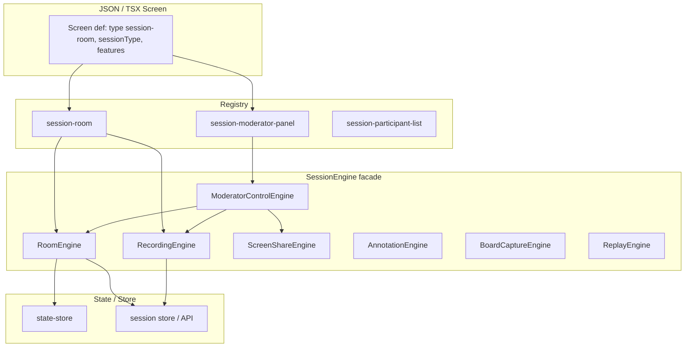

# Session Engine Standardization — Architecture Plan

This plan documents the current system, target SessionEngine design, JSON/template integration, TSX component strategy, moderator panel design, data model, and a safe refactor sequence. **No code implementation**—architecture and migration strategy only.

---

## Phase 1 — Current Structure (System Scan)

### 1.1 JSON-driven screen system

- **Entry:** [src/app/page.tsx](src/app/page.tsx) uses `effectivePath` (from `?screen=` or state) and calls `loadScreen(effectivePath)`.
- **Loader:** [src/03_Runtime/engine/core/screen-loader.ts](src/03_Runtime/engine/core/screen-loader.ts) — `loadScreen(path)`:
  - Static JSON: e.g. `container-creations-landing` → static import.
  - **TSX branch:** `path.startsWith("tsx:")` → returns `{ __type: "tsx-screen", path }` (no fetch).
  - Else → fetch `/api/screens/...` or Node fs via `safeImportJson`; default state from JSON applied only when state is empty.
- **Rendering:**
  - **JSON:** Root = `json?.root ?? json?.screen ?? json?.node ?? json` → `assignSectionInstanceKeys` → `expandOrgansInDocument` → `applySkinBindings` → `composeOfflineScreen` → **ExperienceRenderer** → **JsonRenderer** ([src/03_Runtime/engine/core/json-renderer.tsx](src/03_Runtime/engine/core/json-renderer.tsx)) recurses on node tree; `node.type` → component from **Registry**.
  - **TSX:** `data?.__type === "tsx-screen"` → `resolveTsxScreen(path)` + **TSXScreenWithEnvelope**; synthetic tree `{ type: "json-skin", children: [{ type: "tsx-embed", params: { path } }] }` → same ExperienceRenderer; **JsonSkinEngine** ([src/05_Logic/logic/engines/json-skin.engine.tsx](src/05_Logic/logic/engines/json-skin.engine.tsx)) handles `tsx-embed` by resolving component from **TsxEmbedProvider** and rendering it.

**Conclusion:** JSON maps to TSX only for full-screen TSX via `tsx-embed` (one component per screen). There is no existing JSON node type for “session room” or “session panel”; adding one would require new registry entries and optional tsx-embed or dedicated React components.

### 1.2 Template structure (8 types)

- **Definition:** [src/system/registry/templateRegistry.ts](src/system/registry/templateRegistry.ts) — `StructureType` = `list | board | dashboard | editor | timeline | detail | wizard | gallery`.
- **Built-in data:** [src/lib/tsx-structure/resolver/builtinTemplates.ts](src/lib/tsx-structure/resolver/builtinTemplates.ts) — `BUILTIN_TEMPLATES[structureType][templateId]` (density, columns, grid, etc.); each combination auto-registers as `structureType:templateId`.
- **Selection:** [src/lib/tsx-structure/TSXScreenWithEnvelope.tsx](src/lib/tsx-structure/TSXScreenWithEnvelope.tsx) uses `getDefaultTsxEnvelopeProfile(screenPath)` and path conventions; optional overrides via TsxStructurePanel (structure type + templateId).
- **Template loader:** [src/lib/tsx-structure/resolver/templateLoader.ts](src/lib/tsx-structure/resolver/templateLoader.ts) — `getTemplateForScreen(structureType, templateId)`.

**Conclusion:** Sessions (room UI, moderator panel, timeline) can be modeled as a **new structure type** (e.g. `session`) or as a **detail/editor** variant. Convention: session screens use a dedicated structure type and templateIds (e.g. `session:default`, `session:moderator`) so layout/chrome stay consistent with the rest of the platform.

### 1.3 Layout definitions

- **Unified resolver:** [src/04_Presentation/layout/resolver/layout-resolver.ts](src/04_Presentation/layout/resolver/layout-resolver.ts) — `resolveLayout(layout, context?)` → `LayoutDefinition` (containerWidth, split, backgroundVariant, moleculeLayout, container).
- **Page + component:** Page layout from [layout-definitions.json](src/04_Presentation/layout/data/layout-definitions.json) via page-layout-resolver and component-layout-resolver; molecule layout from [src/04_Presentation/lib-layout/molecule-layout-resolver.ts](src/04_Presentation/lib-layout/molecule-layout-resolver.ts).
- **Usage:** JsonRenderer and section/card layout use `resolveLayout` and profile (section layout id, card presets).

**Conclusion:** Session UIs (room, moderator panel, participant list) should consume the same `resolveLayout` and layout-definitions where applicable (e.g. sidebar vs floating panel defined as component layouts).

### 1.4 Component registry

- **Single registry:** [src/03_Runtime/engine/core/registry.tsx](src/03_Runtime/engine/core/registry.tsx) — one map: **JSON `node.type`** (string) → React component.
- **Resolution:** JsonRenderer does `Registry[resolvedNode.type]`; missing type → debug “Missing registry entry”.
- **Atoms/molecules:** Atoms from `@/components/atoms`; 12 molecules via `getCompoundComponent(id)` from `@/components/molecules`; layout molecules (row, column, grid, stack, page) from `@/lib/layout/molecules`.

**Conclusion:** To drive sessions from JSON, add new node types (e.g. `session-room`, `session-moderator-panel`, `session-participant-list`, `session-timeline`) and register components that wrap SessionEngine (or sub-engines). No second registry; everything stays in the same Registry.

### 1.5 Palette/theme system

- **Definition:** [src/04_Presentation/palettes/](src/04_Presentation/palettes/) — JSON palettes; index builds `palettes` by filename.
- **Store:** [src/03_Runtime/engine/core/palette-store.ts](src/03_Runtime/engine/core/palette-store.ts) — `getPaletteName()` from state; `getPalette()` from palettes; `setPalette(name)` dispatches state.
- **Bridge:** [src/06_Data/site-renderer/palette-bridge.tsx](src/06_Data/site-renderer/palette-bridge.tsx) — sets CSS variables on root. JsonSkinEngine and TSXScreenWithEnvelope use palette for vars-only/full-scope.

**Conclusion:** Session components must not hardcode colors; use palette tokens and CSS variables so sessions respect the active theme.

### 1.6 Layout resolver (see 1.3)

Already covered. Session moderator panel and room layout should use the same resolver for consistency.

### 1.7 Behavior runner

- **Behavior:** [src/03_Runtime/behavior/behavior-runner.ts](src/03_Runtime/behavior/behavior-runner.ts) — `runBehavior(domain, action, ctx, args)`; resolves handler from behavior.json / navigation; **BehaviorEngine** runs handlers (e.g. interact.tap, navigation).
- **Actions:** [src/05_Logic/logic/runtime/action-runner.ts](src/05_Logic/logic/runtime/action-runner.ts) — `runAction(action, state)`; handlers from [action-registry.ts](src/05_Logic/logic/runtime/action-registry.ts).
- **Wiring:** [behavior-listener](src/03_Runtime/engine/core/behavior-listener.ts) listens for trigger events; infers domain; calls `runBehavior` or dispatches state updates.

**Conclusion:** Session actions (mute, start/stop recording, end session) can be exposed as behaviors or actions so JSON can bind buttons to them without hardcoding in the session component.

### 1.8 State store

- **Store:** [src/03_Runtime/state/state-store.ts](src/03_Runtime/state/state-store.ts) — append-only log; **deriveState(log)** in [state-resolver.ts](src/03_Runtime/state/state-resolver.ts); `getState()`, `subscribeState()`, `dispatchState(intent, payload)`.
- **Shape:** `journal`, `currentView`, `values` (generic key/value), `layoutByScreen`, `dashboardLayout`, etc.
- **Persistence:** [persistence-adapter.ts](src/03_Runtime/state/persistence-adapter.ts); rehydration replays log.

**Conclusion:** SessionEngine can use the same store for “current session id”, “recording on”, “screen share on”, etc., so JSON and TSX screens stay in sync. Domain-specific session data (participants, recordings, boards) can remain in a dedicated store (or API) and be referenced by state keys (e.g. `state.values.sessionId`).

---

## Phase 2 — Session Engine Analysis (Prayer / Live Room)

### 2.1 Current implementation map


| Area                       | Location                                                                                                                                                                                                                                                        | Notes                                                                                        |
| -------------------------- | --------------------------------------------------------------------------------------------------------------------------------------------------------------------------------------------------------------------------------------------------------------- | -------------------------------------------------------------------------------------------- |
| **LiveKit**                | [src/app/api/prayer-room/token/route.ts](src/app/api/prayer-room/token/route.ts), [usePrayerRoomWebRTC.ts](src/01_App/(live) Gospel/Prayer/room/usePrayerRoomWebRTC.ts), [PrayerRoom.tsx](src/01_App/(live) Gospel/Prayer/PrayerRoom.tsx)                       | Token API; hook: Room, connect, publish/subscribe; UI uses hook.                             |
| **Participant management** | [data/store.ts](src/01_App/(live) Gospel/Prayer/data/store.ts) (`RoomRecord`, `RoomParticipantRecord`), [api/prayer-room/join](src/app/api/prayer-room/join/route.ts), [PrayerRoomParticipants.tsx](src/01_App/(live) Gospel/Prayer/PrayerRoomParticipants.tsx) | Store + API + list UI.                                                                       |
| **Mute**                   | [api/prayer-room/mute](src/app/api/prayer-room/mute/route.ts), [PrayerRoomControls.tsx](src/01_App/(live) Gospel/Prayer/PrayerRoomControls.tsx), hook `myMuted`/`setMyMuted`                                                                                    | Host-only server mute + local mute state.                                                    |
| **Recording**              | [PrayerRoomRecorder.ts](src/01_App/(live) Gospel/Prayer/room/PrayerRoomRecorder.ts)                                                                                                                                                                             | Client MediaRecorder on stream; not yet wired in UI; mixedStream in hook is intended source. |
| **Screen share**           | Plans only (e.g. LiveKit screen track); not implemented.                                                                                                                                                                                                        |                                                                                              |
| **Prayer feed**            | [MomentsSection.tsx](src/01_App/(live) Gospel/Prayer/moments/MomentsSection.tsx), prayers.json                                                                                                                                                                  | Prayer list; not live event stream.                                                          |
| **Groups**                 | [data/store.ts](src/01_App/(live) Gospel/Prayer/data/store.ts) (groups, members), [api/prayer/groups](src/app/api/prayer/groups/route.ts), [GroupAdmin.tsx](src/01_App/(live) Gospel/Prayer/GroupAdmin.tsx)                                                     | Reusable group/membership pattern; prayer-scoped.                                            |


### 2.2 Prayer app entry point

- **Route:** [src/app/prayer/[[...slug]]/page.tsx](src/app/prayer/[[...slug]]/page.tsx) renders `<PrayerApp slug={slug} />` directly.
- **Not** using the main app `page.tsx` screen loader or `tsx-embed` pipeline. So prayer (and thus the live room) is currently **outside** the JSON-driven screen system. Integrating sessions into that system requires either:
  - Registering a TSX screen that renders Prayer (or a session-only shell) and loading it via `?screen=tsx:(live) Gospel/Prayer/PrayerApp`, or
  - Introducing JSON-driven “session” node types that render via Registry and optionally host an embedded session UI (which could still use the same room/participant/recording logic).

### 2.3 Reusable vs prayer-specific

- **Reusable (candidates for engine):** RoomRecord / RoomParticipantRecord and room CRUD in store; types in [PrayerRoomTypes.ts](src/01_App/(live) Gospel/Prayer/PrayerRoomTypes.ts); [PrayerRoomParticipants](src/01_App/(live) Gospel/Prayer/PrayerRoomParticipants.tsx) and [PrayerRoomControls](src/01_App/(live) Gospel/Prayer/PrayerRoomControls.tsx) (host-centric audio room); [usePrayerRoomWebRTC](src/01_App/(live) Gospel/Prayer/room/usePrayerRoomWebRTC.ts) (connect, publish, subscribe, merge participants, mute state); [PrayerRoomRecorder](src/01_App/(live) Gospel/Prayer/room/PrayerRoomRecorder.ts) (generic MediaRecorder wrapper).
- **Prayer-specific:** All routes under `/api/prayer`* and `/api/prayer-room*` (they use Prayer store and naming); prayer-room-api.ts; PrayerRoom.tsx, PrayerApp.tsx, GroupAdmin, LiveSection, MomentsSection; group filtering for rooms and prayers; upload/feed.

---

## Phase 3 — Engine Extraction Model (Target Architecture)

### 3.1 Core abstraction: SessionEngine

**SessionEngine** is a **facade** that composes sub-engines and exposes a single integration point for the app (JSON-driven or TSX). It does not replace the JSON/template pipeline; it plugs into it.

- **Session types:** `prayer | study | meeting | teaching | discussion` (configurable per screen or room).
- **Capabilities:** rooms, participants, recording, screen share, annotations, study boards, replay timeline. Each capability is implemented by a **modular engine**; SessionEngine wires them and exposes a minimal API (e.g. “start session”, “current session state”, “actions”).

### 3.2 Proposed sub-engines


| Engine                     | Responsibility                                                                                                                       | Reusable building block                                                                                      |
| -------------------------- | ------------------------------------------------------------------------------------------------------------------------------------ | ------------------------------------------------------------------------------------------------------------ |
| **RoomEngine**             | Create/join/end room; participant list; roles (host/speaker/listener); LiveKit (or other) connection.                                | Current room store + API pattern + usePrayerRoomWebRTC-like hook (generalized).                              |
| **RecordingEngine**        | Start/stop recording; source stream (e.g. mixed); blob/upload pipeline; optional server-side recording.                              | PrayerRoomRecorder + wiring to RoomEngine’s stream.                                                          |
| **ScreenShareEngine**      | Start/stop screen share; one shared screen per room; viewer component; moderator can stop.                                           | New; LiveKit screen track + UI.                                                                              |
| **AnnotationEngine**       | Toggle annotations on/off; capture drawing/pointer state; optional persistence.                                                      | New; can be stub initially.                                                                                  |
| **BoardCaptureEngine**     | Capture “board” (e.g. canvas or screenshot); label board; attach to session.                                                         | New; can be stub initially.                                                                                  |
| **ReplayEngine**           | Timeline of session events; playback of recordings; link recordings to boards/annotations.                                           | New; timeline data model + UI.                                                                               |
| **ModeratorControlEngine** | Host-only controls: mute participant, start/stop recording, start/stop screen share, toggle annotations, capture board, end session. | Wraps actions from Room, Recording, ScreenShare, Annotation, BoardCapture; exposes to ModeratorControlPanel. |


Each engine is **independently usable**: e.g. a “study” session might use Room + Recording + BoardCapture; a “prayer” session might use Room + Recording only. SessionEngine composes them by configuration (e.g. `features: ["audio","recording","moderation"]`).

### 3.3 Diagram (target)




---

## Phase 4 — JSON Template Integration

### 4.1 Session as a JSON-driven screen

- **Option A — Full screen is TSX:** Keep a dedicated route (e.g. `/prayer/...`) or register a TSX screen path that renders a “session” template (e.g. PrayerApp or a generic SessionApp). The JSON-driven system then loads it via `tsx:...` and the existing tsx-embed pipeline. No new node type; session is just another TSX screen.
- **Option B — Session as node types (recommended for reuse):** Define session screens in JSON with a root (or section) that uses a **session-room** (or similar) node type. Example:

```json
{
  "type": "session-room",
  "params": {
    "sessionType": "prayer",
    "features": ["audio", "recording", "moderation"]
  },
  "children": []
}
```

- **Registry:** Add `session-room` → `SessionRoomComponent`. The component uses SessionEngine (or a thin wrapper) and reads `sessionType` and `features` from params; it does **not** bypass the JSON screen builder—it is one node in the tree rendered by JsonRenderer.
- **Behavior:** Buttons in the same JSON tree (e.g. “End session”) can trigger behaviors that call into SessionEngine or dispatch state that the engine subscribes to.

### 4.2 Do not bypass the pipeline

- Sessions must **render through** ExperienceRenderer → JsonRenderer (or JsonSkinEngine for tsx-embed). So either:
  - Session UI is a **registry component** (e.g. `session-room`) that receives node/params from JsonRenderer and uses SessionEngine under the hood, or
  - The whole screen is a TSX screen (tsx-embed) that internally uses SessionEngine and is still loaded and composed by the same pipeline (profile, layout, palette).

### 4.3 Example: hybrid screen

- A JSON screen could have a **section** with **session-room** and a **section** with **session-moderator-panel**. Both are registry components; both receive params (e.g. `sessionType`, `features`, `roomId` from state). Layout and theme come from the existing layout resolver and palette.

---

## Phase 5 — TSX Template Strategy

### 5.1 Template types that can host sessions

- **Existing:** `editor` (toolbar + content + sidebars) and `detail` (master/detail) are good fits for “room + sidebar panel” or “room + list + detail”.
- **New (recommended):** Add **structure type `session`** and templateIds such as `default`, `moderator-focused`, `minimal`, so session screens get consistent layout/chrome via the same template system.

### 5.2 Components to become reusable molecules

- **SessionRoomTemplate** — Top-level layout for a session screen (room area + optional sidebars). Can be a TSX template that uses `useAutoStructure()` and session structure type; or a registry component that composes layout molecules.
- **SessionModeratorPanel** — Floating or sidebar panel; host-only; uses ModeratorControlEngine for actions. Should be a **molecule** (or registry type `session-moderator-panel`) so any JSON screen can include it.
- **SessionScreenViewer** — Displays shared screen (from ScreenShareEngine). Registry type `session-screen-viewer` or part of `session-room`.
- **SessionParticipantList** — List of participants with avatars, roles, mute state. Already exists as PrayerRoomParticipants; generalize to **SessionParticipantList** and register as `session-participant-list`.
- **SessionTimeline** — Replay timeline (ReplayEngine). New component; register as `session-timeline` when implemented.

### 5.3 Convention alignment

- Use the same envelope profile and structure resolution as other TSX screens (getDefaultTsxEnvelopeProfile, resolveAppStructure). Session-specific layout (e.g. “room full width, panel overlay”) can be a component layout id in layout-definitions.json used by the session components.

---

## Phase 6 — Moderator Control Panel

### 6.1 Requirements

- **Presentation:** Floating panel or sidebar; non-intrusive.
- **Visibility:** Host-only (role from RoomEngine or session state).
- **Controls:** Mute participant, start/stop recording, start/stop screen share, toggle annotations, capture board, label board, end session.

### 6.2 Design

- **Component:** `SessionModeratorPanel` (or `ModeratorControlPanel`) — receives `roomId`, `sessionId`, `participants`, and callbacks or a **ModeratorControlEngine** instance. It does not hold business logic; it calls into the engines (or dispatches actions that the engines react to).
- **Layout:** Resolved via layout-resolver; e.g. a “floating” component layout (position fixed, corner) or “sidebar” component layout. Use palette tokens for background, border, typography.
- **Integration:** Registered as `session-moderator-panel` (or `moderator-control-panel`). JSON screen can include a node of this type in a section; TSX session screens can render the same component. Behavior runner or action-registry can be used so “End session” button triggers the same logic as the panel.

---

## Phase 7 — Data Model Standardization

### 7.1 Unified SessionRecord (target)

Proposed shape (compatible with JSON storage and centralized state):

- **SessionRecord**
  - `id`: string
  - `type`: `prayer | study | meeting | teaching | discussion`
  - `roomId`: string (links to RoomRecord if using RoomEngine)
  - `participants`: array of participant records (id, role, displayName, muted, joinedAt)
  - `recordings`: array of { id, startedAt, endedAt, blobRef or url, label? }
  - `boards`: array of { id, capturedAt, label?, imageRef? }
  - `annotations`: optional (e.g. array of events or blob refs)
  - `timeline`: optional (e.g. events for replay)
  - `createdAt`: string (ISO)
  - `endedAt?`: string (ISO)

Existing **RoomRecord** in [store.ts](src/01_App/(live) Gospel/Prayer/data/store.ts) already has roomId, hostId, participants, status, createdAt. **SessionRecord** can extend or reference it: e.g. `SessionRecord.roomId` points to `RoomRecord.roomId`; `SessionRecord.recordings` and `boards` live in session-specific storage or API. This keeps compatibility with current rooms.json and allows a single store.ts (or a shared session store) to be used by both prayer and other session types.

### 7.2 Compatibility

- **Centralized store (state-store):** Use `state.values.sessionId`, `state.values.recordingOn`, etc., for UI and feature flags; keep heavy data (participants, recordings, boards) in session store or API.
- **Prayer store:** Keep getRooms/saveRooms and RoomRecord; SessionEngine (or RoomEngine) can use a **adapter** that reads/writes RoomRecord for “prayer” session type. Other session types can use a different adapter or the same store with a `type` field.

---

## Phase 8 — Implementation Plan (Refactor Steps)

Safe migration order (minimize disruption):

1. **Stabilize prayer live rooms** — Ensure current LiveKit-based prayer room (create/join/end, mute, participants, mixedStream) is stable and tests pass. No new engine yet.
2. **Introduce SessionEngine abstraction** — Add a facade module (e.g. `SessionEngine` or `session-engine/index.ts`) that:
  - Accepts config (sessionType, features).
  - Delegates to RoomEngine (first sub-engine). RoomEngine wraps current room store + API + WebRTC hook (generalized from prayer). Prayer app continues to use the same backend but can optionally go through SessionEngine.
3. **Extract RecordingEngine** — Move PrayerRoomRecorder into a generic RecordingEngine; wire it to RoomEngine’s stream (e.g. mixedStream). Expose start/stop from SessionEngine. Optionally add “Start recording” to PrayerRoomControls.
4. **Extract ScreenShareEngine** — Implement screen share (e.g. LiveKit screen track); add ScreenShareEngine; wire to SessionEngine and moderator controls. UI: viewer component + “Share screen” / “Stop share” in moderator panel.
5. **Extract AnnotationEngine and BoardCaptureEngine** — Stub or minimal implementation; register with SessionEngine; add toggle/capture to moderator panel.
6. **Integrate moderator panel** — Implement SessionModeratorPanel (or ModeratorControlPanel) that uses ModeratorControlEngine; add floating/sidebar layout; register as `session-moderator-panel`. Use it in prayer room first, then from JSON.
7. **Enable session templates** — Add structure type `session` and templateIds in builtinTemplates; optionally add SessionRoomTemplate that uses them. Ensure session screens (TSX or JSON) use getDefaultTsxEnvelopeProfile and resolveLayout.
8. **Enable reuse across apps** — Add registry entries for `session-room`, `session-moderator-panel`, `session-participant-list`, `session-screen-viewer`, `session-timeline`. Document JSON schema for session-room and session-moderator-panel. Allow other apps (e.g. study, meeting) to load a screen with `type: "session-room"` and appropriate params.

Each step should be shippable without breaking existing prayer flows; prayer remains the first consumer of SessionEngine.

---

## Phase 9 — Report Summary

### CURRENT STRUCTURE

- **Screens:** JSON (loadScreen → fetch/static) or TSX (loadScreen → `tsx:` → resolveTsxScreen → TSXScreenWithEnvelope → synthetic json-skin + tsx-embed → JsonSkinEngine). Prayer app is served by its own route `/prayer/[[...slug]]`, not by the main screen loader.
- **Templates:** 8 structure types; BUILTIN_TEMPLATES + templateRegistry; envelope profile by path and optional overrides.
- **Layout:** Single layout-resolver (page + component + molecule); layout-definitions.json.
- **Registry:** One map (node.type → component); atoms, 12 molecules, layout molecules, cards, etc.
- **Palette/state/behavior:** Palette from state and palette-store; state from append-only log and deriveState; behavior from behavior-runner and action-registry.
- **Prayer live:** RoomRecord in store; LiveKit token + usePrayerRoomWebRTC; PrayerRoom, PrayerRoomControls, PrayerRoomParticipants; recording stub (PrayerRoomRecorder); no screen share/annotations/boards yet.

### TARGET STRUCTURE

- **SessionEngine** as a facade composing: RoomEngine, RecordingEngine, ScreenShareEngine, AnnotationEngine, BoardCaptureEngine, ReplayEngine, ModeratorControlEngine.
- Sessions configurable by **sessionType** and **features**; each sub-engine independently reusable.
- **JSON integration:** New node types (`session-room`, `session-moderator-panel`, etc.) rendered via Registry; sessions do not bypass the JSON/template pipeline.
- **TSX:** Session screens can use a new structure type `session` and existing envelope/chrome; session components follow the same template and palette conventions.

### ENGINE BREAKDOWN

- RoomEngine — rooms, participants, roles, LiveKit.
- RecordingEngine — start/stop, stream → blob/upload.
- ScreenShareEngine — one shared screen, viewer, moderator stop.
- AnnotationEngine — toggle, capture (stub).
- BoardCaptureEngine — capture/label board (stub).
- ReplayEngine — timeline, playback (stub).
- ModeratorControlEngine — host-only actions for all of the above.

### JSON TEMPLATE INTEGRATION

- Add registry types for session UI; use `params.sessionType` and `params.features` to configure SessionEngine. Sessions render as part of the same ExperienceRenderer → JsonRenderer (or JsonSkinEngine) flow.

### TSX COMPONENT PLAN

- SessionRoomTemplate (layout); SessionModeratorPanel, SessionParticipantList, SessionScreenViewer, SessionTimeline as molecules or registry components; all use palette and layout resolver.

### REFACTOR STRATEGY

- Eight steps: stabilize prayer → SessionEngine + RoomEngine → RecordingEngine → ScreenShareEngine → Annotation/Board stubs → Moderator panel → Session templates → Registry and reuse. Each step incremental and backward-compatible with existing prayer behavior.

---

## Document status

This plan is **architecture and strategy only**. Implementation will follow in a separate effort, using this document as the single source of truth for how the Session Engine integrates with the JSON-driven UI, the 8 TSX template structure, and the existing prayer/live room implementation.