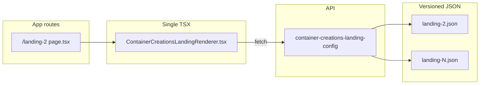

# Single Container Creations landing TSX refactor

## Goal

- **Exactly one** implementation file under Container Creations for the JSON-driven landing wizard: `[ContainerCreationsLandingRenderer.tsx](src/01_App/(live)`%20Business/Container_Creations/ContainerCreationsLandingRenderer.tsx).
- **No** `[landing-2.tsx](src/01_App/(live)`%20Business/Container_Creations/landing-2.tsx) (delete).
- Versioned **JSON** files unchanged in role (`landing-2.json`, future `landing-3.json`, etc.); API in `[route.ts](src/app/api/container-creations-landing-config/route.ts)` already maps `version` → `landing-{n}.json` and `variant` → legacy names.
- Preserve **current behavior**: `/landing-2` still works; `?variant=` / `?version=` behavior unchanged; dev screens that used `tsx:(live) Business/Container_Creations/landing-2` still resolve.

## Why extra edits outside the feature folder are required

`[src/lib/tsx-screen-resolver.tsx](src/lib/tsx-screen-resolver.tsx)` and `[src/app/dev/page.tsx](src/app/dev/page.tsx)` build `AUTO_TSX_MAP` from `require.context` on `(live) Business/**/*.tsx`. Deleting `landing-2.tsx` **removes** the auto key `(live) Business/Container_Creations/landing-2` unless we add an **explicit** import alias to the same module. Without this, bookmarks / dev URLs using the old path break.

## Implementation steps

### 1. Default props on the generic renderer (behavior lock)

In `[ContainerCreationsLandingRenderer.tsx](src/01_App/(live)`%20Business/Container_Creations/ContainerCreationsLandingRenderer.tsx):

- Make `componentName` and `configVersion` **optional** in the props type with **defaults** `componentName = "landing-2"` and `configVersion = "2"` (today’s `/landing-2` behavior when no query overrides).
- This allows:
  - `[app/landing-2/page.tsx](src/app/landing-2/page.tsx)` to render `<ContainerCreationsLandingRenderer />` with no props (same network/API behavior as today’s wrapper).
  - Dev dynamic import of the module **without** props (required for `next/dynamic` + default export).

### 2. Simplify the App Router entry

Update `[src/app/landing-2/page.tsx](src/app/landing-2/page.tsx)`:

- Replace `import Landing2 from ".../landing-2"` with default import from `ContainerCreationsLandingRenderer`.
- Export `default function Landing2Page() { return <ContainerCreationsLandingRenderer />; }` (optional explicit props for readability; defaults match).

### 3. Remove redundant TSX files in the feature folder

- **Delete** `[landing-2.tsx](src/01_App/(live)`%20Business/Container_Creations/landing-2.tsx) (thin wrapper no longer needed).
- **Delete** `[Onboarding.tsx](src/01_App/(live)`%20Business/Container_Creations/Onboarding.tsx): it is a full duplicate of the renderer (same default export name / logic); it is not part of a minimal “one TSX” story and risks drift.

### 4. Preserve dev TSX path `.../landing-2`

Add the same **explicit** entry to both maps (must match):

- `[src/lib/tsx-screen-resolver.tsx](src/lib/tsx-screen-resolver.tsx)` — in `EXPLICIT_TSX_MAP`:
  - `"(live) Business/Container_Creations/landing-2": () => import(".../ContainerCreationsLandingRenderer")`
- `[src/app/dev/page.tsx](src/app/dev/page.tsx)` — in `EXPLICIT_TSX_MAP`:
  - identical line

`resolveTsxScreen` checks `EXPLICIT_TSX_MAP` before `AUTO_TSX_MAP`, so the legacy string continues to load the single implementation with default props.

### 5. Convention / wizard metadata (optional one-line)

`[convention.ts](src/lib/tsx-structure/resolver/convention.ts)` already maps `"(live) Business/Container_Creations/landing-2"` to `wizard`. **Keep** that line so structure resolution for the **legacy dev path string** stays valid. Optionally **add** a parallel entry for `"(live) Business/Container_Creations/ContainerCreationsLandingRenderer"` with the same `wizard` config so navigator/convention works if the screen key ever uses the new filename—small, low-risk consistency.

### 6. JSON asset sanity

- If `[landing-2.json](src/01_App/(live)`%20Business/Container_Creations/landing-2.json) is missing from the working tree, **restore** it (API default and fallback depend on it). No schema change required for this refactor.

### 7. Verify and build

- Run `npm run build` from repo root and fix any TypeScript or import errors limited to the touched files.

## Final architecture (after change)

## Answers after implementation (for your README / handoff)

| Question                          | Answer                                                                                                                                                                                                                                                            |
| --------------------------------- | ----------------------------------------------------------------------------------------------------------------------------------------------------------------------------------------------------------------------------------------------------------------- |
| **Final single TSX file**         | `[src/01_App/(live) Business/Container_Creations/ContainerCreationsLandingRenderer.tsx](src/01_App/(live)`%20Business/Container_Creations/ContainerCreationsLandingRenderer.tsx)                                                                                  |
| **How to add a new JSON version** | 1) Add `landing-N.json` under `Container_Creations`. 2) Either add `src/app/landing-N/page.tsx` with `<ContainerCreationsLandingRenderer componentName="..." configVersion="N" />`, or drive via URL `?version=N` / legacy `?variant=...` per existing API rules. |

## Files touched (complete list)

| File                                                                                                                              | Action                                                |
| --------------------------------------------------------------------------------------------------------------------------------- | ----------------------------------------------------- |
| `[ContainerCreationsLandingRenderer.tsx](src/01_App/(live)`%20Business/Container_Creations/ContainerCreationsLandingRenderer.tsx) | Edit (default props / optional props)                 |
| `[landing-2.tsx](src/01_App/(live)`%20Business/Container_Creations/landing-2.tsx)                                                 | **Delete**                                            |
| `[Onboarding.tsx](src/01_App/(live)`%20Business/Container_Creations/Onboarding.tsx)                                               | **Delete**                                            |
| `[src/app/landing-2/page.tsx](src/app/landing-2/page.tsx)`                                                                        | Edit (import + usage)                                 |
| `[src/lib/tsx-screen-resolver.tsx](src/lib/tsx-screen-resolver.tsx)`                                                              | Edit (`EXPLICIT_TSX_MAP` alias)                       |
| `[src/app/dev/page.tsx](src/app/dev/page.tsx)`                                                                                    | Edit (`EXPLICIT_TSX_MAP` alias)                       |
| `[convention.ts](src/lib/tsx-structure/resolver/convention.ts)`                                                                   | Optional: add `ContainerCreationsLandingRenderer` key |
| `[landing-2.json](src/01_App/(live)`%20Business/Container_Creations/landing-2.json)                                               | Restore if missing                                    |

No changes to `[route.ts](src/app/api/container-creations-landing-config/route.ts)` are required for this refactor unless you want new naming rules for non-`landing-N` filenames later.