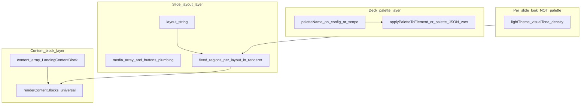

# Slide builder: three-layer architecture and implementation plan

## 1) Short diagnosis — what is missing right now

- **Deck palette layer:** **Not implemented for the landing deck.** The HiSense palette system exists and drives **global** CSS variables via state + `[palette-store](C:/Users/New User/Documents/HiSense-1ea2985/src/03_Runtime/engine/core/palette-store.ts)` and `[palette-bridge](C:/Users/New User/Documents/HiSense-1ea2985/src/06_Data/site-renderer/palette-bridge.tsx)` (used from `[layout.tsx](C:/Users/New User/Documents/HiSense-1ea2985/src/app/layout.tsx)`). **Landing JSON has no `paletteName` (or equivalent) at the deck root** for the slide builder path, and `[ContainerCreationsLandingRenderer](C:/Users/New User/Documents/HiSense-1ea2985/src/01_App/(live)`%20Business/Container_Creations/ContainerCreationsLandingRenderer.tsx) does **not** call `setPalette` or `applyPaletteToElement`. The old **“style preset”** UI only patches `**lightTheme` / `visualTone` / `density`** (`[slide-builder-recipes.ts](C:/Users/New User/Documents/HiSense-1ea2985/src/lib/slide-builder-recipes.ts)`, `[landing-screen-presentation.ts](C:/Users/New User/Documents/HiSense-1ea2985/src/lib/landing-screen-presentation.ts)`) — **not** the palette catalog.
- **Layout / structure layer:** **Partially implemented.** `screen.layout` is a **closed enum** of behaviors implemented as **hand-authored JSX** in a `switch` (e.g. `hero` puts **video/media in one section, title/subtitle/content in another** — see ~1327+ in `ContainerCreationsLandingRenderer.tsx`). There is **no** user-facing “title above vs below image” toggle independent of picking a different `layout` string. **Fine-grained structure (zones, slots)** is **not** in JSON today.
- **Content / block layer:** **Engine is strong; builder is weak.** `[LandingContentBlock](C:/Users/New User/Documents/HiSense-1ea2985/src/lib/landing-content-blocks/types.ts)` + `[renderContentBlocks](C:/Users/New User/Documents/HiSense-1ea2985/src/lib/landing-content-blocks/renderContentBlocks.tsx)` support many block types (heading, checklist with multiple items, comparison, CTA band, etc.). `**[NodeInspector](C:/Users/New User/Documents/HiSense-1ea2985/src/app/ui/control-dock/editor/NodeInspector.tsx)` only edits a subset** (paragraph-like text + badge); **no add/remove/reorder**, **no multi-bullet checklist editing**, **no structured editors** for most block types. Inline canvas editing exists for **title/subtitle** via `[InlineEditableText](C:/Users/New User/Documents/HiSense-1ea2985/src/app/ui/control-dock/editor/InlineEditableText.tsx)`, not for arbitrary blocks.

**Blunt summary:** the product **feels** like a form inspector because **layers 1 and 3 are largely absent** in the builder UI; layer 2 exists only as **coarse layout strings**, not as intuitive “where things go” controls.

---

## 2) Corrected architecture — three layers (mental model)

- **Deck palette:** Brand / tokens for **the whole deck preview** (and persisted on export): colors, radii, spacing scale, type scale, font stacks — **from `@/palettes` JSON** via `setPaletteVarsOnElement` logic in `[palette-bridge.tsx](C:/Users/New User/Documents/HiSense-1ea2985/src/06_Data/site-renderer/palette-bridge.tsx)`.
- **Slide layout:** **Which regions exist and in what order** (hero band vs two columns vs proof shell). Expressed today as `**layout` + `media[]` + `buttons[]` + top-level `title`/`subtitle`**, implemented in **React structure**, not as a free-form canvas.
- **Content blocks:** **Ordered list** of typed blocks inside the text/stack region(s). **Must stay universal:** layouts continue to call `**renderContentBlocks(screen.content, …)` only** (existing invariant in `ContainerCreationsLandingRenderer`).
- **Per-slide “look” (`lightTheme`, `visualTone`, `density`):** **Not palette.** These are **step-level presentation** (steel vs light chrome, bold vs soft weight, compact rhythm) wired to `data-*` attributes and `[landing-theme.css](C:/Users/New User/Documents/HiSense-1ea2985/src/app/landing/landing-theme.css)`. **Keep them separate from deck palette** in the UI: label as **“Step look”** or **“Slide rhythm & contrast”** so users do not confuse them with **brand theme**.

---

## 3) What already exists in HiSense per layer

### Layer 1 — Deck palette (existing system)

| Piece                                                                                                            | Role                                                                                                                      |
| ---------------------------------------------------------------------------------------------------------------- | ------------------------------------------------------------------------------------------------------------------------- |
| [`@/palettes` JSON](C:/Users/New User/Documents/HiSense-1ea2985/src/palettes) (consumed via `palettes` object)   | Source of token definitions                                                                                               |
| `[palette-store.ts](C:/Users/New User/Documents/HiSense-1ea2985/src/03_Runtime/engine/core/palette-store.ts)`    | `setPalette`, `getPaletteName`, `subscribePalette`; **active name in `state.values.paletteName`**                         |
| `[palette-bridge.tsx](C:/Users/New User/Documents/HiSense-1ea2985/src/06_Data/site-renderer/palette-bridge.tsx)` | Maps palette JSON → `**--color-*`, `--spacing-*`, `--font-size-*`, `--font-family-*`, radii, shadows, line-height**, etc. |
| `applyPaletteToElement(element, paletteName)`                                                                    | **Scoped one-shot** apply (ideal for “this deck only” without hijacking the whole app)                                    |
| `usePaletteCSS(containerRef?)` in `[layout.tsx](C:/Users/New User/Documents/HiSense-1ea2985/src/app/layout.tsx)` | Applies **active** palette to `document.documentElement` or `**.palette-scope`** in dev                                   |

**Landing CSS coupling:** `[landing-theme.css](C:/Users/New User/Documents/HiSense-1ea2985/src/app/landing/landing-theme.css)` already uses **palette-backed variables** for many concerns (`--color-bg-primary`, `--font-size-base`, `--landing-content-gap: var(--spacing-md)`, etc.). **Hard-coded “steel” tokens** (`--landing-steel-*`) still dominate **dark steps**; palette alone will **not** flip every steel region until those rules optionally map to palette-driven vars (optional follow-up).

### Layer 2 — Layout / structure (existing system)

| Piece                                       | Role                                                                                                                            |
| ------------------------------------------- | ------------------------------------------------------------------------------------------------------------------------------- |
| `Screen.layout` string                      | Selects **which JSX template** runs (`hero`, `stamped`, `twoCol`, `twoColImageLeft`, `proofPanel`, `splitProof`, `textOnly`, …) |
| `media[]`, `buttons[]`, `title`, `subtitle` | **First-class** fields whose **placement is defined inside each layout case** (e.g. hero uses first video + filtered buttons)   |
| Renderer `switch (screen.layout)`           | **Single source** of “where things go” today                                                                                    |

**Not existing:** JSON-driven **variants** like “same `twoCol` but media left vs right” as a **separate small control** — today you switch `**twoCol` vs `twoColImageLeft`**, etc.

### Layer 3 — Content / blocks (existing system)

| Piece                                                                                                        | Role                                                                                                                                                                                  |
| ------------------------------------------------------------------------------------------------------------ | ------------------------------------------------------------------------------------------------------------------------------------------------------------------------------------- |
| `[LandingContentBlock](C:/Users/New User/Documents/HiSense-1ea2985/src/lib/landing-content-blocks/types.ts)` | Typed union: badge, paragraph, heading, checklist (multi-item), testimonial, comparison, ctaBand, divider, …                                                                          |
| `renderContentBlocks`                                                                                        | **Renders all types**; editor callbacks for many fields exist on `[LandingContentBlocksOptions](C:/Users/New User/Documents/HiSense-1ea2985/src/lib/landing-content-blocks/types.ts)` |
| `[patchLandingScreen](C:/Users/New User/Documents/HiSense-1ea2985/src/lib/landing-screen-patch.ts)`          | Deep-merge patches for `content[]` replacement                                                                                                                                        |

**Not existing in builder UI:** CRUD + reorder for `content[]`; most block-specific editors beyond paragraph/badge.

---

## 4) How palettes fit without confusion

| Question                                            | Answer                                                                                                                                                                                                                                                                                                                                                                                                                                                                      |
| --------------------------------------------------- | --------------------------------------------------------------------------------------------------------------------------------------------------------------------------------------------------------------------------------------------------------------------------------------------------------------------------------------------------------------------------------------------------------------------------------------------------------------------------- |
| Palette vs “style preset”                           | **Different.** Palette = **deck / brand tokens** (`@/palettes`). Style preset today = **per-slide** `lightTheme` + `visualTone` + `density`. **Do not merge the words** in the UI.                                                                                                                                                                                                                                                                                          |
| Deck vs per-slide                                   | **Default product story:** **Deck palette** is **primary** for “whole deck looks like X brand.” **Per-slide look** is **secondary** for “this step is steel / light / compact.” Optionally allow `**paletteOverride` per slide later** — only if a real use case needs it; otherwise **YAGNI**.                                                                                                                                                                             |
| Should palette apply full deck, per-slide, or both? | **Phase 1:** **Full deck** only: store `paletteName` (or `deckPalette`) on **root landing config**, apply to **scoped wrapper** around the deck preview via `applyPaletteToElement` **or** a dedicated `ref` on `.landing-container-creations` so changing the dropdown **does not have to** mutate global app palette (avoids surprising the rest of `/landing-2` chrome). **Export/import** must persist the same field. **Per-slide palette** = later, only if required. |

---

## 5) How layouts actually “move things around”

- **Today:** **Only by changing `layout`** (and using the correct `media` / `button` types each branch expects). The **order** of regions is **code**, not JSON coordinates.
- **“Title above image”:** Only if **some layout case** implements that order — **not** a generic toggle today.
- **Cleanest representation in current JSON:** Keep `**layout` as the structural selector**; add `**layoutVariant`** or **additional layout strings** (`heroTitleFirst`, etc.) **only** when you have a **concrete** template — avoid inventing a second parallel system.
- **Zones / slots:** The **clean long-term** approach is optional `**slot` or `region` on blocks** (e.g. `main` | `sidebar`) **plus** layout components that render **named regions**. That is **not** there today — **wait** until block CRUD exists and you have a short list of real layout variants to support.

**Now vs later**

- **Now:** Document **which user intent maps to which `layout`**; improve **picker labels** (human names + preview thumbnail optional).
- **Wait:** Arbitrary zone editor, drag-between-regions, pixel positioning.

---

## 6) How blocks let users build a real slide

- **Engine:** `content[]` is the **ordered story**: heading → paragraphs → checklist rows → CTA band, etc. **Checklist already supports multiple items** in JSON; the builder must expose **array editing**.
- **Editing model:** **List UI** (add / remove / reorder) + **type picker** + **small form per type** (reuse shapes from `LandingContentBlock`). Mutations = **immutable updates** to `content` + `patchLandingScreen`.
- **Canvas:** Keep **inline** editing where it already works (title, subtitle, paragraphs in preview); **do not** require canvas for every block on day one.

**Missing today (honest):** block list, reorder, add-by-type, checklist item rows, heading blocks, structured editors for comparison/ctaBand/testimonial, etc.

---

## 7) Simple vs advanced vs wait

| Tier         | Deck palette                                              | Layout                                                       | Blocks                                                 |
| ------------ | --------------------------------------------------------- | ------------------------------------------------------------ | ------------------------------------------------------ |
| **Simple**   | One dropdown: “Deck theme” (palette list from `palettes`) | Dropdown: **layout** with **plain-English labels**           | Add paragraph / heading / checklist; reorder; delete   |
| **Advanced** | Optional: “Sync with app palette” toggle for devs         | `nextScreenId`, full `buttons[]` types/targets, media tuning | Edit all block types; raw JSON slice per slide         |
| **Wait**     | Per-slide palette, AI-generated themes                    | Free-form drag layout, arbitrary zones without schema        | WYSIWYG drag blocks inside canvas without list backing |

---

## 8) Phased implementation plan

### Phase A — Deck palette (foundation)

- **Goal:** Dropdown changes **entire deck preview** look using **real** palette JSON.
- **Approach:** Add `**deckPalette: string`** (name) to **root** `LandingConfig` (or sibling field); validate against `palettes` keys. Wrap slide builder + preview root in `**ref`**; on change call `**applyPaletteToElement(ref.current, deckPalette)`** (from `[palette-bridge.tsx](C:/Users/New User/Documents/HiSense-1ea2985/src/06_Data/site-renderer/palette-bridge.tsx)`). Include in **Export JSON**.
- **Files (likely):** `ContainerCreationsLandingRenderer.tsx`, `LandingSlideBuilderPanel.tsx` or inspector header, landing config type / loader JSON, optional thin `useDeckPalette(ref, name)`.
- **Risk:** Medium — must not break hydration; scoped apply is safer than global `setPalette`.
- **Frozen:** `renderContentBlocks` contract; layout switch structure.

### Phase B — Block layer (highest user value)

- **Goal:** **Add / remove / reorder** `content[]`; edit **checklist items**, **headings**, and **2–3** most-used blocks well.
- **Approach:** New **BlockList** panel section using existing `LandingContentBlock` types + `patchLandingScreen`; wire existing `LandingContentBlocksOptions` change handlers where possible.
- **Files (likely):** new `SlideContentBlocksEditor.tsx` (or extend `NodeInspector`), `renderContentBlocks` only if adding dev labels — prefer not.
- **Risk:** Medium — careful with deep merge vs array replace semantics (already documented in `landing-screen-patch`).
- **Frozen:** Layout `switch` invariant (still one `renderContentBlocks` call per layout).

### Phase C — Layout layer clarity (not zones yet)

- **Goal:** **Obvious** mapping from user goals → `layout`; optional **1–2** new layout strings if product needs “title first” hero, etc.
- **Approach:** **Rename** layout options in UI; optional thumbnails; implement **new** layout by **copying** an existing case and swapping region order (still JSX).
- **Risk:** Low per layout if changes are localized.
- **Wait:** Full slot/zone JSON until Phase B is stable.

### Phase D — Per-slide look cleanup

- **Goal:** Remove misleading **“style preset”** as a fake palette; keep `**lightTheme` / `visualTone` / `density`** as **“Step look”** under Advanced or a compact row.
- **Risk:** Low.

### Phase E — Visual / drag (later)

- **Goal:** Drag blocks in canvas or between regions.
- **Wait** until Phase B + C prove the JSON model; requires **drop targets** tied to **indices** or future **slots**.

---

## 9) What can realistically be built next without destabilizing everything

**Recommended next slice (single increment):** **Phase A (scoped deck palette) + Phase D (rename/clarify step look)** **or** **Phase B (block list)** if palette can wait one sprint.

**Most aligned with “three layers” clarity:** **Phase A first** — it fills the **largest conceptual hole** (global deck look) using **existing** `palettes` + `applyPaletteToElement`, with **clear labeling** separate from per-slide tone/density.

**Do not start yet:** zone-based layout editor, global `setPalette` as the only implementation (side effects), or block-type filtering inside layout cases.

---

## 10) Contract reminders (from repo)

- `[layout.tsx](C:/Users/New User/Documents/HiSense-1ea2985/src/app/layout.tsx)` comment: **palette must not mutate layout JSON** — deck palette should **only** add a **visual field** on the landing config and **scoped CSS application**, not rewrite `screens[]` structure.
- Landing renderer comment: **layouts must not filter blocks by type** — block tooling must not encourage layouts that skip `renderContentBlocks`.

