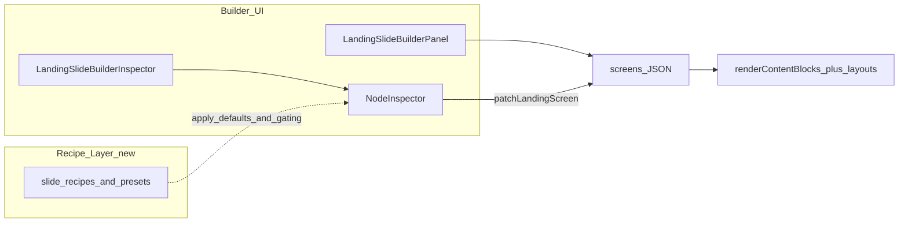

# Slide/deck builder: simple-by-default organizational layer

## Current baseline (repo-grounded)

- **JSON engine**: Each screen is a `[Screen](C:/Users/New User/Documents/HiSense-1ea2985/src/01_App/(live)`%20Business/Container_Creations/ContainerCreationsLandingRenderer.tsx) with `layout`, `title`/`subtitle`/`stepLabel`, `content` (`[LandingContentBlock](C:/Users/New User/Documents/HiSense-1ea2985/src/lib/landing-content-blocks/types.ts)`), `media`, `buttons`, `nextScreenId`, plus optional `lightTheme`, `visualTone`, `density`, `inlineControls`, `dynamicSummary`, etc.
- **Rendering contract**: Layouts must only structure; all block types flow through `[renderContentBlocks](C:/Users/New User/Documents/HiSense-1ea2985/src/lib/landing-content-blocks/renderContentBlocks.tsx)` (explicit rule in `ContainerCreationsLandingRenderer`). **Slide “types” must not become a second engine** that filters blocks at render time.
- **Presentation knobs** (already wired): `[landingScreenPresentationAttrs](C:/Users/New User/Documents/HiSense-1ea2985/src/lib/landing-screen-presentation.ts)` → `data-visual-tone` (`default` | `soft` | `bold`) and `data-density` (`comfortable` | `compact`), with CSS in `[landing-theme.css](C:/Users/New User/Documents/HiSense-1ea2985/src/app/landing/landing-theme.css)` (e.g. compact tightens stack gaps; bold strengthens headline weight / CTA emphasis).
- **Builder shell today**: `[?slideBuilder=1](C:/Users/New User/Documents/HiSense-1ea2985/src/app/landing-2/page.tsx)` → `[ContainerCreationsLandingRenderer](C:/Users/New User/Documents/HiSense-1ea2985/src/01_App/(live)`%20Business/Container_Creations/ContainerCreationsLandingRenderer.tsx) renders `[LandingSlideBuilderPanel](C:/Users/New User/Documents/HiSense-1ea2985/src/01_App/(live)`%20Business/Container_Creations/LandingSlideBuilderPanel.tsx) + single-slide preview + `[LandingSlideBuilderInspector](C:/Users/New User/Documents/HiSense-1ea2985/src/01_App/(live)`%20Business/Container_Creations/LandingSlideBuilderInspector.tsx) wrapping `[NodeInspector](C:/Users/New User/Documents/HiSense-1ea2985/src/app/ui/control-dock/editor/NodeInspector.tsx)`. Patches use `[patchLandingScreen](C:/Users/New User/Documents/HiSense-1ea2985/src/lib/landing-screen-patch.ts)`; deck ops use `[landing-deck-mutations.ts](C:/Users/New User/Documents/HiSense-1ea2985/src/lib/landing-deck-mutations.ts)`.

---

## 1) Standard slide types (recipes, not render filters)

Treat each **slide type** as a **recipe**: default `layout`, suggested `content` block ordering, default `media` shape, default `buttons`, and default presentation fields. The renderer stays unchanged; recipes only **seed** JSON and **prioritize** inspector controls.

| Slide type           | Job                         | Normal layouts                               | Blocks to surface first (add / edit)                                                    | Keep behind **Advanced** unless user picked “custom”                                                                                                                           |
| -------------------- | --------------------------- | -------------------------------------------- | --------------------------------------------------------------------------------------- | ------------------------------------------------------------------------------------------------------------------------------------------------------------------------------ |
| **Hook**             | Grab attention; set promise | `hero`, `stamped`                            | `badge`, `heading`, short `paragraph`, optional single `image`/`video` in `media`       | Raw `layout` list; `visualTone`/`density`/`lightTheme` à la carte; `nextScreenId`; full media tuning (`aspectRatio`, `objectFit`, `fullBleed`, `poster`); non-hook block types |
| **Teaching**         | Explain; teach one idea     | `twoCol`, `twoColImageLeft`, `textOnly`      | `heading`, `paragraph`, `checklist`, `iconFeatures`, optional `divider`                 | `proofPanel`/`splitProof` layouts; stats/testimonial/comparison; flow overrides                                                                                                |
| **Proof**            | Evidence / credibility      | `proofPanel`, `splitProof`, `twoCol`         | `testimonial`, `stats`, `trustStrip`, `rating`, `beforeAfter`/`image` in `media`        | Comparison tables; CTA-band emphasis tuning; `inlineControls`                                                                                                                  |
| **Comparison**       | Contrast options            | `twoCol`, `textOnly` (stacked), `proofPanel` | `comparison`, `heading`, short `paragraph`                                              | Proof/split layouts unless explicitly chosen; media-heavy options                                                                                                              |
| **Input / decision** | Collect choice or confirm   | `textOnly`, `twoCol`                         | `paragraph` (instructions), `checklist` (if used as options pattern), primary `buttons` | `inlineControls` (product-specific), `trackerResponse`, `dynamicSummary` linkage                                                                                               |
| **Summary**          | Recap                       | `textOnly`, `stamped`                        | `heading`, `paragraph`, `iconFeatures` or `checklist`                                   | `dynamicSummary` + `dynamicSummaryConfig` (keep advanced), custom block soup                                                                                                   |
| **Action**           | Clear next step / CTA       | `hero`, `textOnly`, `stamped`                | `ctaBand`, `heading`, `paragraph`, `buttons`                                            | `nextScreenId` and `goto` button graphs; media proof blocks                                                                                                                    |

**Important repo constraint**: Layouts do not filter blocks—so “expose first” is **builder UX only**. Users can still paste odd combinations in expert JSON; preview should never break by type.

---

## 2) Style presets (map to existing fields + CSS)

Presets are **named bundles** over fields the engine already understands, plus layout affinity where it matters.

| Preset               | Intent                            | Maps to (engine / CSS)                                                                                | Fits current model?                                                                                                                                  | Likely gaps (later)                                                                       |
| -------------------- | --------------------------------- | ----------------------------------------------------------------------------------------------------- | ---------------------------------------------------------------------------------------------------------------------------------------------------- | ----------------------------------------------------------------------------------------- |
| **Clean / light**    | Bright, editorial                 | `lightTheme: true`, `visualTone: "soft"`, `density: "comfortable"`, prefer `hero`/`textOnly`/`twoCol` | Yes: `lightTheme` + `[data-visual-tone="soft"](C:/Users/New User/Documents/HiSense-1ea2985/src/app/landing/landing-theme.css)` + comfortable density | Optional: token-level “brand accent” if you later split from global theme                 |
| **Bold / proof**     | Strong headline, evidence-forward | `visualTone: "bold"`, often `lightTheme: false` on steel steps, prefer `proofPanel`/`splitProof`      | Yes: bold tone CSS already targets titles / emphasized CTA band                                                                                      | May want a dedicated “proof band contrast” flag if light+proof combos need fine-tuning    |
| **Dark / immersive** | Cinematic, low chrome             | `lightTheme: false`, `visualTone: "default"` or `"bold"`, media `objectFit: "cover"`, prefer `hero`   | Mostly yes (layout + `lightTheme` + media tuning)                                                                                                    | If “true dark” needs more than steel hero, may need extra CSS vars (not required day one) |
| **Compact / info**   | Dense checklist / specs           | `density: "compact"`, `visualTone: "default"`, prefer `textOnly`/`twoCol`                             | Yes: compact density vars already defined                                                                                                            | If compact needs smaller type scale globally, may add one CSS variable later              |
| **Action / CTA**     | Conversion-focused                | `ctaBand` with `emphasis: true` in `content`, `visualTone: "bold"`, strong `buttons`                  | Yes: blocks + bold tone + existing CTA emphasis styles                                                                                               | None critical if CTA block present                                                        |

**Round-trip strategy**: Presets should **write real fields** (`lightTheme`, `visualTone`, `density`, layout, key blocks). Optionally add an **ignored-by-renderer** optional key e.g. `builderMeta: { presetId?: string, slideType?: string }` on a screen object for UX only—**omit from export** if you want purity, or **keep** if you want the builder to remember last preset; either way the runtime must ignore it (document in code, not a doc maze).

---

## 3) Layered builder model

- **Basic mode (default)**  
  - **First**: Slide type picker (recipe), style preset, `stepLabel` + `title` + `subtitle`.  
  - **Primary canvas**: inline editing stays as today in preview (`[InlineEditableText](C:/Users/New User/Documents/HiSense-1ea2985/src/app/ui/control-dock/editor/InlineEditableText.tsx)` path).  
  - **Simple structure**: “Add block” limited to the **top 3–5 types** for that slide type; one primary media slot (src + alt) if recipe expects media.  
  - **Flow**: primary button row only (hide `nextScreenId`, `goto` targets, extra button rows).
- **Advanced mode**  
  - Unlocks full `[NodeInspector](C:/Users/New User/Documents/HiSense-1ea2985/src/app/ui/control-dock/editor/NodeInspector.tsx)` groups: raw `layout` dropdown, `lightTheme`, separate `visualTone`/`density`, full first-media tuning, `nextScreenId`, all button `type`s, and expanded block editors.
- **Expert / raw JSON mode (optional)**  
  - Single-screen JSON editor (validated parse + apply via `patchLandingScreen` or full-screen replace) + “format” button.  
  - Clearly labeled: **breaks recipe sync** unless you add `builderMeta` or “detach from preset” semantics.

**Power without overwhelm**: Basic mode = **recipes issue patches** to the same `EditableNode` shape; advanced = today’s inspector; expert = escape hatch. No second source of truth.

---

## 4) Integration with the current editable slide builder

**Stays the same**

- JSON shape, `renderContentBlocks` contract, layout switch in `ContainerCreationsLandingRenderer`, `landingScreenPresentationAttrs`, export pipeline (`[mergeScreenOrderIntoScreens](C:/Users/New User/Documents/HiSense-1ea2985/src/lib/landing-deck-mutations.ts)`).

**Add after current editability work**

- A small pure module e.g. `src/lib/slide-builder-recipes.ts` (or similar): `SlideTypeId`, `StylePresetId`, `applySlideRecipe`, `applyStylePreset`, `listBlocksForType`, `inspectorFieldVisibility(mode, type)`.
- **Inspector / shell split**:
  - **Primary**: Extend `[NodeInspector](C:/Users/New User/Documents/HiSense-1ea2985/src/app/ui/control-dock/editor/NodeInspector.tsx)` with `mode`, `slideType`, `onSlideTypeChange`, `stylePreset`, `onPresetChange` props—or wrap it in a new `SlideBuilderNodeInspector` used only from `[LandingSlideBuilderInspector](C:/Users/New User/Documents/HiSense-1ea2985/src/01_App/(live)`%20Business/Container_Creations/LandingSlideBuilderInspector.tsx) so `[DevNodePanel](C:/Users/New User/Documents/HiSense-1ea2985/src/04_Presentation/components/organs/tsx/website/DevNodePanel.tsx)` stays unchanged until you opt in.
  - **Shell**: Optionally show type + preset chips in `[LandingSlideBuilderPanel](C:/Users/New User/Documents/HiSense-1ea2985/src/01_App/(live)`%20Business/Container_Creations/LandingSlideBuilderPanel.tsx) rows for scanability; mode toggle could live in inspector header or panel header in `[ContainerCreationsLandingRenderer](C:/Users/New User/Documents/HiSense-1ea2985/src/01_App/(live)`%20Business/Container_Creations/ContainerCreationsLandingRenderer.tsx) (single source for `slideBuilder` UX state).

---

## 5) Phased implementation (stable, low-risk)

| Phase                            | Goal                                                                                                            | Likely files                                                                                                      | Frozen / protected                                | Risk    | Success                                                                   |
| -------------------------------- | --------------------------------------------------------------------------------------------------------------- | ----------------------------------------------------------------------------------------------------------------- | ------------------------------------------------- | ------- | ------------------------------------------------------------------------- |
| **A — Recipes library (no UI)**  | Typed recipes + presets as pure functions applying patches; unit-test snapshots of patch output                 | New `src/lib/slide-builder-recipes.ts`; tests colocated or `__tests`__                                            | Renderer, CSS, JSON consumers                     | Low     | Same JSON as hand-authored; no UI change                                  |
| **B — Basic vs Advanced gating** | Wrap `NodeInspector` for slide builder only; top section: type + preset + mode toggle; collapse advanced fields | `LandingSlideBuilderInspector.tsx`, new thin wrapper or extended `NodeInspector` props                            | `DevNodePanel` behavior until explicitly migrated | Low–med | New users see ~5 controls; advanced toggle reveals current full inspector |
| **C — Block palette (tiered)**   | “Add block” actions insert into `content[]` with correct defaults per type; basic lists restricted              | Wrapper inspector + small helpers; possibly touch `renderContentBlocks` only if adding dev-only labels—prefer not | Universal rendering rule                          | Med     | Common blocks editable without raw JSON                                   |
| **D — Expert JSON**              | Per-screen textarea with JSON.parse guard + apply/discard                                                       | Wrapper inspector                                                                                                 | Export format                                     | Med     | No more “stuck” edits; still exports same schema                          |
| **E — Polish & parity**          | Bring `DevNodePanel` to same wrapper **if desired**; outline badges; preset “dirty” detection (optional)        | `DevNodePanel.tsx`, `LandingSlideBuilderPanel.tsx`                                                                | Core engine                                       | Low     | One mental model across dev + slide builder                               |

---

## 6) Recommended architecture (long-term)

- **One engine**: Existing `Screen` JSON + `renderContentBlocks` + layouts.  
- **One builder**: Same shell; modes only change **projection** of controls onto patches.  
- **One source of truth**: The screen object on the wire; presets/types either **only** set fields or add optional `builderMeta` ignored at runtime.  
- **Recipes on top**: `slide-builder-recipes.ts` is the single catalog for defaults and “what to show first.”  
- **No capability loss**: Advanced + expert paths always reach the same patch surface area you have today; recipes never delete user data unless explicitly “reset slide to recipe” (confirm dialog).

This keeps the codebase aligned with the existing invariant: **layouts structure, blocks render universally**—the next layer only helps authors **start right** and **stay oriented**.