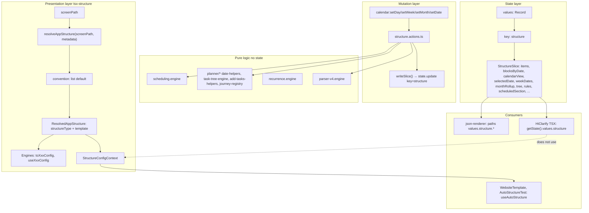

# Full Structural Audit and Unification Plan

## 1. Audit of structure-related systems

### 1.1 state.values.structure (the slice)

- **Owner:** [src/05_Logic/logic/actions/structure.actions.ts](src/05_Logic/logic/actions/structure.actions.ts) — single key `"structure"`; all writes via `state.update` through this module.
- **Shape (StructureSlice):** `tree`, `items`, `blocksByDate`, `rules`, `activePlannerId`, `calendarView`, `selectedDate`, `weekDates`, `monthRollup`, `stats`, `parserStaging`, `taskFolderTemplate`, `taskTemplateRows`, `parserConfig`, `scheduledSection`. Optional `domain?: string` exists but is **never set or read** in the repo.
- **Persistence:** state-resolver applies `state.update` generically; [src/03_Runtime/state/state-resolver.ts](src/03_Runtime/state/state-resolver.ts) sets `derived.values[key] = payload.value`. No separate structure-specific persistence.

### 1.2 structure.actions

- **Scope:** All mutations to the single slice: add/update/delete items, set blocks, calendar (setDay/setWeek/setMonth/setDate), setScheduledSection, addFromText, parser staging, loadRuleset, addJourney, cancelDay, setActivePlanner, etc.
- **Contract:** "Structure actions — single key state.values.structure; atomic state.update only" (comment in file and [action-registry.ts](src/05_Logic/logic/runtime/action-registry.ts)).
- **No reference** to `structureType`, ResolvedAppStructure, or tsx-structure.

### 1.3 scheduling.engine

- **Location:** [src/05_Logic/logic/engines/structure/scheduling.engine.ts](src/05_Logic/logic/engines/structure/scheduling.engine.ts).
- **Role:** Pure function `scheduledForDate(tasks, date, blocks, rules)` → `ScheduledItem[]`. Uses recurrence.engine (isDueOn). No state; no structureType.

### 1.4 planner logic folder

- **Location:** [src/05_Logic/logic/planner/](src/05_Logic/logic/planner/) — date-helpers, task-tree-engine, add-tasks-helpers, base-planner-tree, journey-registry, journey-types, tree-merge, relative-time, journey-packs.
- **Role:** Pure helpers and registries for dates, folder/category indexing, journey packs. Consumed by structure.actions (addFromText, addJourney, tree merge) and by HiClarify TSX (usePlannerViewModels, date navigation). **No structureType.**

### 1.5 journey registry

- **Role:** [src/05_Logic/logic/planner/journey-registry.ts](src/05_Logic/logic/planner/journey-registry.ts) — getJourneyPack(id) for structure:addJourney and OSB routing. Data only; no structural abstraction.

### 1.6 timeline / board / wizard structure types (tsx-structure)

- **Definition:** [src/lib/tsx-structure/types.ts](src/lib/tsx-structure/types.ts) — `StructureType = "list" | "board" | "dashboard" | "editor" | "timeline" | "detail" | "wizard" | "gallery"`.
- **Resolution:** [src/lib/tsx-structure/resolver/index.ts](src/lib/tsx-structure/resolver/index.ts) — `resolveAppStructure(screenPath, metadata)` → `ResolvedAppStructure` (structureType + template). Convention: co-located → path patterns → metadata.structure.type → default ("list", "default").
- **Engines:** Each type has `toXxxConfig(template)` and `useXxxConfig()` (e.g. [engines/timeline.ts](src/lib/tsx-structure/engines/timeline.ts)); all read from `useStructureConfig()` (context provided by envelope). No state key or data binding in the type system.
- **Contracts:** [src/lib/tsx-structure/contracts/](src/lib/tsx-structure/contracts/) — renderer boundary strings and props per type; no reference to state.values.

### 1.7 json-renderer structure usage

- **Paths:** Resolves dotted paths into state (e.g. `values.structure.calendarView`, `values.structure.selectedDate`). Special-case for `calendarView` defaulting to `"day"` when undefined.
- **List content:** Phase C uses `scheduledFromState` + `scheduledFromStateDateKey` and `blocksFromState` + `blocksFromStateDateKey` to read from state (e.g. `structure`, `structure.selectedDate`, `structure.blocksByDate`). Renders lists of scheduled items or blocks for a given date.
- **No structureType:** Json-renderer does not receive or branch on structureType; it only follows JSON node content paths into state.

### 1.8 TSX planner components in (dead) Tsx

- **Location:** [src/01_App/(dead) Tsx/HiClarify/](src/01_App/(dead) Tsx/HiClarify/) — JSX_PlannerShell, UnifiedPlannerLayout, JSX_DayView, JSX_WeekView, JSX_MonthView, ChunkPlannerLayer, TimelineAxis, usePlannerViewModels, JSX_AddTasks, etc.
- **Data source:** All read from `getState()?.values?.structure` or `usePlannerViewModels()` (which reads the same slice). They dispatch structure:* and calendar:* actions.
- **Layout source:** Hardcoded (Day | Week | Month | Add tabs, PlannerRoot with time axis). **They do not call useStructureConfig() or useAutoStructure().** So the planner TSX is **not** a consumer of the structureType abstraction.

### 1.9 tsx-structure types and engines

- **Root type:** `ResolvedAppStructure = { structureType, template, schemaVersion?, featureFlags? }`. No state key, no data binding at the type level.
- **TimelineStructureConfig** has optional `dataBinding?: { eventsKey?, tasksKey?, chunksKey?, adapter? }` — keys for **payload shape**, not state path. Built-in templates (e.g. "day-only") set `dataBinding: { eventsKey: "events", tasksKey: "tasks" }` but no contract says these come from `state.values.structure`.

---

## 2. Findings: highest-level contract and root abstraction

### 2.A Highest-level structural contract already present

- **For data:** The effective contract is "state.values.structure is the single key for planner/task/calendar data; all mutations go through structure.actions and calendar.*." It is **implicit** (comments + action-registry); there is no exported type or doc that names "StructureSlice" as the single source of truth for that key.
- **For presentation:** The highest-level contract is **ResolvedAppStructure** (structureType + template), resolved from screenPath and provided by the envelope. It governs layout/config only; it does not reference state or a state key.

There is **no single contract** that ties "this screen is a timeline (structureType) and its data lives at state.values.structure."

### 2.B Is structureType the true root abstraction?

- **For the TSX wrapper layer:** Yes. structureType is the discriminator for the 8 layout/presentation modes (list, board, dashboard, editor, timeline, detail, wizard, gallery). Resolution is deterministic from screenPath/metadata; engines normalize template to typed config.
- **For the app as a whole:** No. The **data** that timeline/planner UIs show lives in state.values.structure and is **independent** of structureType. The same slice could be rendered by a list, a timeline, or a custom TSX shell; structureType does not control where data is stored.

So: structureType is the root abstraction **for presentation/layout only**. It is not the root for "structure domain" (data + presentation together).

### 2.C Are planner/board/timeline/wizard variants of a deeper domain?

- **As layout modes:** Yes — they are variants of "how to arrange and interact with content" (list = linear, board = columns, timeline = time axis, wizard = steps). That deeper notion is **layout/presentation**, already expressed by structureType.
- **As data domains:** Partially. Planner/timeline **data** (items, blocks, calendar state) lives in state.values.structure. Board data could be the same items with a different view, or a different state key; the codebase does not define a "board" or "wizard" state key. So planner/timeline share one data domain (the slice); board/wizard in tsx-structure do not today bind to a shared data contract — they are layout-only.

### 2.D Where structural responsibilities are duplicated

| Responsibility                        | Location 1                                               | Location 2                                                                                                  | Duplication                                                                                                    |
| ------------------------------------- | -------------------------------------------------------- | ----------------------------------------------------------------------------------------------------------- | -------------------------------------------------------------------------------------------------------------- |
| "What layout mode is this screen?"    | tsx-structure: structureType from path                   | (Implicit) HiClarify planner: hardcoded Day/Week/Month                                                      | Planner layout is not derived from structureType.                                                              |
| "Where is task/planner data?"         | structure.actions: key "structure"                       | usePlannerViewModels: getState().values.structure                                                           | Same truth; slice shape duplicated in usePlannerViewModels (local type) vs structure.actions (StructureSlice). |
| "How does timeline get items/blocks?" | TimelineStructureConfig.dataBinding (keys like tasksKey) | json-renderer: content.scheduledFromState = "structure", content.blocksFromState = "structure.blocksByDate" | JSON path is state path; timeline config does not define state path.                                           |
| Calendar view mode                    | state.values.structure.calendarView (day/week/month)     | TSX: ViewSwitcherLinks, JSX_PlannerShell tabs                                                               | Same value; TSX reads state, does not read from structureType.                                                 |

---

## 3. Diagram of actual structural hierarchy (repo evidence)

**Key:** State slice and ResolvedAppStructure are separate trees. No arrow from structureType to state key or slice.

---

## 4. Fragmentation points (list)

1. **Two meanings of "structure"** — (a) state key and slice (planner/task/calendar data), (b) structureType (list/board/timeline/…) with no link to (a) in type or contract.
2. **Planner TSX ignores structureType** — HiClarify planner uses only state + actions; layout is hardcoded; it never calls useStructureConfig/useAutoStructure.
3. **No binding from structureType to state** — timeline (and others) do not declare which state key or path holds their data; json-renderer uses ad-hoc content paths (scheduledFromState, blocksFromState).
4. **Slice type duplication** — StructureSlice in structure.actions.ts vs local shape in usePlannerViewModels; no single exported canonical type for "the structure slice" consumed by all.
5. **Optional slice.domain unused** — StructureSlice has `domain?: string`; nothing sets or reads it; no use for multi-domain or mapping domain → structureType.
6. **Envelope provides structure config for all TSX** — but only WebsiteTemplate and AutoStructureTest consume it; the main planner UI does not, so "structure as only truth" is not true for planner screens.

---

## 5. Minimal unification plan

**Principle:** Do not invent new architecture; add the minimal contract and wiring so that (1) there is one documented "structure domain" and (2) TSX can treat structure (data + layout) as single truth where applicable.

**Steps:**

1. **Document the dual system** (single artifact under contracts or tsx-structure):
  - **Structure data:** state key `"structure"`, shape StructureSlice; only structure.actions and calendar.* write it. List all consumers (json-renderer, HiClarify TSX, diagnostics).
  - **Structure presentation:** ResolvedAppStructure (structureType + template) from screenPath; provided by envelope; consumed by screens that call useStructureConfig/useAutoStructure.
  - **Optional binding:** For structureType `"timeline"` (and any future "planner" alias), the **recommended** state key for task/calendar data is `"structure"`. No enforcement yet; documentation only.
2. **Export a single canonical StructureSlice type** from the logic layer (e.g. from structure.types or a thin structure-slice.ts) and use it in structure.actions and in usePlannerViewModels (and any other consumer) so the slice shape is not duplicated.
3. **Optional: dataBinding.stateKey in timeline (and similar)** — Extend TimelineStructureConfig (or built-in template docs) to allow an optional `stateKey?: string` (e.g. `"structure"`) so that screens that use useTimelineConfig() can know where to read data from, without changing json-renderer or state shape. This is a small, additive contract.
4. **TSX planner alignment (if planner is revived)** — When a TSX screen is the "plan" or "timeline" screen, it should (a) resolve structureType (e.g. timeline) from path/metadata so the envelope provides it, and (b) read data from state.values.structure (or from the key indicated by template if stateKey is added). No requirement to use useTimelineConfig() for layout unless we add a shared timeline renderer; layout can remain custom as long as data source is the single slice.
5. **No change to:** json-renderer (paths stay as-is), state-resolver, action-registry, scheduling.engine, planner folder, journey-registry. No new compiler or schema.

---

## 6. What must change in TSX wrappers for structure to be the only truth

- **Envelope:** Already provides ResolvedAppStructure to all TSX screens via StructureConfigProvider. No change required for "structure as truth" for **layout type**.
- **Screens that should treat structure as truth:**
  - **Planner/timeline screens:** Must read data from state.values.structure (or from the key specified by config if stateKey is added). Today HiClarify planner already does; the gap is that it does **not** derive layout mode from structureType (it hardcodes Day/Week/Month). To make structure the **only** truth: either (1) have the screen resolve structureType (e.g. timeline) and use useTimelineConfig() to drive layout options (e.g. viewModes), or (2) keep custom layout but document that for "plan" screen, data comes from state.values.structure and layout is screen-specific. Option (1) requires wiring path → timeline and using config in the component; option (2) is minimal and only requires consistent data source.
- **Screens that already use useAutoStructure (e.g. WebsiteTemplate):** They get structureType + config; they do not currently bind to state.values.structure. For a "structure as only truth" guarantee, any screen that renders task/timeline/planner data must subscribe to the same state key (and optionally use the same canonical StructureSlice type).
- **Concrete change list (minimal):**
  - Export and use a single StructureSlice type so all consumers (including usePlannerViewModels) use the same shape.
  - Add one contract document (or section) that states: state key for planner/timeline data = `"structure"`; structureType timeline recommends that key.
  - If planner TSX is re-enabled: either (A) pass structureType from envelope and have planner read viewModes from useTimelineConfig(), or (B) leave layout hardcoded and only standardize on reading from state.values.structure.

---

## 7. .cursor rules vs runtime contracts

- **.cursor rules:** Sufficient for (1) naming convention (e.g. "structure slice = state.values.structure; mutations only via structure.actions"), (2) where to export StructureSlice from, (3) that TSX planner/timeline screens must read from state.values.structure. They can also state that structureType is the root for presentation and does not by itself specify a state key unless documented.
- **Runtime contracts:** The only runtime "contract" today is that structure.actions write the single key and consumers read it. No runtime check enforces "timeline screens must use state.values.structure." To enforce that without new architecture: (1) add optional stateKey to timeline config and have a hook (e.g. useStructureSlice(stateKey?) that reads from getState().values[stateKey ?? "structure"] and returns the canonical type), and (2) in dev, optionally warn if a screen with structureType timeline does not subscribe to that key. That would be a small runtime contract; it is not strictly necessary for unification if we only document and use a single type.

**Recommendation:** Start with .cursor rules + one contract doc + single exported StructureSlice type. Add optional stateKey and useStructureSlice only if we want runtime consistency checks or to drive multiple keys later.

---

## 8. Summary

| Question                                   | Answer                                                                                                                                                                                 |
| ------------------------------------------ | -------------------------------------------------------------------------------------------------------------------------------------------------------------------------------------- |
| Highest-level structural contract?         | Two: (1) state.values.structure = planner data, mutations via structure.actions; (2) ResolvedAppStructure = layout type from path. No single contract tying both.                      |
| Is structureType the true root?            | Yes for presentation (8 layout modes). No for data; data root is the slice key.                                                                                                        |
| Planner/board/timeline/wizard same domain? | As layout, yes (structureType). As data, planner/timeline share state.values.structure; board/wizard have no defined data key.                                                         |
| Minimal abstraction to unify?              | (1) Document both systems and optional structureType → stateKey; (2) single exported StructureSlice type; (3) optional stateKey in timeline config + useStructureSlice.                |
| StructureDomain contract?                  | Optional. A "StructureDomain" could be { structureType, stateKey?, sliceType? }. Minimal form: document timeline → stateKey "structure"; no new type required.                         |
| TSX consume structure correctly?           | Partially. Envelope provides config; planner TSX uses data from slice but not structureType. Unification: same slice type + same state key + optional use of structureType for layout. |
| .cursor vs runtime?                        | .cursor rules sufficient for conventions and single type; optional runtime hook + stateKey for enforcement.                                                                            |

No file edits in this plan; implementation follows after approval.