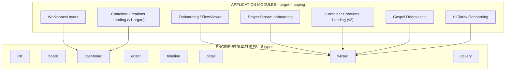

# Structure Engine Normalization — Analysis and Refactor Plan

## 1. Official structure engine (canonical types)

**Location:** [src/lib/tsx-structure/](src/lib/tsx-structure/)

The codebase defines **8** structure types (not 7). The single source of truth is [src/lib/tsx-structure/types.ts](src/lib/tsx-structure/types.ts) (`StructureType` union, lines 6–14):

- **list**, **board**, **dashboard**, **editor**, **timeline**, **detail**, **wizard**, **gallery**

**Supporting pieces:**

- **Contracts** ([src/lib/tsx-structure/contracts/](src/lib/tsx-structure/contracts/)): One file per type (`list.ts`, `board.ts`, …) defining `*StructureConfig`, `*RendererProps`, and `*_RENDERER_BOUNDARY` (JSON vs TSX responsibility).
- **Engines** ([src/lib/tsx-structure/engines/](src/lib/tsx-structure/engines/)): `to*Config(template)` and `use*Config()` per type; [engines/index.ts](src/lib/tsx-structure/engines/index.ts) exports `ENGINE_MAP` and `getEngine(type)`.
- **Built-in templates** ([src/lib/tsx-structure/resolver/builtinTemplates.ts](src/lib/tsx-structure/resolver/builtinTemplates.ts)): `BUILTIN_TEMPLATES` maps `structureType → templateId → template`; each template is registered with `@/system/registry/templateRegistry`.
- **Resolver** ([src/lib/tsx-structure/resolver/index.ts](src/lib/tsx-structure/resolver/index.ts)): `resolveAppStructure(screenPath, metadata?)` uses [convention.ts](src/lib/tsx-structure/resolver/convention.ts) (co-located map → path-pattern globs → metadata.structure → default `list`/`default`) then `loadTemplate()` to produce `ResolvedAppStructure`.
- **Context:** [StructureConfigContext.tsx](src/lib/tsx-structure/StructureConfigContext.tsx) provides `StructureConfigProvider` and `useStructureConfig()`. [useAutoStructure.ts](src/lib/tsx-structure/useAutoStructure.ts) returns typed config via `getEngine(structureType).toConfig(resolved.template)`.

**Envelope:** [TSXScreenWithEnvelope.tsx](src/lib/tsx-structure/TSXScreenWithEnvelope.tsx) is the intended universal wrapper: it calls `resolveAppStructure(screenPath)`, wraps the mounted component in `StructureConfigProvider`, and applies layout/palette from [getDefaultTsxEnvelopeProfile.ts](src/lib/tsx-structure/getDefaultTsxEnvelopeProfile.ts). **In practice, the dev page and app routes do not use it:** TSX screens are rendered via `ExperienceRenderer` + `TsxEmbedProvider` with the raw component, so **no screen currently receives structure context from the engine** except the test screen that explicitly uses `useStructureConfig()`.

---

## 2. How screens currently bypass the structure system

**Data source:** Scans of `src/01_App/` and usage of `tsx-structure` / `resolveAppStructure` / `StructureConfigProvider`.

| Module                      | Path / key files                                                   | Uses engine?           | Bypass / custom pattern                                                                                                                                                                                                |
| --------------------------- | ------------------------------------------------------------------ | ---------------------- | ---------------------------------------------------------------------------------------------------------------------------------------------------------------------------------------------------------------------- |
| **Prayer_Stream**           | `(live) Business/Prayer_Stream/PrayerStreamOnboarding.tsx`         | No                     | Custom wizard: `PrayerStreamConfig` with `screens[]`, `stepTracker`, local `renderContentBlocks`; no `StructureType` or `useWizardConfig`.                                                                             |
| **Container_Creations**     | `ContainerCreationsLanding.tsx`, `ContainerCreationsLanding-2.tsx` | No                     | V1: organ/ExperienceRenderer pipeline. V2: `LandingConfig` with `screens[]`, `stepTracker`, `renderContentBlocks`, step state; same pattern as Gospel.                                                                 |
| **Onboarding / FlowViewer** | `(live) Business/onboarding/FlowViewer.tsx`                        | Partially (logic only) | Uses `@/logic/engine-system/engine-contract` (`getPresentation`, `applyEngine`), `EducationCard`, flow-loader; step/wizard behavior from **engine system**, not from `lib/tsx-structure` or `StructureType: "wizard"`. |
| **HiClarify**               | `(dead) Tsx/HiClarify/HiClarifyOnboarding.tsx`                     | No                     | Single static view (title + button); no steps. Planner views use `@/logic/engines/structure` (data/structure items), not screen structure.                                                                             |
| **WorkspaceLayout**         | `(live) Business/workspace/WorkspaceLayout.tsx`                    | No                     | Custom tab layout (`ViewId`: command, compare, timeline, data, reports, ads, decision); no dashboard/list from tsx-structure.                                                                                          |
| **Gospel Discipleship**     | `(live) Gospel/Discipleship/GospelDiscipleship.tsx`                | No                     | Same schema as ContainerCreationsLanding-2: `LandingConfig`, `screens[]`, `stepTracker`, `renderContentBlocks`.                                                                                                        |
| **Container FlowViewer**    | `Container_Creations/FlowViewer.tsx`                               | No                     | Re-exports `../onboarding/FlowViewer`; same as Onboarding/FlowViewer.                                                                                                                                                  |
| **AutoStructureTest**       | `apps-tsx/test/AutoStructureTest.tsx`                              | Yes                    | Only 01_App consumer of `useStructureConfig()`; branches on `structureType` (list/board/timeline/detail).                                                                                                              |

**Routing / envelope gap:** [src/app/dev/page.tsx](src/app/dev/page.tsx) (lines 739–776): when a TSX screen is selected, it builds a synthetic tree with `tsx-embed` and renders via `ExperienceRenderer` + `TsxEmbedProvider`. The component is injected directly; **TSXScreenWithEnvelope is never used**, so `resolveAppStructure` and `StructureConfigProvider` are never applied for real app screens. Docs (e.g. [.cursor/rules/TSX_BUILD_SYSTEM.md](.cursor/rules/TSX_BUILD_SYSTEM.md), [docs/CURSOR_TSX_GENERATION_RULES.md](docs/CURSOR_TSX_GENERATION_RULES.md)) state that every TSX screen must be mounted via `TSXScreenWithEnvelope`; the implementation does not follow that.

---

## 3. Onboarding and landing vs engine

**Wizard contract** ([src/lib/tsx-structure/contracts/wizard.ts](src/lib/tsx-structure/contracts/wizard.ts), [types.ts](src/lib/tsx-structure/types.ts) `WizardStructureConfig`): steps (source: config/data, showProgress, progressStyle), navigation (back/next/skip, placement), branching (enabled, decisionKey), linear.

**Current implementations:**

- **PrayerStreamOnboarding:** `config.screens[]`, step index, next/back by `nextScreenId`; content via local `renderContentBlocks`. Matches wizard semantics (linear steps, progress, nav).
- **ContainerCreationsLanding-2 / GospelDiscipleship:** `LandingConfig.screens[]`, stepTracker, layouts (hero, stamped, twoCol, …), buttons (next/back/goto/link). Same wizard-shaped flow.
- **FlowViewer:** Step-by-step education flow driven by engine presentation and EducationCard; no wizard config from tsx-structure.

**Conclusion:** All of these are **specialized wizard implementations**. Onboarding and “landing” flows should map to the **wizard** structure: step sequence, progress, navigation, optional branching. The engine already supports `steps.source: "config" | "data"`, progress styles (bar, stepper, dots, minimal), and placement (bottom, top, sides). Divergence is:

- Custom config shapes (`PrayerStreamConfig`, `LandingConfig`) instead of the wizard template shape consumed by `toWizardConfig`.
- Custom step rendering and content blocks instead of using a shared wizard renderer that reads `WizardStructureConfig`.
- FlowViewer uses the **logic engine** for steps, not the **screen structure** wizard; it could either be a wizard screen that receives step content from the engine or stay engine-driven but declare itself as `structureType: "wizard"` for envelope/resolver.

---

## 4. Canonical architecture map

**Mapping (module → structure):**

| Module                           | Target structure          | Notes                                                                                                                    |
| -------------------------------- | ------------------------- | ------------------------------------------------------------------------------------------------------------------------ |
| Onboarding / FlowViewer          | **wizard**                | Step-based education flow; use wizard template + engine for step content.                                                |
| Prayer Stream onboarding         | **wizard**                | Multi-step; migrate to `useWizardConfig` + shared step/content renderer.                                                 |
| Container Creations Landing-2    | **wizard**                | Multi-step landing; migrate to wizard template + same content-block contract.                                            |
| Gospel Discipleship              | **wizard**                | Same as CC-2; wizard with shared landing content schema.                                                                 |
| HiClarify Onboarding             | **wizard**                | Single step (one screen); still wizard with one step or minimal template.                                                |
| WorkspaceLayout                  | **dashboard**             | Tabbed workspace with widgets; map to dashboard grid/tiles or keep as “dashboard” shell.                                 |
| Container Creations Landing (v1) | **dashboard** or **list** | Organ-based; could be dashboard (widgets) or stay as JSON-driven experience with a declared structure for envelope only. |

**Detail / editor / list / board / timeline / gallery:** Reserved for future or existing screens that fit (e.g. flow list → list, admin upload → editor, prayer player single view → detail).

---

## 5. Refactor boundaries (what must be normalized)

**A. Route / mount layer**

- **Files:** [src/app/dev/page.tsx](src/app/dev/page.tsx), any app route that renders TSX (e.g. prayer-stream, flow, gospel pages).
- **Change:** For TSX screens, mount via `TSXScreenWithEnvelope` with a stable `screenPath` (e.g. strip `tsx:` and pass the path used by resolver). Ensure the same `screenPath` is used in dev panel and in resolver patterns so overrides and structure apply.

**B. Resolver convention**

- **Files:** [src/lib/tsx-structure/resolver/convention.ts](src/lib/tsx-structure/resolver/convention.ts) (path patterns or co-located map), or a loaded `tsx-structure-resolver.json` if used.
- **Change:** Add patterns (or co-located entries) so that:
  - `**/PrayerStreamOnboarding` → wizard (e.g. templateId `default` or `linear`)
  - `**/ContainerCreationsLanding-2` → wizard
  - `**/GospelDiscipleship` → wizard
  - `**/FlowViewer` → wizard
  - `**/HiClarifyOnboarding` → wizard
  - `**/WorkspaceLayout` → dashboard

**C. Screen components (per module)**

- **Prayer_Stream:** [PrayerStreamOnboarding.tsx](src/01_App/(live) Business/Prayer_Stream/PrayerStreamOnboarding.tsx) — Replace custom step state and config with `useAutoStructure()` / `useWizardConfig()`, derive steps from resolved template (or from existing JSON loaded by path). Keep `renderContentBlocks` as shared or move to a shared content-block renderer used by wizard step content.
- **Container_Creations:** [ContainerCreationsLanding-2.tsx](src/01_App/(live) Business/Container_Creations/ContainerCreationsLanding-2.tsx) — Same: consume wizard config from context; optionally keep existing LandingConfig JSON for step content and map it into wizard steps.
- **Gospel:** [GospelDiscipleship.tsx](src/01_App/(live) Gospel/Discipleship/GospelDiscipleship.tsx) — Same pattern as CC-2.
- **Onboarding/FlowViewer:** [FlowViewer.tsx](src/01_App/(live) Business/onboarding/FlowViewer.tsx) — Either (1) declare as wizard and feed engine-driven steps into a wizard shell, or (2) keep engine-driven UI but wrap in envelope with `structureType: "wizard"` for consistency.
- **HiClarify:** [HiClarifyOnboarding.tsx](src/01_App/(dead) Tsx/HiClarify/HiClarifyOnboarding.tsx) — Use wizard with one step or minimal wizard template; or leave as-is and only add resolver pattern so envelope applies.
- **WorkspaceLayout:** [WorkspaceLayout.tsx](src/01_App/(live) Business/workspace/WorkspaceLayout.tsx) — Use `useDashboardConfig()` for grid/chrome if useful; else only add resolver pattern so structureType is dashboard and envelope applies.

**D. Shared content-block renderer**

- **Files:** New or existing shared module (e.g. under `src/lib/` or `src/04_Presentation/`) used by wizard step content.
- **Change:** Extract `renderContentBlocks` (and any shared block types) so Prayer, CC-2, and Gospel all use the same renderer; wizard step content can pass `content` + options to this renderer.

**E. No custom screen architecture**

- Remove or reduce duplicate “landing” and “onboarding” types that duplicate wizard (e.g. `LandingConfig` as the only source of truth). Prefer: structure from engine (wizard), step content from JSON or from existing flow APIs, rendered via shared content-block + wizard chrome (progress, nav) from engine template.

---

## 6. Safe refactor plan (step-by-step)

**Phase 1 — Envelope and resolver (no screen logic changes)**

1. **Wire envelope into dev and routes**
  In [src/app/dev/page.tsx](src/app/dev/page.tsx), when rendering a TSX screen, wrap the resolved component in `TSXScreenWithEnvelope`: e.g. pass `screenPath` (normalized, e.g. without `tsx:` prefix if that’s what the resolver expects) and `Component`. Ensure `screenPath` matches what the dev panel and TsxStructurePanel use so overrides apply. Do the same for any direct TSX route (e.g. prayer-stream, flow, gospel) so all TSX screens go through the envelope.
2. **Resolver patterns**
  In [convention.ts](src/lib/tsx-structure/resolver/convention.ts) or in a config fed to `setResolverConfig`, add path patterns (e.g. globs) mapping:
  - `**/PrayerStreamOnboarding` → wizard, default (or linear)
  - `**/ContainerCreationsLanding-2` → wizard, default
  - `**/GospelDiscipleship` → wizard, default
  - `**/FlowViewer` → wizard, default
  - `**/HiClarifyOnboarding` → wizard, minimal
  - `**/WorkspaceLayout` → dashboard, default
   Use the exact path format that the app passes as `screenPath` (e.g. `(live) Business/Prayer_Stream/PrayerStreamOnboarding`).
3. **Verify**
  Open each screen in dev; confirm in console/logs that `resolveAppStructure` is called with the correct path and returns the intended `structureType`. Confirm no regression in routes or dev tool screen list.

**Phase 2 — One pilot: Prayer Stream**

1. **PrayerStreamOnboarding**
  In [PrayerStreamOnboarding.tsx](src/01_App/(live) Business/Prayer_Stream/PrayerStreamOnboarding.tsx): Use `useWizardConfig()` (or `useAutoStructure()` and cast). If the wizard template’s step count/source doesn’t match current JSON, keep loading current JSON for step definitions and use wizard config only for progress style, navigation placement, and linear flag. Render steps and content blocks using the same behavior as today; optionally switch to a shared `renderContentBlocks` helper. Ensure existing routes (`/prayer-stream`, dev panel) and behavior (step navigation, content) remain.
2. **Tests / manual**
  Test Prayer Stream on dev and on its route; confirm structure panel shows wizard and overrides work.

**Phase 3 — Remaining wizard screens**

1. **ContainerCreationsLanding-2**
  Same pattern: resolver already set; add `useWizardConfig()` (or `useAutoStructure()`), derive chrome from config, keep existing LandingConfig fetch and step content; optionally extract shared content-block renderer.
2. **GospelDiscipleship**
  Same as CC-2; reuse shared content renderer if introduced.
3. **FlowViewer**
  Keep engine-driven step content; wrap in wizard structure (or at least declare wizard in resolver) so envelope and future wizard chrome can apply. Avoid breaking flow selection or engine APIs.
4. **HiClarifyOnboarding**
  Minimal change: resolver pattern so envelope applies; optionally use wizard with one step.

**Phase 4 — Workspace and v1 landing**

1. **WorkspaceLayout**
  Add dashboard resolver pattern; optionally use `useDashboardConfig()` for layout/chrome; keep tab behavior.
2. **ContainerCreationsLanding (v1)**
  Decide: either declare as dashboard (or list) for envelope only and leave organ pipeline as-is, or migrate to a structure-driven shell later.

**Phase 5 — Cleanup and docs**

1. **Shared content-block renderer**
  If not done per-screen: extract one place for `renderContentBlocks` and standard block types; have Prayer, CC-2, Gospel (and any other wizard with content blocks) use it.
2. **Remove or narrow custom types**
  Where possible, stop treating `LandingConfig` / `PrayerStreamConfig` as the only source of structure; prefer engine wizard template + overrides, with step content still from JSON/API.
3. **Update docs**
  Align [.cursor/rules/TSX_BUILD_SYSTEM.md](.cursor/rules/TSX_BUILD_SYSTEM.md), [docs/CURSOR_TSX_GENERATION_RULES.md](docs/CURSOR_TSX_GENERATION_RULES.md), and any other “7 structures” references to **8 structures** and to the mapping above. State that onboarding and landing flows are wizard implementations.

**Safety throughout:** Preserve existing URLs, dev panel screen keys, and `registerJsonScreen` / node editor behavior. Migrate one module at a time; keep feature flags or env checks if you need to toggle envelope or structure per screen during rollout.

---

## 7. Files to touch (summary)

| Purpose           | Files                                                                                                                                      |
| ----------------- | ------------------------------------------------------------------------------------------------------------------------------------------ |
| Envelope in app   | `src/app/dev/page.tsx`; `src/app/prayer-stream/page.tsx`, `src/app/flow/page.tsx`, `src/app/gospel/page.tsx` (if they render TSX directly) |
| Resolver patterns | `src/lib/tsx-structure/resolver/convention.ts` or resolver config JSON                                                                     |
| Wizard screens    | `PrayerStreamOnboarding.tsx`, `ContainerCreationsLanding-2.tsx`, `GospelDiscipleship.tsx`, `FlowViewer.tsx`, `HiClarifyOnboarding.tsx`     |
| Dashboard screen  | `WorkspaceLayout.tsx`                                                                                                                      |
| Shared content    | New or existing shared `renderContentBlocks` (and types) module                                                                            |
| Docs              | `.cursor/rules/TSX_BUILD_SYSTEM.md`, `docs/CURSOR_TSX_GENERATION_RULES.md`, any “7 structures” or onboarding docs                          |

No code changes are applied in this plan; the above is the architecture diagnosis, module→structure mapping, and step-by-step refactor plan only.