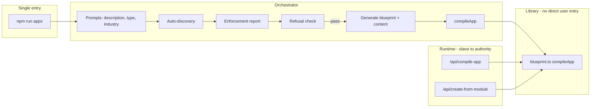

# Unify System Governance Under npm run apps

## Current state summary

- `**npm run apps**` in [package.json](package.json) points to `src/map/engine/map-engine.ts`, which **does not exist** under `src/`. The only implementation lives in [src/999_Cleanup/map-old/engine/map-engine.ts](src/999_Cleanup/map-old/engine/map-engine.ts) and uses a different APPS_ROOT (`src/apps-json`), a different parser, and emits `map-flow.json` / `map-render-graph.json` / `content.txt` (not `app.json`). So the current "apps" script is broken or legacy.
- **Actual app compilation** is done by `compileApp()` in [src/07_Dev_Tools/scripts/blueprint.ts](src/07_Dev_Tools/scripts/blueprint.ts): reads `blueprint.txt` + `content.txt`, uses [organ-index.json](src/07_Dev_Tools/scripts/organ-index.json) and hardcoded `ALLOWED_CONTENT_KEYS`, writes `app.json`.
- **Other entry points** that create or compile apps: [src/app/api/compile-app/route.ts](src/app/api/compile-app/route.ts), [src/app/api/create-from-module/route.ts](src/app/api/create-from-module/route.ts), [src/app/api/duplicate-app/route.ts](src/app/api/duplicate-app/route.ts) (copy only; UI then calls compile-app), [src/module-system/scripts/generate-dentist-and-contractor.ts](src/module-system/scripts/generate-dentist-and-contractor.ts), and the **blueprint CLI** via `npm run blueprint` ([blueprint.ts](src/07_Dev_Tools/scripts/blueprint.ts) `run()`).
- `**npm run app`** (no 's') runs [scripts/app.ts](scripts/app.ts): prompts for slug/description, snapshots registries (engineRegistry, templateRegistry, structureRegistry, TSX contracts), writes `BUILD_PLAN_REPORT.md` — no compilation.
- `**npm run app:report**` runs [scripts/registry-report.ts](scripts/registry-report.ts): reports engine/template/structure registration coverage.

---

## PHASE 1 — Collapse authority

### Competing app compilation pipelines


| Pipeline                            | Entry                                           | Output                                            | Notes                                                        |
| ----------------------------------- | ----------------------------------------------- | ------------------------------------------------- | ------------------------------------------------------------ |
| **map-engine**                      | `npm run apps` → `src/map/engine/map-engine.ts` | map-flow.json, map-render-graph.json, content.txt | Path missing in src; only in 999_Cleanup; different contract |
| **blueprint.ts**                    | `npm run blueprint` or direct import            | app.json                                          | Canonical TXT → app.json compiler                            |
| **compile-app API**                 | POST /api/compile-app                           | app.json (via compileApp)                         | Delegates to blueprint.compileApp                            |
| **create-from-module API**          | POST /api/create-from-module                    | blueprint.txt, content.txt, app.json              | Copies module then compileApp                                |
| **duplicate-app + compile-app**     | UI: duplicate-app then compile-app              | app.json                                          | Copy folder then compile                                     |
| **generate-dentist-and-contractor** | Script                                          | blueprint.txt, content.txt, app.json              | generateFiles + compileApp                                   |
| **generate-app.ts**                 | Programmatic                                    | blueprint.txt, content.txt only                   | Callers must call compileApp separately                      |


### Target: single entry point

- **Make `npm run apps` the only user-facing entry point for app construction.**  
Implementation: replace the current script target with a new orchestrator (e.g. `scripts/apps.ts` or move/repurpose under `src/`) that:
  1. Prompts for app description, type, optional industry (per Phase 2).
  2. Runs discovery and enforcement (Phase 2); on pass, proceeds.
  3. For “create new app” flow: generates or copies blueprint.txt + content.txt (reuse module-system or template selection), then **calls `compileApp(appPath)`** from [src/07_Dev_Tools/scripts/blueprint.ts](src/07_Dev_Tools/scripts/blueprint.ts) (internal dependency; no duplicate compiler).
  4. Writes BUILD_AUTHORITY_REPORT.md and JSON summary (Phase 2).
- **Remove or deprecate duplicate entry paths:**
  - **Deprecate** `npm run blueprint` as a **standalone** app-construction entry: keep `blueprint.ts` as a **library** (export `compileApp` only). The new `npm run apps` (or a subcommand) can invoke the same CLI logic internally (e.g. “compile only” mode) so there is no second way to “build an app” from the command line.
  - **compile-app API**: keep for **runtime/UI** use (e.g. CreateNewInterfacePanel, duplicate-then-compile), but document that the **authority** for “what is allowed to be built” is defined by `npm run apps` (discovery + refusal). API becomes a “compile this folder” slave; it does not define build surface.
  - **create-from-module API**: same: keep for UI flows, but authority (allowed modules, palettes, layouts, etc.) is determined by what `npm run apps` discovers and allows; optionally have create-from-module call a shared validation step that uses the same refusal rules.
  - **duplicate-app**: no change to behavior; it copies then client calls compile-app; authority still from `npm run apps` governance.
  - **generate-dentist-and-contractor.ts**: treat as one-off or example; either run via a subcommand of `npm run apps` (e.g. “npm run apps --seed”) or document as dev-only and not an authority.
  - **map-engine**: remove from `npm run apps`. Either delete the script reference to `src/map/engine/map-engine.ts` or point `npm run apps` to the new orchestrator. The code in 999_Cleanup/map-old remains legacy; do not use it as the apps entry.

### Execution flow (target)




### Files to modify (Phase 1)

- [package.json](package.json): change `"apps"` script from `ts-node src/map/engine/map-engine.ts` to the new orchestrator (e.g. `tsx scripts/apps.ts` or agreed path).
- New file: **scripts/apps.ts** (or **src/07_Dev_Tools/scripts/apps-orchestrator.ts**): single entry that prompts, runs discovery, enforcement, refusal, then generate + `compileApp`; no second compiler.
- [src/app/api/compile-app/route.ts](src/app/api/compile-app/route.ts): no logic change; optionally add a comment or small doc that authority is `npm run apps`; route remains “compile this path.”
- [src/app/api/create-from-module/route.ts](src/app/api/create-from-module/route.ts): no structural change; optionally validate against same refusal/discovery surface when moving to Phase 4.

### Files to deprecate / remove from authority

- **Deprecate as entry:** `npm run blueprint` for “building an app” — keep the script for “compile only” or internal use; document that “building an app” is only via `npm run apps`.
- **Remove from `npm run apps`:** any reference to `src/map/engine/map-engine.ts` (script currently broken); do not wire map-engine as the apps entry.

---

## PHASE 2 — Define npm run apps responsibilities

### User prompts

`npm run apps` must ask:

1. **App description** (short natural language).
2. **App type** (calendar, kanban, website, learning, etc.) — align with structure types / templates (e.g. from [src/lib/tsx-structure/types.ts](src/lib/tsx-structure/types.ts) and template registry).
3. **Optional industry** (for module-system or content hints).

### Auto-discovery (no manual registry edits for “add a new X”)

Scan and auto-discover:


| Asset                    | Source                                                                                                             | Notes                                                                                                                                                                                                                                  |
| ------------------------ | ------------------------------------------------------------------------------------------------------------------ | -------------------------------------------------------------------------------------------------------------------------------------------------------------------------------------------------------------------------------------- |
| **Palettes**             | [src/04_Presentation/palettes/*.json](src/04_Presentation/palettes/)                                               | Already filesystem (require.context in [palettes/index.ts](src/04_Presentation/palettes/index.ts)); list names from there or glob.                                                                                                     |
| **Layout IDs**           | [src/04_Presentation/layout/data/layout-definitions.json](src/04_Presentation/layout/data/layout-definitions.json) | pageLayouts, sectionLayouts, etc. keys.                                                                                                                                                                                                |
| **Molecules**            | Filesystem                                                                                                         | Scan [src/04_Presentation/components/molecules/](src/04_Presentation/components/molecules/) for *.compound.tsx or agreed pattern; no COMPONENT_MAP edits.                                                                              |
| **Organs + variants**    | Filesystem + manifest                                                                                              | [src/04_Presentation/components/organs/](src/04_Presentation/components/organs/) and variants in each organ’s `variants/*.json`; or derive from [organ-index.json](src/07_Dev_Tools/scripts/organ-index.json) if it becomes generated. |
| **TSX wrapper types**    | Registry / loader                                                                                                  | From [scripts/lib/tsx-contract-loader](scripts/lib/tsx-contract-loader) or equivalent TSX contract scan.                                                                                                                               |
| **Engines**              | engineRegistry                                                                                                     | [src/system/registry/engineRegistry.ts](src/system/registry/engineRegistry.ts) via getEngines() after loadRegistrations (see [scripts/app.ts](scripts/app.ts)).                                                                        |
| **Actions**              | action-registry                                                                                                    | [src/05_Logic/logic/runtime/action-registry.ts](src/05_Logic/logic/runtime/action-registry.ts) — list registered action keys.                                                                                                          |
| **Blueprint node types** | blueprint.ts + organ-index                                                                                         | Section, organ, and molecule types from ALLOWED_CONTENT_KEYS + organ-index organs.                                                                                                                                                     |
| **Contracts**            | Existing contract loaders                                                                                          | Verbs, expected params, layout node types (as in app.ts).                                                                                                                                                                              |


### Manual registries: classify

- **Must be replaced by auto-discovery:**  
  - Molecule list (so new molecule = new file, no COMPONENT_MAP edit).  
  - Organ/variant list (so new organ/variant = new file + optional manifest, no organ-registry import list edit).  
  - Palette list already filesystem; ensure no second source (e.g. [styler](src/03_Runtime/engine/core/styler.tsx) uses `@/registry/palettes.json` — treat as “must align” or migrate to @/palettes).
- **Acceptable as catalog-only (data, no code edit to add item):**  
  - layout-definitions.json, organ-index.json (if generated from filesystem), layout thumbnails manifest (if derived from layout-definitions + public paths).  
  - engineRegistry / templateRegistry / structureRegistry (self-registration at runtime from code; discovery = “run loader and snapshot”).

### Enforcement report

Generate:

- **BUILD_AUTHORITY_REPORT.md**: human-readable report with sections: Available palettes, Available layouts, Available molecules, Available organs + variants, Available wrapper types, Available engines, Hardcoding violations (list files/lines that still require code edits for new assets), Registry dependencies (which registries are still manual), Compliance score (e.g. % of assets discoverable without code edit), Refusal conditions (list from Phase 4).
- **JSON summary**: machine-readable “allowed build surface” (palette ids, layout ids, molecule ids, organ ids + variant ids, wrapper types, engine names, action keys, blueprint node types). Path: e.g. `BUILD_AUTHORITY_REPORT.json` or under a report directory.

### Refusal conditions (detailed in Phase 4)

Enforcement report must list them; `npm run apps` must refuse when any condition holds (e.g. new molecule requires code edit, new organ requires registry edit, palette list diverges, hardcoded structure detected, discovery mismatch).

---

## PHASE 3 — Eliminate manual registry dependencies (plan only)

Replace the following with filesystem- or manifest-driven discovery and generated indices where needed. Minimal changes; preserve runtime behavior.


| Current manual surface                  | Location                                                                                                           | Replacement strategy                                                                                                                                                                                                                                                                                                                                              |
| --------------------------------------- | ------------------------------------------------------------------------------------------------------------------ | ----------------------------------------------------------------------------------------------------------------------------------------------------------------------------------------------------------------------------------------------------------------------------------------------------------------------------------------------------------------- |
| **organ-registry** manual imports       | [src/04_Presentation/components/organs/organ-registry.ts](src/04_Presentation/components/organs/organ-registry.ts) | **Filesystem-driven:** Scan `organs/*/variants/*.json` at build time or runtime (require.context), build VARIANTS map; or generate a single `organs.bundle.json` and load that. Preserve `loadOrganVariant(organId, variantId)` signature.                                                                                                                        |
| **COMPONENT_MAP** manual entries        | [src/04_Presentation/components/molecules/index.ts](src/04_Presentation/components/molecules/index.ts)             | **Filesystem-driven:** Scan molecules dir for *.compound.tsx (or manifest), generate index that exports id→component map; or dynamic import by convention. getCompoundComponent stays; implementation becomes discovery-based.                                                                                                                                    |
| **registry.tsx** type map               | [src/03_Runtime/engine/core/registry.tsx](src/03_Runtime/engine/core/registry.tsx)                                 | **Option A:** Keep as catalog-only: document that new types require a single Registry edit. **Option B:** Generated index from a manifest (e.g. atoms + molecules + layout molecules listed in a JSON/TS manifest); registry.tsx imports from generated file. Prefer minimal change: Option A first; Option B if governance requires “no code edit for new type.” |
| **ALLOWED_CONTENT_KEYS** hardcoding     | [src/07_Dev_Tools/scripts/blueprint.ts](src/07_Dev_Tools/scripts/blueprint.ts)                                     | **Manifest-driven:** Move to organ-index.json (for molecules) or a new molecules-content-keys.json derived from contract/manifest; blueprint loads from file. Keys per molecule type become data.                                                                                                                                                                 |
| **Palette duplication**                 | [src/03_Runtime/engine/core/styler.tsx](src/03_Runtime/engine/core/styler.tsx) uses `@/registry/palettes.json`     | **Single source:** Use @/palettes (or a single generated palette index) everywhere; remove duplicate palette list from registry if it exists.                                                                                                                                                                                                                     |
| **layoutThumbnailRegistry** manual maps | [src/app/ui/layoutThumbnailRegistry.ts](src/app/ui/layoutThumbnailRegistry.ts)                                     | **Manifest-driven:** Build SECTION_LAYOUT_THUMBNAILS etc. from layout-definitions.json keys + convention (e.g. `/layout-thumbnails/<layoutId>.svg`); or generate a small layout-thumbnails.json from layout-definitions + public file existence.                                                                                                                  |


### Proposed order (minimal, no redesign)

1. **Palette:** Single source (palettes/*.json via @/palettes); remove or align styler and any registry/palettes.json.
2. **organ-index.json:** Generate from filesystem (organs/*/variants/*.json) so organ-index is not hand-edited; blueprint and orchestrator both read it.
3. **Organ-registry:** Switch to loading from generated organs.bundle.json or require.context so new variants don’t require new imports.
4. **ALLOWED_CONTENT_KEYS:** Move to JSON/manifest; blueprint loads it.
5. **Molecules:** Discovery-based index or manifest; COMPONENT_MAP replaced by generated or dynamic map.
6. **layoutThumbnailRegistry:** Derive from layout-definitions + convention or generated manifest.
7. **registry.tsx:** Leave as-is (catalog) or add generated type map in a later step.

---

## PHASE 4 — Refusal doctrine

`npm run apps` must **refuse execution** (exit non-zero, clear message) if any of the following is true:

1. **New molecule requires code edit** — A molecule id used in the requested app is not discoverable from the molecules filesystem/manifest (i.e. would require adding to COMPONENT_MAP or registry).
2. **New organ requires registry edit** — An organ or variant used is not discoverable from filesystem or generated organ manifest (i.e. would require adding an import/entry to organ-registry).
3. **Palette list diverges from source** — Discovered palette set from palettes/*.json does not match a committed/canonical list (e.g. from BUILD_AUTHORITY_REPORT.json or a lockfile); or multiple sources (e.g. registry/palettes.json vs palettes/) disagree.
4. **Hardcoded structure detected** — Enforcement scan finds that a required asset (layout, molecule, organ, palette) is only available via a hardcoded list that requires code change to extend.
5. **Discovery mismatch** — Any asset referenced in the app request (blueprint, content, or selected template) is not in the discovered allowed build surface (e.g. layout id not in layout-definitions, organ id not in organ-index, molecule not in discovered list).

Define exact refusal conditions in the orchestrator and in BUILD_AUTHORITY_REPORT.md so that “npm run apps” is the single gate that prevents drift.

---

## PHASE 5 — Final deliverable: step-by-step refactor plan

### Step order

1. **Create orchestrator and wire `npm run apps`**
  - Add script (e.g. `scripts/apps.ts`) that implements: prompt (description, type, industry), discovery, enforcement report, refusal check, then (on pass) generate blueprint+content and call `compileApp`.  
  - In package.json, set `"apps": "tsx scripts/apps.ts"` (or equivalent).  
  - Remove or stop using `src/map/engine/map-engine.ts` as the apps script target.
2. **Implement discovery and report**
  - In the orchestrator (or a shared module), implement scanners for: palettes (from palettes/*.json), layout IDs (from layout-definitions.json), molecules (filesystem), organs+variants (filesystem or organ-index.json), TSX wrapper types, engines (engineRegistry), actions (action-registry), blueprint node types.  
  - Emit BUILD_AUTHORITY_REPORT.md and a JSON summary (allowed build surface).  
  - Classify manual registries (must replace vs catalog-only) in the report.
3. **Implement refusal checks**
  - Before generating/compiling, run Phase 4 checks; on failure, print message and exit non-zero.
4. **Deprecate standalone blueprint CLI as app entry**
  - Document that “building an app” is only via `npm run apps`; keep `npm run blueprint` for “compile only” (existing folder) if desired.
5. **Phase 3 replacements (in order)**
  - Palette single source.  
  - Generate organ-index from filesystem; then switch organ-registry to bundle or context.  
  - ALLOWED_CONTENT_KEYS to manifest; blueprint loads it.  
  - Molecules discovery/index.  
  - layoutThumbnailRegistry from layout-definitions + convention or generated manifest.  
  - registry.tsx: document as catalog or add generated map later.

### New files to create

- **scripts/apps.ts** (or chosen path): orchestrator entry, prompts, discovery, report, refusal, generate + compileApp.
- **BUILD_AUTHORITY_REPORT.md** (generated): enforcement report.
- **BUILD_AUTHORITY_REPORT.json** (or equivalent): JSON summary of allowed build surface.
- Optional: **scripts/apps-discovery.ts** (or under src): shared discovery functions used by apps and optionally by API validation.

### Files to modify (ordered)

- [package.json](package.json): `apps` script.
- [src/07_Dev_Tools/scripts/blueprint.ts](src/07_Dev_Tools/scripts/blueprint.ts): later, load ALLOWED_CONTENT_KEYS from manifest (Phase 3).
- [src/04_Presentation/components/organs/organ-registry.ts](src/04_Presentation/components/organs/organ-registry.ts): load from bundle or require.context (Phase 3).
- [src/04_Presentation/components/molecules/index.ts](src/04_Presentation/components/molecules/index.ts): discovery-based map (Phase 3).
- [src/03_Runtime/engine/core/styler.tsx](src/03_Runtime/engine/core/styler.tsx): use single palette source (Phase 3).
- [src/app/ui/layoutThumbnailRegistry.ts](src/app/ui/layoutThumbnailRegistry.ts): derive from layout-definitions or manifest (Phase 3).
- [src/app/api/compile-app/route.ts](src/app/api/compile-app/route.ts): comment that authority is `npm run apps` (Phase 1).
- [src/app/api/create-from-module/route.ts](src/app/api/create-from-module/route.ts): optional validation against same refusal surface (Phase 1/4).

### Files to delete or deprecate

- **Delete from authority (do not use as apps entry):** current `npm run apps` target `src/map/engine/map-engine.ts` (path is broken; implementation in 999_Cleanup remains legacy).
- **Deprecate as user-facing app build:** `npm run blueprint` for “create/choose then compile” flow; keep for “compile this folder” only.

### Verification checklist

- `npm run apps` is the only CLI entry that “builds an app” (prompt → discovery → report → optional generate → compile).
- All other compilation paths (compile-app API, create-from-module, duplicate-app + compile-app) call `compileApp()` and do not define build surface; authority is `npm run apps`.
- BUILD_AUTHORITY_REPORT.md and JSON are produced and list palettes, layouts, molecules, organs+variants, engines, actions, blueprint node types, hardcoding violations, refusal conditions.
- Refusal conditions are implemented and tested (e.g. unknown molecule/organ/palette/layout causes exit non-zero).
- Phase 3 replacements are applied in order; runtime behavior (renderer, blueprint output) preserved.
- No doctrine or runtime contract rewritten; only governance and discovery unified.

### Estimated scope

- **Single refactor:** Possible if the orchestrator, discovery, and report are implemented in one pass and Phase 3 is done in a follow-up.
- **Staged:** Recommended. Stage 1: Phase 1 + Phase 2 + Phase 4 (orchestrator, discovery, report, refusal; no registry replacement). Stage 2: Phase 3 (replace manual registries one by one). This keeps risk low and allows verification of “single authority” before touching organ-registry and molecules.

---

## Summary diagram (authority after refactor)

```mermaid
flowchart TB
  subgraph authority [Single authority]
    NPM["npm run apps"]
    Discover[Discovery]
    Report[BUILD_AUTHORITY_REPORT]
    Refuse[Refusal doctrine]
    CompileApp[compileApp"]
  end
  subgraph consumers [Consumers - no authority]
    API["/api/compile-app"]
    CreateMod["/api/create-from-module"]
    Duplicate["/api/duplicate-app"]
  end
  NPM --> Discover --> Report --> Refuse --> CompileApp
  API --> CompileApp
  CreateMod --> CompileApp
  Duplicate --> copy only
  CompileApp --> app.json
```


Result: **npm run apps** is the sole deterministic authority that prevents drift; all app construction flows through it or through API/scripts that delegate to `compileApp` without defining the allowed build surface.