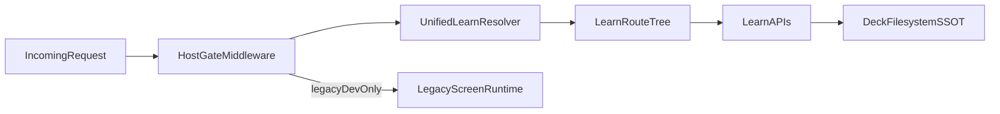

# Universal Runtime Foldover Plan

## Plain-English Diagnosis

The repo currently runs **two overlapping runtimes**:

- **Legacy screen runtime**: `/` + `/dev` + `loadScreen()` + `/api/screens/`* resolve JSON/TSX from mixed roots (including `(dead)` trees).
- **Learn runtime**: `/learn/{app}/{flow}/{version}` + `loadCatalog()/resolveDeck()` + `/api/learn/`* resolve file-system deck flows.

The interference on `learn.`* hosts is not one bug; it is architecture overlap:

- host routing is split between middleware and config rewrites,
- legacy endpoints remain callable on learn hosts,
- `LandingDeckRenderer` still has a legacy fallback path,
- root runtime and dev navigator still assume `/api/screens` as universal index.

## Exact Files/Systems Involved

- Host and entry routing
  - [src/middleware.ts](src/middleware.ts)
  - [next.config.js](next.config.js)
  - [deck-public-rewrites.cjs](deck-public-rewrites.cjs)
  - [src/app/layout.tsx](src/app/layout.tsx)
  - [src/app/RootLayoutClient.tsx](src/app/RootLayoutClient.tsx)
- Learn platform SSOT
  - [src/lib/deck-platform/registry.ts](src/lib/deck-platform/registry.ts)
  - [src/lib/deck-platform/host-route-map.ts](src/lib/deck-platform/host-route-map.ts)
  - [src/lib/deck-platform/legacy-app-keys.ts](src/lib/deck-platform/legacy-app-keys.ts)
  - [src/app/learn/LearnDeckEditorPage.tsx](src/app/learn/LearnDeckEditorPage.tsx)
  - [src/app/learn/[appKey]/page.tsx](src/app/learn/[appKey]/page.tsx)
  - [src/app/learn/[appKey]/[flowKey]/page.tsx](src/app/learn/[appKey]/[flowKey]/page.tsx)
  - [src/app/learn/[appKey]/[flowKey]/[versionKey]/page.tsx](src/app/learn/[appKey]/[flowKey]/[versionKey]/page.tsx)
  - [src/app/api/learn/catalog/route.ts](src/app/api/learn/catalog/route.ts)
  - [src/app/api/learn/resolve/route.ts](src/app/api/learn/resolve/route.ts)
  - [src/app/api/learn/save-draft/route.ts](src/app/api/learn/save-draft/route.ts)
  - [src/app/api/learn/create-version/route.ts](src/app/api/learn/create-version/route.ts)
  - [src/app/api/learn/create-flow/route.ts](src/app/api/learn/create-flow/route.ts)
- Legacy screen runtime
  - [src/app/page.tsx](src/app/page.tsx)
  - [src/app/dev/page.tsx](src/app/dev/page.tsx)
  - [src/03_Runtime/engine/core/screen-loader.ts](src/03_Runtime/engine/core/screen-loader.ts)
  - [src/03_Runtime/engine/core/safe-json-import.ts](src/03_Runtime/engine/core/safe-json-import.ts)
  - [src/app/api/screens/route.ts](src/app/api/screens/route.ts)
  - [src/app/api/screens/[...path]/route.ts](src/app/api/screens/[...path]/route.ts)
  - [src/07_Dev_Tools/nav/screen-registry.ts](src/07_Dev_Tools/nav/screen-registry.ts)
- Legacy compatibility branches still affecting behavior
  - [src/lib/landing-deck/LandingDeckRenderer.tsx](src/lib/landing-deck/LandingDeckRenderer.tsx)
  - [src/app/api/container-creations-landing-config/route.ts](src/app/api/container-creations-landing-config/route.ts)
  - [src/app/flow/page.tsx](src/app/flow/page.tsx)
  - [src/app/container-creations/page.tsx](src/app/container-creations/page.tsx)

## Keep / Migrate / Disable Matrix

- Keep (as-is or near-as-is)
  - Filesystem-discovered Learn catalog and deck resolution (`loadCatalog`, `resolveDeck`).
  - App-key normalization compatibility (`normalizeDeckAppKey`).
  - Learn write/version APIs with path-safety and authoring guard.
  - Minimal-shell detection for public Learn hosts.
- Migrate (preserve concept, reimplement in Learn platform)
  - Legacy "domain-driven" idea: host determines app namespace -> centralize in one resolver used by middleware and rewrites.
  - Legacy graceful loader diagnostics (`FILE_NOT_FOUND`, parse feedback) -> expose equivalent learn-safe diagnostics for editor/authoring UX.
  - Legacy navigator universality (`screen registry`) -> split into a Learn catalog navigator and a separate Legacy runtime navigator.
  - Legacy variant semantics -> map to Learn schema/version model where conceptually equivalent.
- Disable (after parity gates)
  - `LandingDeckRenderer` legacy fallback fetch branch (`/api/container-creations-landing-config`) for learn-driven contexts.
  - `/api/screens/*` usage on `learn.*` hosts.
  - Legacy `flow` public route and legacy container-creations compatibility routes once traffic is cut over.
  - Duplicative host-rewrite logic drift (dual policy in middleware + build rewrites).

## Execution Plan (first, second, third)

1. **First: Runtime observability and contract freeze**

- Produce an explicit request matrix for host/path -> handler -> data source -> shell mode, covering: `learn.hiclarify.com`, non-learn host, `/`, `/flow`, `/learn/`*, `/api/screens/`*, `/api/learn/*`.
- Add temporary diagnostic logging/headers (non-breaking) to confirm which resolver path wins in production-like traffic.
- Define source-of-truth contracts:
  - Learn public routing contract.
  - Learn resolve/save/version contract.
  - Legacy compatibility contract (what remains temporarily supported).

1. **Second: Capability parity extraction and fold-in**

- Extract reusable capabilities from legacy runtime and implement them inside Learn-owned modules:
  - unified host->learn path resolver,
  - structured load errors for authoring UX,
  - explicit learn catalog APIs for tooling/nav.
- Update `LandingDeckRenderer` to run in strict Learn mode when `learnDeck` identity exists.
- Keep legacy runtime active only behind clear boundaries (`/dev` and explicit legacy routes).

1. **Third: Conflict shutdown and staged decommission**

- Enforce learn-host policy: no legacy runtime fetch path on `learn.`* hosts.
- Decommission old public routes/endpoints in stages:
  - soft-disable with telemetry,
  - hard-disable after no live usage.
- Remove dead compatibility code and duplicate rewrites after cutover verification.

## Step-by-Step Workstreams

- Workstream A: Host resolution unification
  - Choose one canonical resolver (middleware-first) and make config rewrites a generated mirror or remove them.
  - Reuse [src/lib/deck-platform/host-route-map.ts](src/lib/deck-platform/host-route-map.ts) or replace with single shared function consumed by both layers.
- Workstream B: Learn runtime hardening
  - Make [src/lib/landing-deck/LandingDeckRenderer.tsx](src/lib/landing-deck/LandingDeckRenderer.tsx) fail-closed for learn contexts (no legacy fallback branch).
  - Keep fallback only for explicitly legacy routes.
- Workstream C: Legacy containment
  - Scope `/api/screens` and `loadScreen` to dev/legacy-only surfaces.
  - Remove learn-host reachability to `/api/screens` runtime paths.
- Workstream D: Route/API deprecation
  - Deprecate [src/app/api/container-creations-landing-config/route.ts](src/app/api/container-creations-landing-config/route.ts), [src/app/flow/page.tsx](src/app/flow/page.tsx), and legacy container-creations route after parity checks.
- Workstream E: Verification and rollback safety
  - Add host/path integration checks for rewrite outcomes and final rendered runtime.
  - Define rollback toggles for each deprecation step.

## Refactor Size, Effort, and Risk

- Size: **Medium-Large**.
- Effort: **2-4 focused engineering weeks** (including parity validation + staged deprecation), depending on how much legacy route compatibility must be preserved.
- Risk: **Medium-High** if done as a single cut; **Medium** with staged flags/telemetry.

High-risk areas:

- host rewrite precedence and edge-case path handling,
- hidden legacy consumers of `/api/screens`,
- production host differences behind forwarding headers.

Low-risk areas:

- catalog/resolve API hardening,
- adding explicit boundaries and diagnostics,
- isolating dev-only legacy tooling.

## What “Truly Universal” Should Look Like

- One runtime policy: host + path resolve through a single Learn resolver.
- One data contract for deck content: `resolveDeck` + Learn APIs as SSOT.
- Legacy runtime remains optional/tooling-only, never implicitly selected on public Learn hosts.
- New domains/apps onboard by filesystem convention only (`src/01_App/**/learn/<flow>/<version>.json`) with no custom host patches.

## Acceptance Gates

- `learn.*` host requests always resolve to Learn pages/API contracts and never hit legacy screen API paths.
- Learn editor can resolve/save/create-version/create-flow for all onboarded app/flow/version combos.
- No unresolved public traffic to legacy compatibility endpoints for agreed soak period.
- Legacy dev tooling still works on non-learn dev routes until formally removed.

