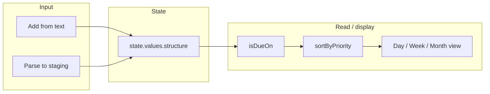

# Weekly planner with automatic prioritization

## Goal

Deliver a planner that helps users **organize their week** and **automatically prioritize** what matters most, using only the existing registry (no new engines, no routers in templates), with **no hardcoded state keys** and **no hardcoded strings in TSX** (content-driven).

## Current-state summary

- **Structure pipeline:** Items are produced in [structure.actions.ts](c:/Users/New User/Documents/HiSense/src/05_Logic/logic/actions/structure.actions.ts) via `structureAddFromText` / `structureParseToStaging` / `structureConfirmStaging` (parser-v4 + structure-mapper or extreme-mode + structure-mapper). Recurrence, prioritization, and scheduling operate at **read/display** time, not in a single sequential runner.
- **Display path:** [json-renderer.tsx](c:/Users/New User/Documents/HiSense/src/03_Runtime/engine/core/json-renderer.tsx) Phase C (lines ~1268–1305) resolves `content.scheduledFromState` and `content.scheduledFromStateDateKey`, reads `state.values.structure`, filters with `isDueOn`, sorts with `sortByPriority`, and fills list content. So **auto-prioritization is already implemented** where lists are bound via these content paths.
- **Reference UI:** The dead JSON app [app.json](c:/Users/New User/Documents/HiSense/src/01_App/(dead) Json/apps/hiclarify/app.json) implements a full week planner: day view and 7 day columns with `scheduledFromState: "structure"` and `scheduledFromStateDateKey: "structure.selectedDate"` or `structure.weekDates.0` … `structure.weekDates.6`. The dead TSX hook [usePlannerViewModels.ts](c:/Users/New User/Documents/HiSense/src/01_App/(dead) Tsx/HiClarify/usePlannerViewModels.ts) provides `useDayViewModel`, `useWeekViewModel`, `useMonthViewModel` (items per day, sorted by priority, visibility).
- **Templates:** Timeline templates (`timeline:week-month`, `timeline:day-only`) exist in [builtinTemplates.ts](c:/Users/New User/Documents/HiSense/src/lib/tsx-structure/resolver/builtinTemplates.ts); they define config (e.g. `dataBinding`) but do not read state — the **screen** supplies data. List templates work with json-renderer when the node has `scheduledFromState` / `scheduledFromStateDateKey` in content.

## Architecture (data flow)

- **Organize week:** User adds tasks (or confirms parsed staging); structure.actions write to `structure` slice (items, rules, selectedDate, weekDates). Week is “organized” by setting `weekDates` (e.g. via existing `calendarSetWeek`) and showing tasks per day.
- **Automatically prioritize:** Already implemented: at render time, lists use `structure.items` → filter by `isDueOn(item, date)` → `sortByPriority(items, date, rules)`. No new engine required.

## Implementation plan

### 1. Planner content module (state keys + copy)

- Add a content module under `(live) Business/planner/` (e.g. `content.ts`), following the pattern in [onboarding/content.ts](c:/Users/New User/Documents/HiSense/src/01_App/(live) Business/onboarding/content.ts).
- Define **state key paths** used by the planner UI only (satisfy noHardcodedStateKeys in TSX):
  - `structureSliceKey` (e.g. `"structure"` — must match the key used by structure.actions; today that is the single canonical key).
  - `selectedDatePath` (e.g. `"structure.selectedDate"`).
  - `weekDatesPath` (e.g. `"structure.weekDates"`) and, if needed, a pattern for per-day date path (e.g. `"structure.weekDates.0"` … `"structure.weekDates.6"`).
- Define all **UI strings** (labels, titles, empty states, buttons: e.g. “Week”, “Day”, “Add task”, “Prioritize”, “Today”, “No tasks for this day”) so TSX uses content only (noHardcodedStringsInTSX).
- Do **not** change structure.actions to read the key from content in this phase; the actions file can keep its internal `STRUCTURE_KEY`; the planner screen and any bindings will use the path from content for reading/display only.

### 2. Planner screen (TSX)

- Add a live planner screen (e.g. `PlannerScreen.tsx` or `WeekPlanner.tsx`) under `(live) Business/planner/`.
- **Template choice:** Use **list** with a list template (e.g. `list:default` or `list:compact`) for day view and week view (7 lists) to maximize reuse of existing json-renderer Phase C behavior. Alternatively use **timeline** with `timeline:week-month` or `timeline:day-only`; then the screen must supply the data (see below).
- **State keys:** Read structure slice key and date paths from the new planner content (e.g. `content.planner.stateKeys.structureSliceKey`, `content.planner.stateKeys.selectedDatePath`, `content.planner.stateKeys.weekDatesPath`). Use these when reading from `getState()?.values` and when passing any path to list/timeline or to children.
- **Data for the view:**
  - Subscribe to state; resolve the structure slice from `state.values[structureSliceKey]`.
  - Compute `selectedDate` (from slice or default today), `weekDates` (from slice or from `getWeekDates(selectedDate)` via [date-helpers.ts](c:/Users/New User/Documents/HiSense/src/05_Logic/logic/planner/date-helpers.ts)).
  - For each day: filter items with `isDueOn(item, date)`, optionally `isVisibleInWeekView(item, date, rules)` for week view, then `sortByPriority(items, date, rules)` — same logic as [usePlannerViewModels.ts](c:/Users/New User/Documents/HiSense/src/01_App/(dead) Tsx/HiClarify/usePlannerViewModels.ts). So “automatically prioritize” is just using these existing engines when building the list/timeline data.
- **List path:** If the screen renders lists that are still driven by the json-renderer (e.g. screen model with List nodes), ensure the screen model or resolved content uses the **content-defined** paths for `scheduledFromState` and `scheduledFromStateDateKey` (e.g. from content.planner.stateKeys), not literals. If the screen builds list content entirely in TSX (no json-renderer for those lists), it passes the pre-sorted items into the list template and does not use scheduledFromState in TSX.
- **Timeline path:** If using a timeline template, the screen passes the derived `itemsByDay` / events into the timeline component; timeline config (dataBinding) stays as-is; no state keys inside the template.
- **Actions:** Wire existing structure actions: add task (from text or staging), set week (`calendarSetWeek`), cancel day, change selected date. Action names stay as in structure.actions (e.g. `structure:addFromText`, `structure:confirmStaging`, `calendarSetWeek`); no new engine, no router in template.

### 3. Bootstrap and navigation

- Ensure the structure slice is initialized when the user opens the planner (already done in `getSlice()` in structure.actions: empty slice + BASE_PLANNER_TREE).
- Set initial `selectedDate` and `weekDates` on first visit if missing (e.g. call existing logic that writes `selectedDate: toKey(new Date())` and `weekDates: getWeekDates(new Date())` via existing actions or a one-time write).
- Register the planner in app navigation (e.g. add a “Planner” or “Week” entry that navigates to the new TSX screen path). Use content for label and path (e.g. `content.planner.screenPath`, `content.planner.navLabel`).

### 4. Template and registry

- Use existing templates only: e.g. `list:default`, `list:compact`, or `timeline:week-month`, `timeline:day-only`. No new template required.
- In the registry, no change to `requiredStateKeys` / `supportedEngines` is strictly required for list/timeline; the planner screen resolves state via content. If a future convention ties templates to state keys, the planner’s content-defined keys can be documented or registered there.

### 5. Constraints checklist

| Constraint              | How satisfied                                                                                                                                            |
| ----------------------- | -------------------------------------------------------------------------------------------------------------------------------------------------------- |
| noEngineAutogeneration  | Only existing engines: parser-v4, structure-mapper, recurrence, prioritization, scheduling (and aggregation/progression/rule-evaluator if needed later). |
| noRouterInTemplates     | Planner does not add flow-router to any template definition.                                                                                             |
| noHardcodedStateKeys    | State key paths used by the planner screen (and any list bindings) come from planner content.                                                            |
| noHardcodedStringsInTSX | All user-facing strings come from planner content.ts.                                                                                                    |
| approveBeforeEdits      | Plan only; no code edits until approved.                                                                                                                 |

## Files to add or touch (summary)

- **Add:** `src/01_App/(live) Business/planner/content.ts` — state key paths and all UI strings.
- **Add:** `src/01_App/(live) Business/planner/PlannerScreen.tsx` (or `WeekPlanner.tsx`) — planner UI using content, existing view logic (day/week, sortByPriority), and existing structure actions.
- **Optionally move/refactor:** Reuse or relocate day/week/month view logic from `(dead) Tsx/HiClarify/usePlannerViewModels.ts` (e.g. into a shared hook or inline in the new screen) so the live planner does not depend on (dead) code long-term.
- **Touch:** App entry or navigation (e.g. flows-index, main menu, or route config) to add entry point to the planner screen; labels and paths from content.

## Out of scope (no new engines)

- No new prioritization algorithm: use existing `sortByPriority` and `effectivePriority` (and optional `isVisibleInWeekView`).
- No new parser or structure-mapper: use existing add-from-text and parse-to-staging flows.
- No new recurrence/scheduling engines: use existing `isDueOn`, `scheduledForDate` if needed later; json-renderer already uses isDueOn + sortByPriority for list content.

## Optional follow-ups

- **Timeline data binding:** If the app uses a TSX timeline for week view, ensure the timeline component accepts a prop for “tasks per day” or “events” sourced from the same derived data (itemsByDay + sortByPriority) and document the contract.
- **Centralized structure key:** Later, structure.actions could read the structure state key from a single app/registry config so that the only place that names the key is content/registry, not the actions file.

