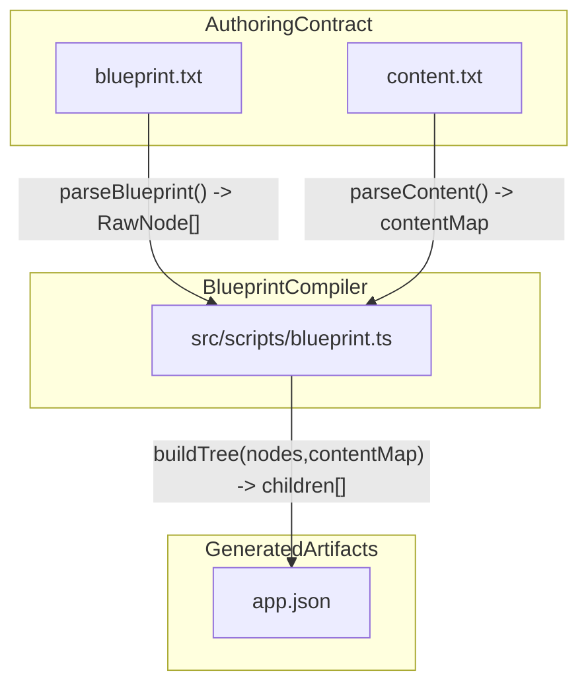
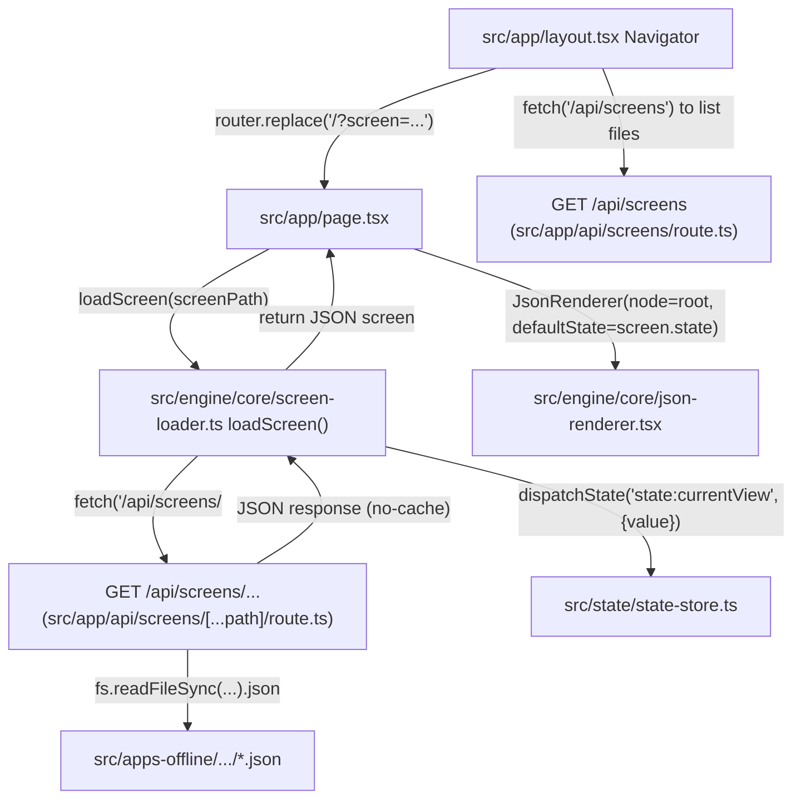
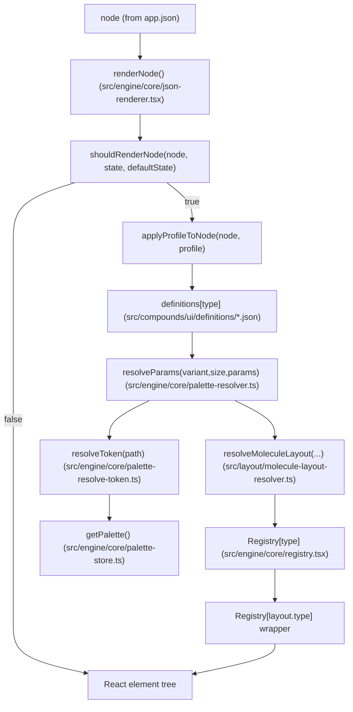
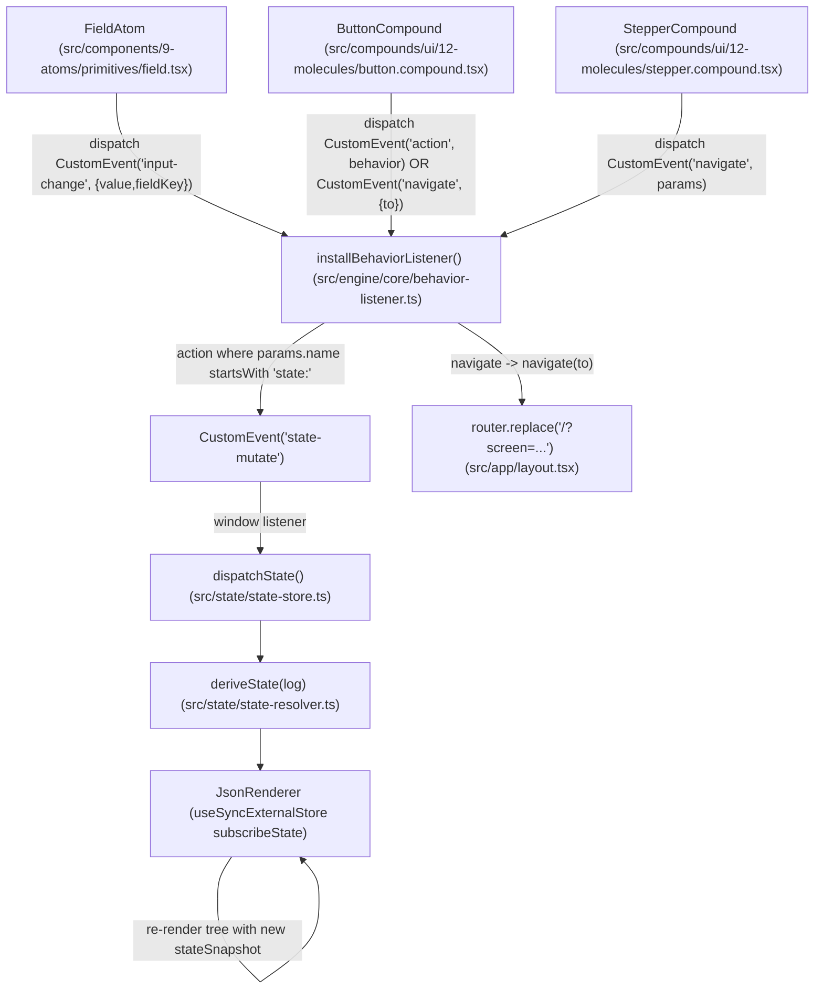

# apps-offline JSON-driven system map

This document maps the **offline JSON-driven** system end-to-end: authoring inputs → compilation (`npm run blueprint`) → runtime rendering → behavior/state feedback loop.

## Directory responsibilities (independent subsystems)

The architecture is intentionally “fixed code, runtime JSON decides.” These folders correspond to the independent subsystems you called out:

- **`src/apps-offline/`**: Offline “screen” source files.\n
  - Typical unit: an *app folder* containing `blueprint.txt` + `content.txt` + generated/hand-authored `*.json` screens.\n
  - Served at runtime via `/api/screens/*`.\n

- **`src/scripts/`**: Authoring/compile-time tooling.\n
  - `src/scripts/blueprint.ts` compiles `blueprint.txt` + `content.txt` into `app.json`.\n

- **`src/engine/`**: The runtime core.\n
  - Rendering: `src/engine/core/json-renderer.tsx`\n
  - Screen IO: `src/engine/core/screen-loader.ts`\n
  - Profile selection (experience): `src/engine/core/layout-store.ts`\n
  - Palette selection: `src/engine/core/palette-store.ts`\n
  - Behavior bridge (CustomEvent router): `src/engine/core/behavior-listener.ts`\n

- **`src/components/`**: Atoms (primitives).\n
  - Example: `src/components/9-atoms/primitives/field.tsx` emits `input-change` events.\n

- **`src/compounds/`**: Molecules (locked UI building blocks) + their JSON definitions.\n
  - Molecules: `src/compounds/ui/12-molecules/*.compound.tsx`\n
  - Definitions: `src/compounds/ui/definitions/*.json` (variants/sizes presets)\n
  - Definition registry: `src/compounds/ui/index.ts`\n

- **`src/layout/`**: Layout subsystem (pure resolvers + layout molecules).\n
  - Molecule layouts: `src/layout/molecule-layout-resolver.ts`\n
  - Screen layouts: `src/layout/screen-layout-resolver.ts`\n
  - Structural layout components are also registered in `src/engine/core/registry.tsx`.\n

- **`src/palettes/`**: Palette definitions.\n
  - Palette registry: `src/palettes/index.ts`\n
  - Token resolution: `src/engine/core/palette-resolve-token.ts`\n

- **`src/state/`**: State subsystem (append-only event log + pure derived state).\n
  - Store: `src/state/state-store.ts`\n
  - Reducer/replay: `src/state/state-resolver.ts`\n

- **`src/behavior/`**: Behavior subsystem (verb+variant → handler mapping).\n
  - Runner: `src/behavior/behavior-runner.ts`\n
  - Engine handlers: `src/behavior/behavior-engine.ts`\n
  - Navigation + interaction maps: `src/behavior/behavior-navigations.json`, `src/behavior/behavior-interactions.json`\n

- **`src/logic/`**: Runtime “engines” and verb/action routing.\n
  - `src/logic/runtime/interaction-controller.ts` records interactions and routes verbs.\n
  - `src/logic/runtime/runtime-verb-interpreter.ts` normalizes and forwards to `action-runner`.\n

- **`src/registry/`**: Declarative registry metadata (JSON listing of atoms/molecules/palettes).\n
  - Current runtime binding is done in `src/engine/core/registry.tsx` and `src/compounds/ui/index.ts`, but these JSON files serve as an externalized manifest.\n

## Locked contracts (what must stay stable in “code complete, JSON decides”)

### 1) JSON node shape (runtime)

The renderer expects a *tree of nodes*; nodes may include:
- **`id`**: stable identifier (used for debug + React keys when available)
- **`type`**: registry key (`Registry[type]`) e.g. `Field`, `Button`, `section`, `row`
- **`children`**: nested nodes
- **`content`**: pure content payload (labels, body text, etc.)
- **`params`**: styling/layout params (merged from variant/size presets + inline overrides)
- **`variant` / `size`**: selects presets from `src/compounds/ui/definitions/<type>.json`
- **`layout`**: optional structural wrapper (uses `layout.type` as another registry component)
- **`params.moleculeLayout`**: optional molecule layout spec, resolved by `resolveMoleculeLayout()`
- **`behavior`**: declarative intent (`Action`, `Navigation`, `Interaction`)
- **`state`**: state binding descriptor (e.g. `{ mode: "two-way", key: "journal.think" }`)
- **`when`**: conditional visibility (e.g. `{ state: "currentView", equals: "|home" }`)

### 2) Registry contract (type → implementation)

- `src/engine/core/registry.tsx` is the canonical runtime map: **JSON `type` → React component**.\n
- Atoms and molecules may support both lowercase and PascalCase aliases (e.g. `fieldatom` and `FieldAtom`).\n

### 3) Styling contract (definition JSON + palette tokens)

- Molecule definitions live in `src/compounds/ui/definitions/*.json` and provide:\n
  - `variants[variantName]` presets\n
  - `sizes[sizeName]` presets\n
- `resolveParams()` merges presets and resolves palette tokens via `resolveToken()`.\n

### 4) Interaction contract (events + state replay)

- UI components emit **CustomEvents**:\n
  - `input-change` (FieldAtom typing)\n
  - `action` (Action intent)\n
  - `navigate` (Navigation intent)\n
  - `interaction` (reserved)\n
- The bridge `src/engine/core/behavior-listener.ts` routes these to:\n
  - `state-mutate` events and/or runtime verb interpreter\n
- The state engine is **append-only log + pure replay**:\n
  - `dispatchState(intent, payload)` appends to log\n
  - `deriveState(log)` produces derived state snapshot\n

## Build-time pipeline (`npm run blueprint`)

**Entrypoint**
- `package.json` → `scripts.blueprint` → `ts-node src/scripts/blueprint.ts`

**Authoring inputs (per offline app)**
- `src/apps-offline/<category>/<app>/blueprint.txt` (required): the *structural tree* + runtime intents (state binds, logic actions, navigation targets)
- `src/apps-offline/<category>/<app>/content.txt` (optional): per-node *content blobs*, keyed by raw blueprint ids (e.g. `1.2.2`)

**Compiler output**
- `src/apps-offline/<category>/<app>/app.json`: canonical runtime tree
  - root: `{ id: "screenRoot", type: "screen", state: { currentView: "|home" }, children: [...] }`

### Mermaid: blueprint/content → app.json

### What the compiler *encodes* for runtime

From `src/scripts/blueprint.ts`, the compiler turns authoring syntax into runtime JSON intents:
- **State binding**: `state.bind: journal.think` → `node.state = { mode: "two-way", key: "journal.think" }` + `node.params.field.fieldKey = "journal.think"`
- **Action**: `(logic.action: state:journal.add)` → `node.behavior = { type: "Action", params: { name: "state:journal.add", valueFrom: "input", fieldKey: ... } }`
- **Navigation**: `-> 1.2` or `-> SomeScreenName` → `node.behavior = { type: "Navigation", params: { verb: "go", variant: "screen", screenId: ... , to: ... } }`

## Runtime pipeline (to be filled in next sections)

- Renderer: `src/engine/core/json-renderer.tsx`
- Type registry: `src/engine/core/registry.tsx`
- Molecule definitions: `src/compounds/ui/definitions/*.json` (variants/sizes)
- Palette tokens: `src/engine/core/palette-resolve-token.ts` + `src/engine/core/palette-store.ts` + `src/palettes/index.ts`
- Molecule layout: `src/layout/molecule-layout-resolver.ts`
- Behavior bridge: `src/engine/core/behavior-listener.ts` (CustomEvent routing)
- State replay: `src/state/state-store.ts` + `src/state/state-resolver.ts`

### Runtime: screen selection + loading

At runtime, the app uses a **file-path screen selector** (not IDs):
- The Navigator UI lives in `src/app/layout.tsx` and sets `/?screen=<category>/<folder>/<file>`
- `src/app/page.tsx` calls `loadScreen(screen)` from `src/engine/core/screen-loader.ts`
- `loadScreen()` fetches `/api/screens/<normalizedPath>` and **applies JSON default state** (notably `state.currentView`) via `dispatchState("state:currentView", ...)`
- `page.tsx` passes the loaded JSON node (or its `.root`) into `<JsonRenderer node={...} defaultState={json?.state} />`

### Mermaid: screen selection → load → render

### Runtime: JSON → React render contract

`JsonRenderer` renders a node by:
- Subscribing to **palette**, **layout profile**, and **derived state** via `useSyncExternalStore` (root-only subscription).
- For each node:
  - `shouldRenderNode(node, stateSnapshot, defaultState)` gates visibility via `node.when` (if present)
  - `applyProfileToNode(node, profile)` optionally overrides `section` layout by role (presentation-only)
  - Loads molecule definition JSON by `node.type` from `src/compounds/ui/index` (variants/sizes)
  - `resolveParams(variantPreset, sizePreset, node.params)` merges params then resolves palette tokens
  - If `params.moleculeLayout` exists: `resolveMoleculeLayout(...)` computes concrete layout params
  - Finds the React component via `Registry[node.type]` (`src/engine/core/registry.tsx`)
  - Recursively renders children
  - Optional structural wrapper: if `node.layout.type` is set, wraps children with `Registry[node.layout.type]`

### Mermaid: per-node render pipeline

### Runtime: interaction + behavior + state loop

There are two parallel “execution” paths in this repo:

1) **CustomEvent behavior bridge (JSON molecules/atoms)**\n
   - UI dispatches `navigate`, `action`, `interaction`, and `input-change` events.\n
   - `src/engine/core/behavior-listener.ts` is installed once by `src/app/layout.tsx`.\n
   - `src/state/state-store.ts` listens for `state-mutate` and derives a new state snapshot via `src/state/state-resolver.ts`.\n
   - `JsonRenderer` re-renders from the new state snapshot.\n

2) **Runtime verb pipeline (TSX “engine” screens)**\n
   - `recordInteraction(...)` (`src/logic/runtime/interaction-controller.ts`) records interactions then calls `interpretRuntimeVerb(...)`.\n
   - `interpretRuntimeVerb` → `runAction` → handler (action registry) (this is separate from the CustomEvent bridge).\n

### Mermaid: CustomEvent behavior loop (offline JSON screens)

> Note: there is also a separate file `src/behavior/behavior-listerner.ts` (typo in name) that appears to be a hard-debug listener; the app runtime uses `src/engine/core/behavior-listener.ts` via `src/app/layout.tsx`.

## Concrete walkthrough: `apps-offline/apps/journal_track`

This walkthrough shows the intended lifecycle: **blueprint/content → app.json → runtime render → user interaction → state change → re-render**.

### Authoring inputs (source of truth)

From `src/apps-offline/apps/journal_track/blueprint.txt`, a representative subtree:
- `ThinkInput` declares a **state binding**
- `ThinkSave` declares an **action intent**

From `src/apps-offline/apps/journal_track/content.txt`, content provides:
- section titles (e.g. “Think About the Scriptures”)
- card bodies (prompts)
- field labels

### Compiled runtime JSON (what the renderer consumes)

From `src/apps-offline/apps/journal_track/app.json`, the key nodes look like:
- `Field` node:
  - `state: { mode: "two-way", key: "journal.think" }`
  - `params.field.fieldKey: "journal.think"` (used to correlate typed input → action payloads)
- `Button` node:
  - `behavior: { type: "Action", params: { name: "state:journal.add", valueFrom: "input", fieldKey: "journal.think", ... } }`

### What happens when the user types + taps “Save”

1) **Typing into the Field**\n
   `FieldAtom` emits `CustomEvent("input-change", { value, fieldKey })` where `fieldKey` comes from `params.fieldKey`.\n
   - File: `src/components/9-atoms/primitives/field.tsx`

2) **Tapping the Save button**\n
   `ButtonCompound` emits `CustomEvent("action", { detail: behavior })`.\n
   - File: `src/compounds/ui/12-molecules/button.compound.tsx`

3) **Behavior listener resolves “valueFrom: input”**\n
   `src/engine/core/behavior-listener.ts` keeps an *ephemeral* input buffer keyed by `fieldKey` and, when it receives an `action` event with `params.valueFrom === "input"`, it resolves the value from the most recent `input-change`.\n

4) **State mutation is broadcast**\n
   The listener dispatches `CustomEvent("state-mutate", { name: "journal.add", value: <resolvedInput>, ...restParams })`.\n

5) **State store replays and derives new state**\n
   `src/state/state-store.ts` listens for `state-mutate` and calls `dispatchState(intent=name, payload=...)`, then `deriveState(log)` computes the new derived state.\n
   - `src/state/state-resolver.ts` handles `journal.add` by writing into `derived.journal[track][key] = value`.\n

6) **Renderer re-renders**\n
   `JsonRenderer` is subscribed to the state store (via `useSyncExternalStore(subscribeState, getState)`), so the updated derived state produces a new render.\n

### Important contract note (current wiring)

In the current files:\n
- `journal.add` writes to `journal[track][key]` (from payload).\n
- The generated button payload uses `key: "entry"`.\n
- `UserInputViewer` (`src/ui/user-input-viewer.tsx`) currently reads `state.journal[track][field]` where `field` is derived from `params.stateKey` (e.g. `"journal.think"` → `"think"`).\n
\n
So if `track="think"`, `key="entry"`, `stateKey="journal.think"`, the viewer will look for `journal.think.think`, but the write will land at `journal.think.entry`.\n
\n
This isn’t a flow-breaker (the system still compiles and runs), but it’s a **schema alignment point** to lock down as part of the “code fixed, JSON decides” contract.

