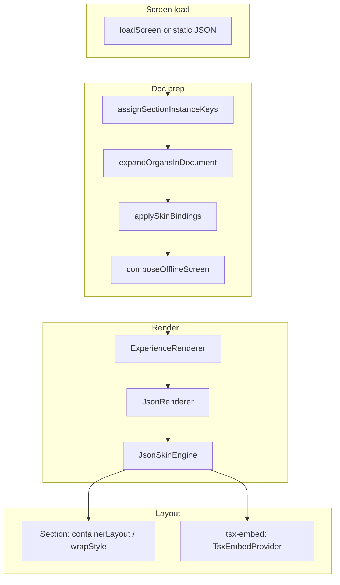

# Global Rendering Pipeline Fix — Report

## Safeguards applied

1. **TSX screens kept** — Not removed. TSX screens now render through the same pipeline by wrapping as a `tsx-embed` node: loadScreen → composeOfflineScreen → ExperienceRenderer → JsonRenderer → JsonSkinEngine. The TSX component is provided via `TsxEmbedProvider` and rendered inside JsonSkinEngine for node type `tsx-embed`.
2. **Device preview stage kept** — Layout constraints were removed from the **renderer** (root and section layout are full width where schema says so). The device preview container (json-stage in layout.tsx) still controls width (desktop/tablet/phone) via `maxWidth: min(100%, stageMaxWidth px)`.
3. **PreviewStage padding** — Converted to preview-only chrome: `canvasOuterStyle` padding set to `0` so schema-driven content is full width; device frames (phone/tablet) still control width in their own chrome.

---

## Pipeline after fixes

```
Screen Load (loadScreen or static import)
    ↓
Doc prep (assignSectionInstanceKeys → expandOrgansInDocument → applySkinBindings → composeOfflineScreen)
    ↓
ExperienceRenderer (node = treeForRender)
    ↓
JsonRenderer (root: width 100%, maxWidth none, padding 0)
    ↓
JsonSkinEngine (when node.type === "json-skin")
    ↓
Section / tsx-embed nodes
    ↓
Schema layout (params.containerLayout, params.wrapStyle) or TSX embed (TsxEmbedProvider)
```

- **JSON screens:** Root has `type: "json-skin"`, children are sections (and optionally other nodes). Layout from `params.containerLayout` / `params.wrapStyle`.
- **TSX screens:** Root is a synthetic `json-skin` tree with one child `type: "tsx-embed"`, `params.path`. JsonSkinEngine renders it via `useTsxEmbed().getComponent(path)` inside TsxEmbedProvider.

---

## Files modified

| File | Change |
|------|--------|
| [src/lib/tsx-embed-context.tsx](src/lib/tsx-embed-context.tsx) | **New.** Context + provider for passing TSX component into pipeline (`getComponent(path)`). |
| [src/lib/tsx-screen-resolver.tsx](src/lib/tsx-screen-resolver.tsx) | **New.** Shared `resolveTsxScreen(path)` for root and dev. |
| [src/05_Logic/logic/engines/json-skin.engine.tsx](src/05_Logic/logic/engines/json-skin.engine.tsx) | `tsx-embed` node type: render component from `useTsxEmbed().getComponent(path)` with Suspense. |
| [src/app/page.tsx](src/app/page.tsx) | TSX branch removed; build synthetic json-skin tree, TsxEmbedProvider, ExperienceRenderer. Use `resolveTsxScreen` from lib. Removed nextDynamic/TSXScreenWithEnvelope. |
| [src/app/dev/page.tsx](src/app/dev/page.tsx) | TSX branch: same pipeline (synthetic tree + TsxEmbedProvider + ExperienceRenderer). experience===app branch now uses `jsonContent` (ExperienceRenderer) instead of direct JsonRenderer. Removed JsonRenderer import. `behaviorProfile` declared before TSX branch. |
| [src/03_Runtime/engine/core/screen-loader.ts](src/03_Runtime/engine/core/screen-loader.ts) | `container-creations-landing`: load static JSON from `@/05_Logic/logic/content/landing/container-creations.landing.json`; removed fetch + convertLandingConfigToJsonSkin. |
| [src/app/container-creations/page.tsx](src/app/container-creations/page.tsx) | Use `loadScreen("container-creations-landing")` instead of fetch + convert. Main/error/loading wrappers: width 100%, maxWidth none, padding 0, margin 0. |
| [src/04_Presentation/components/stage/PreviewStage.tsx](src/04_Presentation/components/stage/PreviewStage.tsx) | `canvasOuterStyle.padding` set to `0` so schema content is full width (preview chrome only). |
| [src/app/layout.tsx](src/app/layout.tsx) | Editor: editor-body = LeftSidebar (PipelineDiagnosticsRail) | CanvasArea | RightSidebar (RightFloatingSidebar). Replaced absolute stage-center with flex (stage-center flex 1, json-stage flex column; content area overflow auto; nav strip flexShrink 0). |

---

## Diagram (after fixes)



---

## Confirmation

- **All screens use the same pipeline:** JSON and TSX both go through load (or static import) → doc prep (for JSON; for TSX a minimal synthetic tree is composed) → ExperienceRenderer → JsonRenderer → JsonSkinEngine. No route bypasses this.
- **Container-creations single source:** `/landing`, `/container-creations`, and `loadScreen("container-creations-landing")` all use the same static [container-creations.landing.json](src/05_Logic/logic/content/landing/container-creations.landing.json). No converter in the render path.
- **Dev and production aligned:** Dev always uses ExperienceRenderer (including when experience===app). Same doc prep and same renderer stack.
- **Layout:** Section layout is only from schema (`params.containerLayout`, `params.wrapStyle`) in JsonSkinEngine. Page wrappers and main elements are neutral (width 100%, maxWidth none, padding 0, margin 0 where applicable). Device preview stage in layout.tsx still applies maxWidth for the preview frame; renderer content inside remains full width of that frame.
- **Editor layout:** EditorRoot (flex column 100vh) → TopBar (flexShrink 0) → editor-body (flex row) → LeftSidebar (PipelineDiagnosticsRail) | CanvasArea (flex 1, overflow auto) | RightSidebar (RightFloatingSidebar). Absolute positioning removed from stage; only CanvasArea scrolls; explicit z-index on sidebars.
