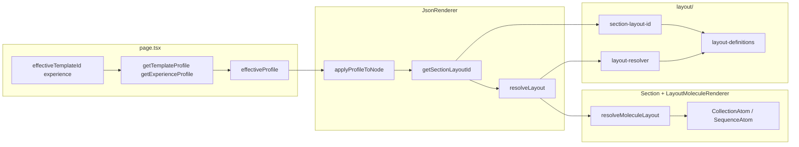

# Audit 3 — Layout Selection Pipeline

**Purpose:** Map how the final layout type (column/row/grid) and section layout id are chosen, where they are overridden, default layout injections, conflicts, and fallback logic order. Read-only analysis.

---

## 1. Pipeline Overview

---

## 2. Step-by-Step Pipeline

### 2.1 Screen / page.tsx

**File:** `src/app/page.tsx`

- **effectiveTemplateId** — From state (templateIdFromState) or layoutSnapshot.templateId or "".
- **experience** — From props/state (e.g. "website", "app", "learning").
- **getTemplateProfile(effectiveTemplateId)** — Returns template from template-profiles.json (id, sections, defaultSectionLayoutId, visualPreset, spacingScale, containerWidth, widthByRole, layoutVariants, etc.).
- **getExperienceProfile(experience)** — Returns experience profile from presentation-profiles.json.
- **effectiveProfile** — useMemo merge: experienceProfile + templateProfile; stylingOverride (state.values.stylingPreset) overrides visualPreset. Passed as **profileOverride** to ExperienceRenderer → JsonRenderer.

So: page.tsx does not choose section layout id or column/row/grid; it supplies the profile (template + experience) that JsonRenderer uses for applyProfileToNode and getSectionLayoutId.

### 2.2 Template Profile

**Files:** `src/04_Presentation/lib-layout/template-profiles.json`, `template-profiles.ts`

- **defaultSectionLayoutId** — Used when no override and no node.layout and no layoutVariants[role] and no template role mapping; passed as defaultSectionLayoutIdFromProfile to getSectionLayoutId.
- **sections[role]** — type (row/column/grid) + params (gap, justify, align, padding, etc.). Used for **params overlay** in JsonRenderer (visual preset overlay, section layout overlay); they do **not** set the section layout **id**. The section layout id (e.g. "hero-split") is what drives which componentLayout is used; componentLayout then supplies the actual type (column/row/grid) for inner arrangement.
- **layoutVariants[role]** — Optional layoutId (and containerWidth, params) per role; used by getSectionLayoutId when no override and no node.layout.

So: template profile drives **which layout id** (via defaultSectionLayoutId and layoutVariants and, indirectly, template role map in layout-definitions) and **param overlays** (sections[role].params, spacingScale, visualPreset). It does **not** directly set column/row/grid for section inner layout; that comes from layout-definitions.componentLayouts[layoutId].type.

### 2.3 layout-definitions

**File:** `src/04_Presentation/layout/data/layout-definitions.json`

- **pageLayouts** — Keyed by layout id (e.g. hero-split, content-stack). Each entry: containerWidth, split, backgroundVariant, container, contentColumn, mediaColumn, mediaImageWrapper, mediaImage, etc. Defines **page-level** (section placement, split, container, content column styles).
- **templates** — Keyed by template id; values are `{ [sectionRole]: layoutId }` (e.g. hero → "hero-split", features → "features-grid-3"). No **defaultLayout** in current JSON; template default comes from template-profiles.defaultSectionLayoutId passed as defaultSectionLayoutIdFromProfile.
- **componentLayouts** — Keyed by same layout id. Each entry: type (column | row | grid | stacked), preset (null or string), params (gap, align, justify, padding, columns, etc.). This is where **column/row/grid** for section inner layout is defined.

Flow: getSectionLayoutId returns a layout id (e.g. "hero-split"). resolveLayout(layoutId, context) fetches pageLayouts[layoutId] and componentLayouts[layoutId] and merges them. So **column/row/grid decision for section inner layout** = componentLayouts[layoutId].type.

### 2.4 Section layout id (single authority)

**File:** `src/04_Presentation/layout/section-layout-id.ts`

**getSectionLayoutId(args, opts?)** — Single authority for which layout id a section gets. Order (first non-null wins):

1. **Override** — sectionLayoutPresetOverrides[sectionKey].
2. **Explicit node.layout** — node.layout (string from screen JSON).
3. **Template layoutVariants** — templateProfile.layoutVariants[nodeRole].layoutId.
4. **Template role** — getPageLayoutId(null, { templateId, sectionRole }) → layout-definitions templates[templateId][sectionRole].
5. **Template default** — defaultSectionLayoutIdFromProfile (from template-profiles) or getDefaultSectionLayoutId(templateId). In page-layout-resolver, getDefaultSectionLayoutId returns templates[templateId]["defaultLayout"]; layout-definitions.json templates currently do not define defaultLayout; the effective template default is from template-profiles defaultSectionLayoutId passed as defaultSectionLayoutIdFromProfile.
6. **Fallback** — "content-stack" (line 127).

Result (layoutId, and optionally ruleApplied, variantParams, variantContainerWidth) is used by JsonRenderer to set node.layout and _variantParams; Section then receives layout (the id) and calls resolveLayout(layout, context).

### 2.5 Layout resolver (page + component merge)

**File:** `src/04_Presentation/layout/resolver/layout-resolver.ts`

**resolveLayout(layout, context)** — layout is the layout id string (or { template, slot }); context has templateId, sectionRole.

- getPageLayoutId(layout, context) → layoutId (string or null).
- getPageLayoutById(layoutId) → pageDef from layout-definitions pageLayouts.
- resolveComponentLayout(layoutId) → componentDef from layout-definitions componentLayouts.
- Returns { ...pageDef, moleculeLayout: componentDef } or null.

So column/row/grid for section inner layout **originates** in layout-definitions.componentLayouts[layoutId].type; resolveLayout just merges page + component definition.

### 2.6 Molecule layout resolver

**File:** `src/04_Presentation/lib-layout/molecule-layout-resolver.ts`

**resolveMoleculeLayout(flow, preset, params)** — flow = componentLayouts[layoutId].type (column/row/grid/stacked); preset from componentLayouts[layoutId].preset; params from componentLayouts[layoutId].params (and any overlays from JsonRenderer finalParams).

- LAYOUT_DEFINITIONS from molecule-layouts.json (column, row, stacked, grid): each has layout.flow, layout.params, layout.responsive, defaults, presets.
- Merge order: def.defaults → resolvedLayout.params → presetParams → passed params.
- translateFlow(flow, mergedParams) → { display, direction, gridTemplateColumns, gap, padding, align, justify, … } for flex/grid.

So **inner flex/grid** (display, direction, gridTemplateColumns, gap, etc.) is fully determined by layout-definitions.componentLayouts + molecule-layouts.json (defaults/presets) + passed params (which include JsonRenderer overlays for non-section moleculeLayout; for section, Section does not overwrite params.moleculeLayout from layout id—see json-renderer comment at ~993).

### 2.7 Screen layout vs molecule layout

**screen-definitions.json** and **screen-layout-resolver.ts** — Used by `renderFromSchema.tsx` and `GeneratedSiteViewer.tsx` (site-renderer / generated-site path). They are **not** used in the JsonRenderer → Section → LayoutMoleculeRenderer path. So for **section inner layout**, screen layout is **unused**; section path uses only layout-definitions.componentLayouts + molecule-layout-resolver.

### 2.8 LayoutMoleculeRenderer

**File:** `src/04_Presentation/layout/renderer/LayoutMoleculeRenderer.tsx`

- Receives layout (LayoutDefinition: page + moleculeLayout from resolveLayout).
- If moleculeLayout.type is present, calls resolveMoleculeLayout(moleculeLayout.type, moleculeLayout.preset, moleculeLayout.params).
- Renders: grid → CollectionAtom(resolved); flex (direction) → SequenceAtom(resolved); else raw div with resolved style. No additional layout type override inside the renderer.

### 2.9 TSX wrapper influence

**page.tsx** — Chooses Shell (WebsiteShell, AppShell, LearningShell) and experience wrapper (websiteWrapperStyle, app, learning) with padding/gap. These affect **container spacing and structure** only; they do **not** change section layout id or column/row/grid.

### 2.10 Fallback logic order

| Stage | Fallback |
|-------|----------|
| Section layout id | getSectionLayoutId → "content-stack" when all prior sources (override, node.layout, layoutVariants, template role, template default) are empty. |
| resolveLayout | Returns null if layoutId is null or getPageLayoutById returns null; Section then passes null to LayoutMoleculeRenderer, which renders children without layout wrapper (no container/split/column structure). |
| resolveMoleculeLayout | Returns params ?? {} when flow is missing or unknown (unknown flow logs and returns params only). |

---

## 3. Where column/row/grid decisions originate

- **Section layout id:** getSectionLayoutId (override → node.layout → layoutVariants → template role → template default → "content-stack").
- **Section inner type (column/row/grid):** layout-definitions.json **componentLayouts[layoutId].type**.
- **Section inner params (gap, align, justify, columns):** componentLayouts[layoutId].params + molecule-layouts.json defaults/presets + JsonRenderer param overlays (visual preset, spacing, variant); for section, params.moleculeLayout is not overwritten by JsonRenderer for type (section layout is driven by section.layout id).

---

## 4. Where they get overridden

- **Layout id:** Overridden by sectionLayoutPresetOverrides, or by explicit node.layout, or by template layoutVariants[role], or by template role map, or by template default.
- **Column/row/grid type:** Not overridden after resolution; it is fixed by layout id → componentLayouts[id].type.
- **Params (gap, align, justify):** Overridden in JsonRenderer by: visualPresetOverlay (getVisualPresetForMolecule) → sectionPresetLayoutOverlay → spacingOverlay (gap stripped for section) → _variantParams (gap stripped for section). So for section, gap is intentionally left to layout-definitions; other params can be overridden by variant and visual preset.

---

## 5. Default layout injections

- **defaultSectionLayoutId** — From template-profiles (profile.defaultSectionLayoutId); passed as defaultSectionLayoutIdFromProfile to getSectionLayoutId. layout-definitions templates do not define defaultLayout; getDefaultSectionLayoutId(templateId) would return undefined for current JSON.
- **Template role map** — layout-definitions templates[templateId][role] = layoutId injects layout id when no override, no node.layout, no layoutVariant.
- **Fallback "content-stack"** — Injected when every other source fails.

---

## 6. Conflicts

- **template sections[role].params.gap vs componentLayouts[layoutId].params.gap:** Template sections.params are merged in JsonRenderer as visual/section overlays; for section gap, spacing overlay and variant overlay **strip gap** so that layout-definitions (componentLayouts params) remain the authority for section inner gap. So no conflict: layout-definitions wins for section gap.
- **Template sections[role].type vs componentLayouts.type:** Template sections define type (row/column/grid) for **intent** (e.g. used in some overlays); the actual type used for rendering section inner layout is componentLayouts[layoutId].type. So componentLayouts wins; template sections.type is not used to set the rendered layout type in the current section path.

---

## 7. Fallback logic order (concise)

1. Section layout id: override → node.layout → layoutVariants → template role → template default → "content-stack".
2. Layout definition: resolveLayout(layoutId) → pageDef + componentDef; null if no layoutId or no pageDef.
3. Molecule layout: resolveMoleculeLayout(flow, preset, params) → style object; params only if flow missing/unknown.
4. Render: LayoutMoleculeRenderer with null layout → fragment (children only); with layout → container/split/column + CollectionAtom or SequenceAtom or div with resolved style.
