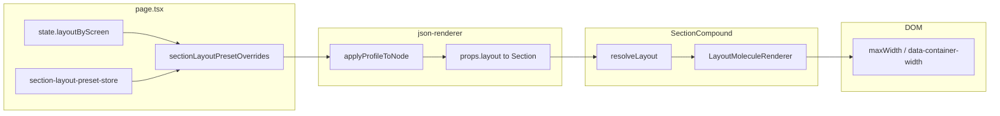

# LAYOUT PIPELINE REPORT

**Goal:** Find where `layoutResolved` / `finalLayout` (e.g. `"content-narrow"`) is supposed to affect the rendered DOM and why the DOM structure does not change.

---

## 1. Layout value produced by resolver

- **Resolved value:** `content-narrow` (when user selects it from the section layout dropdown).
- **Where it is produced:**  
  [src/engine/core/json-renderer.tsx](src/engine/core/json-renderer.tsx) — `applyProfileToNode()` (lines 359–418).  
  For each section, `layoutId` is computed from:  
  `existingLayoutId || overrideId || templateRoleLayoutId || templateDefaultLayoutId || undefined`.  
  That value is assigned to `next.layout` and `(next as any)._effectiveLayoutPreset`, and is what appears as `layoutResolved` / `finalLayout` in traces and PipelineDebugStore.

---

## 2. First component receiving layout

- **File:** [src/compounds/ui/12-molecules/section.compound.tsx](src/compounds/ui/12-molecules/section.compound.tsx)
- **Prop name:** `layout` (type: `string | { template: string; slot: string }`).
- **How it gets there:**  
  [src/engine/core/json-renderer.tsx](src/engine/core/json-renderer.tsx) (lines 787–871): `props` is built from `resolvedNode`; then `props.layout` is deleted (line 868) and, for sections only, re-set from `resolvedNode.layout` (lines 869–871) so that Section receives the engine-resolved layout id.

---

## 3. Where layout SHOULD change structure

- **File:** [src/layout/renderer/LayoutMoleculeRenderer.tsx](src/layout/renderer/LayoutMoleculeRenderer.tsx)
- **Expected behavior:**
  - Section receives `layout` (e.g. `"content-narrow"`).
  - SectionCompound calls `resolveLayout(layout)` ([src/layout/resolver/layout-resolver.ts](src/layout/resolver/layout-resolver.ts)) → `getPageLayoutId` + `getPageLayoutById` → definition from [src/layout/page/page-layouts.json](src/layout/page/page-layouts.json) (e.g. `"content-narrow": { "containerWidth": "narrow" }`).
  - SectionCompound passes the resulting `LayoutDefinition` to `LayoutMoleculeRenderer`.
  - LayoutMoleculeRenderer uses `layout.containerWidth` (`rawWidth`) to set:
    - `maxWidth: "var(--container-narrow)"` when `rawWidth === "narrow"` (lines 216–227),
    - `data-container-width` and outer wrapper styles (lines 239–257),
  - So the DOM should show a narrower content width when layout is `content-narrow`.

---

## 4. Actual behavior found

- **Override is ignored when the section node has an explicit `layout` in JSON.**  
  The resolver correctly computes a `layoutId` and passes it to Section, and Section/LayoutMoleculeRenderer correctly branch on the layout definition. However, the **value** of `layoutId` is not the user’s choice when the screen JSON gives the section an explicit `layout` field.
- **Observed:** State and override map show `content-narrow` for the section, but the section still renders with layout `features-grid-3` (e.g. SECTION RENDER TABLE shows Layout Resolved = `features-grid-3`). So the DOM does not change.

---

## 5. Root cause

- **File:** [src/engine/core/json-renderer.tsx](src/engine/core/json-renderer.tsx)  
- **Lines:** 367–384 (precedence order for `layoutId`).  
- **Reason:**  
  Layout precedence is:

  ```ts
  const layoutId =
    existingLayoutId ||    // 1) explicit node.layout from JSON
    overrideId ||          // 2) sectionLayoutPresetOverrides[sectionKey] (dropdown/state)
    templateRoleLayoutId ||
    templateDefaultLayoutId ||
    undefined;
  ```

  **Explicit `node.layout` from the screen JSON is preferred over the user override.**  
  So when the section in the screen JSON has a `layout` field (e.g. `"layout": "features-grid-3"`), `existingLayoutId` is set and **overrideId (dropdown “content-narrow”) is never used**.  
  Example: [src/apps-offline/apps/journal_track/app-1.json](src/apps-offline/apps/journal_track/app-1.json) — section `features_section` has `"layout": "features-grid-3"` (lines 126–129). Selecting “content-narrow” in the dropdown sets `overrideId = "content-narrow"`, but `layoutId` remains `"features-grid-3"` because `existingLayoutId` wins.

---

## 6. Fix recommendation

- **Change precedence so user override wins over explicit JSON layout.**  
  In [src/engine/core/json-renderer.tsx](src/engine/core/json-renderer.tsx), in `applyProfileToNode`, set:

  ```ts
  const layoutId =
    overrideId ||          // 1) user override (dropdown / state / store)
    existingLayoutId ||    // 2) explicit node.layout from JSON
    (templateRoleLayoutId && templateRoleLayoutId.trim() ? templateRoleLayoutId.trim() : null) ||
    templateDefaultLayoutId ||
    undefined;
  ```

  So: **overrideId first**, then existingLayoutId, then template role, then template default.  
  Optionally, update the `ruleApplied` / logging (lines 390–409) so that when `overrideId` is used, the decision trace clearly shows “override” and when `existingLayoutId` is used it shows “explicit node.layout”.

---

## Summary flow (for reference)



**Break point:** Inside `applyProfileToNode`, the chosen `layoutId` is correct for the pipeline (override vs explicit vs template), but the **order** of precedence causes explicit JSON `layout` to override the user’s selection. Changing precedence so `overrideId` is used before `existingLayoutId` fixes the issue.

---

## Preset registry verification

- **content-narrow** is defined in:
  - [src/layout/page/page-layouts.json](src/layout/page/page-layouts.json): `"content-narrow": { "containerWidth": "narrow" }`
  - [src/layout/page/capabilities.ts](src/layout/page/capabilities.ts): listed in `SECTION_TO_CARD_CAPABILITIES`
- **resolveLayout** for the string `"content-narrow"` returns a valid `LayoutDefinition` with `containerWidth: "narrow"`; `LayoutMoleculeRenderer` maps that to `var(--container-narrow)` and applies it to the wrapper. No defect found in the registry or in the Section → LayoutMoleculeRenderer path; the only defect is the precedence in `applyProfileToNode` above.
