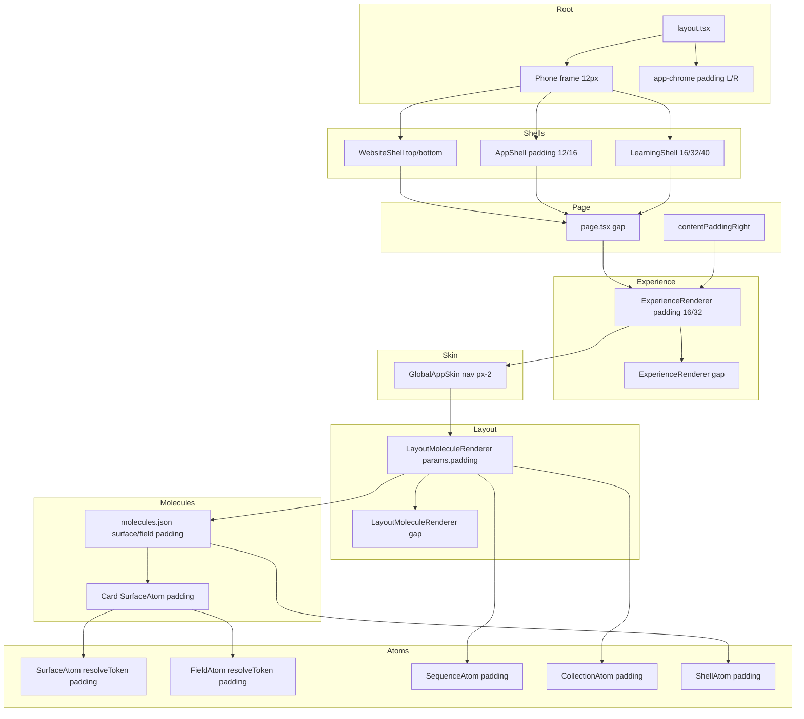

# System-Wide Padding Consolidation Audit — HiClarify Architecture

**STRICT: Analysis + plan only. No file edits. No new atoms/molecules. No default insertions.**

---

## 1. Full Scan — Padding Sources

### 1.1 Search Coverage

Searched for: `padding`, `paddingLeft`/`paddingRight`/`paddingInline`, `marginLeft`/`marginRight`, `gap`, `maxWidth` side constraints, container spacing tokens across atoms, molecules, layout JSON/TSX, page.tsx, layout.tsx, shells, site-theme.css, palette tokens.

---

## 2. Padding Map — Every Place Padding Can Originate

### 2.1 Root / Layout

| File | Line(s) | Type | Direction | Token / Hardcode | Compounds |
|------|---------|------|-----------|------------------|-----------|
| `src/app/layout.tsx` | 224 | inline style | all | `padding: 0` (app-content) | No (explicit 0) |
| `src/app/layout.tsx` | 242 | inline style | all | `padding: "12px"` (phone frame device) | **Yes** — eats width inside 390px |
| `src/app/layout.tsx` | (app-chrome via CSS) | css | L/R | `0 var(--spacing-3)` | **Yes** — chrome horizontal |

### 2.2 CSS — site-theme.css

| File | Line(s) | Type | Direction | Token / Hardcode | Compounds |
|------|---------|------|-----------|------------------|-----------|
| `src/07_Dev_Tools/styles/site-theme.css` | 158 | .site-container | all | `padding: 0 !important` | No (stripped) |
| `src/07_Dev_Tools/styles/site-theme.css` | 192–193, 201–202, 741–742 | .site-container-inner | L/R (and media) | `padding-left/right: 0 !important` | No (stripped) |
| `src/07_Dev_Tools/styles/site-theme.css` | 212–213 | .product-grid-container | L/R | `var(--spacing-8)` | **Yes** if used |
| `src/07_Dev_Tools/styles/site-theme.css` | 651 | .app-content | all | `padding: 0 !important` | No |
| `src/07_Dev_Tools/styles/site-theme.css` | 507 | .app-chrome | L/R | `0 var(--spacing-3)` | **Yes** |
| `src/07_Dev_Tools/styles/site-theme.css` | 527, 557 | .app-chrome select/button | all | `var(--spacing-2) var(--spacing-3)` | Chrome-internal only |
| `src/07_Dev_Tools/styles/site-theme.css` | 639 | .app-section-layout-panel | all | `var(--spacing-3)` | **Yes** (dev panel) |
| `src/07_Dev_Tools/styles/site-theme.css` | 677–678 | .diagnostics-compact | all | `2px 6px` | Dev only |

### 2.3 Shells

| File | Line(s) | Type | Direction | Token / Hardcode | Compounds |
|------|---------|------|-----------|------------------|-----------|
| `src/06_Data/site-skin/shells/WebsiteShell.tsx` | 49–50 | inline (main) | top/bottom | `paddingTop: "var(--spacing-6)"`, `paddingBottom: "var(--spacing-16)"` | **Yes** — vertical only; L/R already 0 via CSS |
| `src/06_Data/site-skin/shells/AppShell.tsx` | 37 | aside (nav) | all | `padding: 12` (hardcode) | **Yes** — sidebar |
| `src/06_Data/site-skin/shells/AppShell.tsx` | 55 | header | all | `"8px 16px"` | **Yes** |
| `src/06_Data/site-skin/shells/AppShell.tsx` | 66 | content grid | all | `padding: 16` | **Yes** — major horizontal stack |
| `src/06_Data/site-skin/shells/AppShell.tsx` | 78 | sidebar panel | all | `padding: 12` | **Yes** |
| `src/06_Data/site-skin/shells/LearningShell.tsx` | 32 | header div | all | `"16px 16px"` | **Yes** — horizontal |
| `src/06_Data/site-skin/shells/LearningShell.tsx` | 35 | main | all | `"32px 16px 40px"` | **Yes** — horizontal 16px L/R |
| `src/06_Data/site-skin/shells/LearningShell.tsx` | 51 | footer div | all | `"16px 16px"` | **Yes** |
| `src/04_Presentation/shells/GlobalAppSkin.tsx` | 154, 170–171 | root/content | all | `padding: 0` (stripped) | No |
| `src/04_Presentation/shells/GlobalAppSkin.tsx` | 179 (Tailwind) | nav | L/R | `px-2` (8px) | **Yes** — nav bar |
| `src/04_Presentation/shells/GlobalAppSkin.tsx` | 180 (Tailwind) | nav items | vertical + gap | `py-1`, `gap-2.5`/`sm:gap-3` | Nav-internal |
| `src/04_Presentation/shells/GlobalAppSkin.tsx` | buttons (Tailwind) | nav buttons | all | `px-1 sm:px-4`, `pt-2`, `pb-1` | Nav-internal |

### 2.4 Page / Experience Renderer

| File | Line(s) | Type | Direction | Token / Hardcode | Compounds |
|------|---------|------|-----------|------------------|-----------|
| `src/app/page.tsx` | 769 | wrapper (website) | gap only | `gap: "var(--spacing-8)"` | **Yes** — vertical rhythm (not side padding) |
| `src/app/page.tsx` | 786, 843, 833 | content div | R | `paddingRight: contentPaddingRight` (0 or 424) | **Yes** — sidebar offset |
| `src/03_Runtime/engine/core/ExperienceRenderer.tsx` | 113 | app wrapper | all | `padding: "var(--spacing-4)"` | **Yes** — major horizontal stack |
| `src/03_Runtime/engine/core/ExperienceRenderer.tsx` | 124 | learning wrapper | all | `padding: "var(--spacing-8)"` | **Yes** — horizontal |
| `src/03_Runtime/engine/core/ExperienceRenderer.tsx` | 103, 110, 201 | gap only | — | `gap: "var(--spacing-8)"` / `var(--spacing-4)` | **Yes** — vertical rhythm |

### 2.5 Layout TSX — LayoutMoleculeRenderer

| File | Line(s) | Type | Direction | Token / Hardcode | Compounds |
|------|---------|------|-----------|------------------|-----------|
| `src/04_Presentation/layout/renderer/LayoutMoleculeRenderer.tsx` | 286, 317 | moleculeLayout.params.padding | all | From JSON (layout/section) | **Yes** — when present |
| `src/04_Presentation/layout/renderer/LayoutMoleculeRenderer.tsx` | 297–299, 490–491, 496–497 | split/nonSplit/combinedOuter | all | `padding: 0` (stripped) | No |
| `src/04_Presentation/layout/renderer/LayoutMoleculeRenderer.tsx` | 420–421, 431–432, 438–439 | container | L/R | marginLeft/Right from layout or "auto" | Centering only (no padding) |

### 2.6 Layout JSON

| File | Line(s) | Type | Direction | Token / Hardcode | Compounds |
|------|---------|------|-----------|------------------|-----------|
| `src/04_Presentation/lib-layout/template-profiles.json` | 40, 989, 1992, 2045, 2054, 2103, 2160, 2168, 2272, 2281, 2330, 2338, 2387, 2395, 2445, 2453 | section params | top/bottom (e.g. "3rem 0", "2rem 0") | rem values | **Yes** — vertical only in most |
| `src/04_Presentation/layout/data/layout-definitions.json` | contentColumn has gap | gap | — | `var(--spacing-6)` | Gap only (no padding in defs) |

### 2.7 Layout Molecules (column/row/grid)

| File | Line(s) | Type | Direction | Token / Hardcode | Compounds |
|------|---------|------|-----------|------------------|-----------|
| `src/04_Presentation/lib-layout/molecules/column-layout.tsx` | 14 | default param | — | `gap = "1rem"` (default) | **Yes** if not overridden |
| `src/04_Presentation/lib-layout/molecules/row-layout.tsx` | 15 | default param | — | `gap = "1rem"` | **Yes** |
| `src/04_Presentation/lib-layout/molecules/grid-layout.tsx` | 16 | default param | — | `gap = "1rem"` | **Yes** |
| (Same files) | padding from params | all | From layout JSON | Pass-through | **Yes** when JSON supplies padding |

### 2.8 Atoms

| File | Line(s) | Type | Direction | Token / Hardcode | Compounds |
|------|---------|------|-----------|------------------|-----------|
| `src/04_Presentation/components/atoms/surface.tsx` | 25 | style | all | `resolveToken(params.padding)` | **Yes** — applies whatever token passed |
| `src/04_Presentation/components/atoms/field.tsx` | 46 | style | all | `resolveToken(params.padding)` | **Yes** |
| `src/04_Presentation/components/atoms/shell.tsx` | 16 | style | all | `resolveToken(params.padding)` | **Yes** |
| `src/04_Presentation/components/atoms/sequence.tsx` | 36–37, 56, 78 | style | all | `tok(p.padding)` from params | **Yes** |
| `src/04_Presentation/components/atoms/collection.tsx` | 37, 53 | style | all | `toCssGapOrPadding(params.padding)` | **Yes** |
| `src/04_Presentation/components/atoms/media.tsx` | (caption) | marginTop | top | `var(--spacing-2)` | Vertical only |

**Atoms do not hardcode padding;** they apply `params.padding` (or token). The **source** of those params is molecules/layout/presets (see below).

### 2.9 Molecules (Presets / JSON — Source of Atom Params)

| File | Line(s) | Type | Direction | Token / Hardcode | Compounds |
|------|---------|------|-----------|------------------|-----------|
| `src/04_Presentation/components/molecules/molecules.json` | 5, 10, 24, 29, 34, 39, 44, 50–52, 59, 65, 71, 77, 83, 90–92, 99, 103, 108–109, 118, 123–125, 133, 138, 143–144, 160, 164, 201, 206, 212–214, 252, 257, 262, 265, 270, 273, 278, 281, 286, 289, 294, 297, 302, 305 | surface/field padding | all | `padding.xs`, `padding.sm`, `padding.md`, `padding.lg`, `spacing.cardPadding`, `spacing.inlinePadding`, `"4rem 2rem 2rem"`, `"0.75rem 1.5rem"` | **Yes** — defines what atoms receive |
| `src/04_Presentation/components/molecules/card.compound.tsx` | 213 | inline (text chunk) | gap | `gap: "var(--spacing-2)"` | Gap only |
| `src/04_Presentation/components/molecules/card.compound.tsx` | 249, 272, 278 | layout params | gap | from layoutParams.gap / finalGap | Gap only |

### 2.10 JsonRenderer / Debug

| File | Line(s) | Type | Direction | Token / Hardcode | Compounds |
|------|---------|------|-----------|------------------|-----------|
| `src/03_Runtime/engine/core/json-renderer.tsx` | 85 | debug wrapper | all | `margin/padding: "var(--spacing-1)"` | Debug only |
| `src/03_Runtime/engine/core/json-renderer.tsx` | 1389–1390 | root | L/R | `marginLeft/Right: "auto"` | Centering only (no padding) |

### 2.11 maxWidth / Side Constraints (Width Eaten)

| File | Line(s) | Role | Value | Compounds With Padding |
|------|---------|------|--------|-------------------------|
| `src/app/layout.tsx` | 236–246 | phone frame | 390×844, inner padding 12px | **Yes** — 12px each side inside 390px |
| `src/06_Data/site-skin/shells/LearningShell.tsx` | 32, 35, 51 | main width | maxWidth: 820, padding 16px L/R | **Yes** |
| `src/03_Runtime/engine/core/ExperienceRenderer.tsx` | 122 | learning | maxWidth: min(820px, 100%), padding 32px | **Yes** |
| `src/04_Presentation/layout/renderer/LayoutMoleculeRenderer.tsx` | 393–402, 425, 430, 437 | container | var(--container-*) or layout | **Yes** when layout adds padding |
| `src/07_Dev_Tools/styles/site-theme.css` | 65–74 | tokens | --container-narrow 720, content 960, wide 1200 | Used by layout only |

---

## 3. Compounding Chains

### 3.1 Horizontal (Left/Right) — Where Width Is Eaten

```
Phone frame (optional)
  padding: 12px (device bezel)                    → 12px L + 12px R
  → PreviewStage (no side padding)
  → WebsiteShell
      site-container: padding 0 (stripped)
      site-container-inner: padding L/R 0 (stripped)
      main: paddingTop/Bottom only (no side)
  → OR AppShell
      aside nav: padding 12                         → 12px
      content grid: padding 16                     → 16px L + 16px R
  → OR LearningShell
      main: padding "32px 16px 40px"               → 16px L + 16px R
  → page.tsx wrapper
      gap only (no side padding); content div: paddingRight (sidebar offset)
  → ExperienceRenderer
      App: padding var(--spacing-4)                → 16px L + 16px R
      Learning: padding var(--spacing-8)           → 32px L + 32px R
  → GlobalAppSkin
      content: padding 0 (stripped)
      nav: px-2                                    → 8px (nav bar only)
  → JsonRenderer root
      marginLeft/Right auto (no padding)
  → LayoutMoleculeRenderer outer
      padding 0 / margin 0 (stripped); maxWidth sometimes set
  → Section (SurfaceAtom + inner layout)
      moleculeLayout.params.padding                → from JSON (if set)
  → Molecule (e.g. Card)
      SurfaceAtom params.padding from molecules.json → e.g. spacing.cardPadding
  → Atom (Surface / Field / Sequence / Collection)
      padding from params (no intrinsic default in atom code; defaults come from presets)
```

**Worst-case horizontal stack (e.g. App + phone frame):**  
12 + 12 + 16 + 16 + 16 + (section padding) + (card padding) + (field padding) → **multiple tens of px per side**.

### 3.2 Vertical (Top/Bottom)

```
App Chrome height 56px (not padding; consumes top)
  → WebsiteShell main
      paddingTop var(--spacing-6), paddingBottom var(--spacing-16)
  → AppShell
      header padding 8px 16px; content grid padding 16; sidebar 12
  → LearningShell
      main padding 32px 16px 40px
  → page.tsx
      gap var(--spacing-8) between sections
  → ExperienceRenderer
      gap var(--spacing-4) or var(--spacing-8)
  → LayoutMoleculeRenderer
      moleculeLayout.params.padding (e.g. "3rem 0") from template-profiles
  → Section layout (Sequence/Collection)
      padding from params
  → Card SurfaceAtom + text chunk gap
  → Field Surface/FieldAtom padding
```

### 3.3 Diagram — Compounding Flow



---

## 4. Target Architecture (No Implementation)

### 4.1 Rule Set

**LAYOUT (single authority for side spacing)**

- **Owns** all horizontal padding (left/right) for the content area.
- **May** define vertical rhythm (e.g. section padding top/bottom, gap between sections) via layout JSON / template profiles only.
- **Delivers** padding to the tree via:
  - One place: layout definitions + template profiles + section `moleculeLayout.params.padding` (and optionally `params.gap` for vertical rhythm).
- **No** shell, page, or experience wrapper may add side padding to the main content flow.

**MOLECULES**

- **May** request spacing via **params** (e.g. pass through `params.surface.padding` from layout/preset).
- **Must NOT** set side padding directly: no hardcoded `paddingLeft`/`paddingRight` or all-sides padding that is not coming from layout/preset.
- **May** use gap for internal vertical/horizontal spacing between children; gap values should be supplied by layout/preset, not hardcoded in molecule code.

**ATOMS**

- **No** padding logic: atoms must not define or hardcode padding.
- **May** expose a `params.padding` (or equivalent) that is **only** applied when the caller (layout/molecule) provides it — i.e. pass-through, no default in atom.

**CSS**

- **No** container padding defaults for main content: `.site-container`, `.site-container-inner`, `.app-content` remain zero side padding (already stripped).
- Chrome/nav/panels can keep their own internal padding (chrome, nav bar, dev panels) as they are outside the content flow.

### 4.2 Single Source of Truth

- **Horizontal content padding:** Only from layout (layout-definitions.json, template-profiles section params, and section-level `moleculeLayout.params.padding` when it specifies horizontal or full padding). Rendered by LayoutMoleculeRenderer or a single designated layout wrapper.
- **Vertical rhythm:** Section-level padding/gap from template-profiles + moleculeLayout.params; no shell/page/experience adding competing vertical padding to content.
- **Component internal padding (e.g. card “inset”):** Only when explicitly provided by layout/preset and passed as param to Surface/Field; no molecule or atom defaults.

---

## 5. Removal List (What Must Be Removed Later)

- **Shells**
  - **WebsiteShell:** Remove vertical padding from main (paddingTop/paddingBottom) once layout owns vertical rhythm; or keep only if redefined as “layout-driven” values from a single token.
  - **AppShell:** Remove `padding: 12` from aside; remove `padding: 8px 16px` from header; remove `padding: 16` from content grid; remove `padding: 12` from sidebar panel. Side and internal spacing must come from layout.
  - **LearningShell:** Remove `padding: "16px 16px"` and `"32px 16px 40px"` and `"16px 16px"` from header/main/footer. Layout must own horizontal and vertical content spacing.
- **CSS**
  - **site-container-inner:** Already 0 L/R; ensure no other rule re-adds side padding (e.g. product-grid-container if used in content flow: move to layout or remove).
  - **.app-chrome:** Keep for chrome only; no change to content.
- **ExperienceRenderer**
  - Remove `padding: "var(--spacing-4)"` from app wrapper.
  - Remove `padding: "var(--spacing-8)"` from learning wrapper.
  - Gap can remain for section rhythm only if layout does not already supply it; otherwise remove and let layout own gap.
- **page.tsx**
  - Remove any wrapper that adds side padding; keep only `paddingRight: contentPaddingRight` for sidebar offset (or move to layout/shell contract).
  - Gap between sections: keep only if layout does not define it; otherwise remove.
- **Layout.tsx**
  - Phone frame device `padding: "12px"`: either remove and handle inset via layout, or document as “device chrome” and exclude from content width math.
- **Atoms**
  - **SurfaceAtom, FieldAtom, ShellAtom:** Do not apply `params.padding` by default; apply only when explicitly provided (no fallback token in atom).
  - **SequenceAtom, CollectionAtom:** Do not apply `params.padding` by default; apply only when explicitly provided.
- **Molecules**
  - **molecules.json:** Remove all `surface.padding` and `field.padding` defaults; these become layout-provided only. Molecules may still pass through layout-supplied params.
  - **card.compound.tsx:** No hardcoded padding; only pass layout/preset padding to SurfaceAtom.
- **Layout TSX**
  - **LayoutMoleculeRenderer:** Stop stripping outer padding if layout is to own it; instead, apply a single layout-driven padding from template-profiles/layout-definitions and remove duplicate padding from shells/experience.
- **Duplicate wrapper spacing**
  - Remove any second wrapper that adds padding when layout already adds it (e.g. ExperienceRenderer + AppShell both adding horizontal padding).

---

## 6. Safe Migration Order

### Phase 1 — Neutralize shell/container padding

1. **WebsiteShell:** Set main `paddingTop`/`paddingBottom` to 0 (or to a single layout token that layout will later own).
2. **AppShell:** Set aside padding to 0; header padding to 0; content grid padding to 0; sidebar panel padding to 0.
3. **LearningShell:** Set header/main/footer padding to 0.
4. **site-theme.css:** Confirm .site-container and .site-container-inner have no side padding; .app-content remains padding 0.
5. **layout.tsx:** Optionally set phone frame inner padding to 0 and document that layout will control content inset; or leave as device-only and document.
6. **Verification:** Run app; expect content to touch edges where padding was removed. No visual “fix” yet.

### Phase 2 — Strip atom padding application (pass-through only)

1. **SurfaceAtom:** Apply `padding` only when `params.padding` is explicitly provided (no `resolveToken` default; undefined → do not set style.padding).
2. **FieldAtom:** Same — only apply padding when provided.
3. **ShellAtom:** Same.
4. **SequenceAtom:** Apply `padding` only when `p.padding` is provided (no default).
5. **CollectionAtom:** Apply `padding` only when `params.padding` is provided (no default).
6. **Verification:** Components that relied on preset padding will lose it until layout supplies it; expected.

### Phase 3 — Strip molecule hardcoded padding

1. **molecules.json:** Remove every `surface.padding` and `field.padding` entry from presets (or replace with a single “layout-controlled” sentinel that means “from layout”).
2. **card.compound.tsx (and other compounds):** Ensure no inline padding; only pass through layout/preset params. If preset is removed, pass nothing so layout must supply.
3. **Verification:** Cards/fields have no padding until layout provides it.

### Phase 4 — Enforce layout-only authority

1. **Layout definitions:** In layout-definitions.json and template-profiles.json, define one clear “content inset” (horizontal padding) per layout or template (e.g. section-level `moleculeLayout.params.padding`).
2. **LayoutMoleculeRenderer:** Apply this padding on the section/layout wrapper only (single place). Remove the DEBUG strip of padding on outer so that layout-driven padding is actually applied.
3. **ExperienceRenderer:** Ensure no `padding` on app/learning wrappers (already removed in Phase 1).
4. **page.tsx:** No side padding on content wrapper; only sidebar offset if needed.
5. **Document:** Layout is the only authority for horizontal and vertical content padding; shells and atoms do not add padding.

### Phase 5 — Verify no compounding remains

1. **Audit:** Grep again for `padding`, `paddingLeft`, `paddingRight` in shells, page, ExperienceRenderer, atoms (should be pass-through only), molecules (no hardcode).
2. **Width math:** For a known viewport (e.g. 390px phone), compute: viewport − 2× (single layout padding) = content width; verify in dev tools.
3. **Nested family:** Render section → card → field; confirm only one padding value (from layout) affects horizontal inset.
4. **Phone preview:** Confirm phone preview width (390px or 100%) is retained and only one padding layer (layout) applies inside it.

---

## 7. Validation Checks (Tests to Define)

- **Width math before/after**
  - **Before:** Measure total horizontal padding (sum of all layers) for App experience, Learning, Website on 390px and 960px viewports.
  - **After:** Same viewports; total horizontal padding must equal the single layout-defined value (e.g. 16px or 24px per side); no stacking.
- **Nested family behavior**
  - **Before:** Section containing Card containing Field: record padding at each level.
  - **After:** Only the section (layout) wrapper has side padding; Card and Field have no side padding unless layout explicitly passes it for that level (and then only one level).
- **Phone preview width retention**
  - **Before:** In phone frame mode, content width = 390 − 24 (device) − (shell + experience + molecule + atom padding).
  - **After:** Content width = 390 − 24 (device, if kept) − 2× layoutPadding; no other horizontal padding in content flow.
- **Regression**
  - Visual snapshot or simple E2E: key screens (e.g. journal_replicate, hiclarify app) with layout-owned padding only; compare content width and alignment before/after consolidation.

---

## 8. Summary

| Item | Count / Note |
|------|----------------|
| **Padding sources (content flow)** | Shells (5+), ExperienceRenderer (2), LayoutMoleculeRenderer (1), template-profiles (many), molecules.json (50+ preset entries), atoms (5 apply params.padding) |
| **Horizontal compounding layers** | Up to 6+ (phone + shell + page + experience + layout + molecule/atom) |
| **Target** | 1 layer: layout only (horizontal + vertical rhythm) |
| **Removal** | All shell/content side padding; experience wrapper padding; atom/molecule defaults; duplicate wrappers |
| **Migration** | 5 phases: neutralize shells → atom pass-through → molecule strip → layout authority → verify |

End of audit. No code was modified.
