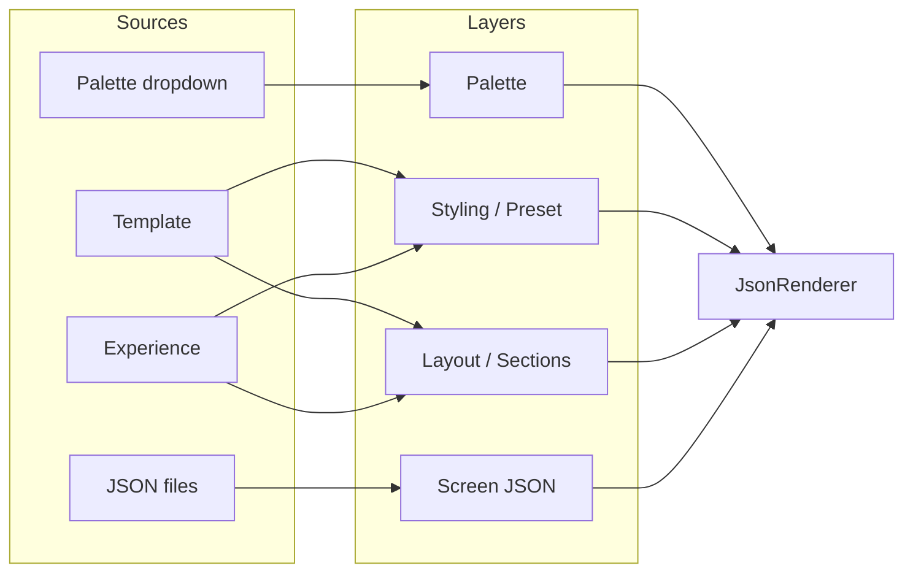

# Template-Driven Visual Wix Quality System — Evaluation & Plan

**Classification:** REFERENCE — Template system; status implemented; primary architecture reference: docs/SYSTEM_MASTER/

**Purpose:** Evaluate the GPT Cursor task for a template-driven website layout system and map an implementation plan that keeps all layers (palette, styling, layout, flow) maintaining their pieces. Verification uses screen JSON files; templates update layout/styling independently of palette and behavior.

**Status:** Implemented. Template dropdown in layout bar; effective profile (template overrides sections + visualPreset) applied in page.tsx for JSON screens. No changes to composeOfflineScreen, JsonRenderer internals, behavior, state, palette, or screen JSON.

---

## Executable Plan (Applied)

### System context (unchanged)

- **experience** → shell + base profile
- **profile.sections** → section layout (row/column/grid)
- **profile.visualPreset** → density & styling
- **palette** → colors & fonts
- **JSON screens** → section roles only; layout comes from profile

Templates override **profile.sections** and **profile.visualPreset** only. They do **not** touch palette, behavior, state, screen JSON, or renderer logic.

### Step 1 — Template profiles ✅

**File:** [src/layout/template-profiles.ts](src/layout/template-profiles.ts)

- **Types:** `LayoutDef` (type, params: gap, columns, align, justify, padding, wrap, width), `TemplateProfile` (id, label, visualPreset, sections: Record<string, LayoutDef>).
- **API:** `getTemplateProfile(id)`, `getTemplateList()` (for dropdown).
- **10 templates:** modern-hero-centered, startup-split-hero, editorial-story, course-landing, product-grid, saas-dark, agency-bold, minimalist, playful-cards, luxury-spacious. Each defines header, hero, content, features, products, footer with distinct layouts and preset.

### Step 2 — Layout store ✅

**File:** [src/engine/core/layout-store.ts](src/engine/core/layout-store.ts)

- Added `templateId: string` (default `"modern-hero-centered"`).
- `setLayout({ templateId })` updates and notifies subscribers. Experience, preset, regionPolicy unchanged.

### Step 3 — Effective profile in page.tsx ✅

**File:** [src/app/page.tsx](src/app/page.tsx)

- `experienceProfile = getExperienceProfile(experience)`.
- `templateProfile = getTemplateProfile(layoutSnapshot.templateId)`.
- `effectiveProfile = templateProfile ? { ...experienceProfile, sections: templateProfile.sections, visualPreset: templateProfile.visualPreset } : experienceProfile`.
- `<JsonRenderer profileOverride={effectiveProfile} ... />`. composeOfflineScreen and JsonRenderer internals unchanged.

### Step 4 — Template dropdown ✅

**File:** [src/app/layout.tsx](src/app/layout.tsx)

- Template `<select>` next to Experience and Palette. Options from `getTemplateList()`. Value = `templateId` from `useSyncExternalStore(subscribeLayout, getLayout, getLayout)`. On change: `setLayout({ templateId: e.target.value })`. Triggers instant re-render via layout store subscription.

### Do not touch (preserved)

- Behavior system, state system, screen JSON structure, palette system, renderer internals. Layout + preset override layer only.

### Success test

- Switch template → hero alignment, section spacing, grid vs stacked layouts, visual density change without editing screen JSON. Palette dropdown still only affects colors/fonts.

---

## 1. Evaluation of the GPT Command

### 1.1 What the Command Gets Right

- **Visual-only scope** — No engine or behavior changes; only layout + styling structure. This matches the existing separation: JsonRenderer already gets a *profile* (sections + visualPreset) and applies it; we just change *where that profile comes from* when a template is selected.
- **Template = profile override** — Each template defining `sections` (header, hero, content, features, …) and `visualPreset` fits the current pipeline: `applyProfileToNode` in json-renderer already sets `node.layout` from `profile.sections[node.role]`, and `getVisualPresetForMolecule` already uses `profile.visualPreset`. So templates are *another source* of that same profile shape.
- **LayoutDef shape** — `type: "row" | "column" | "grid" | "stack"` and params (`gap`, `columns`, `align`, `justify`, `padding`) align with existing presentation profiles (e.g. [website.profile.json](src/layout/presentation/website.profile.json)) and layout molecules (row, column, grid, stack in [registry](src/engine/core/registry.tsx)). GridLayout already uses `params.columns`, `params.gap`, etc.
- **Dropdown + instant change** — Adding `templateId` to layout store and a Template dropdown in the nav bar is consistent with existing Experience and Palette dropdowns in [layout.tsx](src/app/layout.tsx).

### 1.2 What Needs Correction or Clarification

- **“Modify composeOfflineScreen so that section layout comes from templateProfile”** — Layout is **not** applied in `composeOfflineScreen`. That function only infers section *roles* (first section → header, rest → content). Section *layout* is applied in **json-renderer** via `applyProfileToNode(profile)`, which sets `node.layout` from `profile.sections[node.role]`. So we do **not** change composeOfflineScreen to “apply layout”; we change **who builds the profile** passed to JsonRenderer (page.tsx): when a template is selected, the effective profile’s `sections` and `visualPreset` come from the template instead of (or merged over) the experience profile.
- **“Replace hardcoded experience layouts”** — Experience profiles (website, app, learning) remain useful for shell choice (WebsiteShell vs AppShell vs LearningShell) and as a fallback or base. The plan should **merge** template over experience (template overrides `sections` and `visualPreset` for JSON screens) so that:
  - Experience still drives shell and region policy.
  - Template drives section layouts + visual preset for the JSON screen path.
- **50 templates** — Starting with **10** starter templates is enough for the “quick win”; the type and resolver can support 50 later. The GPT list (modern-hero-centered, startup-split-hero, course-landing, product-grid, editorial-story, saas-dark, agency-bold, minimalist, playful-cards, luxury-spacious) is a good first set.
- **Default template** — Default `templateId: "modern-hero-centered"` should produce section layouts and preset that mirror the current website profile so existing screens (e.g. app-1.json) look the same until the user switches template.

---

## 2. Thoughts and Suggestions

### 2.1 Layer Separation (All Layers Maintain Their Pieces)

Verification requirement: *“Templates should be able to update different parts (palette, styling, layout, flow, etc) individually; all layers need to maintain their pieces.”*

| Layer | Source | What it controls | Template touches? |
|-------|--------|-------------------|--------------------|
| **Palette** | palette-store + palette dropdown | Colors, shadows, fonts (theme) | **No** — palette stays independent; template does not override palette. |
| **Styling (visual preset)** | profile.visualPreset → visual-preset-resolver | Density, typography scale, card/button weight, spacing mood | **Yes** — template.visualPreset selects preset (default, compact, spacious, editorial, prominent). |
| **Layout (section structure)** | profile.sections → applyProfileToNode | Section layout (row/column/grid, gap, columns, align) | **Yes** — template.sections supplies LayoutDef per role (header, hero, content, features, …). |
| **Flow** | profile.defaults (e.g. readingFlow) or section order | Reading direction, section order | **Optional** — section order is from screen JSON children; template can expose defaults (e.g. readingFlow) if we want; not required for Step 1. |
| **Screen JSON** | apps-offline JSON | Structure (roles, children), content, behavior | **No** — same JSON; only the *profile* (sections + preset) changes when template changes. |

So: **template only drives styling (visualPreset) and layout (sections)**. Palette and behavior remain separate. Verification: same screen JSON; switch template → only layout + density/preset change; switch palette → only colors/fonts change.

### 2.2 Template vs Experience

- **Experience** — Keeps current role: shell (Website / App / Learning), region policy, and *base* profile. Layout store keeps `experience`; it is still passed to getExperienceProfile(experience) for defaults and for shell selection.
- **Template** — New lever for JSON screens: when `templateId` is set, effective profile for JsonRenderer = experience profile with `sections` and `visualPreset` overridden by template. So:
  - `effectiveProfile = { ...getExperienceProfile(experience), sections: template.sections, visualPreset: template.visualPreset }`
  - Or merge sections: `sections: { ...experienceProfile.sections, ...template.sections }` so a template only overrides the roles it defines (e.g. hero, features) and leaves the rest from experience. **Recommendation:** full override for sections from template so each template is self-contained; ensure starter templates define all section keys used by demo screens (header, hero, content, features, footer).
- **Default** — `templateId: "modern-hero-centered"` with sections/preset matching current website profile preserves current look.

### 2.3 Where to Apply Template (No Engine Changes)

- **layout-store.ts** — Add `templateId: string` (default `"modern-hero-centered"`) and allow `setLayout({ templateId })` (or a dedicated `setTemplate(id)` that calls setLayout).
- **template-profiles.ts** (new) — Export `LayoutDef`, `TemplateProfile`, and `getTemplateProfile(id)`. Export a list of template ids/labels for the dropdown. Implement 10 starter templates.
- **page.tsx** — For JSON screen branch only: read `templateId` from layout store; `effectiveProfile = mergeTemplateWithExperience(getTemplateProfile(templateId), getExperienceProfile(experience))`; pass `effectiveProfile` as `profileOverride` to JsonRenderer. No change to composeOfflineScreen or JsonRenderer logic.
- **layout.tsx** — Add Template dropdown; on change, call `setLayout({ templateId: value })`. Subscribe to layout store so the dropdown reflects current templateId.

### 2.4 Backward Compatibility

- Existing experience-based flow remains: if we ever need “no template” we can use a sentinel template id that returns experience profile as-is, or we can default to a template that mirrors website profile so behavior is unchanged.
- JsonRenderer and visual-preset-resolver stay unchanged; they already consume profile.sections and profile.visualPreset.

### 2.5 Success Criteria (Aligned with GPT)

- Switching template produces **immediate visual layout changes** on the same screen JSON:
  - Hero: centered column vs split row (e.g. startup-split-hero).
  - Features: 3-col grid vs stacked column (e.g. editorial-story).
  - Spacing: tight (compact) vs spacious (editorial / luxury-spacious).
- Palette switch still only changes theme (colors/fonts).
- No engine or behavior changes; only layout + styling structure.

---

## 3. Implementation Plan

### Step 1 — Create Template Profile System

**New file:** [src/layout/template-profiles.ts](src/layout/template-profiles.ts)

- **Types** (exported):
  - `LayoutDef = { type: "row" | "column" | "grid" | "stack"; params?: { gap?: string; columns?: number; align?: string; justify?: string; padding?: string } }`
  - `TemplateProfile = { id: string; label: string; visualPreset: "default" | "compact" | "spacious" | "editorial" | "prominent"; sections: { header?: LayoutDef; hero?: LayoutDef; content?: LayoutDef; features?: LayoutDef; gallery?: LayoutDef; testimonials?: LayoutDef; pricing?: LayoutDef; faq?: LayoutDef; footer?: LayoutDef } }`
- **API:**
  - `getTemplateProfile(id: string): TemplateProfile | null`
  - `getTemplateIds(): { id: string; label: string }[]` for dropdown
- **Starter templates (10):** Define each with distinct section layouts and preset:
  - **modern-hero-centered** — hero column center, features 3-col grid; preset default (mirror website).
  - **startup-split-hero** — hero row (e.g. left text, right media), content column; preset default or prominent.
  - **course-landing** — hero column, content stack, features grid; preset editorial.
  - **product-grid** — header row, content grid 3-col, footer column; preset compact.
  - **editorial-story** — hero column, content column large gap; preset editorial.
  - **saas-dark** — same structure, preset default (palette handles “dark”).
  - **agency-bold** — hero row, features grid 2-col; preset prominent.
  - **minimalist** — sparse sections, column layouts, preset compact.
  - **playful-cards** — features/cards in grid, preset playful if exists else default.
  - **luxury-spacious** — column layouts, large gaps; preset spacious.

Use existing website profile section shapes (type + params) so layout molecules receive the same param names they already use (e.g. grid `columns`, `gap`).

### Step 2 — Add templateId to Layout Store

**File:** [src/engine/core/layout-store.ts](src/engine/core/layout-store.ts)

- Extend `activeLayout` with `templateId: string` (default `"modern-hero-centered"`).
- In `setLayout`, accept `templateId?: string` and update `activeLayout.templateId` when provided.
- Optionally export `setTemplate(id: string)` as a convenience that calls `setLayout({ templateId: id })`.
- Keep `experience`, `type`, `preset`, `regionPolicy` unchanged.

### Step 3 — Apply Template to JSON Screens (Effective Profile)

**File:** [src/app/page.tsx](src/app/page.tsx)

- In the JSON screen branch (where `experienceProfile = getExperienceProfile(experience)` and `profileOverride={experienceProfile}`):
  - Read `templateId` from layout snapshot: `layoutSnapshot.templateId`.
  - If `templateId` is set: `templateProfile = getTemplateProfile(templateId)`; build `effectiveProfile = { ...experienceProfile, sections: templateProfile.sections, visualPreset: templateProfile.visualPreset }` (or merge sections if you prefer partial override).
  - If no template or template not found: keep `effectiveProfile = experienceProfile`.
  - Pass `effectiveProfile` as `profileOverride` to JsonRenderer.
- No changes to composeOfflineScreen or JsonRenderer; they already use profile.sections and profile.visualPreset.

### Step 4 — Visual Preset Per Template

Already satisfied by Step 3: `effectiveProfile.visualPreset` comes from `template.visualPreset`. JsonRenderer and `getVisualPresetForMolecule(type, profile?.visualPreset, experience)` already use `profile.visualPreset`; no code change in visual-preset-resolver required. Optionally, when template is active, pass only `profile.visualPreset` from template (no experience fallback) so template fully controls preset.

### Step 5 — Template Dropdown in UI

**File:** [src/app/layout.tsx](src/app/layout.tsx)

- Import `getTemplateList` and layout store `getLayout`, `setLayout`, `subscribeLayout`.
- Add useSyncExternalStore for current `templateId` from `getLayout().templateId`.
- Add a `<select>` for Template (e.g. between Experience and Palette): options from `getTemplateList()`, value = `templateId`, onChange = `setLayout({ templateId: e.target.value })`.
- Ensure layout store subscription triggers re-render when templateId changes so page.tsx and JsonRenderer get the new effective profile.

### Step 6 — Verification with Screen JSON

- Use existing or updated screen JSON (e.g. [app-1.json](src/apps-offline/apps/journal_track/app-1.json)) that has sections with roles: header, hero, content, features (and optional footer).
- **Template switch:** Change template (e.g. Modern Hero → Startup Split → Editorial). Confirm:
  - Hero alignment/layout changes (column center vs row split).
  - Features layout changes (grid vs column stack).
  - Section spacing/density changes (compact vs spacious).
- **Palette switch:** Change palette only. Confirm only colors/typography change; section layout unchanged.
- **Experience switch:** Change experience (website / app / learning). Confirm shell and any non-overridden profile defaults still apply; template still drives sections + preset for JSON screens.

---

## 4. Layer Summary (Reference)

- **Palette** — Only from palette store; template does not touch it.
- **Styling** — From profile.visualPreset (template or experience).
- **Layout** — From profile.sections (template or experience).
- **Screen JSON** — Unchanged; only profile changes when template changes.

---

## 5. Rules (From GPT — Preserved)

- Do **not** modify engines (behavior-listener, state, verb interpreter).
- Do **not** add business logic.
- Do **not** touch behavior system.
- **Only** layout and structure and visual organization (sections + visualPreset).

When implementation is done, output: **"Template Layout System Implemented — Ready for Visual Testing"**.

**Upgrade evaluation:** See [Template_Upgrade_Evaluation.md](Template_Upgrade_Evaluation.md) for verdict (Upgrade), what improved, and optional next steps. **“Template Layout System Implemented — Ready for Visual Testing”**.
