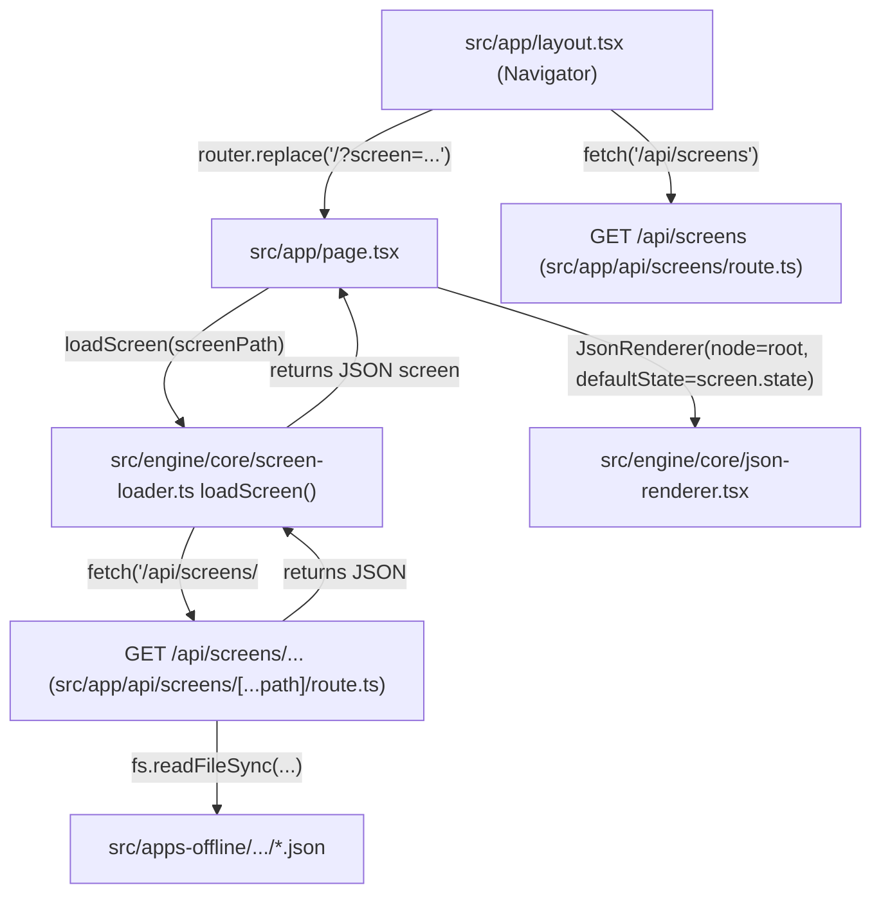
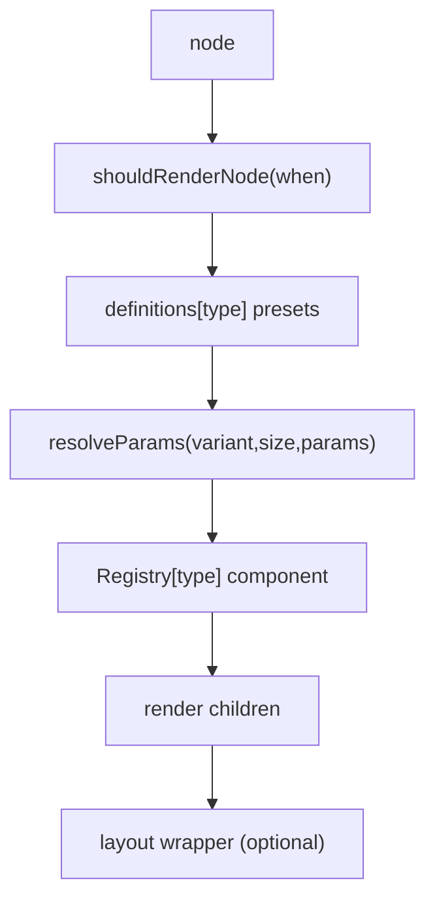

# SYSTEM MASTER PLAN (HiSense / HIcurv)

This is the consolidated, single-source reference for the **apps-offline JSON-driven system**: architecture, runtime wiring, blueprint compiler flow, contract validation, state flow, and the current migration phases.

**Sources of truth used**
- Repo docs: `APPS_OFFLINE_SYSTEM_MAP.md`, `CONTRACT_GAP_REPORT.md`, `CONTRACT_VALIDATION_REPORT.md`
- Runtime wiring: `src/engine/core/json-renderer.tsx`, `src/engine/core/registry.tsx`, `src/engine/core/screen-loader.ts`, `src/engine/core/behavior-listener.ts`
- Compiler: `src/scripts/blueprint.ts`
- State engine: `src/state/state-store.ts`, `src/state/state-resolver.ts`
- Contract validator: `src/contracts/blueprint-universe.validator.ts`

---

## Architecture map (subsystem boundaries)

- **Offline app sources**: `src/apps-offline/`
  - Authoring inputs per app folder: `blueprint.txt`, `content.txt`
  - Runtime screens are served via `/api/screens/*` and rendered by the JSON engine.

- **Compiler / authoring tools**: `src/scripts/`
  - `npm run blueprint` → `src/scripts/blueprint.ts` compiles `blueprint.txt + content.txt` → `app.json`.
  - Contract validation hooks run warn-only during compilation.

- **Runtime engine core**: `src/engine/core/`
  - **Render**: `json-renderer.tsx` (node tree → React element tree)
  - **Screen IO**: `screen-loader.ts` (fetch JSON screen, apply default state)
  - **Behavior bridge**: `behavior-listener.ts` (CustomEvent routing)
  - **Registry**: `registry.tsx` (JSON `type` → component implementation)

- **UI primitives + molecules**
  - Atoms: `src/components/9-atoms/primitives/*`
  - Molecules (locked implementations): `src/compounds/ui/12-molecules/*`
  - Molecule definitions (variants/sizes presets): `src/compounds/ui/definitions/*.json`

- **State system**: `src/state/`
  - `state-store.ts`: append-only event log + persistence + subscriptions
  - `state-resolver.ts`: pure replay engine producing `DerivedState`

---

## Runtime pipeline (end-to-end)

### 1) Screen selection → load → render

**Key constraints**
- `screen-loader.ts` enforces **path-based screens** (IDs are forbidden for file loading).
- `page.tsx` renders `json.root ?? json.screen ?? json.node ?? json`.

### 2) Node → React render pipeline (per-node)

**Implementation**
- `src/engine/core/json-renderer.tsx` (subscribes to palette/layout/state once at root and renders the tree)
- `src/engine/core/registry.tsx` (maps `type` → component)

---

## State flow (authoritative)

### State model
- **Store**: append-only event log in `src/state/state-store.ts`
- **Derivation**: `deriveState(log)` in `src/state/state-resolver.ts`
- **Persistence**: log persisted to `localStorage["__app_state_log__"]` (except high-frequency `state.update`)

### DerivedState shape
- `journal: Record<track, Record<key, string>>`
- `values: Record<string, any>` (generic live values, used for input typing + engines)
- `currentView?: string` (view gating for `when`)

### Mutation intents currently used
- **Typing**: `dispatchState("state.update", { key: fieldKey, value })`
- **Journal write**: `dispatchState("journal.add", { track, key, value })` and `dispatchState("journal.set", { track?, key, value })`
- **View nav**: `dispatchState("state:currentView", { value })`

---

## Behavior pipeline (CustomEvent bridge)

### Producers
- Field typing emits `CustomEvent("input-change", { value, fieldKey })` from `src/components/9-atoms/primitives/field.tsx`.
- Actionable molecules emit:
  - `CustomEvent("action", { detail: behavior })`
  - `CustomEvent("navigate", { detail: ... })`
  from `src/compounds/ui/12-molecules/*`.

### Router / execution
- Installed in `src/app/layout.tsx` via `installBehaviorListener(...)`.
- Routed by `src/engine/core/behavior-listener.ts`.

**Important current behavior**
- `valueFrom:"input"` + `state:journal.add` resolves input from `getState().values[fieldKey]`.
- Navigation destinations that start with `|` are treated as **internal view IDs** and mapped to `state:currentView` (not loaded as a new screen file).

---

## Blueprint compiler flow (`npm run blueprint`)

### Inputs and outputs
- **Input**: `src/apps-offline/<category>/<app>/blueprint.txt` (+ optional `content.txt`)
- **Output**: `src/apps-offline/<category>/<app>/app.json`

### Compiler responsibilities (as implemented)
- Parse blueprint outline lines (`rawId | name | type [slots] (token)` plus legacy directives).
- Apply state binds:
  - `state.bind: journal.think` → node has `state:{mode:"two-way", key:"journal.think"}` and `params.field.fieldKey = "journal.think"`.
- Apply logic actions:
  - `(logic.action: state:journal.add)` → node behavior: `type:"Action", params:{ name:"state:journal.add", track, key:"entry", valueFrom:"input", fieldKey:"journal.<track>" }`

### Contract validator hook
- Compiler runs warn-only contract checks before writing `app.json`:
  - `warnBlueprintViolations(output, { source:"blueprint-cli", ... })`

---

## Contract validator (purpose + current wiring)

### Purpose
`src/contracts/blueprint-universe.validator.ts` is a **WARN-ONLY** validator that detects drift vs the locked universe:
- State declared in tree
- Unknown molecule types / invalid variant/size
- Forbidden behavior on non-actionable molecules
- Non-contract action names (e.g. `state:*`)
- Missing required content keys / empty content objects (high-signal)

### Where it runs
- **Compile-time**: `src/scripts/blueprint.ts`
- **Runtime load-time**: `src/engine/core/screen-loader.ts` (warn-only per screen load)

### Current compliance snapshot
See `CONTRACT_VALIDATION_REPORT.md` for latest counts and top offending files.

---

## Current migration phases (what’s done vs next)

### Phase A — Contract validator + reporting (done)
- Validator exists: `src/contracts/blueprint-universe.validator.ts`
- CLI scripts exist: `npm run contract:validate` / `npm run contract:report`
- Runtime load-time validation wired in `screen-loader.ts` (warn-only)

### Phase B — System reconnection (done)
Goal: ensure the runtime wiring is complete and deterministic (input → state → render; view nav; single execution surface).
- Field typing writes to `state.values[fieldKey]` via `state.update` (in `behavior-listener.ts`)
- State update is reactive but not persisted (in `state-store.ts`)
- Fields read controlled values from state injection (in `json-renderer.tsx`)
- `|View` navigation updates `state:currentView` (in `src/app/layout.tsx`)

### Phase C — Journal display (in progress / implemented runtime-side)
Goal: display saved journal entries from state without touching atoms/molecules/state structure.
- A pure display component exists: `src/ui/molecules/JournalHistory.tsx`
- Registered in `src/engine/core/registry.tsx`
- Injected by `JsonRenderer` for nodes of type `JournalHistory` from `state.journal[track].entry` (normalized to `string[]`)

---

## Operational checklists

### Runtime smoke tests
- **Typing**: type in a Field and confirm `state.values[fieldKey]` updates (viewer or logs).
- **Save**: click Save and confirm `state.journal[track].entry` updates and persists after refresh.
- **View nav**: click a `|Something` navigation and confirm `currentView` toggles `when` gated nodes.

### Contract hygiene
- Run `npm run contract:report` and track counts in `CONTRACT_VALIDATION_REPORT.md`.
- Keep migration changes focused on JSON/apps unless explicitly changing engine behavior.

