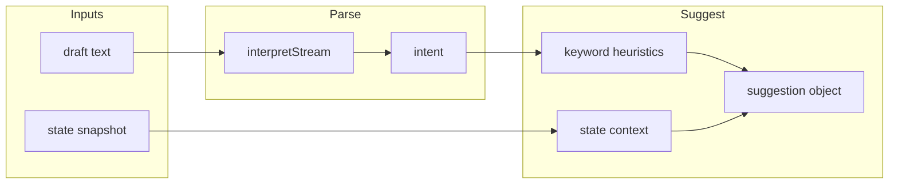
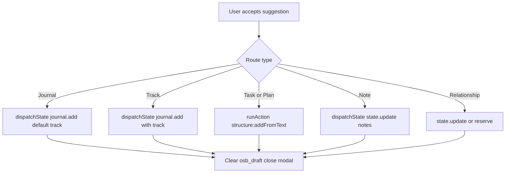

# OSB Decision Tree

**Document type:** Design only. Describes how input becomes suggestion and how suggestions become actions. No implementation.

---

## 1. From Input to Suggestion

High-level flow: **draft text** (and optional state context) → **parser** → **keyword/context pass** → **suggestion object** (primary route, secondary routes, optional track hint).

### 1.1 Parse step

- **Input:** Single segment `[{ text: draft, isFinal: true }]`.
- **Existing API:** `interpretStream(segments)` from extreme-mode-parser.
- **Output:** ParseResult with `sentences`, `intent` (task | note | question | command).
- **Extension (optional):** Add or wrap with OSB-specific intent map so that we can also classify toward "journal" or "track" when keywords (e.g. "pray", "reflect", "Scripture") appear, without changing the parser's public return type; e.g. a thin `osbIntent(draft, parseResult)` that returns an OSB route hint.

### 1.2 Keyword / context pass (heuristics only)

- **Track hint:** If draft matches TRACK semantics (e.g. "confess", "repent", "ask God", "obey", "remember to do") map to suggest track (think/repent/ask/conform/keep). Use simple regex or phrase lists; no new engine.
- **Plan hint:** If draft has date/timing words (tomorrow, next week, schedule, meeting) → suggest "Plan" or "Task" with date.
- **Relationship hint:** If draft has who/call/meet/name patterns → suggest "Relationship" or "Note."
- **State context:** If currentView is a track name (think/repent/ask/conform/keep), boost "Track" with that track. If recent interactions show repeated journal.add to one track, boost that track. If structure.items is large, user may be in "planning mode" → boost Task/Plan.

### 1.3 Suggestion object (for UI only)

- **primary:** One of Journal | Task | Track | Note | Plan | Relationship.
- **secondary:** Array of other plausible routes (e.g. ["note", "journal"]).
- **trackHint:** Optional track name (think/repent/ask/conform/keep) when primary is Track or Journal.
- **phrase:** Optional human-readable line for the chip (e.g. "Looks like a task", "This feels like a journal entry", "Is this a TRACK study?", "Should this become a reminder?").

No contract; this shape is internal to the suggestion module and the OSB modal component.

---

## 2. From Suggestion to Action

When the user **accepts** a suggestion (taps a chip or confirms), the OSB component performs exactly one of the following. No new state intents; all existing pipelines.

### 2.1 Journal

- **Action:** `dispatchState("journal.add", { track: "default", key: "entry", value: draft })`.
- **Value source:** From `getState().values.osb_draft` or passed from component state. Behavior-listener expects state:journal.add with valueFrom "input" and fieldKey when triggered from JSON; when OSB component dispatches directly, it can call `dispatchState("journal.add", ...)` with value explicitly (state-resolver accepts payload.value).
- **Note:** If the UI triggers an "action" event with name "state:journal.add" and params including fieldKey "osb_draft", existing behavior-listener will resolve value from state.values.osb_draft and dispatch journal.add. So OSB can either dispatch journal.add directly with value or fire action event with state:journal.add and fieldKey.

### 2.2 Track

- **Action:** Same as Journal but with `track` set to the chosen track (think | repent | ask | conform | keep).
- **Payload:** `dispatchState("journal.add", { track, key: "entry", value: draft })`.

### 2.3 Task / Plan

- **Action:** Invoke existing logic action: `runAction({ name: "structure:addFromText", text: draft })` (via engine-contract getActionHandler or equivalent). structureAddFromText reads text, runs streamToCandidates, writes to structure.items.
- **No duplicate parse:** Parser runs only inside structure:addFromText; OSB does not need to call the parser again for task path.

### 2.4 Note

- **Action:** `dispatchState("state.update", { key: notesKey, value })`. Notes key and shape (e.g. values.notes as array) defined in one place; append or replace as needed in the component or in a tiny helper.

### 2.5 Relationship

- **V1:** Can map to Note (state.update) or to a reserved key (e.g. values.relationship_draft) for a future module. No new intent.

---

## 3. Decision Table (Summary)

| User sees (suggestion) | User action | System action |
|------------------------|-------------|----------------|
| "Looks like a task" | Tap | runAction(structure:addFromText, { text: draft }) |
| "Journal entry" | Tap | dispatchState(journal.add, { track: "default", key: "entry", value }) |
| "TRACK: Think" (or Repent/Ask/Conform/Keep) | Tap | dispatchState(journal.add, { track, key: "entry", value }) |
| "Save as note" | Tap | dispatchState(state.update, { key: notesKey, value }) |
| "Plan it" | Tap | Same as Task (structure:addFromText) or future planner hook |
| "Relationship" | Tap | state.update (note or relationship key) |

Optional: after tap, show a one-line confirm ("Save as Journal?") and then run the action; or direct save for minimal friction in V1.

---

## 4. Boundaries

- **Parser:** Used once per OSB submit to get intent (and optionally sentences). Not used again when user chooses Task (structure:addFromText does its own parse).
- **State:** Read for context and draft; write only via journal.add, state.update, and structure:addFromText.
- **Behavior-listener:** No new action names required; OSB component can dispatch state events or invoke runAction directly. If a JSON-driven flow is desired later, one optional action (e.g. osb:confirm) could be added that takes type/track/value and delegates to the same dispatches.

This document defines the decision flow only. No code has been modified.
